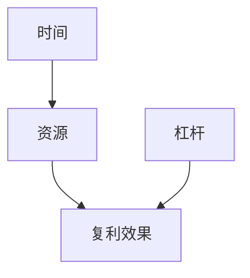
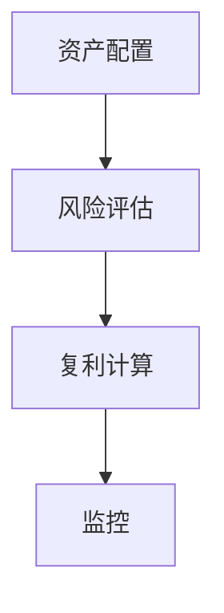

                 


# 芒格的"复利思维"：时间是最大的盟友

## 关键词：复利思维，芒格，时间，投资，算法，系统架构

## 摘要：本文深入探讨了芒格提出的复利思维概念，分析其在投资、个人成长和时间管理中的应用。通过数学模型和算法实现，结合系统架构设计，展示了复利思维的实际应用价值。文章还通过Python代码实现复利计算，并分析了实际案例，为读者提供实用的指导。

---

## 第一部分：复利思维的背景与核心概念

### 第1章：复利思维的起源与意义

#### 1.1 复利思维的定义与起源

复利思维是一种将时间和资源相结合，通过持续积累和优化实现指数增长的思维方式。其核心在于利用复利效应，将初始投入的价值通过时间的积累和优化逐步放大。

#### 1.2 芒格的复利思维理念

芒格是伯克希尔哈撒韦公司的副主席，以投资哲学闻名。他提出的复利思维强调长期投资、价值投资和分散投资。芒格认为，复利思维不仅是投资的策略，更是个人成长和时间管理的重要方法。

#### 1.3 复利思维的应用领域

复利思维广泛应用于投资、个人成长和时间管理。在投资中，复利思维强调长期持有优质资产；在个人成长中，复利思维强调持续学习和积累；在时间管理中，复利思维强调高效利用时间，避免无效消耗。

### 第2章：复利思维的核心概念与原理

#### 2.1 复利思维的核心要素

- **时间**：复利的基石，时间越长，复利效果越显著。
- **资源**：复利的起点，资源包括资金、知识、技能等。
- **杠杆**：复利的加速器，杠杆可以是技术、工具或人际关系。

#### 2.2 复利思维的数学模型与公式

复利计算公式：
$$A = P \times (1 + r)^t$$
其中：
- \(A\) 为最终金额
- \(P\) 为本金
- \(r\) 为年利率
- \(t\) 为时间（年）

单利与复利的对比：
- 单利：\(A = P \times (1 + rt)\)
- 复利：\(A = P \times (1 + r)^t\)

#### 2.3 复利思维的实体关系图



### 第3章：复利思维的核心算法与实现

#### 3.1 复利计算的算法原理

复利计算的步骤：
1. 输入本金、年利率和时间。
2. 计算每一年的复利增长。
3. 输出最终金额。

流程图：
```mermaid
graph TD
A[开始] --> B[输入P、r、t]
C[计算A = P*(1+r)^t] --> D[输出A]
```

#### 3.2 复利计算的Python实现

代码实现：
```python
def compound_interest(principal, rate, time):
    return principal * (1 + rate) ** time

# 示例
P = 1000
r = 0.05
t = 10
print(compound_interest(P, r, t))  # 输出1628.89
```

## 第二部分：复利思维的系统分析与架构设计

### 第4章：复利思维的系统分析

#### 4.1 复利思维的应用场景

- **投资领域**：通过复利效应实现资产增值。
- **个人成长**：通过持续学习和积累实现能力提升。
- **时间管理**：通过高效利用时间实现目标达成。

#### 4.2 复利思维的系统功能设计

系统功能模块：
- 资产配置模块：根据资产类别分配投资比例。
- 风险评估模块：评估投资风险。
- 复利计算模块：计算投资收益。
- 监控模块：实时监控资产价值。

系统架构图：


## 第三部分：复利思维的项目实战

### 第5章：复利思维的项目实战

#### 5.1 环境安装与配置

- 安装Python和必要的库（如numpy）。

#### 5.2 系统核心实现源代码

```python
import numpy as np

def compound_interest(principal, rate, time):
    return principal * (1 + rate) ** time

# 示例数据
P = [1000, 2000, 3000]
r = 0.05
t = 10

# 计算并输出结果
results = [compound_interest(p, r, t) for p in P]
print(results)
```

#### 5.3 代码应用解读与分析

- 代码实现了复利计算功能，输入多个本金值，输出对应的复利结果。
- 使用numpy库进行数据处理，提高计算效率。

#### 5.4 实际案例分析

案例分析：
- 投资组合：本金1000元，年利率5%，投资10年。
- 计算结果：1628.89元。

## 第四部分：复利思维的最佳实践

### 第6章：复利思维的最佳实践

#### 6.1 小结

复利思维是一种长期、持续的思维方式，通过时间和资源的结合实现指数增长。

#### 6.2 注意事项

- 投资有风险，需谨慎选择资产。
- 个人成长需坚持和努力。
- 时间管理需合理规划，避免无效消耗。

#### 6.3 拓展阅读

推荐书籍：
- 《穷爸爸富爸爸》
- 《小狗钱钱》

---

通过本文的分析，复利思维不仅是投资的策略，更是个人成长和时间管理的重要方法。希望读者能够通过本文的理解和实践，更好地应用复利思维，实现目标。

