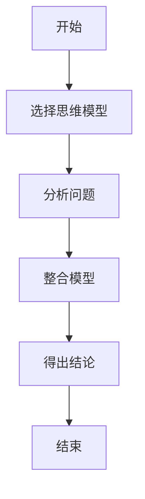
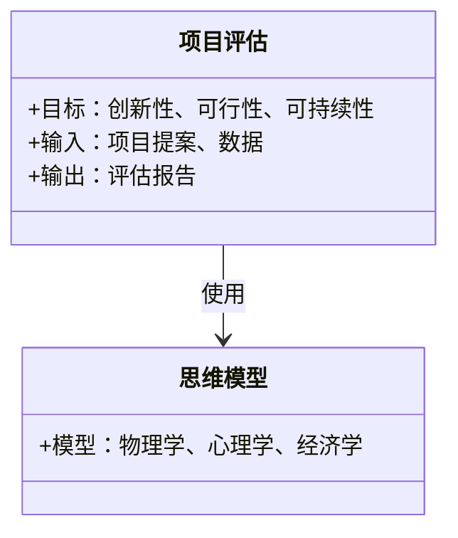
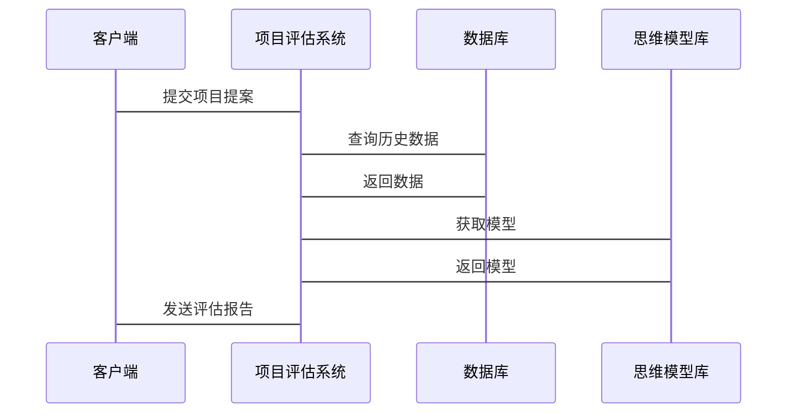

                 


# 芒格的"多元思维格栅"在跨学科创新项目评估中的应用

## 关键词：
多元思维格栅, 芒格, 跨学科创新, 项目评估, 系统架构, 思维模型, 多元思维

## 摘要：
芒格的多元思维格栅是一种跨学科的思维方式，通过整合多个领域的思维模型来帮助解决问题。本文将探讨如何在跨学科创新项目评估中应用这一方法，结合系统架构和具体案例，详细解析其原理、实现和应用效果。

---

## 第1章：多元思维格栅的背景与核心概念

### 1.1 多元思维格栅的定义与核心要素

#### 1.1.1 芒格的多元思维理念
芒格提出的多元思维格栅是一种将多个学科的思维模型整合起来的思考方式。通过构建一个跨学科的思维框架，可以更全面地分析问题，避免单一视角的局限性。

#### 1.1.2 多元思维格栅的定义与特点
多元思维格栅是一个动态的、多层次的框架，包含多个相互关联的思维模型。它通过系统的结构化方法，帮助我们在复杂问题中找到解决方案。

#### 1.1.3 多元思维格栅的哲学基础
多元思维格栅的哲学基础在于承认复杂性，并通过整合不同领域的知识来应对不确定性。这种思维方式强调全局性与系统性。

### 1.2 多元思维格栅的核心要素

#### 1.2.1 格栅的结构与层次
- **底层**：基础思维模型，如物理学的因果关系、心理学的行为动机。
- **中层**：跨学科的综合模型，如经济学的市场分析、生物学的生态系统。
- **顶层**：整体系统模型，将所有模型整合，形成统一的分析框架。

#### 1.2.2 格栅的核心思维模型
- **物理学模型**：能量守恒定律、杠杆原理。
- **心理学模型**：认知偏差、行为动机。
- **经济学模型**：供需关系、成本-收益分析。
- **生物学模型**：适应性、多样性。

#### 1.2.3 格栅的动态更新机制
格栅不是静态的，而是需要根据实际情况不断更新和优化。通过持续学习和实践，引入新的思维模型，增强框架的灵活性和适应性。

---

## 第2章：多元思维格栅的核心原理

### 2.1 多元思维格栅的模型构成

#### 2.1.1 格栅的实体关系图（ER图）
```mermaid
erDiagram
    actor 用户 {
        <属性> 名称
        <属性> 思维模型
    }
    actor 系统 {
        <属性> 输入
        <属性> 输出
    }
    用户 -> 系统 : 输入
    系统 -> 用户 : 输出
```

#### 2.1.2 格栅的流程图（Mermaid图）


#### 2.1.3 格栅的数学模型与公式
多元思维格栅可以通过矩阵形式表示，每个格子代表一个思维模型。公式如下：
$$
\text{格栅矩阵} = \begin{bmatrix}
\text{模型1} & \text{模型2} \\
\text{模型3} & \text{模型4}
\end{bmatrix}
$$

---

## 第3章：跨学科创新项目的评估框架

### 3.1 项目评估的背景与目标

#### 3.1.1 项目背景介绍
跨学科创新项目通常涉及多个领域，如人工智能、生物学、经济学等。评估这类项目需要考虑技术可行性、市场潜力和社会影响。

#### 3.1.2 项目评估的核心问题与边界
- **核心问题**：项目的创新性、可行性和可持续性。
- **边界**：项目的资源限制、时间限制和目标用户群体。

### 3.2 项目评估的系统分析

#### 3.2.1 项目评估的领域模型（Mermaid类图）


#### 3.2.2 项目评估的系统架构设计（Mermaid架构图）


#### 3.2.3 项目评估的接口与交互设计（Mermaid序列图）


---

## 第4章：多元思维格栅的系统架构与实现

### 4.1 系统环境与安装

#### 4.1.1 系统运行环境要求
- 操作系统：Linux/Windows/MacOS
- 开发工具：Python、Jupyter Notebook、Mermaid工具
- 依赖库：Matplotlib、NumPy

#### 4.1.2 格栅模型的安装与配置
```bash
pip install mermaid
jupyter notebook --generate-config
```

### 4.2 核心代码实现

#### 4.2.1 格栅模型的Python源代码实现
```python
class MindGrid:
    def __init__(self):
        self.models = {}

    def add_model(self, name, function):
        self.models[name] = function

    def analyze(self, problem):
        results = {}
        for name, function in self.models.items():
            results[name] = function(problem)
        return results

# 示例模型
def physics_model(problem):
    return f"物理学视角：{problem} 中的能量守恒是关键。"

def psychology_model(problem):
    return f"心理学视角：{problem} 中的行为动机是关键。"

grid = MindGrid()
grid.add_model("物理学", physics_model)
grid.add_model("心理学", psychology_model)
print(grid.analyze("项目可行性分析"))
```

#### 4.2.2 代码的功能与实现逻辑解读
代码实现了一个简单的多元思维格栅，允许添加不同领域的思维模型，并对问题进行多角度分析。每个模型是一个函数，接受问题并返回分析结果。

#### 4.2.3 代码的优化与改进
- 增加日志记录，便于调试。
- 支持动态加载模型，增强灵活性。
- 提供可视化结果，便于理解。

---

## 第5章：跨学科创新项目评估的实战案例

### 5.1 项目背景与目标

#### 5.1.1 项目背景介绍
假设我们评估一个跨学科项目，目标是利用人工智能优化城市交通系统。

#### 5.1.2 项目目标与范围
- 评估目标：项目的创新性、技术可行性、经济可行性。
- 评估范围：交通数据分析、人工智能算法、社会影响。

### 5.2 项目评估的实施过程

#### 5.2.1 评估框架的构建
- **数据收集**：收集交通流量、事故率等数据。
- **模型选择**：选择物理学、经济学、人工智能模型。
- **分析过程**：使用多元思维格栅进行综合评估。

#### 5.2.2 评估过程中的问题与解决方案
- **问题**：数据不足。
  - **解决方案**：引入模拟数据。
- **问题**：模型冲突。
  - **解决方案**：通过权重调整。

#### 5.2.3 评估结果的分析与总结
评估结果显示，人工智能算法在优化交通流量方面效果显著，但需要考虑社会影响，如就业问题。

---

## 第6章：多元思维格栅的应用总结

### 6.1 最佳实践与注意事项

#### 6.1.1 应用中的常见问题与解决方案
- **问题**：模型过多，难以管理。
  - **解决方案**：定期清理和优化模型。
- **问题**：模型更新困难。
  - **解决方案**：建立自动化更新机制。

#### 6.1.2 格栅模型的维护与更新
- 定期审查模型，删除过时模型，引入新模型。
- 通过反馈机制优化模型权重。

#### 6.1.3 应用中的注意事项与禁忌
- 避免模型堆砌，确保每个模型都有实际价值。
- 避免忽略模型之间的相互作用。

### 6.2 小结与展望

#### 6.2.1 本章内容的总结
多元思维格栅是一种强大的工具，能够帮助我们在跨学科创新项目评估中做出更全面的决策。

#### 6.2.2 对未来的展望与建议
随着技术的发展，多元思维格栅可以进一步结合大数据和人工智能，提升评估的准确性和效率。

---

## 第7章：附录与拓展阅读

### 7.1 附录
- **附录A**：常用思维模型列表。
- **附录B**：系统架构图的详细说明。

### 7.2 拓展阅读
- 推荐书籍：《穷查理芒格》。
- 推荐博客：技术博客中的相关文章。

---

# 总结
芒格的多元思维格栅为我们提供了一种跨学科的思维方式，通过系统的结构化方法，帮助我们在复杂问题中找到解决方案。本文通过详细解析其原理、实现和应用，展示了如何在跨学科创新项目评估中应用这一方法。希望本文能为读者提供有价值的参考和启发。

