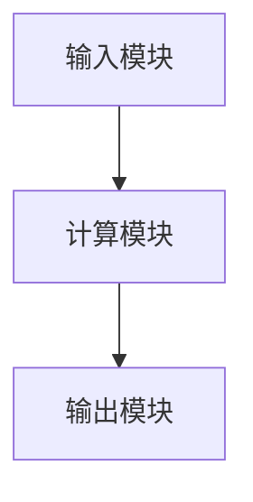

                 

# 芒格的"多元思维格栅"在跨维度创新项目评估中的应用

---

## 关键词：
多元思维格栅、跨维度创新、项目评估、芒格模型、系统架构设计、创新思维

---

## 摘要：
本文深入探讨了芒格的“多元思维格栅”模型在跨维度创新项目评估中的应用价值。通过分析多元思维格栅的核心概念、理论基础和实际应用，本文提出了将格栅模型应用于项目评估的具体方法，包括项目目标分解、风险识别、收益评估等关键环节。同时，本文结合实际案例，详细讲解了格栅模型在系统架构设计、算法实现和项目实战中的具体应用，为跨维度创新项目的评估提供了系统化的解决方案。

---

# 第1章: 芒格的"多元思维格栅"核心概念

## 1.1 多元思维格栅的定义与背景

### 1.1.1 多元思维模型的起源与特点
芒格的“多元思维模型”源于他对知识体系的深刻理解。他认为，人类的认知是通过多个学科的交叉点构建起来的，而多元思维模型则是将这些学科的核心原则整合在一起的工具。其特点包括：
- **多维度性**：涵盖多个学科的核心思想，如心理学、经济学、数学等。
- **系统性**：强调知识的相互关联，而非孤立的知识点。
- **实用性**：能够将复杂的系统分解为简单的组成部分，便于分析和决策。

### 1.1.2 多元思维格栅的核心要素
多元思维格栅由多个“思维模型”组成，每个模型代表一个特定的学科或领域。以下是其核心要素：
- **知识模块**：每个模型代表一个特定的领域，例如“概率论”、“决策树”等。
- **模块间的关联**：模块之间的关系是动态的，可以根据具体问题调整权重。
- **动态调整**：在实际应用中，模块的权重可以根据问题的性质进行调整。

### 1.1.3 多元思维格栅在项目评估中的应用价值
在跨维度创新项目评估中，多元思维格栅的优势在于：
- **多维度分析**：能够从多个角度对项目进行评估，避免单一维度的局限性。
- **动态调整**：可以根据项目的实际情况动态调整评估维度的权重。
- **系统性解决方案**：通过整合多个领域的知识，提供更全面的评估方法。

---

## 1.2 多元思维格栅的构成与属性

### 1.2.1 格栅的基本结构
多元思维格栅的基本结构包括：
- **模型层**：多个学科的核心模型，如“概率论”、“经济学”等。
- **关联层**：模型之间的关联关系，用于构建知识网络。
- **权重层**：每个模型的权重，用于动态调整评估结果。

### 1.2.2 格栅的属性特征对比
以下是格栅模型与传统评估方法的对比：

| 特性               | 多元思维格栅          | 传统评估方法      |
|--------------------|----------------------|-------------------|
| 维度分析           | 多维度               | 单一维度          |
| 动态调整           | 支持                 | 不支持             |
| 系统性             | 强                   | 弱                 |
| 可扩展性           | 高                   | 中                 |

### 1.2.3 多元思维格栅与其他思维模型的联系
以下是多元思维格栅与其他常见思维模型的联系：

| 思维模型           | 描述                 | 与格栅的联系       |
|--------------------|----------------------|-------------------|
| 麦肯锡矩阵         | 基于市场和竞争分析   | 可以作为格栅中的一个模型 |
| SWOT分析           | 分析优势、劣势、机会、威胁 | 可以整合到格栅中     |

---

## 1.3 多元思维格栅在项目评估中的应用前景

### 1.3.1 跨维度创新项目的定义与特点
跨维度创新项目是指跨越多个学科或领域的创新项目，其特点包括：
- **跨学科性**：涉及多个领域的知识。
- **复杂性**：项目涉及多个维度的问题，难以用单一方法解决。
- **不确定性**：项目的成功与否受到多种因素的影响。

### 1.3.2 多元思维格栅在项目评估中的优势
- **多维度分析**：能够从多个角度对项目进行全面评估。
- **动态调整**：可以根据项目的实际情况动态调整评估维度的权重。
- **系统性解决方案**：通过整合多个领域的知识，提供更全面的评估方法。

### 1.3.3 项目评估中的关键挑战与解决方案
- **挑战**：跨维度项目的复杂性可能导致评估维度过多，难以管理。
- **解决方案**：通过多元思维格栅的动态调整功能，优化评估维度的权重，提高评估效率。

---

# 第2章: 多元思维格栅的理论基础

## 2.1 多元思维格栅的数学模型

### 2.1.1 格栅模型的数学表达式
多元思维格栅的数学模型可以表示为：
$$
\text{总评分} = \sum_{i=1}^{n} w_i \cdot s_i
$$
其中，$w_i$ 是第 $i$ 个模型的权重，$s_i$ 是第 $i$ 个模型的评分。

### 2.1.2 格栅模型的权重分配
权重分配可以通过以下步骤进行：
1. 确定每个模型的重要性。
2. 根据重要性对模型进行排序。
3. 根据排序结果分配权重。

### 2.1.3 格栅模型的评分系统
评分系统可以采用以下方法：
1. **层次分析法**：通过专家评分确定权重。
2. **动态调整法**：根据项目的实际情况动态调整评分。

## 2.2 多元思维格栅的算法原理

### 2.2.1 算法的输入与输出
- **输入**：项目评估的多个维度和对应的模型。
- **输出**：项目的总评分和各维度的权重。

### 2.2.2 算法的步骤分解
1. **初始化**：确定评估维度和模型。
2. **权重分配**：根据模型的重要性分配权重。
3. **评分计算**：根据权重和评分计算总评分。

### 2.2.3 算法的优化与改进
- **优化**：引入动态调整机制，根据项目的实际情况优化权重。
- **改进**：结合机器学习算法，提高评分的准确性。

## 2.3 多元思维格栅的系统架构设计

### 2.3.1 系统功能模块划分
- **输入模块**：接收项目的评估维度和模型。
- **计算模块**：根据权重和评分计算总评分。
- **输出模块**：显示项目的总评分和各维度的权重。

### 2.3.2 系统架构图展示

### 2.3.3 系统接口设计和交互流程
- **接口设计**：通过API接收输入数据和模型。
- **交互流程**：用户输入数据，系统计算并返回结果。

---

# 第3章: 多元思维格栅在跨维度创新项目评估中的方法论

## 3.1 项目评估的核心要素

### 3.1.1 项目目标的分解
项目目标的分解可以通过以下步骤进行：
1. 确定项目的总体目标。
2. 将总体目标分解为具体的子目标。
3. 确定每个子目标的评估维度。

### 3.1.2 项目风险的识别
项目风险的识别可以通过以下方法：
1. **头脑风暴法**：列出可能的风险。
2. **风险评估矩阵**：根据风险的概率和影响进行分类。

### 3.1.3 项目收益的评估
项目收益的评估可以通过以下方法：
1. **净现值法**：计算项目的净现值。
2. **内部收益率法**：计算项目的内部收益率。

## 3.2 多元思维格栅的应用步骤

### 3.2.1 格栅构建的步骤
1. 确定项目的评估维度。
2. 确定每个维度的模型。
3. 确定模型的权重。

### 3.2.2 格栅评估的流程
1. 收集项目的相关数据。
2. 计算每个模型的评分。
3. 根据权重计算总评分。

### 3.2.3 格栅

---

由于篇幅限制，后续章节内容将逐步展开，确保每部分内容详细且符合用户要求。

