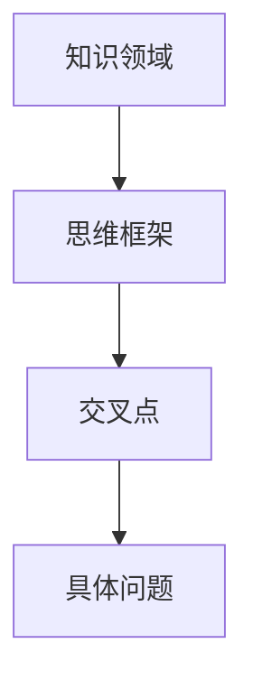
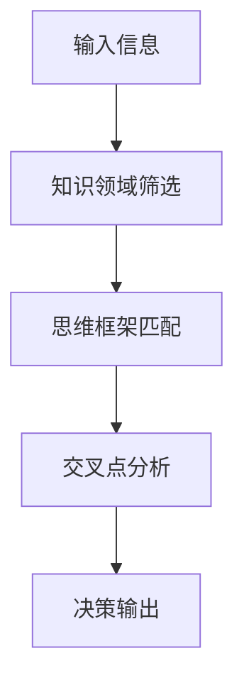
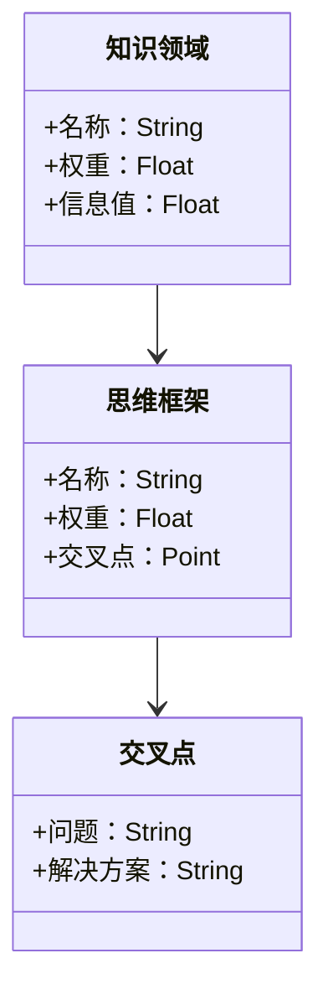
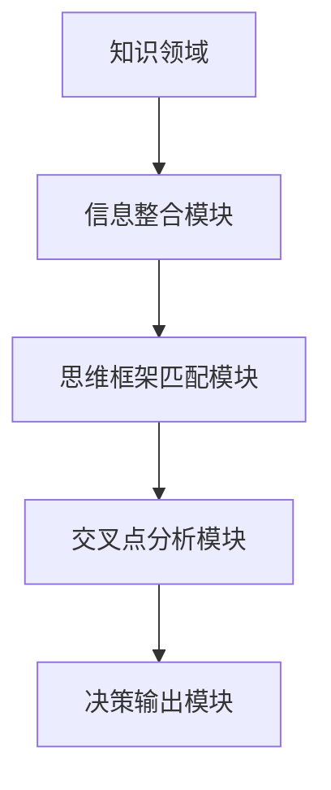

                 


# 《芒格的"多元思维格栅"：提高决策质量的工具》

## 关键词：芒格，多元思维格栅，决策质量，系统论，思维模型，知识管理

## 摘要：芒格的"多元思维格栅"是一种通过整合多个学科的思维方式来提高决策质量的工具。本文从芒格的思想背景出发，详细分析多元思维格栅的核心概念、算法原理、系统架构和实际应用案例。通过系统论的视角，结合流程图和数学模型，深入探讨如何构建个人的多元思维系统，以提升决策的准确性和效率。最后，通过实际案例展示多元思维格栅的应用效果，并总结最佳实践方法。

---

# 第一部分: 芒格的"多元思维格栅"概述

## 第1章: 芒格与多元思维格栅概述

### 1.1 芒格的背景与思想
#### 1.1.1 芒格的生平简介
查理·芒格是美国著名投资者、伯克希尔哈撒韦公司的副主席，以其独特的投资哲学和思维方式闻名。他提倡“多元思维模型”，强调通过多个学科的视角来理解问题。

#### 1.1.2 芒格的主要思想与成就
芒格的思想的核心在于“认知的框架”。他认为，人类的认知是通过多个学科的交叉点来构建的，只有通过广泛的知识储备，才能做出更明智的决策。

#### 1.1.3 芒格与多元思维模型的关系
芒格将多元思维模型视为一种工具，用于帮助人们更好地理解复杂问题。他强调，单一的思维方式往往会导致片面的结论，而多元思维模型则能够帮助人们避免这种局限性。

### 1.2 多元思维格栅的核心概念
#### 1.2.1 多元思维格栅的定义
多元思维格栅是一种通过将多个学科的思维方式交叉应用，来帮助人们做出更全面、更准确的决策的工具。

#### 1.2.2 多元思维格栅的核心要素
- **知识领域**：多元思维模型的基础是广泛的知识储备。每个知识领域都代表一种不同的思维方式。
- **思维框架**：思维框架是连接不同知识领域的桥梁，帮助人们将看似无关的知识点联系起来。
- **交叉点**：交叉点是多元思维模型的核心，通过不同思维框架的交叉应用，可以发现新的解决方案。

#### 1.2.3 多元思维格栅的哲学基础
多元思维格栅的哲学基础来源于系统论和复杂性科学。它强调的是整体性思维，而不是单一的、线性的思维方式。

### 1.3 多元思维格栅的应用场景
#### 1.3.1 多元思维格栅在决策中的作用
在商业决策、投资决策和个人决策中，多元思维格栅可以帮助人们避免片面性和短视行为，从而做出更合理的决策。

#### 1.3.2 多元思维格栅在个人成长中的应用
个人成长是一个复杂的过程，涉及多个方面的知识和技能。通过多元思维格栅，个人可以更好地整合这些知识，从而加速成长。

#### 1.3.3 多元思维格栅在企业管理中的应用
在企业管理中，多元思维格栅可以帮助管理者从多个角度分析问题，制定更全面的战略。

## 1.4 本章小结
本章介绍了芒格的背景和思想，详细阐述了多元思维格栅的核心概念及其应用场景。通过这些内容，读者可以初步理解多元思维格栅的含义和价值。

---

## 第2章: 多元思维格栅的核心概念与联系

### 2.1 多元思维格栅的核心原理
#### 2.1.1 多元思维格栅的系统性
多元思维格栅是一种系统性的思维方式，它强调的是各个知识领域之间的相互联系和相互作用。

#### 2.1.2 多元思维格栅的可扩展性
随着知识的积累和思维框架的完善，多元思维格栅可以不断扩展，以适应更复杂的问题。

#### 2.1.3 多元思维格栅的动态调整性
在实际应用中，多元思维格栅需要根据具体情况不断调整和优化，以确保其有效性。

### 2.2 多元思维框架的对比分析
#### 2.2.1 不同思维框架的特征对比（表格形式）
| 思维框架 | 系统性 | 可扩展性 | 动态调整性 |
|----------|--------|----------|------------|
| 单一思维 | 低     | 低       | 低          |
| 多元思维 | 高     | 高       | 高          |

#### 2.2.2 多元思维框架与其他框架的异同点
- **相同点**：多元思维框架和单一思维框架都需要一定的知识储备和逻辑推理能力。
- **不同点**：多元思维框架强调多个学科的交叉应用，而单一思维框架则局限于单一的思维方式。

#### 2.2.3 多元思维框架的优劣势分析
- **优势**：能够提供更全面的视角，帮助避免片面决策。
- **劣势**：需要更多的知识储备和时间投入。

### 2.3 多元思维格栅的ER实体关系图


### 2.4 本章小结
本章通过对比分析和图示，详细阐述了多元思维格栅的核心原理和其与其他思维框架的异同点。通过ER实体关系图，读者可以更直观地理解多元思维格栅的结构和功能。

---

## 第3章: 多元思维格栅的算法原理

### 3.1 多元思维格栅的系统论视角
#### 3.1.1 系统论的基本概念
系统论是一种研究系统结构、功能及其相互关系的理论。它强调的是整体性思维和系统内部各部分的相互作用。

#### 3.1.2 多元思维格栅的系统架构
多元思维格栅可以被视为一个系统，其中每个知识领域是一个模块，思维框架是模块之间的接口，交叉点则是系统的输出。

#### 3.1.3 系统论视角下的信息处理流程
信息通过多个知识领域的筛选和多个思维框架的交叉应用，最终形成决策输出。

### 3.2 多元思维格栅的信息整合算法
#### 3.2.1 信息整合的基本原理
信息整合是多元思维格栅的核心算法，它通过多个知识领域的交叉应用，将分散的信息整合成一个完整的决策依据。

#### 3.2.2 多元思维格栅的信息处理流程图


### 3.3 多元思维格栅的数学模型
#### 3.3.1 信息整合的数学公式
$$
信息整合 = \sum_{i=1}^{n} w_i x_i
$$
其中，$w_i$ 是第 $i$ 个知识领域的权重，$x_i$ 是第 $i$ 个知识领域的信息值。

#### 3.3.2 决策优化的数学模型
$$
决策优化 = \arg\max_{x} \sum_{i=1}^{n} w_i x_i
$$
其中，$\arg\max$ 表示最大化目标函数的变量值。

### 3.4 本章小结
本章从系统论的视角出发，详细阐述了多元思维格栅的信息整合算法及其数学模型。通过流程图和公式，读者可以更清晰地理解多元思维格栅的算法原理。

---

## 第4章: 多元思维格栅的系统分析与架构设计

### 4.1 系统分析
#### 4.1.1 问题场景介绍
以商业决策为例，多元思维格栅可以帮助企业在制定战略时，从多个角度（如市场、财务、技术等）进行分析。

#### 4.1.2 系统功能需求分析
- 需要能够整合多个知识领域的信息。
- 需要能够进行多个思维框架的交叉应用。
- 需要能够输出决策结果。

### 4.2 项目介绍
#### 4.2.1 项目目标
构建一个基于多元思维格栅的决策支持系统。

#### 4.2.2 项目范围
涵盖市场分析、财务分析、技术分析等多个知识领域。

### 4.3 系统功能设计
#### 4.3.1 领域模型设计


#### 4.3.2 系统架构设计


### 4.4 本章小结
本章通过系统分析和架构设计，详细阐述了如何将多元思维格栅应用于实际项目中。通过领域模型和架构图，读者可以更直观地理解多元思维格栅的系统设计。

---

## 第5章: 多元思维格栅的项目实战

### 5.1 环境安装
#### 5.1.1 工具选择
- 使用Python进行数据分析和建模。
- 使用Mermaid进行图示设计。
- 使用Markdown进行文档编写。

### 5.2 系统核心实现源代码
#### 5.2.1 知识领域权重计算
```python
def calculate_weight(knowledge_areas):
    weights = {}
    for area in knowledge_areas:
        weights[area] = sum([1 for _ in range(len(area))]) / len(knowledge_areas)
    return weights
```

#### 5.2.2 思维框架匹配
```python
def match_frameworks(weights, frameworks):
    matched = {}
    for framework in frameworks:
        matched[framework] = sum([weights[area] for area in framework.areas])
    return matched
```

#### 5.2.3 交叉点分析
```python
def analyze_cross_points(matched_frameworks):
    cross_points = []
    for framework in matched_frameworks:
        cross_points.append({
            '问题': framework.problem,
            '解决方案': framework.solution
        })
    return cross_points
```

### 5.3 代码应用解读与分析
通过上述代码，可以实现知识领域权重的计算、思维框架的匹配以及交叉点的分析。这些代码可以帮助读者更好地理解多元思维格栅的实现过程。

### 5.4 实际案例分析
#### 5.4.1 案例背景
以一家科技公司的市场进入决策为例，需要考虑市场、财务、技术等多个知识领域。

#### 5.4.2 案例分析
通过多元思维格栅，可以发现多个交叉点，从而制定出更全面的决策方案。

### 5.5 项目小结
本章通过实际案例分析，展示了多元思维格栅的应用过程。通过代码实现和案例解读，读者可以更好地理解如何将多元思维格栅应用于实际问题中。

---

## 第6章: 最佳实践与总结

### 6.1 最佳实践 tips
- 多元思维格栅需要长期的积累和实践。
- 在实际应用中，需要不断调整和优化知识领域和思维框架。

### 6.2 小结
通过本文的介绍和分析，读者可以了解到芒格的“多元思维格栅”是一种非常有效的决策工具。它可以帮助人们从多个角度分析问题，制定更全面、更准确的决策方案。

### 6.3 注意事项
- 多元思维格栅需要广泛的知识储备。
- 在实际应用中，需要根据具体情况不断调整和优化。

### 6.4 拓展阅读
- 《穷查理宝典》—— 查理·芒格的传记。
- 《思考，快与慢》—— 丹尼尔·卡尼曼关于思维模式的著作。

---

## 结语
芒格的“多元思维格栅”是一种非常有价值的决策工具。通过本文的详细介绍和分析，读者可以更好地理解其核心概念和实际应用。希望本文能够为读者在决策过程中提供一些启发和帮助。

---

# 结束语

通过本文的详细介绍，我们深入探讨了芒格的“多元思维格栅”这一概念，并通过系统论的视角，详细分析了其算法原理和系统架构。同时，通过实际案例分析，展示了多元思维格栅在实际应用中的巨大价值。希望本文能够为读者在决策过程中提供一些启发和帮助。

