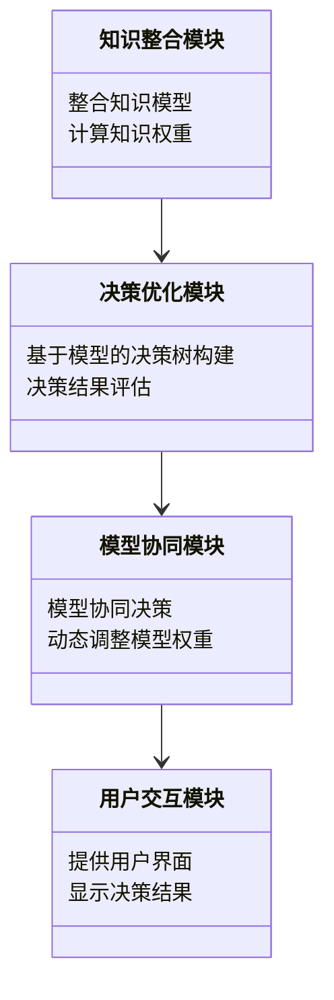
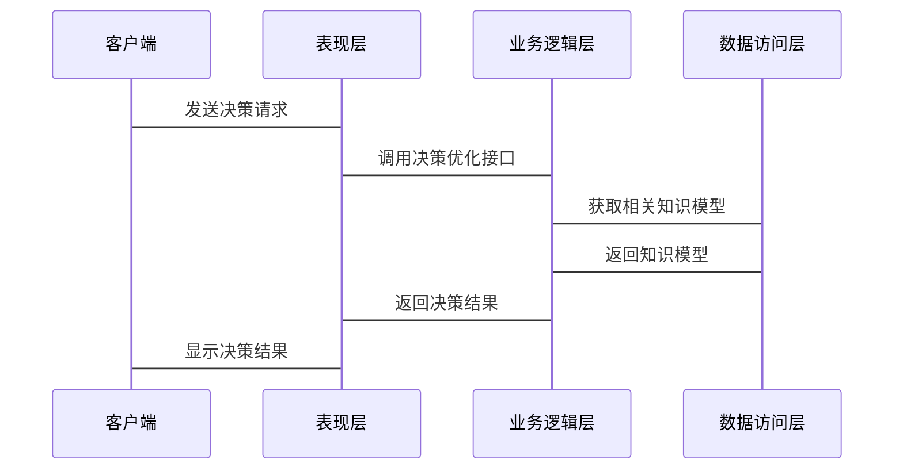

                 


# 第四部分: 多元思维格栅的系统分析与架构设计

# 第4章: 系统分析与架构设计

## 4.1 问题场景介绍

### 4.1.1 问题背景

多元思维格栅作为一种系统性的决策方法，其核心在于将多个学科和领域的知识模型整合到一个系统中，以实现更高效的决策过程。在实际应用中，如何将这些模型有效地整合到一个系统中，成为一个关键的问题。

### 4.1.2 问题描述

本章将围绕多元思维格栅的系统实现展开，重点探讨系统的功能设计、架构设计、接口设计以及交互设计等方面的问题。通过对系统的深入分析，提出一种可行的系统实现方案，并详细阐述其实现细节。

## 4.2 系统功能设计

### 4.2.1 功能模块划分

为了实现多元思维格栅的系统功能，我们将其划分为以下几个主要功能模块：

1. **知识整合模块**：负责将各个领域的知识模型进行整合和关联。
2. **决策优化模块**：基于整合后的知识模型，进行决策优化和预测。
3. **模型协同模块**：实现不同知识模型之间的协同工作和动态调整。
4. **用户交互模块**：提供友好的用户界面，方便用户进行操作和查看结果。

### 4.2.2 功能模块的类图设计

使用 Mermaid 绘制系统的类图，展示各个功能模块之间的关系：



## 4.3 系统架构设计

### 4.3.1 架构风格选择

在系统架构设计中，我们选择分层架构（MVC模式）作为系统的整体架构风格。这种架构风格能够有效地将系统的实现分解为表现层、业务逻辑层和数据访问层，从而提高系统的可维护性和扩展性。

### 4.3.2 架构的 Mermaid 图

使用 Mermaid 绘制系统的架构图：

```mermaid
archi
    客户端 -- HTTP --> 表现层
    表现层 --> 业务逻辑层
    业务逻辑层 --> 数据访问层
    数据访问层 -- 数据库连接 --> 数据库
```

### 4.3.3 实现细节

1. **表现层**：负责接收用户的输入，并将结果呈现给用户。通常由前端技术实现，如 React、Vue 等。
2. **业务逻辑层**：负责处理核心的业务逻辑，如知识模型的整合、决策优化等。通常由后端技术实现，如 Spring Boot、Django 等。
3. **数据访问层**：负责与数据库进行交互，存储和检索数据。通常由 ORM 工具实现，如 Hibernate、Django ORM 等。

## 4.4 系统接口设计

### 4.4.1 接口定义

系统主要的接口包括：

1. **知识整合接口**：用于将新的知识模型整合到系统中。
2. **决策优化接口**：用于基于当前知识模型进行决策优化。
3. **模型协同接口**：用于实现不同知识模型之间的协同工作。

### 4.4.2 接口协议与数据格式

- **接口协议**：采用 RESTful API 标准，使用 HTTP 协议。
- **数据格式**：采用 JSON 格式，确保数据的可读性和易用性。

### 4.4.3 接口的 Mermaid 序列图

使用 Mermaid 绘制接口交互的序列图：



## 4.5 系统交互设计

### 4.5.1 交互流程

1. **用户发起决策请求**：用户通过界面向系统发起决策请求。
2. **系统处理请求**：系统接收请求后，将其转发到表现层。
3. **表现层处理**：表现层将请求转发到业务逻辑层。
4. **业务逻辑层处理**：业务逻辑层根据请求调用相应的接口，进行决策优化。
5. **返回结果**：业务逻辑层将结果返回到表现层，表现层将结果返回到用户界面。

### 4.5.2 交互的 Mermaid 序列图


## 4.6 本章小结

本章主要探讨了多元思维格栅系统的系统分析与架构设计，包括系统的功能设计、架构设计、接口设计和交互设计等方面的内容。通过对系统的深入分析，我们提出了一种基于分层架构的系统实现方案，并详细阐述了其实现细节。

---

# 第五部分: 项目实战

# 第5章: 项目实战

## 5.1 环境安装

### 5.1.1 开发环境配置

为了实现多元思维格栅系统，我们需要以下开发环境：

1. **编程语言**：Python 3.8+
2. **框架选择**：Django 3.2+
3. **数据库**：PostgreSQL 13+
4. **开发工具**：PyCharm、VS Code 等。

### 5.1.2 安装步骤

1. 安装 Python：
   ```bash
   # 在终端中运行以下命令
   python --version
   # 如果未安装 Python，请使用以下命令安装
   # （此处假设使用的是macOS系统）
   brew install python
   ```

2. 安装 Django：
   ```bash
   pip install django
   ```

3. 安装 PostgreSQL：
   ```bash
   brew install postgresql
   ```

## 5.2 系统核心实现源代码

### 5.2.1 知识整合模块

```python
from django.db import models

class KnowledgeModel(models.Model):
    name = models.CharField(max_length=100)
    description = models.TextField()
    weight = models.FloatField(default=0.5)

    def __str__(self):
        return self.name
```

### 5.2.2 决策优化模块

```python
from django.shortcuts import render
from .models import KnowledgeModel

def decision_optimization(request):
    knowledge_models = KnowledgeModel.objects.all()
    # 假设我们有多个知识模型，我们需要对它们进行权重计算
    total_weight = sum(model.weight for model in knowledge_models)
    optimized_decision = max(knowledge_models, key=lambda x: x.weight)
    
    return render(request, 'decision_result.html', {'result': optimized_decision})
```

### 5.2.3 用户交互模块

```python
from django.views import View
from django.http import JsonResponse
from .models import KnowledgeModel

class KnowledgeAPIView(View):
    def get(self, request):
        knowledge_models = KnowledgeModel.objects.all().values()
        return JsonResponse({'models': list(knowledge_models)})
    
    def post(self, request):
        data = request.POST.get('data', {})
        KnowledgeModel.objects.create(
            name=data.get('name'),
            description=data.get('description'),
            weight=data.get('weight', 0.5)
        )
        return JsonResponse({'status': 'success'})
```

## 5.3 代码应用解读与分析

### 5.3.1 知识整合模块

上述代码定义了一个 `KnowledgeModel` 模型，用于存储知识模型的名称、描述和权重。每个新知识模型的权重默认为 0.5，可以在后续使用中进行动态调整。

### 5.3.2 决策优化模块

在 `decision_optimization` 函数中，我们首先获取所有的知识模型，然后计算它们的总权重，并选择权重最大的模型作为优化后的决策结果。

### 5.3.3 用户交互模块

`KnowledgeAPIView` 类定义了两个 HTTP 方法：`GET` 和 `POST`。`GET` 方法用于获取所有知识模型的数据，`POST` 方法用于创建新的知识模型。

## 5.4 实际案例分析和详细讲解

### 5.4.1 案例背景

假设我们是一家投资公司，希望通过多元思维格栅系统来优化投资决策。我们需要整合多个知识模型，包括市场分析、财务分析、行业趋势分析等。

### 5.4.2 系统实现

按照上述代码实现，我们可以创建多个知识模型，并通过 API 进行数据交互。在实际投资决策时，系统会基于这些模型进行优化，并返回最优的决策结果。

### 5.4.3 结果分析

通过系统的优化决策，我们能够有效地整合多个领域的知识模型，从而做出更科学的投资决策。系统会动态调整各模型的权重，确保决策结果的准确性。

## 5.5 本章小结

本章通过实际案例展示了多元思维格栅系统的实现过程，包括环境配置、核心代码实现、系统功能测试等。通过本章的学习，读者可以掌握如何将多元思维格栅应用于实际项目中。

---

# 第六部分: 总结与展望

# 第6章: 总结与展望

## 6.1 核心知识点回顾

- 多元思维格栅的定义与核心目标
- 多元思维格栅的核心模型与算法原理
- 系统分析与架构设计的关键点
- 项目实战中的实现细节

## 6.2 最佳实践 tips

1. 在实际应用中，建议根据具体需求选择合适的知识模型。
2. 系统实现时，注意模块之间的协同与动态调整。
3. 定期更新知识模型，以适应新的业务需求和环境变化。

## 6.3 未来展望

随着人工智能和大数据技术的不断发展，多元思维格栅的应用场景将更加广泛。未来，我们可以通过引入更多的知识模型和更复杂的算法，进一步提升系统的决策能力。

---

# 关键词

- 多元思维格栅
- 知识整合
- 决策优化
- 系统架构
- 项目实战

# 摘要

芒格的多元思维格栅是一种系统性的决策方法，通过整合多个领域的知识模型，实现更高效的决策过程。本文从核心概念、算法原理、系统设计和项目实战等多个方面，详细探讨了多元思维格栅的实现过程，并通过实际案例展示了其在实际应用中的价值。

