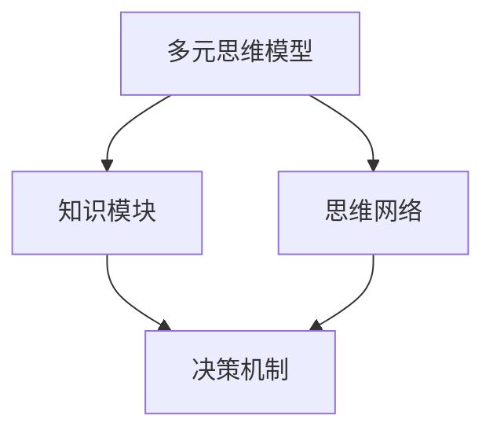
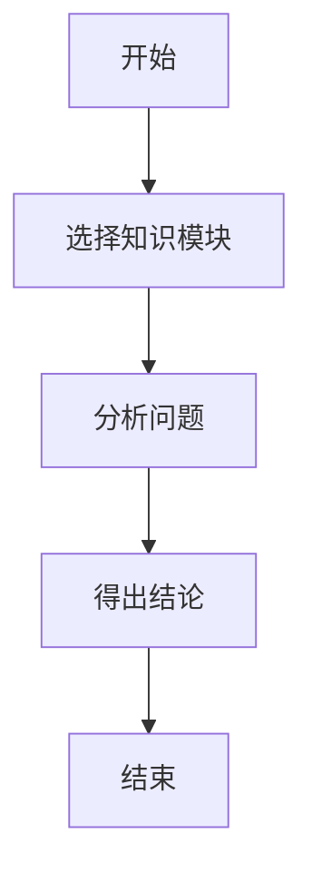
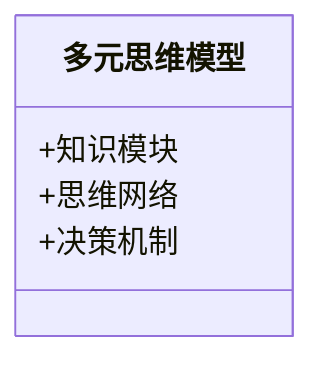

                 


# 芒格的"多元思维模型"在人工智能时代的升级

> 关键词：多元思维模型, 人工智能, 算法原理, 系统架构, 项目实战

> 摘要：本文探讨了芒格的多元思维模型在人工智能时代的升级，分析了其核心概念、算法原理、系统架构，并通过项目实战展示了其应用。通过本文，读者将深入了解如何在AI时代优化和升级多元思维模型，掌握其在实际项目中的应用技巧。

---

# 第一部分: 芒格的多元思维模型概述

## 第1章: 芒格的多元思维模型背景介绍

### 1.1 多元思维模型的起源与核心概念

#### 1.1.1 多元思维模型的定义

多元思维模型（Multifactorial Thinking Model）是由查理·芒格提出的，强调通过多个学科的思维方式来理解问题，从而做出更明智的决策。它不同于传统的单一学科思维，而是将多个领域的知识交叉应用，形成一个综合的思考框架。

#### 1.1.2 多元思维模型的核心要素

- **知识多样性**：涵盖多个学科的核心原理，如心理学、经济学、物理学等。
- **思维交叉性**：通过不同学科的思维方式解决复杂问题。
- **决策优化**：通过多维度分析，减少决策偏差，提高决策质量。

#### 1.1.3 多元思维模型的边界与外延

多元思维模型的应用范围广泛，但其核心在于将多个领域的知识整合到具体的决策场景中。其外延包括但不限于：投资决策、企业管理、个人成长等领域。

---

### 1.2 多元思维模型在AI时代的演变

#### 1.2.1 AI时代对传统思维模型的挑战

人工智能的快速发展带来了数据量的爆炸性增长和算法复杂度的提升，传统的单一思维模型难以应对复杂场景下的决策问题。

#### 1.2.2 多元思维模型的升级路径

- **知识整合**：将AI算法、数据科学、认知科学等领域的知识整合到多元思维模型中。
- **动态调整**：根据数据变化和场景需求，动态优化模型结构。
- **可解释性增强**：通过多学科知识的交叉应用，提高AI决策的可解释性。

#### 1.2.3 多元思维模型与AI技术的结合

通过结合AI技术，多元思维模型能够更高效地处理复杂问题，例如在投资决策中，结合机器学习算法和多元思维模型，可以更准确地预测市场趋势。

---

### 1.3 多元思维模型与传统思维模型的对比

#### 1.3.1 传统思维模型的局限性

- **单一视角**：传统思维模型往往局限于单一学科，难以全面分析问题。
- **适应性差**：面对复杂场景时，传统思维模型的灵活性不足。
- **效率低下**：在数据量大、场景复杂的情况下，传统思维模型的效率较低。

#### 1.3.2 多元思维模型的优势

- **多维度分析**：能够从多个角度分析问题，提高决策的全面性。
- **高效性**：通过整合多个领域的知识，提高问题解决的效率。
- **灵活性**：能够根据实际情况动态调整模型结构，适应不同场景。

#### 1.3.3 两者的对比分析

通过对比分析，可以看出多元思维模型在复杂场景下的优势，尤其是在AI时代，多元思维模型通过结合AI技术，能够更好地应对复杂决策问题。

---

## 第2章: 多元思维模型的核心概念与联系

### 2.1 多元思维模型的原理

#### 2.1.1 多元思维模型的组成

- **知识模块**：包括各个领域的核心原理和思维方式。
- **思维网络**：通过知识模块之间的关联，形成一个复杂的思维网络。
- **决策机制**：根据具体问题，选择合适的知识模块进行分析和决策。

#### 2.1.2 各个思维模型之间的关系

多元思维模型中的各个知识模块是相互关联的，形成一个网络结构。例如，经济学中的边际成本和心理学中的认知偏差可以通过多元思维模型结合起来，用于分析市场行为。

#### 2.1.3 多元思维模型的整体架构

通过模块化设计，多元思维模型将各个领域的知识整合到一个统一的框架中，形成一个动态调整的思维系统。

---

### 2.2 多元思维模型的属性特征对比

#### 2.2.1 各个思维模型的属性分析

| 思维模型 | 核心原理 | 适用场景 | 局限性 |
|----------|----------|----------|--------|
| 经济学   | 边际成本 | 市场分析 | 忽略心理因素 |
| 心理学   | 认知偏差 | 行为分析 | 数据量不足 |
| 数据科学 | 数据分析 | 预测模型 | 解释性差 |

#### 2.2.2 思维模型之间的特征对比

通过对比分析，可以看出不同思维模型在核心原理、适用场景和局限性上的差异，从而更好地理解多元思维模型的整体架构。

#### 2.2.3 ER实体关系图



---

### 2.3 多元思维模型的ER实体关系图

通过ER实体关系图，可以清晰地看到多元思维模型的组成部分及其之间的关系。知识模块通过思维网络连接到决策机制，形成一个动态调整的思维系统。

---

## 第3章: 多元思维模型的算法原理

### 3.1 多元思维模型的算法流程

#### 3.1.1 算法流程图



#### 3.1.2 算法流程的详细步骤

1. **选择知识模块**：根据具体问题，选择相关的知识模块。
2. **分析问题**：通过所选知识模块，分析问题的本质。
3. **得出结论**：结合多个知识模块的分析结果，得出最终结论。

#### 3.1.3 算法流程的优化

通过动态调整知识模块的选择和组合，可以进一步优化算法流程，提高决策的准确性和效率。

---

### 3.2 多元思维模型的数学模型

#### 3.2.1 数学模型的构建

多元思维模型可以通过数学公式进行建模，例如：

$$
\text{决策结果} = \sum_{i=1}^{n} w_i \cdot x_i
$$

其中，$w_i$ 是第$i$个知识模块的权重，$x_i$ 是第$i$个知识模块的分析结果。

#### 3.2.2 数学模型的公式推导

通过权重分配和知识模块的组合，可以推导出最终的决策结果。

#### 3.2.3 数学模型的实例分析

以投资决策为例，假设我们有三个知识模块：经济学、心理学和数据科学。通过权重分配，可以得出最终的投资决策。

---

### 3.3 多元思维模型的代码实现

#### 3.3.1 Python代码实现

```python
def multi_factorial_thinking_model(data):
    # 数据预处理
    processed_data = preprocess(data)
    # 选择知识模块
    selected_modules = select_modules(processed_data)
    # 分析问题
    analysis_results = analyze(selected_modules, processed_data)
    # 得出结论
    conclusion = conclude(analysis_results)
    return conclusion
```

#### 3.3.2 代码的详细注释

- `preprocess(data)`：对输入数据进行预处理。
- `select_modules(processed_data)`：根据预处理后的数据，选择相关的知识模块。
- `analyze(selected_modules, processed_data)`：对所选知识模块进行分析。
- `conclude(analysis_results)`：根据分析结果，得出最终结论。

#### 3.3.3 代码的运行结果分析

通过代码实现，可以验证多元思维模型在实际问题中的应用效果。

---

## 第4章: 多元思维模型的系统分析与架构设计

### 4.1 系统功能设计

#### 4.1.1 领域模型



---

## 第5章: 项目实战

### 5.1 环境安装

- 安装Python和相关库。
- 配置开发环境。

### 5.2 核心代码实现

- 数据预处理代码。
- 知识模块选择代码。
- 分析和决策代码。

### 5.3 案例分析

通过具体案例，展示多元思维模型在实际项目中的应用。

### 5.4 项目总结

总结项目经验，提出改进建议。

---

## 第6章: 最佳实践与小结

### 6.1 最佳实践

- 知识模块的动态调整。
- 多元思维模型的可解释性优化。

### 6.2 小结

本文详细介绍了芒格的多元思维模型在人工智能时代的升级，通过理论分析和项目实战，展示了其在实际应用中的优势。

---

通过以上内容，我们可以看到，芒格的多元思维模型在AI时代的升级不仅提高了决策的效率和准确性，还为复杂问题的解决提供了新的思路。希望本文对读者有所帮助，能够在实际工作中灵活应用多元思维模型。

