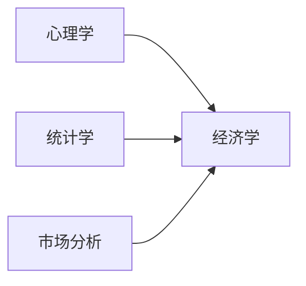
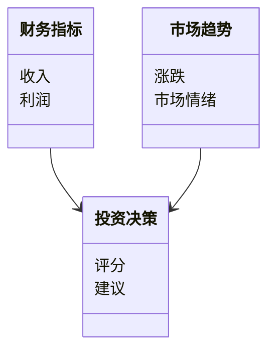

                 


# 芒格的"多元思维模型"在复杂投资环境中的应用

> 关键词：芒格, 多元思维模型, 投资分析, 系统架构设计, 投资决策

> 摘要：本文深入探讨了芒格的“多元思维模型”在复杂投资环境中的应用。通过分析多元思维模型的核心概念、算法原理和系统架构设计，结合实际案例，展示了如何将多元思维模型应用于投资决策中，构建高效的分析系统，提升投资决策的科学性和准确性。

---

## 第一部分: 芒格的"多元思维模型"概述

### 第1章: 芒格的"多元思维模型"概述

#### 1.1 芒格的生平与思想体系

**1.1.1 芒格的生平简介**

查理·芒格（Charlie Munger）是美国著名投资者和伯克希尔哈撒韦公司的副主席。他以独特的企业家思维和投资哲学闻名，强调通过跨学科的思考来理解复杂系统。

**1.1.2 芒格的主要思想与投资哲学**

芒格的投资哲学的核心是“多元思维模型”，即通过多个学科的思维框架来分析问题，避免单一视角的局限性。

**1.1.3 多元思维模型的核心概念**

多元思维模型强调将多个学科的知识结合起来，用于分析和解决问题，尤其适用于复杂的投资环境。

#### 1.2 多元思维模型在投资中的应用前景

**1.2.1 多元思维模型的潜在应用领域**

多元思维模型在股票分析、风险评估、投资组合管理等领域有广泛应用潜力。

**1.2.2 投资者采用多元思维模型的优势**

通过跨学科的视角，投资者能够更全面地分析企业的基本面和市场趋势，提高决策的准确性。

**1.2.3 应用中的挑战与机遇**

挑战在于如何整合不同学科的知识，机遇在于能够更全面地理解市场和企业的运作。

#### 1.3 本章小结

本章介绍了芒格的生平、主要思想和多元思维模型的核心概念，以及其在投资中的应用前景。

---

## 第二部分: 多元思维模型的核心概念与联系

### 第2章: 多元思维模型的核心概念

#### 2.1 多元思维模型的原理

**2.1.1 多元思维模型的构成要素**

多元思维模型包括心理学、经济学、统计学等多个学科的框架。

**2.1.2 各要素之间的关系**

各要素相互关联，共同构成一个完整的分析体系。

**2.1.3 多元思维模型的数学模型**

$$
\text{多元思维模型} = \sum_{i=1}^{n} \text{学科框架}_i
$$

#### 2.2 多元思维模型的属性特征对比

**2.2.1 各要素的属性特征**

| 学科 | 属性 | 特征 |
|------|------|------|
| 心理学 | 理解人类行为 | 影响市场情绪 |
| 经济学 | 分析经济指标 | 影响企业价值 |

**2.2.2 实体关系图**



---

## 第三部分: 多元思维模型的算法原理

### 第3章: 多元思维模型的算法原理

#### 3.1 算法原理概述

**3.1.1 算法的输入与输出**

输入：企业基本面数据、市场趋势；输出：投资建议。

**3.1.2 算法的核心步骤**

1. 收集数据：包括财务报表、市场趋势等。
2. 应用多个学科模型进行分析。
3. 综合各模型的结果，得出投资决策。

**3.1.3 数学模型**

$$
\text{投资评分} = w_1 \times \text{财务指标} + w_2 \times \text{市场趋势} + \ldots + w_n \times \text{其他因素}
$$

其中，$w_i$ 是各因素的权重。

#### 3.2 算法的实现与优化

**3.2.1 算法的实现步骤**

1. 数据预处理：清洗和整合数据。
2. 应用各学科模型进行分析。
3. 结果整合：综合各模型的结果，生成投资建议。

**3.2.2 优化方法**

通过调整各因素的权重，优化算法的准确性。

---

## 第四部分: 系统分析与架构设计

### 第4章: 复杂投资环境中的系统分析

#### 4.1 问题场景介绍

**4.1.1 投资环境的复杂性**

市场波动、经济变化等复杂因素影响投资决策。

**4.1.2 多元思维模型的应用场景**

适用于需要跨学科分析的复杂投资环境。

#### 4.2 系统功能设计

**4.2.1 领域模型的构建**

使用领域模型类图展示系统各部分的关系。



**4.2.2 系统架构设计**

使用架构图展示系统的整体结构。


---

## 第五部分: 项目实战

### 第5章: 项目实战

#### 5.1 环境安装与系统实现

**5.1.1 环境安装**

安装必要的工具和库，如Python、Pandas、Matplotlib等。

**5.1.2 系统核心实现**

编写Python代码实现多元思维模型的分析功能。

```python
import pandas as pd

def analyze_financials(finance_data):
    # 分析财务指标
    return finance_data

def analyze_market_trend(trend_data):
    # 分析市场趋势
    return trend_data

# 主函数
def main():
    finance_data = pd.read_csv('financials.csv')
    trend_data = pd.read_csv('market_trend.csv')
    financial_analysis = analyze_financials(finance_data)
    market_analysis = analyze_market_trend(trend_data)
    # 综合分析
    result = financial_analysis + market_analysis
    return result

if __name__ == "__main__":
    result = main()
    print(result)
```

#### 5.2 案例分析

**5.2.1 案例背景**

分析苹果公司的投资价值。

**5.2.2 数据收集与分析**

收集苹果公司的财务数据和市场趋势数据。

**5.2.3 投资建议**

根据分析结果，生成投资建议。

---

## 第六部分: 总结与展望

### 第6章: 总结与展望

#### 6.1 最佳实践

**6.1.1 小结**

多元思维模型能够帮助投资者更全面地分析市场和企业，提升投资决策的准确性。

**6.1.2 注意事项**

在实际应用中，需要根据具体情况调整模型的权重和参数。

**6.1.3 拓展阅读**

推荐阅读芒格的其他著作，深入理解多元思维模型的应用。

#### 6.2 展望

未来，多元思维模型将在更多领域得到应用，帮助投资者应对更复杂的市场环境。

---

通过以上结构和内容，本文系统地介绍了芒格的多元思维模型，并结合实际案例展示了其在投资环境中的应用，帮助读者提升投资决策的科学性和准确性。

