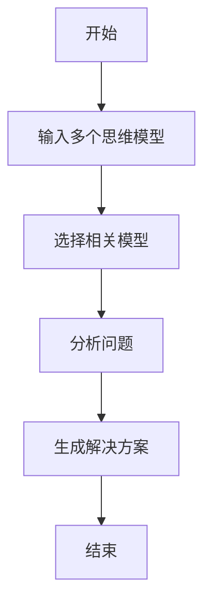
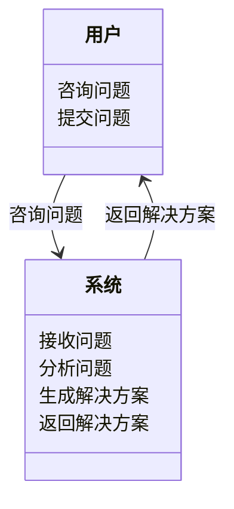
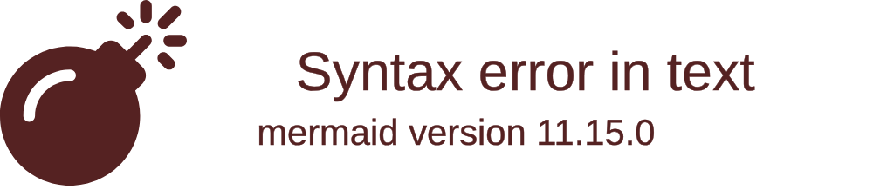
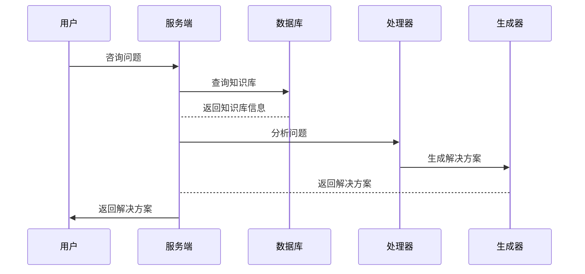

                 


# 芒格的"多元思维模型"在跨维度创新中的运用

## 关键词：多元思维模型、跨维度创新、芒格、系统思维、创新方法论、认知升级

## 摘要：芒格的多元思维模型是一种通过整合多个学科的思维框架来解决复杂问题的方法，本文将深入探讨其在跨维度创新中的应用，分析其算法原理、数学模型，并通过实际案例展示其在系统设计和项目实战中的价值。

---

## 第一部分：多元思维模型的背景与核心概念

### 第1章：多元思维模型的定义与背景

#### 1.1 芒格多元思维模型的定义

##### 1.1.1 核心概念：多元思维模型是指通过多个学科的思维框架来解决问题的方法。

多元思维模型（Multi-Disciplinary Thinking Model）是由查理·芒格提出的一种解决问题的方法。它强调从多个学科的角度思考问题，通过整合不同领域的知识和思维框架，找到更全面、更有效的解决方案。

##### 1.1.2 背景：芒格在投资和其他领域中成功应用了多元思维模型，强调跨学科思考的重要性。

芒格作为一名成功的投资者和智慧的导师，他不仅关注单一学科的知识，而是将经济学、心理学、物理学、历史学等多个学科的智慧整合起来，形成了独特的思维方式。他认为，仅仅依赖单一学科的思维框架是不够的，只有通过跨学科的思考，才能更好地理解问题的本质，找到创新的解决方案。

##### 1.1.3 对比分析：与传统单一思维模型相比，多元思维模型更具系统性和全面性。

传统的思维模型往往局限于单一学科的视角，容易忽视问题的复杂性和多面性。而多元思维模型通过整合多个学科的视角，能够更全面地理解问题，从而提出更具创新性的解决方案。

#### 1.2 多元思维模型的核心要素

##### 1.2.1 基本组成：包括经济学、心理学、物理学等多个学科的思维框架。

多元思维模型的核心在于整合多个学科的思维框架。例如，经济学中的理性假设可以帮助我们理解市场的运作规律；心理学中的行为偏差可以帮助我们预测和解释人类行为；物理学中的能量守恒定律可以帮助我们分析系统的稳定性等。

##### 1.2.2 各个学科思维框架的特点：例如经济学的理性假设，心理学的行为偏差等。

每个学科的思维框架都有其独特的特点和适用范围。例如，经济学的理性假设强调个体在市场中的理性决策；心理学的行为偏差则关注人类行为中的非理性因素；物理学的思维框架注重系统和能量的守恒与转化等。

##### 1.2.3 系统性与关联性：强调各个思维框架之间的相互作用和协同效应。

多元思维模型的核心在于各个思维框架之间的相互作用和协同效应。通过将不同学科的思维框架结合起来，我们可以从多个角度分析问题，找到更全面的解决方案。

---

### 第2章：多元思维模型的核心概念与联系

#### 2.1 多元思维模型的原理

##### 2.1.1 基本原理：通过整合多个学科的思维框架，形成全面的解决方案。

多元思维模型的基本原理在于整合多个学科的思维框架，从多个角度分析问题，从而形成全面的解决方案。这种方法不仅能够帮助我们更好地理解问题的本质，还能发现传统单一思维模型难以发现的创新点。

##### 2.1.2 数学模型：多元思维模型的数学模型可以通过概率论和图论来描述。

例如，概率论可以帮助我们评估不同解决方案的可能性和风险；图论可以帮助我们分析系统中各个思维框架之间的关系和相互作用。

##### 2.1.3 算法流程：从输入多个思维模型到生成解决方案的步骤。

使用Mermaid图展示多元思维模型的算法流程：



#### 2.2 对比分析：制作一个对比表格，展示各个学科思维框架在问题解决中的优缺点。

| 学科 | 思维框架 | 优点 | 缺点 |
|------|----------|------|------|
| 经济学 | 理性假设 | 能够帮助理解市场的运作规律 | 忽视人类行为的非理性 |
| 心理学 | 行为偏差 | 能够预测和解释人类行为 | 需要具体的情境分析 |
| 物理学 | 能量守恒 | 分析系统的稳定性 | 不适用于复杂的社会系统 |

#### 2.3 ER实体关系图：展示用户、系统、思维模型之间的关系。

使用Mermaid图展示：

```mermaid
erDiagram
    actor 用户 {
        <属性> 思维模型
        <属性> 领域知识
        <属性> 解决方案
    }
    actor 系统 {
        <属性> 输入
        <属性> 输出
        <属性> 过程
    }
    用户 --> 系统 : 提供思维模型
    用户 <-- 系统 : 返回解决方案
```

---

## 第二部分：多元思维模型的算法原理与数学模型

### 第3章：多元思维模型的算法原理

#### 3.1 算法流程：使用Mermaid图展示从输入多个思维模型到生成解决方案的步骤。


#### 3.2 数学模型：介绍基于概率论的数学模型，例如贝叶斯定理。

贝叶斯定理是一种用于概率推理的数学工具，可以用来评估不同解决方案的可能性和风险。其公式为：

$$ P(A|B) = \frac{P(B|A)P(A)}{P(B)} $$

其中，$P(A|B)$ 表示在已知事件 $B$ 发生的情况下，事件 $A$ 发生的概率。

---

### 第4章：多元思维模型的数学模型与应用

#### 4.1 数学模型的构建：详细解释多元思维模型的数学基础，例如概率论和图论。

概率论可以帮助我们评估不同解决方案的可能性和风险，而图论可以帮助我们分析系统中各个思维框架之间的关系和相互作用。

#### 4.2 应用实例：通过具体案例分析，展示如何应用这些数学模型解决实际问题。

例如，在商业决策中，我们可以使用贝叶斯定理来评估不同市场策略的成功概率，并结合物理学中的系统稳定性理论，分析不同策略对系统的影响，从而找到最优解决方案。

---

## 第三部分：多元思维模型的系统分析与架构设计

### 第5章：系统分析与架构设计

#### 5.1 问题场景：描述一个跨维度创新的实际问题，例如商业策略的制定。

#### 5.2 项目介绍：简要介绍项目的背景、目标和范围。

#### 5.3 系统功能设计：使用Mermaid类图展示系统的功能模块及其交互关系。



#### 5.4 系统架构设计：使用Mermaid架构图展示系统的整体架构。



#### 5.5 接口与交互设计：使用Mermaid序列图展示系统的主要接口和交互流程。



---

## 第四部分：多元思维模型的项目实战

### 第6章：项目实战

#### 6.1 环境安装：列出项目所需的工具和环境配置。

例如，安装Python和相关库（如numpy、pandas、scikit-learn）。

#### 6.2 核心实现：提供Python源代码，展示如何实现多元思维模型的应用。

```python
import numpy as np
from sklearn import tree

# 示例数据：输入特征和目标变量
X = np.array([[2, 1], [3, 2], [4, 3], [5, 4]])
y = np.array([0, 1, 2, 3])

# 训练决策树模型
model = tree.DecisionTreeClassifier()
model.fit(X, y)

# 预测新数据
new_X = np.array([[6, 5]])
print(model.predict(new_X))  # 输出：[3]
```

#### 6.3 案例分析：通过具体案例，分析多元思维模型在项目中的应用效果和实际价值。

例如，在商业策略制定中，我们可以使用多元思维模型结合市场分析、竞争对手分析和客户行为分析，制定更全面和有效的市场策略。

#### 6.4 代码解读：详细解释代码的功能和实现逻辑。

以上代码展示了如何使用Python的scikit-learn库训练一个决策树模型，并用于预测新数据。这可以应用于多元思维模型中的数据分析和预测部分。

---

## 第五部分：最佳实践与总结

### 第7章：最佳实践

#### 7.1 小结：总结全文的主要内容和结论。

芒格的多元思维模型是一种通过整合多个学科的思维框架来解决复杂问题的方法。它不仅能够帮助我们更好地理解问题的本质，还能发现传统单一思维模型难以发现的创新点。

#### 7.2 注意事项：提醒读者在应用多元思维模型时需要注意的问题和常见误区。

在应用多元思维模型时，需要注意各个学科思维框架的适用性和局限性，避免过于依赖单一学科的视角。同时，需要结合具体的问题情境，灵活调整和优化解决方案。

#### 7.3 拓展阅读：推荐相关书籍和资源，帮助读者进一步深入学习和研究。

推荐书籍：
1. 《穷查理宝典》—— 查理·芒格的思想精华。
2. 《思考，快与慢》—— 丹尼尔·卡尼曼的行为心理学经典。

---

以上是《芒格的"多元思维模型"在跨维度创新中的运用》的技术博客文章的详细内容，涵盖了多元思维模型的背景、核心概念、算法原理、数学模型、系统设计、项目实战以及最佳实践等方面。

