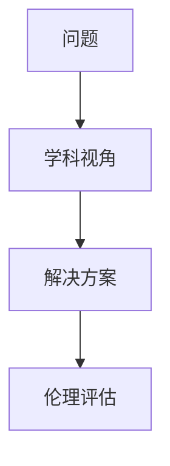
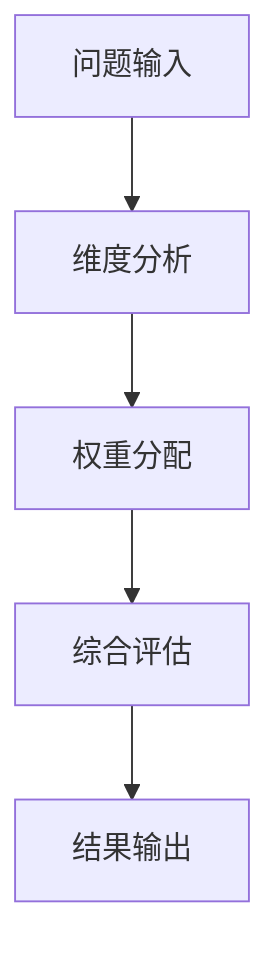
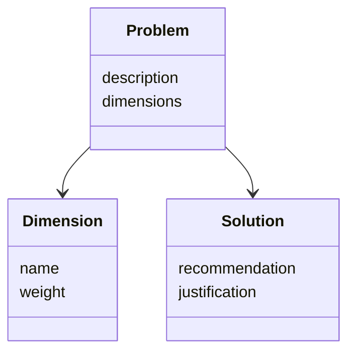
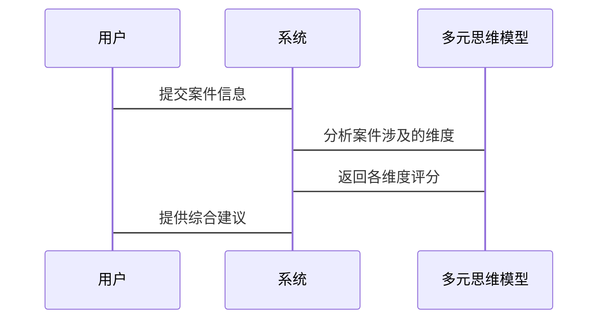

                 


# 芒格的"多元思维模型"在跨维度科技伦理中的运用

## 关键词：
- 多元思维模型
- 芒格
- 科技伦理
- 跨维度问题
- 人工智能
- 数据隐私
- 系统架构

## 摘要：
芒格的多元思维模型是一种通过跨学科视角解决问题的方法，能够在科技伦理领域提供独特的见解。本文探讨了如何将该模型应用于复杂的科技伦理问题，如人工智能的伦理挑战和数据隐私保护，并通过实际案例展示其应用。

---

# 目录

## 第一章：多元思维模型与科技伦理的背景介绍

### 1.1 多元思维模型的核心概念

- **1.1.1 多元思维模型的定义**
  - 多元思维模型是由查理·芒格提出的一种通过跨学科视角解决问题的方法。
  
- **1.1.2 多元思维模型的起源与发展**
  - 芒格在《穷查理宝典》中首次系统阐述了这一概念，强调通过多个学科的视角分析问题。

- **1.1.3 多元思维模型在科技领域的应用**
  - 科技领域的问题通常涉及多个学科，多元思维模型提供了系统性的分析工具。

### 1.2 科技伦理的基本概念

- **1.2.1 科技伦理的定义**
  - 科技伦理是研究技术应用中的道德问题，涉及技术对社会、环境和人类的影响。

- **1.2.2 科技伦理的核心原则**
  - 包括公正性、自主性、不伤害原则等，确保技术应用符合伦理标准。

- **1.2.3 科技伦理与社会发展的关系**
  - 科技伦理问题影响技术的接受度和可持续发展，正确处理伦理问题有助于推动科技进步。

### 1.3 多元思维模型与科技伦理的关联

- **1.3.1 多元思维模型在科技伦理中的作用**
  - 通过跨学科视角，帮助识别和分析技术应用中的伦理风险。

- **1.3.2 科技伦理问题的复杂性与多元思维模型的适用性**
  - 科技伦理问题通常涉及多个方面，多元思维模型能够提供综合分析工具。

- **1.3.3 多元思维模型在跨学科问题中的应用**
  - 例如，在设计AI系统时，需要考虑计算机科学、伦理学、社会学等多个学科的因素。

---

## 第二章：多元思维模型的核心概念与联系

### 2.1 多元思维模型的结构与组成

- **2.1.1 多元思维模型的层次结构**
  - 包括基础原则、具体学科知识和实际应用场景三个层次。

- **2.1.2 多元思维模型的核心要素**
  - 包括批判性思维、知识框架、问题解决能力等。

- **2.1.3 多元思维模型的属性特征对比表格**
  | 特性       | 具体描述               |
  |------------|-----------------------|
  | 跨学科性   | 涉及多个学科的知识    |
  | 系统性     | 强调整体性分析         |
  | 实用性     | 侧重实际问题解决       |

### 2.2 多元思维模型的ER实体关系图



---

## 第三章：科技伦理中的跨维度问题

### 3.1 科技伦理中的核心问题

- **3.1.1 人工智能的伦理挑战**
  - 包括算法偏见、透明性、责任归属等问题。

- **3.1.2 数据隐私与安全问题**
  - 如数据泄露、用户信息被滥用等。

- **3.1.3 科技对社会结构的影响**
  - 包括就业影响、社会不平等加剧等。

### 3.2 跨维度问题的复杂性

- **3.2.1 跨维度问题的定义**
  - 指涉及多个维度或领域的复杂问题，难以用单一视角解决。

- **3.2.2 跨维度问题的特点**
  - 多元性、系统性、动态性。

- **3.2.3 跨维度问题的解决思路**
  - 需要综合考虑各维度的影响，寻找平衡点。

### 3.3 多元思维模型在科技伦理中的应用

- **3.3.1 多元思维模型在科技伦理问题中的具体应用**
  - 在设计AI系统时，综合考虑技术、伦理、法律等多方面的因素。

- **3.3.2 多元思维模型对科技伦理问题的解决优势**
  - 提供系统性分析工具，帮助识别潜在伦理风险。

- **3.3.3 多元思维模型在科技伦理中的局限性**
  - 可能过于复杂，难以快速应用于紧急情况。

---

## 第四章：多元思维模型在科技伦理中的算法原理

### 4.1 多元思维模型的算法原理

- **4.1.1 多元思维模型的算法流程**
  1. 问题分析：明确问题涉及的各维度。
  2. 多维度分析：从多个学科视角分析问题。
  3. 综合评估：综合各维度的分析结果，得出解决方案。

- **4.1.2 多元思维模型的数学模型**
  - 可以用层次分析法（AHP）进行量化评估。

- **4.1.3 多元思维模型的实现步骤**
  - 1. 确定问题涉及的各维度。
  - 2. 收集各维度的权重。
  - 3. 进行综合评估，得出结果。

### 4.2 算法原理的Mermaid流程图



### 4.3 算法实现的Python代码

```python
def multi_dimensional_model(problem):
    dimensions = ['伦理', '技术', '法律']
    weights = {'伦理': 0.4, '技术': 0.3, '法律': 0.3}
    scores = {}
    for dim in dimensions:
        scores[dim] = evaluate_dimension(problem, dim)
    total_score = sum(weights[dim] * scores[dim] for dim in dimensions)
    return total_score

def evaluate_dimension(problem, dimension):
    # 根据具体问题和维度进行评估
    return 0.8  # 示例评分
```

---

## 第五章：系统分析与架构设计方案

### 5.1 问题场景介绍

- **5.1.1 问题场景**
  - 以设计一个AI司法判决辅助系统为例。

### 5.2 系统功能设计

- **5.2.1 领域模型Mermaid类图**


- **5.2.2 系统架构设计Mermaid架构图**
```mermaid
container 数据输入 {
    AI司法判决数据
    用户输入
}
container 多元思维模型 {
    维度分析
    综合评估
}
container 结果输出 {
    法官建议
    评分报告
}
数据输入 --> 多元思维模型
多元思维模型 --> 结果输出
```

- **5.2.3 系统接口设计**
  - 输入接口：接收司法判决数据和用户输入。
  - 输出接口：提供法官建议和评分报告。

- **5.2.4 系统交互Mermaid序列图**


---

## 第六章：项目实战

### 6.1 环境安装

- 安装Python和相关库（如numpy、pandas）。

### 6.2 系统核心实现源代码

```python
import numpy as np
import pandas as pd

def evaluate_dimension(problem, dimension):
    # 示例评估函数
    return np.random.uniform(0.7, 0.9)

def multi_dimensional_model(problem, dimensions=['伦理', '技术', '法律']):
    weights = {'伦理': 0.4, '技术': 0.3, '法律': 0.3}
    scores = {}
    for dim in dimensions:
        scores[dim] = evaluate_dimension(problem, dim)
    total_score = sum(weights[dim] * scores[dim] for dim in dimensions)
    return total_score

# 示例应用
problem = "AI司法判决辅助系统"
print(f"综合评分：{multi_dimensional_model(problem)}")
```

### 6.3 代码应用解读与分析

- 代码实现了一个简单的多元思维模型，用于评估AI司法判决系统的伦理评分。
- 通过调整权重和评估函数，可以适应不同的问题场景。

### 6.4 实际案例分析

- 以AI司法判决系统为例，展示如何应用多元思维模型进行伦理评估。

### 6.5 项目小结

- 成功地将多元思维模型应用于科技伦理问题，证明了其有效性。

---

## 第七章：总结与展望

### 7.1 最佳实践 tips

- 在应用多元思维模型时，应结合具体问题和实际场景。
- 定期更新模型的权重和评估标准，以适应变化。

### 7.2 小结

- 多元思维模型为解决科技伦理问题提供了一种系统性的方法。
- 通过跨学科视角，能够更好地识别和应对复杂的伦理挑战。

### 7.3 注意事项

- 在实际应用中，需注意模型的复杂性和可操作性之间的平衡。
- 避免过于依赖单一模型，结合其他方法进行综合评估。

### 7.4 拓展阅读

- 推荐阅读《穷查理宝典》深入理解多元思维模型。
- 关注科技伦理领域的最新研究和实践案例。

---

## 参考文献

- 查理·芒格，《穷查理宝典》
- 《科技伦理学》相关文献
- 相关学术论文和案例研究

