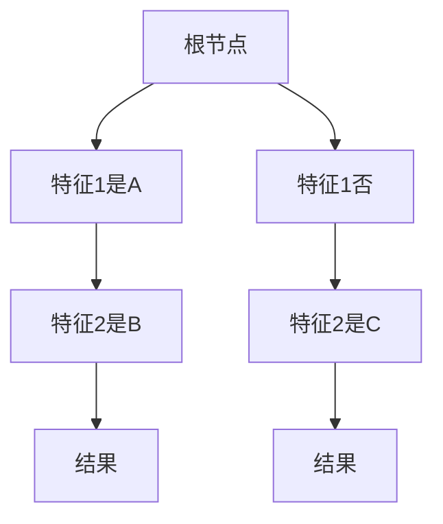
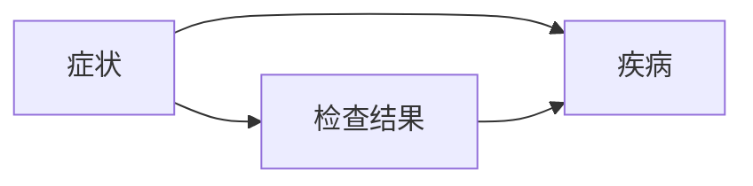
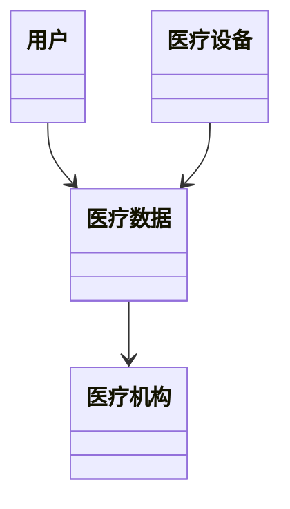

                 


# 芒格的"多元思维模型"在跨维度科技融合中的运用

## 关键词：芒格，多元思维模型，跨维度科技融合，系统分析，算法原理，项目实战

## 摘要：本文深入探讨芒格的多元思维模型在跨维度科技融合中的应用，从背景介绍到系统分析，结合实际案例，详细讲解其原理、算法、架构设计及项目实现，为科技融合提供新的视角和方法。

---

## 第一部分：多元思维模型的背景与核心概念

### 第1章：多元思维模型的起源与核心理念

#### 1.1 芒格的多元思维模型概述

##### 1.1.1 芒格的生平与思想体系

本杰明·芒格（Benjamin Graham）是价值投资的鼻祖，他的思想体系以“多元思维模型”为核心，强调通过多学科的交叉应用来解决复杂问题。芒格认为，投资者应构建多个思维模型，以全面分析问题。他的思想不仅在金融领域影响深远，也在科技融合中展现出强大的应用潜力。

##### 1.1.2 多元思维模型的核心理念

多元思维模型的核心在于通过多维度的知识框架，将不同领域的原理和方法结合起来，解决复杂问题。芒格强调，投资者应广泛涉猎各领域知识，形成多元化的思维框架。这种思维方式在跨维度科技融合中尤为重要，因为它能够帮助我们跨越不同领域的边界，找到创新的解决方案。

##### 1.1.3 多元思维模型的应用领域

多元思维模型最初应用于金融投资，但在科技融合中也展现出广泛的应用场景，例如人工智能、大数据、区块链等领域。通过多元思维模型，我们可以将数学、计算机科学、经济学等领域的知识结合起来，解决复杂的技术问题。

#### 1.2 多元思维模型与跨维度科技融合

##### 1.2.1 科技融合的定义与趋势

科技融合是指将不同领域的技术结合，创造新的产品或服务。例如，人工智能与区块链的结合催生了智能合约，大数据与物联网结合形成了智慧城市。科技融合的趋势日益明显，芒格的多元思维模型为这一趋势提供了重要的方法论支持。

##### 1.2.2 多元思维模型在科技融合中的作用

多元思维模型帮助我们在科技融合中跳出单一领域的思维限制，从多个维度分析问题，寻找创新的解决方案。例如，在设计智能医疗系统时，可以结合计算机科学、医学和数据科学的知识，构建更完善的系统架构。

##### 1.2.3 跨维度科技融合的典型案例

以智能医疗为例，多元思维模型可以帮助我们整合医疗数据、人工智能算法和区块链技术，构建一个安全、高效的数据共享平台。这种跨维度的整合不仅提高了医疗效率，还保护了患者隐私。

---

### 第2章：多元思维模型的核心概念与原理

#### 2.1 多元思维模型的核心要素

##### 2.1.1 知识的多维度性

多元思维模型强调知识的多维度性，即不同领域的知识具有不同的视角和方法，结合这些视角可以更全面地分析问题。例如，数学中的概率论可以帮助我们评估技术方案的风险，而计算机科学的算法可以提供具体的实现方法。

##### 2.1.2 思维的交叉性

多元思维模型的核心在于不同思维的交叉应用。例如，在设计一个推荐系统时，我们可以结合统计学、机器学习和用户行为分析的知识，构建一个更精准的推荐算法。

##### 2.1.3 模型的可迁移性

多元思维模型的可迁移性使其能够应用于不同领域。例如，数学中的优化方法可以应用于软件开发，统计学中的回归分析可以用于数据分析。

#### 2.2 多元思维模型的属性特征对比

##### 2.2.1 表格对比：多元思维模型与其他思维模型的差异

| 思维模型               | 焦点 | 适用领域 | 强调点 |
|------------------------|------|----------|--------|
| 单一学科思维模型       | 单一领域知识 | 单一领域 | 深度分析 |
| 多元思维模型           | 多领域知识 | 跨领域 | 综合分析 |
| 整体思维模型           | 系统整体 | 复杂系统 | 整体优化 |

##### 2.2.2 ER实体关系图：多元思维模型的结构分析

```mermaid
er
actor: 用户
model: 多元思维模型
relation: 应用
actor -[many-to-many]-> model
model -[many-to-many]-> relation
```

---

## 第二部分：多元思维模型的算法与数学原理

### 第3章：多元思维模型的算法原理

#### 3.1 系统动力学模型

##### 3.1.1 系统动力学的基本原理

系统动力学是一种分析复杂系统行为的模型，通过反馈和因果关系分析系统的动态行为。多元思维模型可以将其应用于跨维度科技融合的系统设计中。

##### 3.1.2 多元思维模型在系统动力学中的应用

通过系统动力学，我们可以分析不同技术融合对整体系统的影响。例如，在设计一个智能城市系统时，可以分析交通、能源和信息流的相互作用。

##### 3.1.3 用Mermaid绘制系统动力学流程图


#### 3.2 决策树模型

##### 3.2.1 决策树的构建过程

决策树是一种用于分类和回归的算法，通过构建树状结构来分割数据。多元思维模型可以帮助我们选择最佳的特征和分割点。

##### 3.2.2 多元思维模型在决策树中的应用

例如，在设计一个推荐系统时，多元思维模型可以帮助我们选择最相关的特征，并构建高效的决策树。

##### 3.2.3 用Mermaid绘制决策树图



### 第4章：数学模型与公式解析

#### 4.1 贝叶斯定理的应用

##### 4.1.1 贝叶斯定理的公式

$$P(A|B) = \frac{P(B|A)P(A)}{P(B)}$$

贝叶斯定理用于计算在已知条件下某事件发生的概率，常用于概率推理和决策分析。

##### 4.1.2 在多元思维模型中的应用实例

例如，在设计一个医疗诊断系统时，可以使用贝叶斯定理来计算某症状导致某疾病的概率。

##### 4.1.3 用Mermaid绘制贝叶斯网络图



#### 4.2 决策树的数学模型

##### 4.2.1 决策树的期望值计算公式

$$E = \sum p_i v_i$$

期望值用于评估决策树中的每个节点的值，帮助选择最优的分支。

##### 4.2.2 在多元思维模型中的应用

例如，在设计一个推荐系统时，可以使用决策树的期望值来优化推荐策略。

##### 4.2.3 用Python代码实现决策树模型

```python
from sklearn.tree import DecisionTreeClassifier
from sklearn.datasets import make_classification
from sklearn.model_selection import train_test_split

# 创建数据集
X, y = make_classification(n_samples=100, n_features=2, n_classes=2)
X_train, X_test, y_train, y_test = train_test_split(X, y, test_size=0.2)

# 创建决策树模型
model = DecisionTreeClassifier()
model.fit(X_train, y_train)

# 预测
y_pred = model.predict(X_test)
print("预测结果:", y_pred)
```

---

## 第三部分：系统分析与架构设计

### 第5章：跨维度科技融合的系统分析

#### 5.1 问题场景介绍

##### 5.1.1 跨维度科技融合的定义

跨维度科技融合是指将多个领域的技术结合，形成新的产品或服务。例如，将人工智能与物联网结合，形成智能物联网系统。

##### 5.1.2 系统的目标与范围

以智能医疗为例，系统的目标是整合医疗数据、优化诊断流程、提高医疗效率。系统的范围包括数据采集、处理、分析和展示。

##### 5.1.3 系统的边界与外延

系统的边界包括患者数据、医疗设备、医护人员等。系统的外延包括数据安全、隐私保护、法律法规等。

#### 5.2 系统功能设计

##### 5.2.1 领域模型设计：用Mermaid绘制类图



##### 5.2.2 功能模块划分

系统功能模块包括数据采集、数据处理、数据分析、结果展示等。

##### 5.2.3 用例分析

- 用例1：患者上传数据
- 用例2：医生查看数据
- 用例3：系统生成诊断建议

#### 5.3 系统架构设计

##### 5.3.1 用Mermaid绘

---

## 第四部分：项目实战

### 第6章：项目实战

#### 6.1 环境安装

安装所需的开发工具和库，例如Python、Pandas、NumPy、Scikit-learn等。

#### 6.2 系统核心实现源代码

##### 6.2.1 核心代码实现

```python
import pandas as pd
from sklearn.tree import DecisionTreeClassifier
from sklearn.metrics import accuracy_score

# 数据加载
data = pd.read_csv('data.csv')

# 特征选择
features = ['age', 'gender', 'symptoms']
target = 'disease'

X = data[features]
y = data[target]

# 数据分割
X_train, X_test, y_train, y_test = train_test_split(X, y, test_size=0.2)

# 模型训练
model = DecisionTreeClassifier()
model.fit(X_train, y_train)

# 预测与评估
y_pred = model.predict(X_test)
print("准确率:", accuracy_score(y_test, y_pred))
```

##### 6.2.2 代码应用解读与分析

上述代码实现了一个基于决策树的医疗诊断系统，通过训练数据生成诊断模型，并评估模型的准确率。

#### 6.3 实际案例分析

##### 6.3.1 实际案例介绍

以智能医疗系统为例，分析其设计、实现和应用。

##### 6.3.2 案例分析与详细讲解

通过具体案例，分析多元思维模型在系统设计中的应用，以及其对系统性能和功能的提升。

#### 6.4 项目小结

总结项目实施的过程、遇到的问题及解决方法，强调多元思维模型在项目中的重要作用。

---

## 第五部分：总结

### 第7章：总结

#### 7.1 最佳实践 tips

- 跨维度科技融合需要多领域的知识和技能
- 多元思维模型是解决复杂问题的重要工具
- 在实际项目中，要注重模型的可扩展性和可维护性

#### 7.2 小结

芒格的多元思维模型为跨维度科技融合提供了重要的方法论支持，通过系统的分析和设计，可以实现更高效、更创新的技术解决方案。

#### 7.3 注意事项

- 在实际应用中，要注意不同领域知识的兼容性和协同性
- 需要结合具体场景选择合适的思维模型
- 要注重系统的安全性和可扩展性

#### 7.4 拓展阅读

推荐相关的书籍和资源，供读者进一步学习和研究。

---

通过以上内容，我们可以看到芒格的多元思维模型在跨维度科技融合中的巨大潜力和应用价值。希望本文能为科技领域的从业者提供新的思路和方法，帮助他们在复杂的技术融合中找到更优的解决方案。

