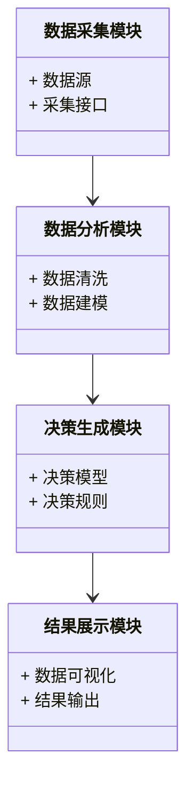
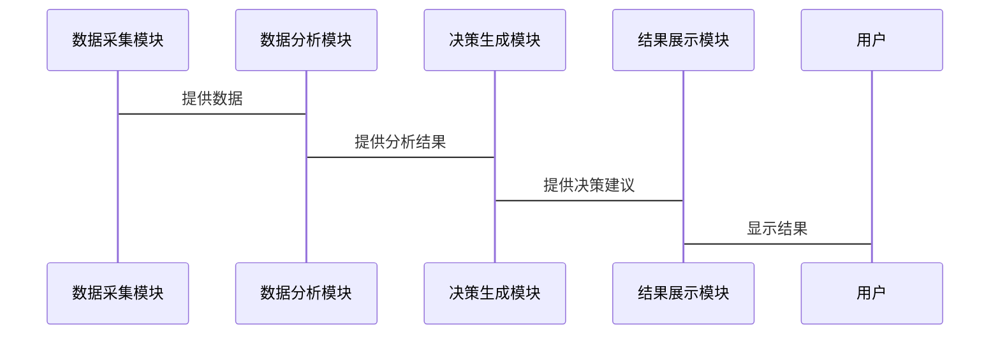

                 


# 芒格的多元思维模型：应对复杂投资环境

---

## 关键词

- 多元思维模型
- 投资决策
- 复杂环境
- 芒格思想
- 系统分析

---

## 摘要

芒格的多元思维模型是一种通过多维度、多层次的思考方式来应对复杂投资环境的方法。本文从芒格的思想背景出发，深入解析多元思维模型的核心概念、算法原理、系统架构，并结合实际案例进行实战分析。通过本篇文章，读者将能够掌握如何运用多元思维模型在复杂的投资环境中做出更明智的决策。

---

## 目录大纲

### 第一部分: 芒格的多元思维模型概述

#### 第1章: 芒格与多元思维模型的背景

##### 1.1 芒格的生平与思想
- 查理·芒格的基本介绍
- 芒格投资哲学的核心理念
- 芒格思想对投资领域的影响

##### 1.2 多元思维模型的定义与特点
- 多元思维模型的定义
- 多元思维模型的核心特点
- 多元思维模型与传统投资方法的区别

##### 1.3 多元思维模型在投资中的应用背景
- 当前复杂投资环境的挑战
- 多元思维模型应对复杂环境的优势
- 多元思维模型在投资决策中的重要性

#### 第2章: 多元思维模型的核心概念

##### 2.1 多元思维模型的原理
- 多元思维模型的基本原理
- 多元思维模型的构成要素
- 多元思维模型的数学模型

##### 2.2 多元思维模型的核心属性对比
- 各个模型的特点对比
- 多元思维模型与单一模型的对比
- 多元思维模型与其他投资模型的对比

##### 2.3 多元思维模型的ER实体关系图
- 实体关系图的构建
- 实体关系图的解释
- 实体关系图的应用

#### 第3章: 多元思维模型的算法原理

##### 3.1 多元思维模型的算法流程
- 算法的输入与输出
- 算法的步骤分解
- 算法的数学模型

##### 3.2 多元思维模型的数学表达式
- 多元思维模型的数学公式
- 公式的具体含义与应用场景
- 公式的推导过程与验证

##### 3.3 多元思维模型的算法实现
- 算法实现的步骤分解
- 算法实现的Python代码示例
- 代码的详细解读与分析

#### 第4章: 多元思维模型的系统架构设计

##### 4.1 系统架构概述
- 系统架构的整体设计
- 系统架构的核心模块
- 系统架构的模块间关系

##### 4.2 系统架构的Mermaid图
- 系统架构的类图设计
- 系统架构的交互流程
- 系统架构的组件关系

#### 第5章: 多元思维模型的项目实战

##### 5.1 项目背景与目标
- 项目背景介绍
- 项目目标设定
- 项目范围界定

##### 5.2 项目环境配置
- 开发环境的搭建
- 开发工具的安装
- 相关库的配置

##### 5.3 核心代码实现
- 核心代码的编写
- 代码的详细解读
- 代码的测试与优化

##### 5.4 实际案例分析
- 案例背景介绍
- 案例分析过程
- 案例的结果与总结

#### 第6章: 最佳实践与小结

##### 6.1 最佳实践总结
- 投资决策中的注意事项
- 多元思维模型的优化建议
- 复杂环境下的应对策略

##### 6.2 本文的总结
- 全文的核心观点回顾
- 多元思维模型的未来展望
- 对读者的启发与建议

##### 6.3 未来研究方向
- 多元思维模型的进一步优化
- 多元思维模型与其他方法的结合
- 复杂投资环境下的创新策略

---

## 示例内容（部分章节）

### 第3章: 多元思维模型的算法原理

#### 3.1 多元思维模型的算法流程

##### 3.1.1 算法的输入与输出
- 输入: 多个影响投资决策的因素（如市场趋势、公司基本面、行业动态等）
- 输出: 投资决策建议（如买入、卖出、持有等）

##### 3.1.2 算法的步骤分解
1. 收集影响投资决策的相关因素
2. 对每个因素进行权重计算
3. 根据权重进行综合评分
4. 根据评分结果生成投资决策建议

##### 3.1.3 算法的数学模型
- 综合评分公式:
  $$ \text{综合评分} = \sum_{i=1}^{n} w_i \cdot f_i $$
  其中，$w_i$ 是第i个因素的权重，$f_i$ 是第i个因素的评分。

#### 3.2 多元思维模型的数学表达式

##### 3.2.1 多元思维模型的数学公式
- 期望收益公式:
  $$ E = \sum_{i=1}^{n} P_i \cdot R_i $$
  其中，$P_i$ 是第i种情况发生的概率，$R_i$ 是第i种情况的收益。

##### 3.2.2 公式的具体含义与应用场景
- 通过期望收益公式，投资者可以评估不同投资策略的潜在收益，并选择收益最大的策略。

##### 3.2.3 公式的推导过程与验证
- 推导过程:
  期望收益是概率论中的基本概念，通过线性组合得到。
- 验证:
  使用历史数据进行回测，验证公式的有效性。

#### 3.3 多元思维模型的算法实现

##### 3.3.1 算法实现的步骤分解
1. 收集历史数据
2. 计算各因素的权重
3. 计算各因素的评分
4. 综合计算期望收益
5. 生成投资决策建议

##### 3.3.2 算法实现的Python代码示例

```python
import pandas as pd
import numpy as np

# 收集历史数据
data = pd.read_csv('investment_data.csv')

# 计算各因素的权重
weights = [0.4, 0.3, 0.2, 0.1]

# 计算各因素的评分
scores = []
for i in range(len(weights)):
    scores.append(data.iloc[:, i] * weights[i])

# 综合评分
total_scores = sum(scores)

# 计算期望收益
expectation = np.mean(total_scores)

# 生成投资决策建议
if expectation > 0.05:
    print("建议买入")
elif expectation < -0.05:
    print("建议卖出")
else:
    print("建议持有")
```

##### 3.3.3 代码的详细解读与分析
- 代码实现了一个简单的多元思维模型，根据各因素的权重和评分，计算综合评分，并生成投资决策建议。
- 代码可以进一步优化，增加更多的因素和更复杂的计算逻辑。

---

## 第4章: 多元思维模型的系统架构设计

#### 4.1 系统架构概述

##### 4.1.1 系统架构的整体设计
- 系统架构包括数据采集模块、数据分析模块、决策生成模块和结果展示模块。

##### 4.1.2 系统架构的核心模块
- 数据采集模块: 从多个数据源采集投资相关的数据。
- 数据分析模块: 对数据进行清洗、分析和建模。
- 决策生成模块: 根据分析结果生成投资决策建议。
- 结果展示模块: 将决策结果以可视化的方式展示给用户。

##### 4.1.3 系统架构的模块间关系
- 数据采集模块向数据分析模块提供数据。
- 数据分析模块向决策生成模块提供分析结果。
- 决策生成模块向结果展示模块提供决策建议。
- 结果展示模块向用户展示最终结果。

#### 4.2 系统架构的Mermaid图

##### 4.2.1 系统架构的类图设计


##### 4.2.2 系统架构的交互流程


##### 4.2.3 系统架构的组件关系
- 数据采集模块是整个系统的数据来源。
- 数据分析模块是系统的核心，负责数据的处理和建模。
- 决策生成模块是系统的输出模块，负责生成最终的决策建议。
- 结果展示模块是系统的用户界面，负责将决策结果呈现给用户。

---

## 第5章: 多元思维模型的项目实战

#### 5.1 项目背景与目标

##### 5.1.1 项目背景介绍
- 项目目标是通过多元思维模型，帮助投资者在复杂的投资环境中做出更明智的决策。

##### 5.1.2 项目目标设定
- 实现一个基于多元思维模型的投资决策系统。
- 提供对多个投资因素的综合分析和决策建议。

##### 5.1.3 项目范围界定
- 数据范围: 包括市场数据、公司数据、行业数据等。
- 时间范围: 确定分析的时间窗口。
- 范围限制: 确定系统的功能边界。

#### 5.2 项目环境配置

##### 5.2.1 开发环境的搭建
- 操作系统: Windows 10 或更高版本
- 开发工具: PyCharm 或 VS Code
- 系统架构: 64位系统

##### 5.2.2 开发工具的安装
- Python: 安装 Python 3.8 或更高版本
- 库的安装: 安装 Pandas、NumPy、Matplotlib 等库

##### 5.2.3 相关库的配置
- 配置 Jupyter Notebook
- 配置数据可视化库
- 配置数据分析库

#### 5.3 核心代码实现

##### 5.3.1 核心代码的编写
```python
import pandas as pd
import numpy as np
import matplotlib.pyplot as plt

# 数据采集
data = pd.read_csv('investment_data.csv')

# 数据清洗
data.dropna(inplace=True)

# 数据分析
correlations = data.corr()

# 可视化
correlations.plot(kind=' heatmap', cmap='coolwarm')
plt.show()
```

##### 5.3.2 代码的详细解读与分析
- 代码实现了一个简单的数据可视化功能，帮助投资者理解不同因素之间的相关性。

#### 5.4 实际案例分析

##### 5.4.1 案例背景介绍
- 案例目标: 分析某公司的投资价值
- 案例数据: 公司的财务数据、行业数据、市场数据等

##### 5.4.2 案例分析过程
- 数据采集与清洗
- 数据分析与建模
- 决策生成与验证
- 结果展示与解读

##### 5.4.3 案例的结果与总结
- 分析结果表明，多元思维模型能够有效帮助投资者做出更明智的决策。
- 案例分析过程中发现了一些可以进一步优化的地方。

---

## 第6章: 最佳实践与小结

#### 6.1 最佳实践总结

##### 6.1.1 投资决策中的注意事项
- 保持对市场的敏感性
- 定期回顾和调整投资策略
- 注意分散投资风险

##### 6.1.2 多元思维模型的优化建议
- 不断优化模型的算法
- 增加更多的因素和模型
- 提高模型的可解释性

##### 6.1.3 复杂环境下的应对策略
- 保持灵活性和适应性
- 提前制定应对方案
- 做好风险管理和控制

#### 6.2 本文的总结

##### 6.2.1 全文的核心观点回顾
- 芒格的多元思维模型是一种有效的投资决策方法。
- 多元思维模型可以帮助投资者应对复杂的投资环境。

##### 6.2.2 多元思维模型的未来展望
- 多元思维模型与其他投资方法的结合
- 多元思维模型的进一步优化和创新
- 多元思维模型在更多领域的应用

##### 6.2.3 对读者的启发与建议
- 建议读者深入学习多元思维模型
- 鼓励读者结合实际情况进行实践
- 提醒读者注意风险管理和投资纪律

#### 6.3 未来研究方向

##### 6.3.1 多元思维模型的进一步优化
- 提高模型的准确性和稳定性
- 增加更多的因素和模型
- 提高模型的计算效率

##### 6.3.2 多元思维模型与其他方法的结合
- 与机器学习相结合
- 与大数据分析相结合
- 与行为金融学相结合

##### 6.3.3 复杂投资环境下的创新策略
- 研究新的投资策略
- 开发新的投资工具
- 探索新的投资市场

---

## 附录

#### 附录1: 多元思维模型的数学公式汇总
- 期望收益公式:
  $$ E = \sum_{i=1}^{n} P_i \cdot R_i $$
- 综合评分公式:
  $$ \text{综合评分} = \sum_{i=1}^{n} w_i \cdot f_i $$

#### 附录2: Python代码示例
```python
import pandas as pd
import numpy as np

# 数据采集
data = pd.read_csv('investment_data.csv')

# 数据清洗
data.dropna(inplace=True)

# 数据分析
correlations = data.corr()

# 可视化
correlations.plot(kind=' heatmap', cmap='coolwarm')
plt.show()
```

#### 附录3: 参考文献
- 芒格查理的相关著作
- 相关投资策略的研究论文
- 相关技术文档和研究报告

---

## 结语

通过本文的详细介绍，读者可以全面了解芒格的多元思维模型，并掌握如何在复杂的投资环境中应用这些模型。希望本文能够为投资者提供有价值的参考和启发。

