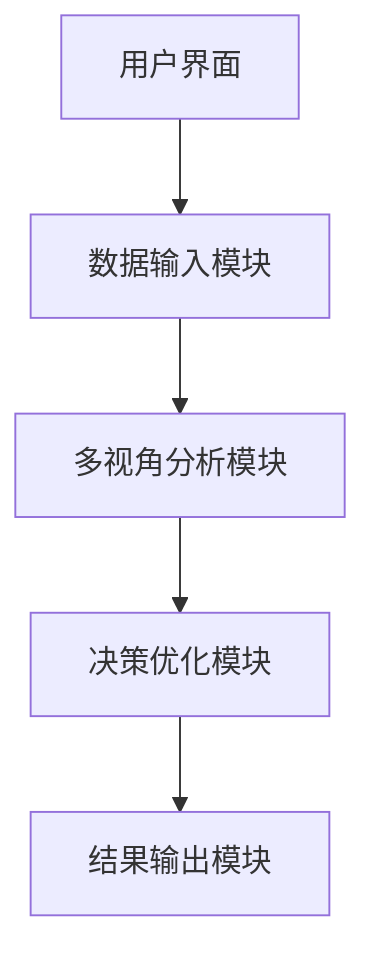
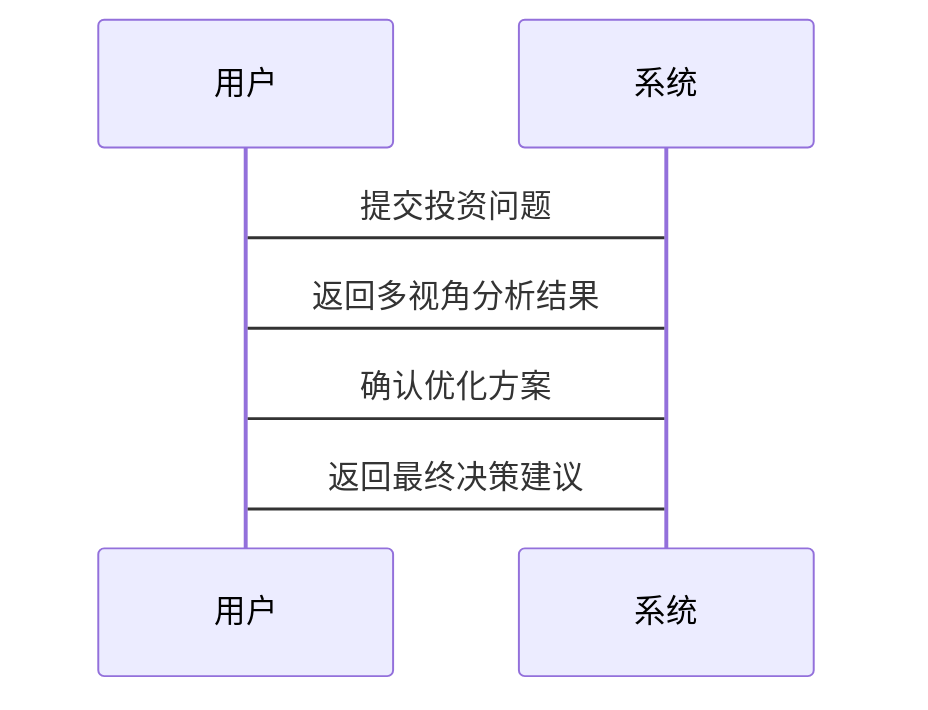

                 


# 芒格的"多元思维模型"：提高投资决策的全面性

> **关键词**：芒格，多元思维模型，投资决策，系统架构，算法实现，案例分析  
> **摘要**：芒格的多元思维模型是一种通过整合多个学科知识和思维方式来提升决策质量的方法。本文从理论到实践，系统地阐述了多元思维模型的核心概念、算法原理、系统架构设计以及实际应用案例，旨在为投资者提供一套全面的投资决策框架。

---

# 第一部分: 芒格的多元思维模型概述

## 第1章: 引言

### 1.1 芒格及其投资理念
芒格是投资界传奇人物巴菲特的合作伙伴，他提出的多元思维模型是一种通过跨学科知识整合来优化决策的思维方式。本文将从芒格的投资哲学出发，探讨多元思维模型的核心思想及其在投资决策中的应用。

### 1.2 多元思维模型的核心概念
多元思维模型是一种通过结合经济学、心理学、统计学等多学科的思维方式，帮助投资者更全面地分析问题、降低决策偏差的方法。

### 1.3 多元思维模型在投资中的应用前景
通过整合不同领域的知识，多元思维模型能够帮助投资者避免单一思维的局限性，提高决策的准确性和全面性。

---

# 第二部分: 多元思维模型的核心概念与联系

## 第2章: 多元思维模型的核心原理

### 2.1 多元思维模型的原理
多元思维模型通过将多个学科的思维方式结合起来，形成一个综合的决策框架。其核心在于通过多个视角的交叉验证，降低决策风险。

### 2.2 多元思维模型的核心要素
多元思维模型包括经济学、心理学、统计学、历史学和工程学等多个领域的思维方式。以下是各要素的详细解释：

#### 2.2.1 经济学思维
经济学思维强调成本收益分析、市场均衡和边际效用等概念，帮助投资者理解市场的运作机制。

#### 2.2.2 心理学思维
心理学思维关注人类行为中的偏差和错误，如过度自信、确认偏差等，帮助投资者识别和规避心理陷阱。

#### 2.2.3 统计学思维
统计学思维通过数据分析和概率计算，帮助投资者量化风险和收益，做出更科学的决策。

#### 2.2.4 历史学思维
历史学思维通过研究历史事件，帮助投资者识别周期性规律，避免重复历史的错误。

#### 2.2.5 工程学思维
工程学思维强调系统性、可靠性和可扩展性，帮助投资者构建稳健的投资体系。

### 2.3 多元思维模型的属性特征对比
以下是多元思维模型与传统投资决策方法的对比表格：

| **对比维度**       | **多元思维模型**           | **传统投资决策**           |
|--------------------|---------------------------|---------------------------|
| 思维视角           | 多学科交叉                | 单一学科主导              |
| 决策风险           | 较低（通过多视角验证）     | 较高（依赖单一视角）       |
| 知识整合           | 强调知识整合              | 知识独立性较强            |

---

# 第三部分: 多元思维模型的算法原理

## 第3章: 多元思维模型的算法流程

### 3.1 多元思维模型的算法概述
多元思维模型的算法流程包括以下几个步骤：
1. **问题分析**：识别投资问题的关键因素。
2. **多视角分析**：从多个学科角度分析问题。
3. **交叉验证**：通过不同视角的结果进行验证。
4. **决策优化**：结合多视角分析结果，优化决策方案。

### 3.2 多元思维模型的数学模型
以下是多元思维模型的数学公式：
$$
\text{决策风险} = \sum_{i=1}^{n} \left( \text{视角}_i \times \text{权重}_i \right)
$$
其中，$\text{视角}_i$表示第i个视角的分析结果，$\text{权重}_i$表示第i个视角的权重。

### 3.3 多元思维模型的算法实现
以下是多元思维模型的Python代码实现：

```python
def multi_perspective_analysis(views, weights):
    total_risk = 0
    for i in range(len(views)):
        total_risk += views[i] * weights[i]
    return total_risk

# 示例调用
views = [0.8, 0.6, 0.7]  # 各视角的分析结果
weights = [0.3, 0.4, 0.3]  # 各视角的权重
risk = multi_perspective_analysis(views, weights)
print("决策风险：", risk)
```

---

# 第四部分: 多元思维模型的系统分析与架构设计

## 第4章: 投资决策系统的架构设计

### 4.1 投资决策系统的需求分析
投资决策系统需要满足以下需求：
- **功能需求**：支持多视角分析、数据可视化、决策优化。
- **性能需求**：高效处理大量数据，支持实时分析。
- **用户需求**：适用于个人投资者和机构投资者。

### 4.2 投资决策系统的系统架构
以下是投资决策系统的系统架构图：



### 4.3 投资决策系统的接口设计
以下是投资决策系统的接口设计：



---

# 第五部分: 多元思维模型的项目实战

## 第5章: 投资决策系统的实战项目

### 5.1 项目环境的安装与配置
安装所需的Python库：
```bash
pip install numpy pandas matplotlib
```

### 5.2 系统核心实现源代码
以下是投资决策系统的Python核心代码：

```python
import numpy as np
import pandas as pd

def multi_perspective_analysis(data, perspectives):
    results = []
    for perspective in perspectives:
        result = data[perspective].mean()
        results.append(result)
    return results

# 示例数据
data = pd.DataFrame({
    '经济指标': [0.8, 0.7, 0.9],
    '心理学指标': [0.6, 0.5, 0.7],
    '统计学指标': [0.7, 0.6, 0.8]
})

perspectives = ['经济指标', '心理学指标', '统计学指标']
results = multi_perspective_analysis(data, perspectives)
print("多视角分析结果：", results)
```

### 5.3 项目实战案例分析
通过分析某公司的财务数据和市场趋势，利用多元思维模型进行投资决策。

---

# 第六部分: 总结与展望

## 第6章: 总结

### 6.1 本章小结
本文系统地介绍了芒格的多元思维模型，从理论到实践，详细阐述了其核心概念、算法原理、系统架构设计和实际应用案例。通过多元思维模型，投资者可以更全面地分析问题，降低决策风险。

### 6.2 最佳实践 tips
- **知识整合**：投资者应不断学习多学科知识，拓宽思维广度。
- **交叉验证**：通过多视角分析，避免单一思维的局限性。
- **系统优化**：构建稳健的投资系统，提升决策效率。

### 6.3 未来展望
随着人工智能和大数据技术的发展，多元思维模型将在投资决策中发挥更大的作用。未来的研究方向包括算法优化、系统扩展性和智能化决策支持。

---

# 参考文献

1. 芒格的《穷查理宝典》
2. 巴菲特的《投资哲学》
3. 投资决策相关学术论文

---

# 附录

## 附录1: Mermaid 图表

### 投资决策系统架构图


### 投资决策系统交互流程图


---

通过以上详细的内容结构，您可以根据实际需求进一步扩展每个部分的内容，添加具体的案例分析、公式推导和代码实现细节。

