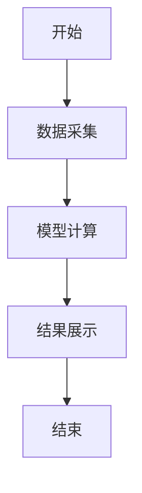
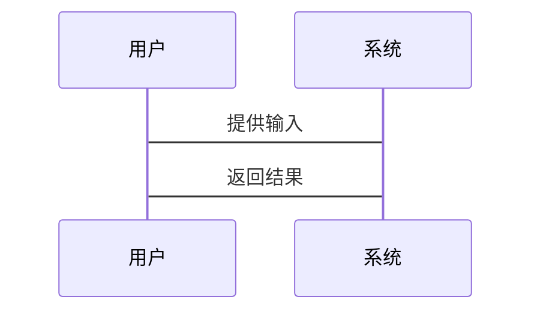

                 


# 芒格的"多元思维模型"：跨学科知识在投资中的应用

## 关键词：芒格、多元思维模型、跨学科、投资、系统架构、数学模型

## 摘要：芒格的多元思维模型是一种通过整合多个学科的基本原理来解决复杂问题的方法，尤其在投资领域展现出强大的应用潜力。本文将详细阐述多元思维模型的核心概念、算法原理、数学模型，并结合系统架构设计和项目实战，展示其在投资决策中的实际应用。通过芒格的决策树算法和逆向思维算法，结合概率论和统计学模型，构建一个完整的投资决策系统，帮助投资者做出更明智的决策。

---

## 第一部分：芒格的多元思维模型概述

### 第1章：芒格的多元思维模型背景介绍

#### 1.1 芒格的生平与投资理念

1.1.1 芒格的生平简介  
查理·芒格（Charlie Munger）是世界著名投资家，沃伦·巴菲特（Warren Buffett）的长期合作伙伴，同时也是伯克希尔·哈撒韦公司（Berkshire Hathaway）的副主席。芒格以其独特的投资理念和多元思维模型闻名于世。

1.1.2 芒格的投资哲学  
芒格的投资哲学强调价值投资和长期主义。他认为，投资的本质是通过理解企业的内在价值，找到那些具有持续竞争优势的企业，并以合理的价格买入并长期持有。

1.1.3 芒格与伯克希尔的传奇  
芒格与巴菲特共同创立了伯克希尔·哈撒韦公司，将其从一家濒临破产的纺织公司转变为市值万亿的金融帝国。芒格的多元思维模型在这一过程中发挥了关键作用。

#### 1.2 多元思维模型的起源与定义

1.2.1 多元思维模型的概念  
多元思维模型（Mental Models）是指通过掌握多个学科的核心原理，将它们结合起来，形成一种多维度的思考框架。芒格认为，这种思维方式能够帮助人们更好地理解复杂问题，并做出更明智的决策。

1.2.2 多元思维模型的核心要素  
- 经济学：理解市场、价值和竞争优势。  
- 心理学：理解人类行为和决策偏差。  
- 统计学：理解概率和风险。  
- 历史学：理解过去事件的规律和周期性。  

1.2.3 多元思维模型的边界与外延  
虽然多元思维模型强调跨学科，但并非所有学科都适用。芒格建议选择那些与投资相关性较高的学科，并将它们的核心原理结合起来。

#### 1.3 多元思维模型在投资中的重要性

1.3.1 投资中的常见问题与挑战  
- 市场波动性：如何应对市场的短期波动？  
- 信息过载：如何筛选有用的信息？  
- 决策偏差：如何克服认知错误？  

1.3.2 多元思维模型如何解决投资问题  
通过整合多个学科的原理，芒格能够更全面地分析问题，避免单一视角的局限性。

1.3.3 多元思维模型的跨学科应用  
- 经济学：分析企业的竞争优势和市场地位。  
- 心理学：理解投资者的行为和情绪。  
- 统计学：评估投资的风险和回报。  

---

## 第二部分：多元思维模型的核心概念与联系

### 第2章：多元思维模型的核心概念原理

#### 2.1 多元思维模型的学科基础

2.1.1 经济学基础  
经济学的核心原理包括供需关系、成本-收益分析、边际效用等。芒格认为，理解这些原理有助于评估企业的价值和竞争优势。

2.1.2 心理学基础  
心理学帮助我们理解人类行为和决策偏差，如确认偏差、从众心理等。芒格强调，避免这些偏差是投资成功的关键。

2.1.3 统计学基础  
统计学提供了分析数据和评估概率的方法。芒格常提到的“lollapalooza效应”即多个概率叠加的情况，需要统计学来评估。

#### 2.2 多元思维模型的属性特征对比

2.2.1 各学科核心原理对比表格  

| 学科 | 核心原理 | 应用领域 |
|------|----------|----------|
| 经济学 | 供需关系 | 企业价值评估 |
| 心理学 | 认知偏差 | 投资者行为分析 |
| 统计学 | 概率分布 | 风险评估 |

2.2.2 多元思维模型的ER实体关系图  

```mermaid
er
actor(投资者) -->
拥有者(企业) -->
属性(价值、风险、竞争优势)
```

---

## 第三部分：多元思维模型的算法原理

### 第3章：芒格的决策树算法

#### 3.1 决策树的构建过程

3.1.1 决策树的定义与特点  
决策树是一种树状结构，用于表示决策过程中的各种可能性和结果。芒格的决策树算法基于多元思维模型，将多个学科的原理融入其中。

3.1.2 决策树的构建步骤  
1. 确定问题目标：例如，评估某只股票的投资价值。  
2. 收集相关信息：包括财务数据、行业趋势等。  
3. 分析关键因素：使用多元思维模型，识别影响投资的关键因素。  
4. 构建决策树：根据关键因素，构建决策树的分支。  
5. 计算概率和回报：评估每种决策的可能结果和概率。  

3.1.3 决策树的优化方法  
- 剪枝：去除不必要的分支，简化决策树。  
- 合并相似分支：减少复杂性，提高可读性。  

#### 3.2 芒格的逆向思维算法

3.2.1 逆向思维的定义与特点  
逆向思维是指从反方向思考问题，寻找问题的解决方案。芒格认为，逆向思维可以帮助投资者发现市场中的潜在机会。

3.2.2 逆向思维的应用场景  
- 寻找被低估的股票：通过分析市场的错误定价。  
- 避免常见错误：识别并避免认知偏差。  

3.2.3 逆向思维的数学模型  

逆向思维的数学模型可以用概率论来表示：

$$ P(A) = 1 - P(\neg A) $$

---

## 第四部分：多元思维模型的数学模型与公式

### 第4章：概率论与统计学在投资中的应用

#### 4.1 概率论基础

4.1.1 概率的基本概念与公式  
概率是描述事件发生可能性的数值。例如，掷硬币正面朝上的概率为0.5。

4.1.2 贝叶斯定理的应用  
贝叶斯定理用于更新基于新证据的概率。例如，评估某公司财务造假的概率。

贝叶斯定理公式：

$$ P(B|A) = \frac{P(A|B)P(B)}{P(A)} $$

4.1.3 马尔可夫链的简介  
马尔可夫链用于描述状态转移的概率，常用于分析市场趋势。

#### 4.2 投资中的统计学模型

4.2.1 蒙特卡洛模拟的应用  
蒙特卡洛模拟用于评估投资组合的风险和回报。

4.2.2 CAPM模型的公式与应用  
CAPM模型用于评估资产的预期回报。

CAPM公式：

$$ E(R_i) = R_f + \beta_i (R_m - R_f) $$

4.2.3 风险调整后的收益模型  
风险调整后的收益模型考虑了投资的风险。

---

## 第五部分：系统分析与架构设计方案

### 第5章：投资决策系统的构建

#### 5.1 投资决策系统的功能设计

5.1.1 系统功能模块划分  
- 数据采集：收集市场数据和公司信息。  
- 模型计算：应用多元思维模型进行分析。  
- 结果展示：显示投资决策的结果。  

5.1.2 系统功能流程图  



#### 5.2 系统架构设计

5.2.1 系统架构的分层设计  
- 数据层：存储市场数据和公司信息。  
- 业务逻辑层：处理模型计算。  
- 表现层：展示结果。  

5.2.2 系统架构的模块化设计  
- 数据采集模块：负责数据的获取和存储。  
- 模型计算模块：应用多元思维模型进行分析。  
- 结果展示模块：以图形化的方式展示结果。  

5.2.3 系统架构的可扩展性设计  
通过模块化设计，系统可以方便地添加新的模型和数据源。

#### 5.3 系统接口设计

5.3.1 数据接口  
- 数据接口用于与外部数据源（如股票数据库）通信。  

5.3.2 用户接口  
- 用户可以通过网页或API与系统交互。  

#### 5.4 系统交互流程图  



---

## 第六部分：项目实战

### 第6章：基于多元思维模型的股票分析系统

#### 6.1 项目环境安装

6.1.1 安装Python  
Python是本项目的编程语言，安装步骤如下：  
1. 下载Python安装包。  
2. 安装Python并配置环境变量。  

6.1.2 安装必要的库  
安装numpy、pandas、scikit-learn等库：  
```bash
pip install numpy pandas scikit-learn
```

#### 6.2 系统核心实现源代码

6.2.1 数据采集模块  
```python
import pandas as pd
import requests

def get_stock_data(ticker):
    url = f"https://api.example.com/stock/{ticker}"
    response = requests.get(url)
    data = response.json()
    return pd.DataFrame(data)
```

6.2.2 模型计算模块  
```python
from sklearn.tree import DecisionTreeClassifier

def calculate_probabilities(data):
    model = DecisionTreeClassifier()
    model.fit(data.features, data.labels)
    return model.predict(data.new_features)
```

6.2.3 结果展示模块  
```python
import matplotlib.pyplot as plt

def plot_results(data):
    plt.plot(data.index, data.values)
    plt.show()
```

#### 6.3 代码应用解读与分析

6.3.1 数据采集模块  
- 使用requests库从API获取股票数据。  
- 将数据存储为DataFrame格式，便于后续分析。

6.3.2 模型计算模块  
- 使用scikit-learn库中的决策树算法进行分类。  
- 输入特征数据，输出概率结果。

6.3.3 结果展示模块  
- 使用matplotlib库绘制图表，直观展示结果。

#### 6.4 实际案例分析和详细讲解剖析

案例：分析某只股票的投资价值。  
1. 采集该股票的历史数据。  
2. 应用多元思维模型进行分析。  
3. 展示分析结果。

#### 6.5 项目小结

通过本项目，我们实现了基于多元思维模型的股票分析系统。该系统能够帮助投资者做出更明智的投资决策。

---

## 第七部分：最佳实践 tips、小结、注意事项、拓展阅读

### 7.1 小结

芒格的多元思维模型是一种强大的工具，能够帮助投资者在复杂的投资环境中做出更明智的决策。通过整合多个学科的原理，芒格成功构建了一个独特且高效的投资体系。

### 7.2 注意事项

- 投资有风险，需谨慎。  
- 多元思维模型只是一个工具，需要结合实际情况灵活应用。  

### 7.3 拓展阅读

- 查理·芒格的《穷查理宝典》  
- 投资相关的书籍和论文  

---

# 结语

芒格的多元思维模型不仅是投资领域的宝贵财富，也是跨学科知识应用的典范。通过本文的详细讲解，我们希望能够帮助读者更好地理解和应用这一模型，提升投资决策的效率和准确性。

