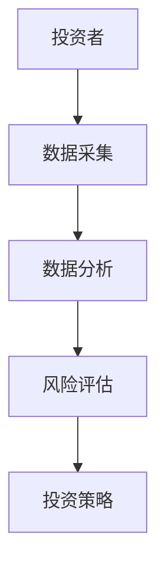
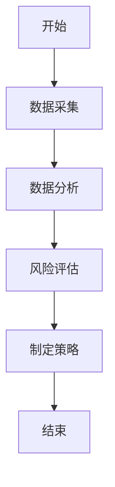

                 


# 芒格的多学科知识在投资决策中的作用

> 关键词：芒格、多学科知识、投资决策、思维模型、决策框架

> 摘要：本文探讨了芒格的多学科知识体系在投资决策中的应用，分析了其核心概念、决策框架、算法原理、数学模型以及实际案例，详细阐述了如何通过跨学科知识提升投资决策的科学性和准确性。

---

## 第一部分: 芒格的多学科知识概述

### 第1章: 芒格的多学科知识与投资决策

#### 1.1 芒格的多学科知识体系概述

##### 1.1.1 芒格的多学科知识背景
芒格的多学科知识体系是其投资决策的核心，他主张将心理学、经济学、统计学等多个学科的知识交叉应用，以全面评估投资机会。这种思维方式帮助他识别市场中的非理性行为和潜在风险。

##### 1.1.2 多学科知识在投资中的重要性
在投资决策中，单一学科的视角往往不足以应对复杂多变的市场环境。通过多学科知识的综合运用，投资者可以更全面地分析问题，避免因认知偏差导致的错误决策。

##### 1.1.3 芒格知识体系的核心特点
芒格的知识体系强调实践应用，注重逻辑推理和事实验证。他通过不断学习新知识并将其融入投资分析中，形成了独特的多维度决策模式。

#### 1.2 投资决策中的问题背景与描述

##### 1.2.1 投资决策的核心问题
投资决策的核心问题是如何在不确定的市场环境中，找到具有长期价值的投资标的。这需要投资者具备全面的分析能力和风险控制能力。

##### 1.2.2 当前投资决策的局限性
传统投资决策往往依赖于单一学科的分析，如财务指标分析或技术分析，这种单一视角可能导致投资者忽视市场的复杂性。

##### 1.2.3 多学科知识在投资中的应用前景
多学科知识的应用能够帮助投资者更全面地评估投资标的的价值，识别潜在风险，并制定更科学的投资策略。

#### 1.3 芒格多学科知识体系的边界与外延

##### 1.3.1 知识体系的边界
芒格的知识体系主要集中在与投资相关的领域，如心理学、经济学、统计学等，但他也关注其他领域的知识，如物理学和工程学，以丰富其分析工具。

##### 1.3.2 投资决策的外延
投资决策的外延涉及市场分析、财务评估、风险管理等多个方面。通过多学科知识的综合运用，投资者能够更好地应对复杂的投资环境。

##### 1.3.3 多学科知识的综合应用
芒格的多学科知识体系强调知识的综合应用，通过跨学科的交叉分析，投资者能够更全面地评估投资标的的价值和风险。

---

## 第二部分: 多学科知识的核心概念与联系

### 第2章: 多学科知识的核心概念与联系

#### 2.1 核心概念原理

##### 2.1.1 经济学基础
经济学是芒格知识体系的重要组成部分，他通过理解市场机制和经济周期，评估投资标的的长期价值。

##### 2.1.2 心理学原理
心理学帮助芒格识别市场中的非理性行为，避免因情绪波动导致的决策错误。

##### 2.1.3 统计学与概率论
统计学和概率论为芒格提供了量化分析工具，帮助他评估投资风险和不确定性。

#### 2.2 多学科知识的对比分析

##### 2.2.1 不同学科的核心要素对比
| 学科 | 核心要素 |
|------|----------|
| 经济学 | 市场机制、经济周期 |
| 心理学 | 认知偏差、情绪影响 |
| 统计学 | 数据分析、概率计算 |

##### 2.2.2 知识体系的关联性分析
不同学科的知识在投资决策中相互关联，共同构成一个完整的分析框架。

##### 2.2.3 知识体系的互补性分析
各学科在分析过程中各有侧重，相互补充，形成全面的分析视角。

#### 2.3 实体关系图（ER图）分析

##### 2.3.1 知识体系的实体构成
- 投资决策
- 多学科知识
- 分析工具

##### 2.3.2 实体之间的关系
投资决策依赖于多学科知识的支持，多学科知识通过分析工具转化为具体的投资策略。

##### 2.3.3 ER图展示
```mermaid
erDiagram
    investor DECIDES decision
    decision USES analysis_tools
    analysis_tools ANALYZE multi_disciplinary_knowledge
    multi_disciplinary_knowledge INCLUDES economics, psychology, statistics
```

---

## 第三部分: 芒格的决策框架与算法原理

### 第3章: 芒格的决策框架与算法原理

#### 3.1 决策框架的系统分析

##### 3.1.1 问题场景介绍
投资决策需要面对复杂多变的市场环境，投资者需要通过系统化的分析框架来做出合理决策。

##### 3.1.2 系统功能设计
- 数据采集与处理
- 风险评估与分析
- 投资策略制定

##### 3.1.3 系统架构设计


#### 3.2 算法原理的详细讲解

##### 3.2.1 算法流程图（mermaid）


##### 3.2.2 算法数学模型
投资决策模型可以表示为：
$$
\text{投资价值} = \text{内在价值} \times (1 - \text{风险调整系数})
$$

##### 3.2.3 算法实现代码
```python
def investment_decision(data):
    # 数据采集
    market_data = data['market']
    financials = data['financials']
    
    # 数据分析
    value = calculate_intrinsic_value(financials)
    risk = assess_risk(market_data)
    
    # 风险调整
    adjusted_value = value * (1 - risk)
    
    return adjusted_value
```

---

## 第四部分: 投资决策中的数学模型与公式

### 第4章: 投资决策中的数学模型与公式

#### 4.1 数学模型的建立与应用

##### 4.1.1 投资决策的数学公式
$$
\text{预期收益} = \sum (p_i \times r_i)
$$
其中，\( p_i \) 是收益 \( r_i \) 的概率，\( r_i \) 是对应的收益值。

##### 4.1.2 概率论在投资中的应用
通过概率论，投资者可以量化投资的不确定性，并制定相应的风险管理策略。

##### 4.1.3 统计学模型的构建
使用回归分析等统计方法，投资者可以识别影响投资标的的关键因素。

#### 4.2 数学公式的详细解读

##### 4.2.1 预期收益公式
$$
E(r) = \sum_{i=1}^{n} p_i r_i
$$
其中，\( E(r) \) 表示预期收益，\( p_i \) 是第 \( i \) 种情况的概率，\( r_i \) 是第 \( i \) 种情况的收益。

##### 4.2.2 风险评估公式
$$
\text{标准差} = \sqrt{\sum_{i=1}^{n} p_i (r_i - E(r))^2}
$$
标准差衡量了收益的波动性，反映了投资的风险水平。

---

## 第五部分: 项目实战与案例分析

### 第5章: 项目实战与案例分析

#### 5.1 项目实战

##### 5.1.1 环境安装
投资者需要收集市场数据、公司财务报表等信息，并选择合适的分析工具。

##### 5.1.2 系统核心实现源代码
```python
import pandas as pd
import numpy as np

def calculate_intrinsic_value(financials):
    # 假设 financials 是一个包含财务数据的字典
    # 计算内在价值
    return financials['revenue'] * 0.1  # 简单示例，实际计算更复杂
```

##### 5.1.3 代码应用解读与分析
通过上述代码，投资者可以基于公司财务数据计算其内在价值，结合市场数据进行风险评估。

#### 5.2 实际案例分析

##### 5.2.1 案例选择
以苹果公司为例，分析芒格如何应用多学科知识做出投资决策。

##### 5.2.2 详细分析
- **市场分析**：评估苹果在科技行业的地位。
- **财务评估**：分析苹果的盈利能力。
- **风险管理**：识别潜在风险，如技术变革和竞争压力。

#### 5.3 项目小结
通过案例分析，投资者可以理解芒格的多学科知识体系在实际投资决策中的应用。

---

## 第六部分: 总结与展望

### 第6章: 总结与展望

#### 6.1 全文总结
芒格的多学科知识体系为投资决策提供了科学的方法论，帮助投资者全面评估投资标的的价值和风险。

#### 6.2 未来研究方向
未来可以进一步研究多学科知识在量化投资中的应用，探索更高级的分析工具和方法。

---

## 第七部分: 最佳实践 tips、小结、注意事项、拓展阅读

### 7.1 最佳实践 tips
- **持续学习**：不断更新多学科知识，丰富投资分析工具。
- **保持理性**：避免情绪化决策，坚持逻辑分析。
- **注重风险控制**：合理配置资产，分散投资风险。

### 7.2 小结
芒格的多学科知识体系为投资决策提供了系统的分析框架，帮助投资者在复杂多变的市场中做出更明智的投资决策。

### 7.3 注意事项
- **数据质量**：确保数据的准确性和完整性。
- **模型假设**：合理设定模型假设，避免过度简化。
- **动态调整**：根据市场变化及时调整投资策略。

### 7.4 拓展阅读
建议读者阅读芒格的《穷查理宝典》，深入理解其投资哲学和多学科知识的应用。

---

通过以上结构，我们可以系统地分析芒格的多学科知识在投资决策中的作用，为投资者提供科学的决策参考。

