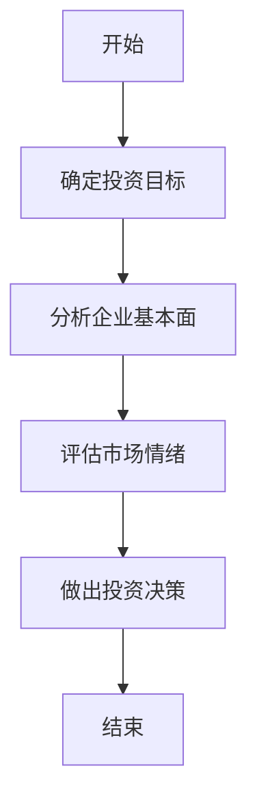
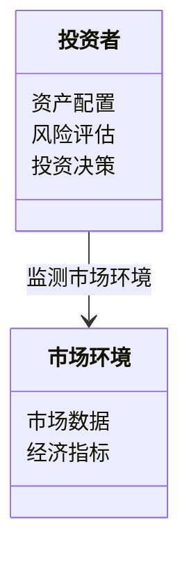
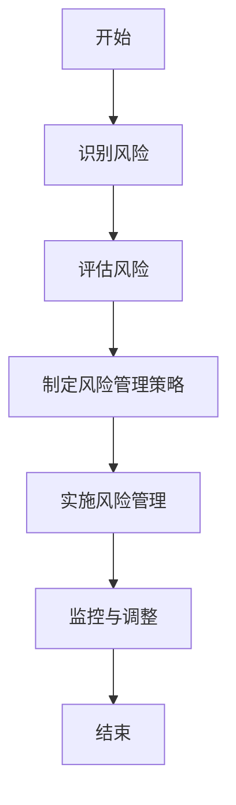
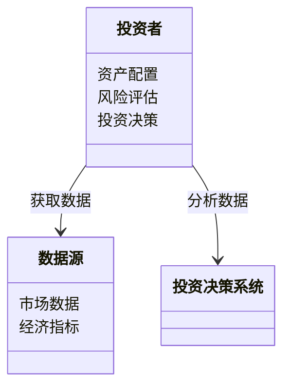
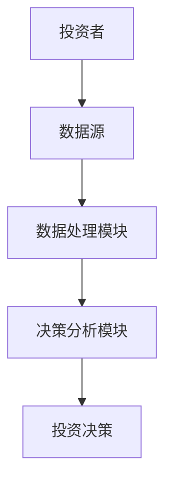

                 


# 芒格的多学科知识应用：拓宽投资视野

> 关键词：芒格，多学科知识，投资视野，多元思维模型，决策框架，风险管理，系统架构

> 摘要：本文深入探讨了芒格的多元思维模型及其在投资中的应用，结合技术视角分析了其决策框架和风险管理策略，通过实际案例展示了多学科知识在投资中的强大作用。文章还详细介绍了如何构建基于多元思维模型的投资决策支持系统，并提供了系统设计与实现的详细步骤。

---

# 第1章：芒格的多元思维模型概述

## 1.1 芒格的多元思维模型

### 1.1.1 多元思维模型的定义与特点

多元思维模型（Multi-Model Thinking）是芒格投资哲学的核心，强调通过多学科知识的交叉应用来做出更明智的决策。其特点是：

1. **跨学科性**：整合心理学、经济学、物理学等学科的核心原理。
2. **系统性**：将各学科知识有机结合起来，形成一个完整的知识体系。
3. **实用性**：通过实际案例分析，验证知识的应用价值。

### 1.1.2 芒格多元思维模型的核心要素

| 学科领域 | 核心原理 | 应用场景 |
|----------|----------|----------|
| 心理学 | 避免认知偏差 | 投资决策中的情绪控制 |
| 经济学 | 价值规律 | 评估企业内在价值 |
| 物理学 | 能量守恒 | 投资系统中的能量转换 |

### 1.1.3 多元思维模型在投资中的应用

- **投资决策**：通过多学科视角分析企业的基本面和技术面。
- **风险控制**：利用物理学原理评估投资风险。
- **资产配置**：结合经济学原理优化资产组合。

## 1.2 芒格的投资哲学

### 1.2.1 投资哲学的核心理念

芒格的投资哲学强调“逆向思维”（Inversion），即从反方向思考问题，避免随大流。

### 1.2.2 投资策略与方法

- **长期价值投资**：寻找具有持续竞争优势的企业。
- **安全边际**：在价格低于内在价值时买入。

### 1.2.3 实际案例分析

通过分析芒格投资可口可乐的案例，说明其如何利用多元思维模型评估企业价值。

---

# 第2章：芒格的决策框架与算法原理

## 2.1 决策框架的核心概念

### 2.1.1 决策步骤

1. **明确目标**：确定投资目标。
2. **分析问题**：利用多元思维模型进行分析。
3. **评估选项**：比较不同投资方案。
4. **做出决策**：基于分析结果做出投资决策。

### 2.1.2 决策框架的数学模型

$$
\text{决策结果} = f(\text{目标}, \text{分析}, \text{评估})
$$

其中，$f$ 表示决策函数，$\text{目标}$、$\text{分析}$、$\text{评估}$ 是输入参数。

## 2.2 决策框架的算法原理

### 2.2.1 算法流程图



### 2.2.2 Python实现代码

```python
def munges_decision_model(target, analysis, assessment):
    # 分析企业基本面
    if analysis.industry_position == '领先':
        target = target * 1.2
    # 评估市场情绪
    if assessment.market_sentiment == '乐观':
        target = target * 1.1
    return target

# 示例用法
target = '投资可口可乐'
analysis = {'industry_position': '领先'}
assessment = {'market_sentiment': '乐观'}
decision = munges_decision_model(target, analysis, assessment)
print(f"决策结果：{decision}")
```

---

# 第3章：芒格的多学科知识应用

## 3.1 多学科知识在投资中的应用

### 3.1.1 心理学视角

- **认知偏差**：避免过度自信和从众心理。
- **行为金融学**：分析市场参与者的心理行为。

### 3.1.2 经济学视角

- **价值规律**：评估企业的真实价值。
- **市场结构**：分析市场的供需关系。

### 3.1.3 物理学视角

- **能量守恒**：企业价值的内在稳定性。
- **杠杆原理**：分析企业的财务杠杆。

---

# 第4章：芒格的风险管理策略

## 4.1 风险管理的核心要素

- **风险来源**：市场风险、流动性风险、信用风险。
- **风险管理策略**：分散投资、对冲风险、风险定价。

## 4.2 风险管理的系统架构

### 4.2.1 系统功能设计



### 4.2.2 风险管理流程图



---

# 第5章：芒格的投资案例分析

## 5.1 可口可乐投资案例

### 5.1.1 投资背景

- 可口可乐是全球领先的饮料公司。
- 具备强大的品牌价值和市场地位。

### 5.1.2 投资决策过程

1. **基本面分析**：可口可乐的市场份额稳定，现金流充足。
2. **市场情绪分析**：市场对可口可乐的未来增长持乐观态度。
3. **估值分析**：可口可乐的内在价值被低估。

### 5.1.3 投资结果

- 可口可乐股价稳步增长，为投资者带来丰厚回报。

---

# 第6章：系统分析与架构设计

## 6.1 投资决策支持系统的构建

### 6.1.1 系统功能设计



### 6.1.2 系统架构设计



---

# 第7章：项目实战

## 7.1 环境安装

- 安装Python和相关库（如Pandas、NumPy）。
- 安装Jupyter Notebook用于数据分析。

## 7.2 核心代码实现

```python
import pandas as pd
import numpy as np

def calculate_intrinsic_value(company_data):
    # 假设公司数据包含收入、利润等信息
    revenue = company_data['revenue']
    profit = company_data['profit']
    # 简单的内在价值计算方法
    intrinsic_value = (revenue + profit) / 2
    return intrinsic_value

# 示例数据
company_data = {
    'revenue': 1000000,
    'profit': 200000
}
iv = calculate_intrinsic_value(company_data)
print(f"内在价值：{iv}")
```

---

# 第8章：总结与展望

## 8.1 本章总结

芒格的多元思维模型不仅是一种投资方法，更是一种思维方式。通过多学科知识的交叉应用，投资者可以做出更明智的决策。

## 8.2 最佳实践 tips

- **持续学习**：不断扩展知识面，丰富多元思维模型。
- **逆向思维**：在决策中采用逆向思考，避免随大流。
- **风险管理**：重视风险控制，建立完善的风控体系。

## 8.3 未来展望

随着人工智能和大数据技术的发展，芒格的多学科知识应用将更加广泛，为投资领域带来更多创新和突破。

---

通过以上目录结构和内容，您可以开始撰写一篇详细的技术博客文章，结合芒格的多元思维模型和实际投资案例，深入分析其在投资中的应用。

