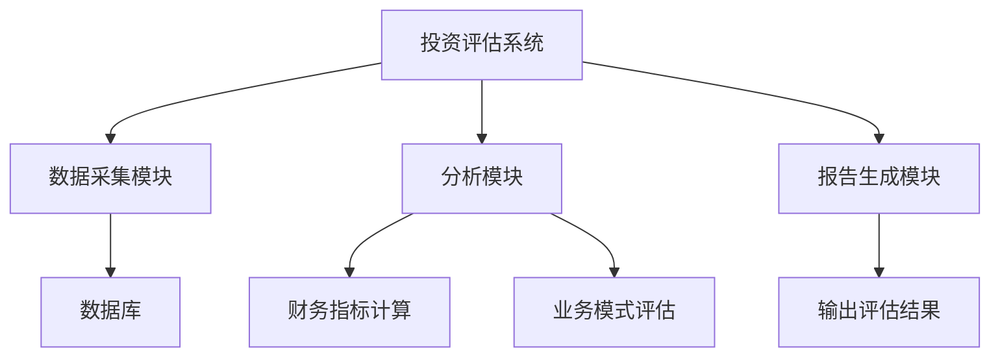

                 

# 芒格的"太难了"篮子：如何避开复杂投资

## 关键词：芒格投资理念，复杂投资，投资策略，系统架构，项目实战

## 摘要：芒格的“太难了”篮子是一种简化投资决策的方法，旨在避开过于复杂和难以理解的投资标的。本文将深入分析复杂投资的特征，提供识别和评估复杂投资的工具与方法，结合实际案例，展示如何应用“太难了”篮子策略，构建高效的投资评估系统。

---

## 第1章：芒格投资理念与“太难了”篮子

### 1.1 芒格投资理念的核心思想

#### 1.1.1 投资的四项标准
- **第一条**：行业地位是否清晰？
- **第二条**：财务状况是否健康？
- **第三条**：管理层是否可靠？
- **第四条**：企业是否有持续竞争优势？

#### 1.1.2 “太难了”篮子的定义与目的
- 复杂投资的定义：涉及高杠杆、多层嵌套、难以预测的业务模式。
- “太难了”篮子的目的是通过简化分析，避免陷入复杂的决策中。

#### 1.1.3 简化投资决策的意义
- 提高决策效率。
- 减少潜在风险。

---

## 第2章：复杂投资的特征与危害

### 2.1 复杂投资的特征

| 特征 | 描述 |
|------|------|
| 高杠杆 | 负债比例过高，风险放大。 |
| 业务复杂 | 多元化业务难以预测。 |
| 低透明度 | 信息披露不充分。 |
| 流动性差 | 难以快速变现。 |

### 2.2 复杂投资的识别方法

#### 2.2.1 财务指标分析
- **负债率**：计算公式为 $负债/资产$。
- **现金流**：分析经营活动现金流是否健康。

#### 2.2.2 业务模式评估
- 评估业务模式的可持续性。
- 识别是否存在过于复杂的业务扩展。

#### 2.2.3 行业环境分析
- 行业周期性：判断行业是否处于下行周期。
- 政策影响：分析政策变化对企业的影响。

---

## 第3章：系统分析与架构设计

### 3.1 投资评估系统概述

#### 3.1.1 系统目标与范围
- 目标：提供复杂投资的识别和评估工具。
- 范围：包括数据采集、分析、报告生成。

#### 3.1.2 系统功能模块划分
- 数据采集模块：收集财务数据和行业信息。
- 分析模块：计算财务指标，评估业务模式。
- 报告生成模块：输出评估结果。

#### 3.1.3 系统架构设计

### 3.2 投资评估系统实现

#### 3.2.1 数据采集与处理
- 使用Python爬虫技术采集数据。
- 数据清洗：处理缺失值和异常值。

#### 3.2.2 指标计算与分析
- 财务健康度评估：使用Python计算负债率和现金流。
- 业务模式可行性分析：基于行业趋势进行评估。

#### 3.2.3 结果展示与报告生成
- 使用可视化工具展示分析结果。
- 生成评估报告，提供投资建议。

---

## 第4章：项目实战

### 4.1 项目背景与目标

#### 4.1.1 项目背景
- 分析一家企业的财务状况和业务模式。
- 评估其是否属于复杂投资。

#### 4.1.2 项目目标
- 使用投资评估系统进行分析。
- 输出评估结果和建议。

### 4.2 项目实施步骤

#### 4.2.1 数据收集与清洗
- 使用Python爬虫获取企业财务数据。
- 清洗数据，确保数据准确性。

#### 4.2.2 指标计算与分析
- 计算负债率和现金流。
- 评估业务模式的可行性。

#### 4.2.3 结果展示与报告编写
- 使用图表展示分析结果。
- 编写评估报告，提出投资建议。

---

## 第5章：总结与最佳实践

### 5.1 核心内容回顾
- 芒格投资理念的核心思想。
- 复杂投资的特征与识别方法。
- 投资评估系统的构建与应用。

### 5.2 最佳实践

#### 5.2.1 投资策略建议
- 避免高杠杆和复杂业务模式的投资。
- 选择行业地位清晰、财务健康的企业。

#### 5.2.2 系统优化建议
- 定期更新数据源，确保分析结果准确。
- 提供多维度的分析工具，提升评估效率。

#### 5.2.3 风险管理建议
- 设立止损机制，控制投资风险。
- 定期复盘，调整投资策略。

---

## 总结
芒格的“太难了”篮子策略提醒我们在投资中要保持简单和专注，避免复杂性带来的风险。通过系统化的分析和评估，我们可以更好地识别复杂投资，做出明智的决策。希望本文的分析和建议能为投资者提供有价值的参考。

---

通过以上结构，您可以根据需要进一步扩展每个章节的内容，添加具体的案例分析、详细的算法代码和更深入的理论解释。

