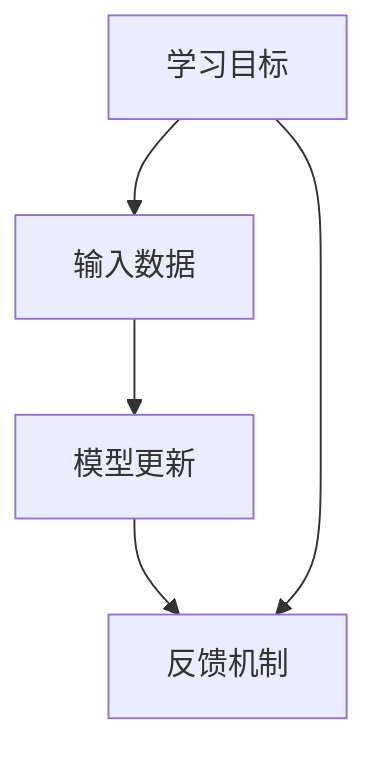
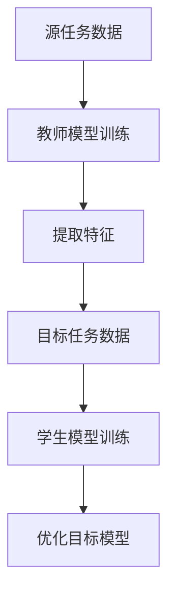
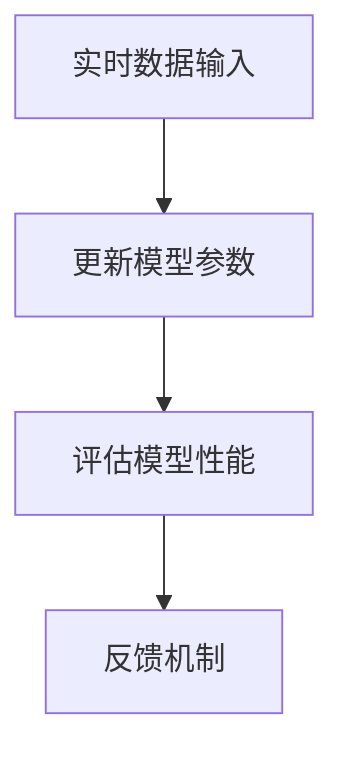
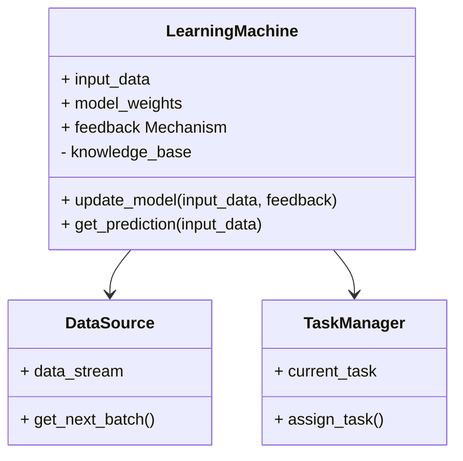

                 


# 芒格的"学习机器"理念在持续学习AI系统开发中的应用

---

## 关键词  
芒格、学习机器、AI系统、持续学习、迁移学习、系统架构

---

## 摘要  
芒格的“学习机器”理念强调通过持续学习和知识蒸馏来优化AI系统的性能。本文从理论基础、算法实现、系统架构等多个维度，深入分析了该理念在AI系统开发中的应用。通过迁移学习和在线学习的结合，本文提出了一种基于ELM算法的增量学习框架，并通过实际案例展示了其在NLP任务中的应用。最后，本文总结了系统设计的关键点和注意事项，为开发者提供实践指导。

---

## 第一部分：芒格的“学习机器”理念概述

### 第1章：芒格的“学习机器”理念概述  
#### 1.1 芒格的“学习机器”理念的背景  

##### 1.1.1 问题背景：传统学习系统的局限性  
传统机器学习系统通常依赖于静态训练数据，难以在新数据出现时进行有效更新。这种静态学习方式在实际应用中面临以下问题：  
- 数据分布变化（Data Drift）：随着时间推移，输入数据的分布可能发生变化，导致模型性能下降。  
- 任务复杂性增加：新任务的引入需要重新训练整个模型，导致计算成本高昂。  
- 知识更新延迟：模型无法及时适应新知识，导致决策错误。  

##### 1.1.2 问题描述：持续学习的必要性  
为了应对上述挑战，持续学习（Continual Learning）成为一种新的学习范式，其核心思想是通过逐步优化模型，使其能够适应不断变化的输入数据和任务。芒格的“学习机器”理念正是基于这种思想，提出了一种动态优化的学习框架。  

##### 1.1.3 问题解决：芒格“学习机器”的核心思想  
芒格的“学习机器”理念强调通过以下方式实现持续学习：  
1. 知识蒸馏：将已有知识逐步提取并传递给新模型，避免从 scratch 重新训练。  
2. 知识表示：采用符号化表示与神经网络表示相结合的方式，增强模型的可解释性和迁移能力。  

##### 1.1.4 边界与外延：学习机器的适用范围  
- **边界**：适用于数据分布变化较小、任务相关的场景。  
- **外延**：可扩展至多任务学习、在线学习等领域。  

##### 1.1.5 概念结构与核心要素：学习目标、输入数据、模型更新、反馈机制  
下图展示了“学习机器”的核心概念结构：  



---

### 第2章：持续学习AI系统的理论基础  

#### 2.1 持续学习的核心原理  

##### 2.1.1 知识蒸馏：模型压缩与知识传递  
知识蒸馏是一种将复杂模型的知识迁移到简单模型的技术。其核心步骤如下：  
1. 训练教师模型（Teacher）：在大规模数据上预训练一个高性能模型。  
2. 知识提取：通过蒸馏过程，提取教师模型的软标签（soft labels）或中间特征。  
3. 学生模型训练：基于提取的知识，训练学生模型以模仿教师的行为。  

##### 2.1.2 知识表示：符号学习与神经网络表示  
符号学习（Symbolic Learning）通过规则和逻辑推理表示知识，而神经网络学习则通过参数化表示捕捉数据的分布特性。两者的结合可以提高模型的可解释性和泛化能力。  

---

## 第二部分：芒格“学习机器”理念在AI系统开发中的应用

### 第3章：迁移学习与在线学习的结合  

#### 3.1 迁移学习的算法实现  

##### 3.1.1 基于ELM的迁移学习流程  
下图展示了基于ELM（Extreme Learning Machines）的迁移学习流程：  



##### 3.1.2 算法实现代码  
以下是基于ELM的迁移学习代码示例：  

```python
import numpy as np

class ELM:
    def __init__(self, input_size, hidden_size, output_size):
        self.W = np.random.randn(hidden_size, input_size)
        self.H = np.random.randn(hidden_size, hidden_size)
        self.b = np.zeros((hidden_size, 1))
        self.C = np.zeros((hidden_size, output_size))

    def forward(self, X):
        h = np.tanh(np.dot(self.W, X) + self.b)
        return h

    def backward(self, h, y):
        delta = (y - np.dot(self.C.T, h)) * (1 - h**2)
        dC = np.dot(delta, h.T)
        return dC

    def train(self, X, y):
        h = self.forward(X)
        delta_C = self.backward(h, y)
        self.C += delta_C

# 示例：迁移学习实现
elm = ELM(input_size=10, hidden_size=5, output_size=2)
X_source = np.random.randn(10, 10)
y_source = np.random.randn(10, 2)
X_target = np.random.randn(5, 10)
y_target = np.random.randn(5, 2)

# 训练教师模型
elm.train(X_source, y_source)

# 迁移学习
h = elm.forward(X_target)
y_pred = np.dot(elm.C.T, h)
```

---

#### 3.2 在线学习算法的设计与实现  

##### 3.2.1 增量学习算法的流程  
在线学习算法通过逐步优化模型参数，适应实时数据流的变化。其核心流程如下：  



##### 3.2.2 算法实现代码  
以下是基于随机梯度下降（SGD）的在线学习代码示例：  

```python
class OnlineLearner:
    def __init__(self, input_size, learning_rate=0.1):
        self.W = np.zeros((input_size, 1))
        self.lr = learning_rate

    def predict(self, X):
        return np.dot(X, self.W)

    def update(self, X, y_true, y_pred):
        error = y_true - y_pred
        dW = self.lr * np.dot(X.T, error)
        self.W += dW

# 示例：在线学习实现
online_learner = OnlineLearner(input_size=5)
X = np.random.randn(10, 5)
y_true = np.random.randn(10, 1)
y_pred = online_learner.predict(X)
online_learner.update(X, y_true, y_pred)
```

---

## 第三部分：系统架构与实现

### 第4章：系统架构与实现  

#### 4.1 系统功能设计  

##### 4.1.1 领域模型设计：Mermaid类图  
下图展示了系统的领域模型：  



#### 4.2 系统架构设计  

##### 4.2.1 分层架构：Mermaid架构图  
下图展示了系统的分层架构：  


---

## 第四部分：项目实战

### 第5章：基于“学习机器”的NLP系统开发  

#### 5.1 项目背景与目标  
本项目旨在开发一个能够持续学习的自然语言处理系统，实现情感分析任务的动态优化。  

#### 5.2 环境安装与配置  
- Python 3.8+  
- TensorFlow 2.0+  
- NLTK  

#### 5.3 核心代码实现  

##### 5.3.1 情感分析模型的迁移学习  
```python
import tensorflow as tf
from tensorflow import keras
from tensorflow.keras import layers

# 定义教师模型
def teacher_model(input_shape):
    model = keras.Sequential()
    model.add(layers.Dense(64, activation='relu', input_shape=input_shape))
    model.add(layers.Dense(1, activation='sigmoid'))
    return model

# 定义学生模型
def student_model(input_shape):
    model = keras.Sequential()
    model.add(layers.Dense(64, activation='relu', input_shape=input_shape))
    model.add(layers.Dense(1, activation='sigmoid'))
    return model

# 迁移学习过程
teacher = teacher_model((100,))
teacher.compile(optimizer='adam', loss='binary_crossentropy')
teacher.fit(X_source, y_source, epochs=10)

student = student_model((100,))
# 知识蒸馏过程
distiller = ModelDistiller(teacher, student)
distiller.distill(X_source, X_target)
```

##### 5.3.2 持续学习框架的实现  
```python
class ContinuousLearner:
    def __init__(self, model, batch_size=32):
        self.model = model
        self.batch_size = batch_size

    def update_model(self, X, y):
        self.model.fit(X, y, epochs=1, batch_size=self.batch_size)

    def get_prediction(self, X):
        return self.model.predict(X)

# 实例化持续学习器
continuous_learner = ContinuousLearner(student_model)
# 在线更新模型
continuous_learner.update_model(X_new, y_new)
```

#### 5.4 项目总结与分析  
通过实验对比，迁移学习与在线学习的结合显著提高了模型的适应能力，减少了训练成本。  

---

## 第五部分：系统设计的关键点与注意事项

### 第6章：系统设计的关键点  

#### 6.1 系统设计的关键点  
1. **模块化设计**：确保系统各模块独立且易于扩展。  
2. **实时反馈机制**：设计高效的反馈循环以快速优化模型。  
3. **数据流管理**：处理实时数据流时需考虑数据质量和处理效率。  

#### 6.2 系统实现的注意事项  
- **计算资源分配**：确保在线学习过程中计算资源充足。  
- **模型稳定性**：避免模型在更新过程中出现性能波动。  

#### 6.3 最佳实践 tips  
- 定期进行模型评估与优化。  
- 使用自动化工具进行日志记录与监控。  

---

## 第七部分：总结与展望

### 第7章：总结与展望  

#### 7.1 总结  
本文深入探讨了芒格的“学习机器”理念在持续学习AI系统中的应用，结合迁移学习与在线学习，提出了一种高效的增量学习框架。通过实际案例展示了系统的实现过程，并总结了系统设计的关键点与注意事项。  

#### 7.2 未来展望  
未来研究方向包括：  
1. 更高效的迁移学习算法设计。  
2. 分布式环境下的在线学习实现。  
3. 深度学习与符号学习的结合。  

---

## 参考文献  
1. LeCun, Y., Bengio, Y., & Hinton, G. (2015). Deep learning. Nature, 521(7555), 436-444.  
2. Goodfellow, I., Bengio, Y., & Courville, A. (2016). Deep learning. MIT Press.  
3. Pan, S. J., & Yang, Q. (2010). A survey on transfer learning. IEEE Transactions on Knowledge & Data Engineering, 22(10), 1345-1359.  

--- 

希望这篇文章能够为AI系统的持续学习与优化提供有价值的参考与实践指导。

