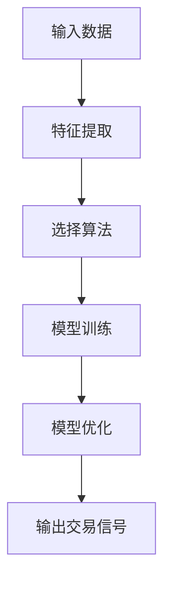
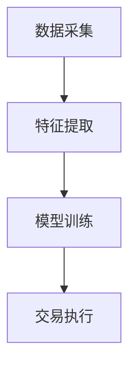
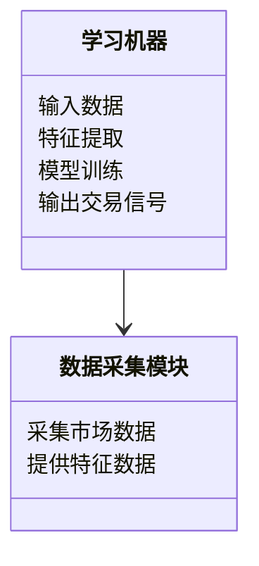
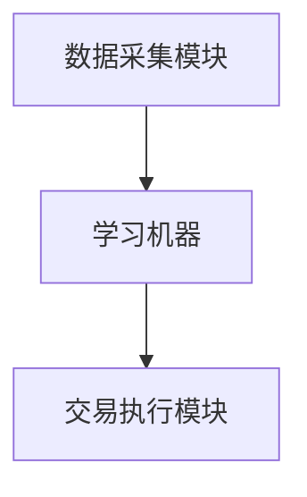
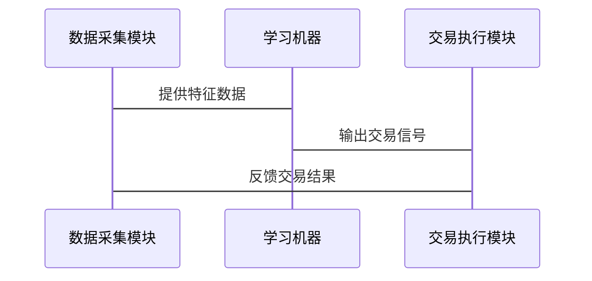

                 


# 芒格的"学习机器"理念在算法交易时代的重要性

> 关键词：芒格、学习机器、算法交易、机器学习、投资决策、量化交易

> 摘要：本文探讨了芒格的"学习机器"理念在算法交易中的重要性。通过分析学习机器的核心概念、算法原理、系统架构以及实际应用，本文揭示了如何将学习机器的理念融入算法交易系统中，以优化投资决策和提升交易效率。

---

## 第1章 芒格的"学习机器"理念与算法交易的背景

### 1.1 芒格的"学习机器"理念

#### 1.1.1 学习机器的定义与核心特征
学习机器是一种能够通过数据和经验不断优化自身行为的智能系统。其核心特征包括：
- **自适应性**：能够根据输入数据调整输出结果。
- **可扩展性**：能够处理不同类型和规模的数据。
- **可解释性**：输出结果能够被人类理解。

#### 1.1.2 学习机器在投资决策中的应用
在投资领域，学习机器可以通过分析历史价格、市场情绪、新闻事件等数据，帮助投资者做出更科学的投资决策。例如，学习机器可以预测股票价格走势，识别市场趋势，评估投资组合的风险。

#### 1.1.3 学习机器与传统投资决策的对比
| 特性 | 学习机器 | 传统投资决策 |
|------|----------|----------------|
| 数据依赖性 | 高 | 低 |
| 决策速度 | 快 | 慢 |
| 可重复性 | 高 | 低 |

### 1.2 算法交易的基本概念

#### 1.2.1 算法交易的定义与特点
算法交易是一种利用计算机算法自动执行交易的金融交易方式。其特点包括：
- **自动化**：交易决策和执行均由算法完成。
- **高效性**：能够在毫秒级别完成交易。
- **数据驱动**：依赖于大量历史数据和实时数据。

#### 1.2.2 算法交易的历史发展与现状
算法交易起源于20世纪70年代，随着计算机技术的发展，算法交易在金融市场的应用越来越广泛。如今，算法交易已经成为金融市场的重要组成部分，占据了全球大部分交易量。

#### 1.2.3 算法交易的核心技术与实现方式
算法交易的核心技术包括：
- **高频交易**：在极短时间内完成大量交易。
- **算法策略**：基于数学模型和统计分析制定交易策略。
- **风险管理**：通过算法控制交易风险。

### 1.3 芒格"学习机器"理念与算法交易的结合

#### 1.3.1 学习机器在算法交易中的作用
学习机器可以用于优化算法交易策略，提高交易效率和收益。例如，学习机器可以通过分析市场数据，自动调整交易参数，优化交易策略。

#### 1.3.2 算法交易时代对学习机器的需求
在算法交易时代，市场数据量大、变化速度快，传统算法交易策略难以适应市场变化。因此，学习机器的需求日益增加。

#### 1.3.3 学习机器在算法交易中的具体应用场景
- **价格预测**：通过学习机器预测股票价格走势。
- **交易信号生成**：通过学习机器生成买入或卖出信号。
- **风险控制**：通过学习机器评估交易风险。

---

## 第2章 学习机器的核心概念与算法原理

### 2.1 学习机器的核心概念

#### 2.1.1 学习机器的输入输出模型
学习机器的输入输出模型可以表示为：
$$ y = f(x) $$
其中，$x$ 是输入数据，$y$ 是输出结果，$f$ 是学习机器的模型。

#### 2.1.2 学习机器的特征提取与模式识别
特征提取是学习机器的重要步骤。例如，在股票交易中，可以提取股票的历史价格、成交量、波动率等特征。

#### 2.1.3 学习机器的自适应与优化机制
学习机器通过不断优化模型参数，以提高预测准确率。例如，可以使用梯度下降算法优化线性回归模型。

### 2.2 算法交易中的学习机器模型

#### 2.2.1 基于机器学习的交易策略
基于机器学习的交易策略可以通过训练数据生成交易信号。例如，使用支持向量机（SVM）模型预测股票价格走势。

#### 2.2.2 基于深度学习的交易模型
深度学习模型（如LSTM）可以用于分析时间序列数据，预测股票价格走势。

#### 2.2.3 基于强化学习的交易决策
强化学习模型可以通过模拟交易环境，学习最优交易策略。

### 2.3 学习机器的数学模型与公式

#### 2.3.1 线性回归模型
线性回归模型可以表示为：
$$ y = \beta_0 + \beta_1x + \epsilon $$
其中，$\beta_0$ 和 $\beta_1$ 是模型参数，$\epsilon$ 是误差项。

#### 2.3.2 支持向量机模型
支持向量机模型的优化目标为：
$$ \text{max} \{ \frac{1}{2}||\theta||^2 | y_i(\theta^T x_i + \theta_0) \geq 1 \} $$

#### 2.3.3 神经网络模型
神经网络模型可以表示为：
$$ y = \sigma(w_2 \cdot \sigma(w_1 x + b_1) + b_2) $$
其中，$\sigma$ 是激活函数，$w_1$ 和 $w_2$ 是权重，$b_1$ 和 $b_2$ 是偏置。

### 2.4 学习机器的算法流程



---

## 第3章 算法交易中的学习机器实现

### 3.1 算法交易系统架构

#### 3.1.1 系统功能模块划分
算法交易系统通常包括以下模块：
- **数据采集模块**：采集市场数据。
- **特征提取模块**：提取特征。
- **模型训练模块**：训练学习机器模型。
- **交易执行模块**：根据模型输出执行交易。

#### 3.1.2 系统数据流设计
系统数据流设计可以表示为：


#### 3.1.3 系统性能优化
系统性能优化可以通过以下方式实现：
- **并行计算**：利用多核处理器加速计算。
- **分布式计算**：利用分布式计算框架（如Spark）处理大数据。

### 3.2 学习机器在算法交易中的实现细节

#### 3.2.1 数据预处理与特征工程
数据预处理包括数据清洗、归一化等步骤。特征工程包括特征选择、特征组合等步骤。

#### 3.2.2 模型训练与调参
模型训练可以通过监督学习、无监督学习等方式进行。调参可以通过网格搜索、随机搜索等方式进行。

#### 3.2.3 模型部署与实时交易
模型部署可以通过API接口实现。实时交易可以通过交易系统对接实现。

### 3.3 学习机器的代码实现

#### 3.3.1 环境安装
需要安装以下环境：
- Python
- NumPy
- Pandas
- Scikit-learn
- TensorFlow

#### 3.3.2 核心代码实现

```python
import numpy as np
import pandas as pd
from sklearn.svm import SVC
from sklearn.metrics import accuracy_score

# 数据加载
data = pd.read_csv('stock_data.csv')

# 特征提取
X = data[['open', 'high', 'low', 'close']]
y = data['label']

# 数据分割
X_train, X_test = X[:int(len(X)*0.8)], X[int(len(X)*0.8):]
y_train, y_test = y[:int(len(y)*0.8)], y[int(len(y)*0.8):]

# 模型训练
model = SVC()
model.fit(X_train, y_train)

# 模型预测
y_pred = model.predict(X_test)

# 模型评估
accuracy = accuracy_score(y_test, y_pred)
print(f'准确率: {accuracy}')
```

---

## 第4章 算法交易中的系统分析与架构设计

### 4.1 问题场景介绍
在算法交易中，学习机器可以帮助投资者优化交易策略，提高交易效率。然而，算法交易也面临数据量大、计算复杂等问题。

### 4.2 系统功能设计

#### 4.2.1 领域模型


#### 4.2.2 系统架构


### 4.3 系统交互设计

#### 4.3.1 交互流程


---

## 第5章 项目实战：基于学习机器的算法交易系统

### 5.1 项目背景与目标
本项目旨在利用学习机器优化算法交易策略，提高交易收益。

### 5.2 核心代码实现

#### 5.2.1 数据预处理
```python
import pandas as pd
import numpy as np

# 数据加载
data = pd.read_csv('stock_data.csv')

# 数据清洗
data = data.dropna()

# 数据归一化
data[['open', 'high', 'low', 'close']] = data[['open', 'high', 'low', 'close']].apply(lambda x: (x - x.min()) / (x.max() - x.min()))
```

#### 5.2.2 模型训练
```python
from sklearn.model_selection import train_test_split
from sklearn.ensemble import RandomForestClassifier

# 数据分割
X_train, X_test, y_train, y_test = train_test_split(X, y, test_size=0.2)

# 模型训练
model = RandomForestClassifier()
model.fit(X_train, y_train)

# 模型预测
y_pred = model.predict(X_test)
```

### 5.3 项目小结
通过本项目，我们可以看到学习机器在算法交易中的强大能力。通过不断优化模型，可以提高交易收益。

---

## 第6章 最佳实践、小结与注意事项

### 6.1 最佳实践
- **数据质量**：确保数据的准确性和完整性。
- **模型选择**：根据具体问题选择合适的模型。
- **风险管理**：制定合理的风险管理策略。

### 6.2 小结
本文探讨了芒格的"学习机器"理念在算法交易中的重要性，分析了学习机器的核心概念、算法原理和系统架构，并通过项目实战展示了学习机器在算法交易中的应用。

### 6.3 注意事项
- **数据隐私**：注意保护数据隐私。
- **模型过拟合**：避免模型过拟合。
- **交易成本**：考虑交易成本对收益的影响。

### 6.4 拓展阅读
- 《算法交易：从零到实战》
- 《机器学习实战》

---

通过本文的分析，我们可以看到，芒格的"学习机器"理念为算法交易提供了新的思路和方法。未来，随着人工智能技术的发展，学习机器在算法交易中的应用将更加广泛和深入。

