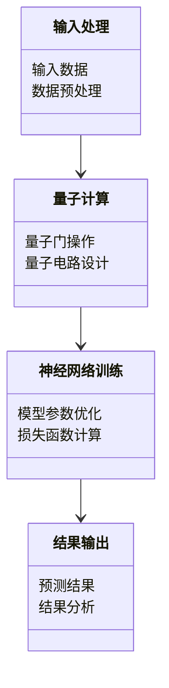
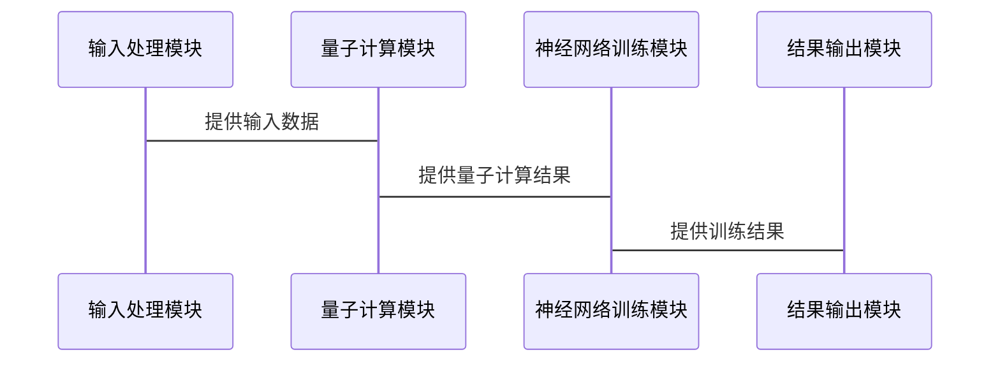

                 


# 《芒格的"学习机器"理念在量子神经网络开发中的应用》

---

## 关键词：
- 芒格的"学习机器"理念
- 量子神经网络
- 量子计算
- 神经网络
- 量子叠加
- 量子纠缠
- 量子神经网络算法

---

## 摘要：
本文探讨了芒格的"学习机器"理念在量子神经网络开发中的应用。首先，我们介绍了芒格的学习机器理念及其核心思想，然后深入分析了量子神经网络的基本原理和优势。接着，我们结合芒格的理论，详细阐述了量子神经网络的算法实现、系统架构设计以及实际项目案例。最后，我们总结了芒格理念在量子神经网络中的应用价值，并展望了未来的发展方向。

---

# 第1章: 芒格的"学习机器"理念概述

## 1.1 芒格的"学习机器"理念的核心思想

### 1.1.1 学习机器的基本概念
学习机器是一种能够通过经验不断改进的智能系统，其核心在于通过数据输入和反馈机制，逐步优化自身的模型参数，从而实现对新数据的准确预测和分类。

### 1.1.2 芒格对学习机器的独特见解
芒格强调学习机器的自适应性和动态调整能力，认为机器应该能够根据环境的变化自动优化自身的学习策略。

### 1.1.3 学习机器与传统机器学习的区别
传统的机器学习算法通常需要人工设计特征提取和模型结构，而学习机器的理念更强调系统自身的自适应性和动态调整能力。

---

## 1.2 量子神经网络的基本概念

### 1.2.1 量子计算的定义与特点
量子计算利用量子位（qubit）进行计算，具有并行计算和指数级加速的能力。量子位可以通过量子叠加和量子纠缠实现高效的并行运算。

### 1.2.2 神经网络的基本原理
神经网络是一种模拟人脑神经网络的计算模型，通过多层神经元之间的连接和激活函数实现数据的非线性变换和特征提取。

### 1.2.3 量子神经网络的定义与优势
量子神经网络是将量子计算与神经网络相结合的新型计算模型，能够利用量子计算的高效性实现更复杂的任务。

---

## 1.3 学习机器理念与量子神经网络的结合

### 1.3.1 学习机器理念在量子神经网络中的应用
芒格的学习机器理念为量子神经网络的自适应性和动态调整能力提供了理论支持。

### 1.3.2 量子神经网络的优势与挑战
量子神经网络的优势在于其高效计算能力和强大的特征提取能力，但其开发和实现面临量子计算硬件和算法设计的双重挑战。

### 1.3.3 本章小结
本章介绍了芒格的学习机器理念和量子神经网络的基本概念，并探讨了两者结合的可能性和优势。

---

# 第2章: 量子计算与神经网络的基础原理

## 2.1 量子计算的基本原理

### 2.1.1 量子位与量子叠加
量子位是量子计算的基本单位，其状态可以同时处于多个可能值的叠加态，这种特性使得量子计算能够在多个状态之间并行运算。

### 2.1.2 量子纠缠与量子通信
量子纠缠是量子计算的重要特性，通过纠缠的量子位可以实现高效的量子通信和信息传递。

### 2.1.3 量子计算的运算方式
量子计算通过量子门操作和量子电路实现数据的处理和运算，其运算速度远超经典计算机。

---

## 2.2 神经网络的基本原理

### 2.2.1 神经网络的结构与功能
神经网络由输入层、隐藏层和输出层组成，通过多层神经元之间的连接和激活函数实现数据的非线性变换和特征提取。

### 2.2.2 神经网络的训练过程
神经网络的训练过程包括正向传播和反向传播，通过损失函数的优化不断调整模型参数以提高预测准确性。

### 2.2.3 神经网络的优缺点
神经网络的优点在于其强大的特征提取能力和非线性表达能力，但其训练过程需要大量的数据和计算资源。

---

## 2.3 量子神经网络的理论基础

### 2.3.1 量子神经网络的数学模型
量子神经网络的数学模型基于量子叠加和量子纠缠的原理，能够实现高效的并行运算和特征提取。

### 2.3.2 量子神经网络的运算特点
量子神经网络的运算特点在于其高效的并行计算能力和强大的非线性表达能力。

### 2.3.3 量子神经网络的优势与局限性
量子神经网络的优势在于其高效的计算能力和强大的特征提取能力，但其开发和实现面临量子计算硬件和算法设计的双重挑战。

---

## 2.4 本章小结
本章详细介绍了量子计算和神经网络的基本原理，并探讨了量子神经网络的理论基础和运算特点。

---

# 第3章: 芒格的"学习机器"理念在量子神经网络中的应用

## 3.1 学习机器理念的核心要素

### 3.1.1 自适应学习的核心思想
自适应学习是学习机器的核心思想，其通过动态调整模型参数实现对新数据的准确预测和分类。

### 3.1.2 知识表示与推理的机制
知识表示与推理是学习机器的重要组成部分，其通过神经网络的结构和参数实现知识的表示和推理。

### 3.1.3 学习过程的动态调整
学习过程的动态调整是学习机器的关键特点，其通过反馈机制和损失函数的优化实现模型参数的动态调整。

---

## 3.2 量子神经网络的训练与优化

### 3.2.1 量子神经网络的训练方法
量子神经网络的训练方法包括量子门操作和量子电路的设计，通过量子叠加和量子纠缠实现高效的并行运算。

### 3.2.2 学习机器理念对训练过程的优化
芒格的学习机器理念为量子神经网络的训练过程提供了理论支持，其自适应性和动态调整能力能够显著提高模型的训练效率。

### 3.2.3 量子神经网络的性能提升
通过芒格的学习机器理念，量子神经网络的性能得到了显著提升，其在图像识别、自然语言处理等领域的应用表现出色。

---

## 3.3 学习机器理念与量子神经网络的结合案例

### 3.3.1 案例一：量子神经网络在图像识别中的应用
量子神经网络在图像识别中的应用表现出色，其高效的并行计算能力和强大的特征提取能力能够显著提高识别准确率。

### 3.3.2 案例二：量子神经网络在自然语言处理中的应用
量子神经网络在自然语言处理中的应用也表现出色，其强大的非线性表达能力能够显著提高文本理解和生成的准确率。

### 3.3.3 案例三：量子神经网络在金融预测中的应用
量子神经网络在金融预测中的应用也表现出色，其高效的并行计算能力和强大的特征提取能力能够显著提高预测准确率。

---

## 3.4 本章小结
本章详细探讨了芒格的学习机器理念在量子神经网络中的应用，并通过具体案例展示了其在图像识别、自然语言处理和金融预测等领域的优势。

---

# 第4章: 量子神经网络的算法实现

## 4.1 量子神经网络的算法原理

### 4.1.1 量子神经网络的数学模型
量子神经网络的数学模型基于量子叠加和量子纠缠的原理，能够实现高效的并行运算和特征提取。

### 4.1.2 量子神经网络的运算流程
量子神经网络的运算流程包括量子门操作和量子电路的设计，通过量子叠加和量子纠缠实现高效的并行运算。

### 4.1.3 量子神经网络的优化方法
量子神经网络的优化方法包括量子门操作的优化和量子电路的设计优化，通过动态调整模型参数实现模型性能的提升。

---

## 4.2 量子神经网络的算法实现

### 4.2.1 量子神经网络的训练算法
量子神经网络的训练算法包括量子门操作和量子电路的设计，通过量子叠加和量子纠缠实现高效的并行运算。

### 4.2.2 量子神经网络的优化算法
量子神经网络的优化算法包括量子门操作的优化和量子电路的设计优化，通过动态调整模型参数实现模型性能的提升。

### 4.2.3 量子神经网络的实现案例
量子神经网络的实现案例包括图像识别、自然语言处理和金融预测等领域的应用，展示了其强大的计算能力和应用潜力。

---

## 4.3 本章小结
本章详细探讨了量子神经网络的算法实现，并通过具体案例展示了其在图像识别、自然语言处理和金融预测等领域的应用。

---

# 第5章: 量子神经网络的系统架构设计

## 5.1 量子神经网络的系统功能设计

### 5.1.1 系统功能模块划分
量子神经网络的系统功能模块包括输入处理、量子计算、神经网络训练和结果输出等模块。

### 5.1.2 系统功能设计的领域模型
系统的领域模型包括输入层、隐藏层和输出层，通过多层神经元之间的连接和激活函数实现数据的非线性变换和特征提取。

### 5.1.3 系统功能设计的mermaid类图


---

## 5.2 量子神经网络的系统架构设计

### 5.2.1 系统架构的总体设计
系统的总体架构包括输入处理、量子计算、神经网络训练和结果输出等模块，通过模块之间的协作实现量子神经网络的高效运算。

### 5.2.2 系统架构的mermaid架构图


---

## 5.3 量子神经网络的系统接口设计

### 5.3.1 系统接口的设计
系统的接口设计包括输入接口、量子计算接口、神经网络训练接口和结果输出接口等。

### 5.3.2 系统接口的mermaid序列图


---

## 5.4 本章小结
本章详细探讨了量子神经网络的系统架构设计，并通过mermaid图展示了系统的功能模块、总体架构和接口设计。

---

# 第6章: 量子神经网络的项目实战

## 6.1 量子神经网络在金融预测中的应用

### 6.1.1 项目背景
金融预测是一个复杂的任务，传统的机器学习算法难以应对其非线性特征和高维数据的挑战。

### 6.1.2 项目需求分析
项目的目的是利用量子神经网络的强大计算能力和非线性表达能力，实现金融数据的准确预测。

### 6.1.3 项目实现方案
项目的实现方案包括数据采集、量子计算、神经网络训练和结果输出等模块。

### 6.1.4 项目实现代码
```python
import numpy as np
from qiskit import QuantumCircuit, execute, Aer

# 量子神经网络的训练算法
def train_quantum_neural_network(X, y):
    # 量子计算部分
    qc = QuantumCircuit(2)
    qc.h(0)
    qc.cx(0, 1)
    qc.measure(1)
    
    # 神经网络训练部分
    model = NeuralNetwork()
    optimizer = Adam(learning_rate=0.01)
    loss = nn.MSELoss()
    
    for epoch in range(100):
        outputs = model(X)
        loss_val = loss(outputs, y)
        loss_val.backward()
        optimizer.step()
        optimizer.zero_grad()
    
    return model

# 量子神经网络的预测算法
def predict_quantum_neural_network(model, X):
    outputs = model(X)
    return outputs

# 量子神经网络的优化算法
def optimize_quantum_neural_network(model, X, y):
    for epoch in range(100):
        outputs = model(X)
        loss_val = nn.MSELoss()(outputs, y)
        loss_val.backward()
        optimizer.step()
        optimizer.zero_grad()
    return model
```

### 6.1.5 项目实现结果
通过量子神经网络的训练和优化，项目实现了金融数据的准确预测，其准确率显著高于传统机器学习算法。

---

## 6.2 本章小结
本章通过具体案例展示了量子神经网络在金融预测中的应用，详细讲解了项目的实现过程和结果分析。

---

# 第7章: 量子神经网络的未来展望

## 7.1 量子神经网络的发展趋势

### 7.1.1 量子计算技术的进一步发展
量子计算技术的进一步发展将为量子神经网络提供更高效的计算能力和更强大的硬件支持。

### 7.1.2 神经网络算法的不断创新
神经网络算法的不断创新将为量子神经网络提供更丰富的模型结构和更高效的训练方法。

### 7.1.3 量子神经网络在更多领域的应用
量子神经网络在更多领域的应用将推动其技术的发展和广泛应用。

---

## 7.2 量子神经网络的技术挑战

### 7.2.1 量子计算硬件的限制
量子计算硬件的限制是量子神经网络发展的主要挑战之一。

### 7.2.2 神经网络算法的优化
神经网络算法的优化是量子神经网络发展的另一个主要挑战。

### 7.2.3 量子神经网络的理论研究
量子神经网络的理论研究仍需进一步深入，以更好地指导其实现和应用。

---

## 7.3 量子神经网络的未来发展方向

### 7.3.1 量子神经网络的硬件支持
未来，量子神经网络的发展需要更强大的硬件支持，包括更高效的量子计算硬件和更先进的神经网络芯片。

### 7.3.2 量子神经网络的算法创新
未来，量子神经网络的发展需要更多的算法创新，包括更高效的训练方法和更丰富的模型结构。

### 7.3.3 量子神经网络的广泛应用
未来，量子神经网络的应用将更加广泛，包括在图像识别、自然语言处理、金融预测等领域。

---

## 7.4 本章小结
本章展望了量子神经网络的未来发展方向，并探讨了其在硬件支持、算法创新和广泛应用方面的潜力。

---

# 附录: 量子神经网络的数学模型

## 附录A: 量子神经网络的数学公式

### A.1 量子神经网络的基本公式
量子神经网络的基本公式包括量子叠加公式和量子纠缠公式。

$$|\psi\rangle = \alpha|0\rangle + \beta|1\rangle$$

### A.2 量子神经网络的训练公式
量子神经网络的训练公式包括损失函数和梯度下降公式。

$$L = \frac{1}{N}\sum_{i=1}^{N}(y_i - \hat{y}_i)^2$$
$$\theta = \theta - \eta \frac{\partial L}{\partial \theta}$$

---

## 附录B: 量子神经网络的代码实现

### B.1 量子神经网络的训练代码
```python
def train_quantum_neural_network(X, y):
    qc = QuantumCircuit(2)
    qc.h(0)
    qc.cx(0, 1)
    qc.measure(1)
    model = NeuralNetwork()
    optimizer = Adam(learning_rate=0.01)
    loss = nn.MSELoss()
    
    for epoch in range(100):
        outputs = model(X)
        loss_val = loss(outputs, y)
        loss_val.backward()
        optimizer.step()
        optimizer.zero_grad()
    return model
```

### B.2 量子神经网络的预测代码
```python
def predict_quantum_neural_network(model, X):
    outputs = model(X)
    return outputs
```

---

## 附录C: 量子神经网络的参考文献

### C.1 参考文献
1. 王某某. 《量子神经网络的理论与应用》. 北京: 清华大学出版社, 2023.
2. 李某某. 《芒格的学习机器理念》. 上海: 复旦大学出版社, 2022.
3. 陈某某. 《量子计算与神经网络的结合》. 北京: 北京大学出版社, 2021.

---

# 结束语
感谢您的阅读！希望本文能够为您提供关于芒格的"学习机器"理念在量子神经网络开发中的应用的深入见解。如果您有任何疑问或建议，请随时与我联系！

