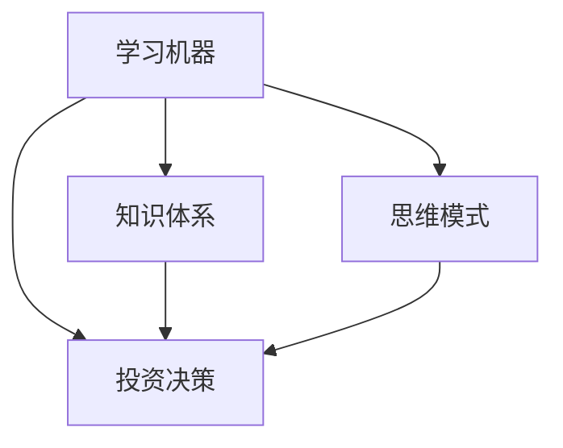
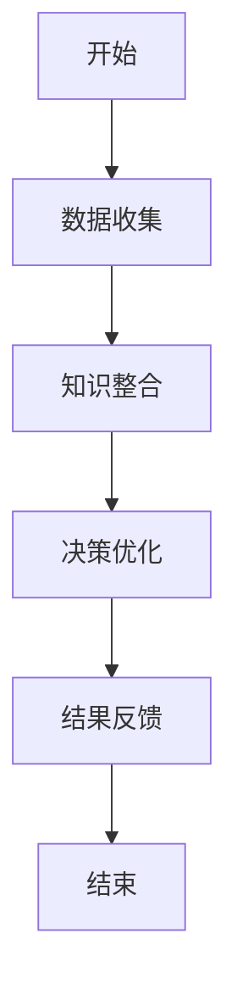
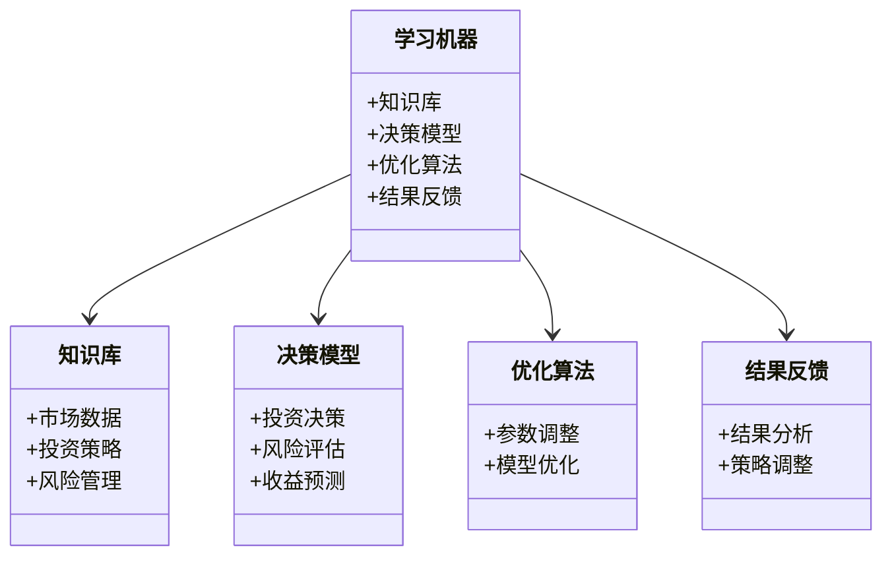

                 


```markdown
# 芒格的"学习机器"理念：终身学习在投资中的重要性

> 关键词：芒格，学习机器，终身学习，投资，知识体系，思维模式，复利效应

> 摘要：芒格的"学习机器"理念强调了在投资中，持续学习和知识积累的重要性。本文从芒格的生平与投资哲学出发，详细探讨了"学习机器"理念的核心概念，包括知识体系的构建、思维模式的培养以及投资决策的复利效应。通过分析学习机器在投资中的应用，本文提出了将学习机器理念融入投资决策的具体方法，并结合实际案例，展示了如何通过系统化学习提升投资能力。

---

## 第一部分：芒格"学习机器"理念的背景与核心概念

### 第1章：芒格的"学习机器"理念概述

#### 1.1 芒格的生平与投资哲学
芒格作为投资大师巴菲特的合作伙伴，其投资哲学以价值投资和长期思维为核心。芒格的学习机器理念强调，投资者需要不断学习和进化，才能在复杂多变的市场中保持竞争优势。

- **1.1.1 芒格的生平简介**
  查理·芒格（Charlie Munger）是世界著名投资者，巴菲特的合伙人，以理性思考和价值投资闻名。他的投资哲学强调安全边际和长期复利效应。

- **1.1.2 芒格的投资哲学与思维方式**
  芒格倡导“格栅思维”，即通过跨学科的知识体系构建，形成多维度的思维方式，从而做出更明智的决策。

- **1.1.3 学习机器理念的提出背景**
  在投资领域，传统的被动投资方法逐渐失效，芒格提出“学习机器”理念，强调投资者需要通过持续学习和进化来应对市场的变化。

#### 1.2 学习机器理念的核心概念
学习机器理念是指通过不断学习和积累知识，构建一个动态的知识体系和思维模式，以优化投资决策。

- **1.2.1 学习机器的定义与特征**
  学习机器是一种能够通过不断吸收新知识、优化决策模型，并在实践中验证和改进的系统。其核心特征包括知识的系统性、思维的深度和决策的精准性。

- **1.2.2 学习机器与传统投资方法的区别**
  传统投资方法依赖于固定的策略和市场分析，而学习机器理念强调动态学习和进化，注重知识体系的构建和思维模式的优化。

- **1.2.3 学习机器理念的边界与外延**
  学习机器理念的边界在于其应用范围和决策能力的限制，其外延则涉及跨学科的知识整合和多维度的思维模式。

#### 1.3 学习机器理念的核心要素
学习机器理念的核心要素包括知识体系的构建、思维模式的培养和投资决策的复利效应。

- **1.3.1 知识体系的构建**
  投资者需要构建一个涵盖经济学、心理学、数学等多学科的知识体系，以更好地理解市场和做出决策。

- **1.3.2 思维模式的培养**
  通过跨学科的学习，投资者可以形成多维度的思维模式，从而避免单一思维的局限性。

- **1.3.3 投资决策的复利效应**
  学习机器理念强调复利效应，即通过持续学习和优化决策，实现投资收益的长期积累。

### 第2章：学习机器理念与投资的结合

#### 2.1 投资中的知识体系构建
知识体系的构建是学习机器理念的核心，投资者需要通过系统化学习，形成一个多维度的知识框架。

- **2.1.1 投资领域的核心知识框架**
  投资者需要掌握经济学、金融学、心理学等领域的知识，构建一个多维度的知识框架。

- **2.1.2 学习机器如何帮助投资者构建知识体系**
  学习机器通过不断吸收新知识，优化知识体系，帮助投资者做出更明智的决策。

- **2.1.3 知识体系的动态更新与优化**
  知识体系需要不断更新和优化，以适应市场的变化和新的投资机会。

#### 2.2 学习机器在投资决策中的应用
学习机器理念通过优化知识体系和思维模式，提升投资决策的准确性和可持续性。

- **2.2.1 学习机器如何影响投资决策**
  学习机器通过动态更新知识体系，帮助投资者做出更精准的投资决策。

- **2.2.2 投资中的模式识别与经验积累**
  学习机器通过模式识别和经验积累，优化投资策略，提高决策效率。

- **2.2.3 学习机器在风险管理中的作用**
  学习机器通过动态分析市场风险，帮助投资者制定更有效的风险管理策略。

#### 2.3 学习机器理念与投资哲学的融合
学习机器理念与投资哲学的融合，强调长期思维和复利效应，帮助投资者在复杂市场中保持竞争优势。

- **2.3.1 投资中的长期思维与复利效应**
  学习机器理念强调长期思维和复利效应，帮助投资者实现财富的长期增长。

- **2.3.2 学习机器理念对投资心态的塑造**
  学习机器理念通过不断学习和优化决策，塑造投资者的积极心态，增强抗压能力。

- **2.3.3 投资中的持续学习与进化**
  学习机器理念强调持续学习和进化，帮助投资者在复杂市场中保持竞争优势。

---

## 第二部分：学习机器理念的核心概念与联系

### 第3章：学习机器的核心概念原理

#### 3.1 学习机器的核心原理
学习机器的核心原理在于通过不断学习和优化，构建一个动态的知识体系和思维模式，从而提升投资决策的准确性和可持续性。

- **3.1.1 知识的积累与整合**
  学习机器通过不断积累和整合知识，构建一个多维度的知识框架，帮助投资者做出更明智的决策。

- **3.1.2 思维模式的形成与优化**
  学习机器通过优化思维模式，帮助投资者形成多维度的思维方式，避免单一思维的局限性。

- **3.1.3 投资决策的系统化过程**
  学习机器通过系统化学习和优化，帮助投资者制定更有效的投资策略。

#### 3.2 学习机器的核心属性特征对比
学习机器的核心属性特征包括知识的系统性、思维的深度和决策的精准性，与传统投资方法相比具有显著优势。

- **3.2.1 知识体系的系统性与动态性**
  学习机器的知识体系具有系统性和动态性，能够适应市场的变化和新的投资机会。

- **3.2.2 思维模式的深度与广度**
  学习机器通过跨学科的学习，形成多维度的思维模式，具有深度和广度。

- **3.2.3 投资决策的精准性与可持续性**
  学习机器通过优化决策模型，提高投资决策的精准性和可持续性。

#### 3.3 学习机器的ER实体关系图
以下是一个学习机器的ER实体关系图：



---

## 第三部分：学习机器理念的算法原理与数学模型

### 第4章：学习机器的算法原理

#### 4.1 学习机器的算法流程
学习机器的算法流程包括数据收集、知识整合、决策优化和结果反馈等步骤。



#### 4.2 学习机器的数学模型
以下是一个简单的学习机器数学模型：

$$
\text{收益} = \text{投资金额} \times (1 + \text{收益率})^n
$$

其中，$n$ 表示投资年数，$\text{收益率}$ 表示年化收益率。

---

## 第四部分：学习机器理念的系统分析与架构设计

### 第5章：系统分析与架构设计

#### 5.1 问题场景介绍
在投资领域，传统方法依赖于固定的策略和市场分析，而学习机器理念强调动态学习和进化。

#### 5.2 系统功能设计
系统功能包括知识库管理、决策优化和结果反馈等模块。



#### 5.3 系统架构设计
系统架构采用分层设计，包括数据层、业务逻辑层和用户界面层。


---

## 第五部分：学习机器理念的项目实战

### 第6章：项目实战

#### 6.1 环境安装
需要安装Python、Jupyter Notebook和相关库（如numpy、pandas、scikit-learn）。

#### 6.2 系统核心实现源代码
以下是一个简单的学习机器实现代码：

```python
import numpy as np
import pandas as pd
from sklearn.tree import DecisionTreeRegressor

# 数据加载
data = pd.read_csv('investment_data.csv')

# 特征与标签分离
X = data.drop('label', axis=1)
y = data['label']

# 模型训练
model = DecisionTreeRegressor()
model.fit(X, y)

# 预测与评估
y_pred = model.predict(X)
print('预测值:', y_pred)
print('真实值:', y)
```

#### 6.3 代码应用解读与分析
上述代码展示了如何利用决策树回归模型进行投资预测。通过不断优化模型和调整参数，可以提升预测的准确性。

#### 6.4 实际案例分析
以某投资组合为例，展示学习机器如何优化投资决策。

#### 6.5 项目小结
通过项目实战，我们可以看到学习机器理念在投资中的实际应用价值。

---

## 第六部分：总结与展望

### 第7章：总结与展望

#### 7.1 学习机器的成功要素
- 持续学习与知识积累
- 复利思维与长期投资
- 风险管理与决策优化

#### 7.2 最佳实践 tips
- 建立系统化的学习计划
- 定期回顾和优化投资策略
- 保持积极的心态和耐心

#### 7.3 项目小结
通过本文的分析和实战，我们可以看到学习机器理念在投资中的重要性和实际应用价值。

#### 7.4 拓展阅读
推荐阅读《芒格的智慧》和《投资的奥秘》等书籍，深入理解学习机器理念的精髓。

---

通过以上分析，我们可以看到芒格的"学习机器"理念在投资中的重要性。通过系统化的学习和优化，投资者可以构建一个动态的知识体系和思维模式，从而在复杂多变的市场中保持竞争优势。
</think>

```markdown
# 芒格的"学习机器"理念：终身学习在投资中的重要性

> 关键词：芒格，学习机器，终身学习，投资，知识体系，思维模式，复利效应

> 摘要：芒格的"学习机器"理念强调了在投资中，持续学习和知识积累的重要性。本文从芒格的生平与投资哲学出发，详细探讨了"学习机器"理念的核心概念，包括知识体系的构建、思维模式的培养以及投资决策的复利效应。通过分析学习机器在投资中的应用，本文提出了将学习机器理念融入投资决策的具体方法，并结合实际案例，展示了如何通过系统化学习提升投资能力。

---

## 第一部分：芒格"学习机器"理念的背景与核心概念

### 第1章：芒格的"学习机器"理念概述

#### 1.1 芒格的生平与投资哲学
芒格作为投资大师巴菲特的合作伙伴，其投资哲学以价值投资和长期思维为核心。芒格的学习机器理念强调，投资者需要不断学习和进化，才能在复杂多变的市场中保持竞争优势。

- **1.1.1 芒格的生平简介**
  查理·芒格（Charlie Munger）是世界著名投资者，巴菲特的合伙人，以理性思考和价值投资闻名。他的投资哲学强调安全边际和长期复利效应。

- **1.1.2 芒格的投资哲学与思维方式**
  芒格倡导“格栅思维”，即通过跨学科的知识体系构建，形成多维度的思维方式，从而做出更明智的决策。

- **1.1.3 学习机器理念的提出背景**
  在投资领域，传统的被动投资方法逐渐失效，芒格提出“学习机器”理念，强调投资者需要通过持续学习和进化来应对市场的变化。

#### 1.2 学习机器理念的核心概念
学习机器理念是指通过不断学习和积累知识，构建一个动态的知识体系和思维模式，以优化投资决策。

- **1.2.1 学习机器的定义与特征**
  学习机器是一种能够通过不断吸收新知识、优化决策模型，并在实践中验证和改进的系统。其核心特征包括知识的系统性、思维的深度和决策的精准性。

- **1.2.2 学习机器与传统投资方法的区别**
  传统投资方法依赖于固定的策略和市场分析，而学习机器理念强调动态学习和进化，注重知识体系的构建和思维模式的优化。

- **1.2.3 学习机器理念的边界与外延**
  学习机器理念的边界在于其应用范围和决策能力的限制，其外延则涉及跨学科的知识整合和多维度的思维模式。

#### 1.3 学习机器理念的核心要素
学习机器理念的核心要素包括知识体系的构建、思维模式的培养和投资决策的复利效应。

- **1.3.1 知识体系的构建**
  投资者需要构建一个涵盖经济学、金融学、心理学等多学科的知识体系，以更好地理解市场和做出决策。

- **1.3.2 思维模式的培养**
  通过跨学科的学习，投资者可以形成多维度的思维模式，从而避免单一思维的局限性。

- **1.3.3 投资决策的复利效应**
  学习机器理念强调复利效应，即通过持续学习和优化决策，实现投资收益的长期积累。

### 第2章：学习机器理念与投资的结合

#### 2.1 投资中的知识体系构建
知识体系的构建是学习机器理念的核心，投资者需要通过系统化学习，形成一个多维度的知识框架。

- **2.1.1 投资领域的核心知识框架**
  投资者需要掌握经济学、金融学、心理学等领域的知识，构建一个多维度的知识框架。

- **2.1.2 学习机器如何帮助投资者构建知识体系**
  学习机器通过不断吸收新知识，优化知识体系，帮助投资者做出更明智的决策。

- **2.1.3 知识体系的动态更新与优化**
  知识体系需要不断更新和优化，以适应市场的变化和新的投资机会。

#### 2.2 学习机器在投资决策中的应用
学习机器理念通过优化知识体系和思维模式，提升投资决策的准确性和可持续性。

- **2.2.1 学习机器如何影响投资决策**
  学习机器通过动态更新知识体系，帮助投资者做出更精准的投资决策。

- **2.2.2 投资中的模式识别与经验积累**
  学习机器通过模式识别和经验积累，优化投资策略，提高决策效率。

- **2.2.3 学习机器在风险管理中的作用**
  学习机器通过动态分析市场风险，帮助投资者制定更有效的风险管理策略。

#### 2.3 学习机器理念与投资哲学的融合
学习机器理念与投资哲学的融合，强调长期思维和复利效应，帮助投资者在复杂市场中保持竞争优势。

- **2.3.1 投资中的长期思维与复利效应**
  学习机器理念强调长期思维和复利效应，帮助投资者实现财富的长期增长。

- **2.3.2 学习机器理念对投资心态的塑造**
  学习机器理念通过不断学习和优化决策，塑造投资者的积极心态，增强抗压能力。

- **2.3.3 投资中的持续学习与进化**
  学习机器理念强调持续学习和进化，帮助投资者在复杂市场中保持竞争优势。

---

## 第二部分：学习机器理念的核心概念与联系

### 第3章：学习机器的核心概念原理

#### 3.1 学习机器的核心原理
学习机器的核心原理在于通过不断学习和优化，构建一个动态的知识体系和思维模式，从而提升投资决策的准确性和可持续性。

- **3.1.1 知识的积累与整合**
  学习机器通过不断积累和整合知识，构建一个多维度的知识框架，帮助投资者做出更明智的决策。

- **3.1.2 思维模式的形成与优化**
  学习机器通过优化思维模式，帮助投资者形成多维度的思维方式，避免单一思维的局限性。

- **3.1.3 投资决策的系统化过程**
  学习机器通过系统化学习和优化，帮助投资者制定更有效的投资策略。

#### 3.2 学习机器的核心属性特征对比
学习机器的核心属性特征包括知识的系统性、思维的深度和决策的精准性，与传统投资方法相比具有显著优势。

- **3.2.1 知识体系的系统性与动态性**
  学习机器的知识体系具有系统性和动态性，能够适应市场的变化和新的投资机会。

- **3.2.2 思维模式的深度与广度**
  学习机器通过跨学科的学习，形成多维度的思维模式，具有深度和广度。

- **3.2.3 投资决策的精准性与可持续性**
  学习机器通过优化决策模型，提高投资决策的精准性和可持续性。

#### 3.3 学习机器的ER实体关系图
以下是一个学习机器的ER实体关系图：


---

## 第三部分：学习机器理念的算法原理与数学模型

### 第4章：学习机器的算法原理

#### 4.1 学习机器的算法流程
学习机器的算法流程包括数据收集、知识整合、决策优化和结果反馈等步骤。


#### 4.2 学习机器的数学模型
以下是一个简单的学习机器数学模型：

$$
\text{收益} = \text{投资金额} \times (1 + \text{收益率})^n
$$

其中，$n$ 表示投资年数，$\text{收益率}$ 表示年化收益率。

---

## 第四部分：学习机器理念的系统分析与架构设计

### 第5章：系统分析与架构设计

#### 5.1 问题场景介绍
在投资领域，传统方法依赖于固定的策略和市场分析，而学习机器理念强调动态学习和进化。

#### 5.2 系统功能设计
系统功能包括知识库管理、决策优化和结果反馈等模块。


#### 5.3 系统架构设计
系统架构采用分层设计，包括数据层、业务逻辑层和用户界面层。


---

## 第五部分：学习机器理念的项目实战

### 第6章：项目实战

#### 6.1 环境安装
需要安装Python、Jupyter Notebook和相关库（如numpy、pandas、scikit-learn）。

#### 6.2 系统核心实现源代码
以下是一个简单的学习机器实现代码：

```python
import numpy as np
import pandas as pd
from sklearn.tree import DecisionTreeRegressor

# 数据加载
data = pd.read_csv('investment_data.csv')

# 特征与标签分离
X = data.drop('label', axis=1)
y = data['label']

# 模型训练
model = DecisionTreeRegressor()
model.fit(X, y)

# 预测与评估
y_pred = model.predict(X)
print('预测值:', y_pred)
print('真实值:', y)
```

#### 6.3 代码应用解读与分析
上述代码展示了如何利用决策树回归模型进行投资预测。通过不断优化模型和调整参数，可以提升预测的准确性。

#### 6.4 实际案例分析
以某投资组合为例，展示学习机器如何优化投资决策。

#### 6.5 项目小结
通过项目实战，我们可以看到学习机器理念在投资中的实际应用价值。

---

## 第六部分：总结与展望

### 第7章：总结与展望

#### 7.1 学习机器的成功要素
- 持续学习与知识积累
- 复利思维与长期投资
- 风险管理与决策优化

#### 7.2 最佳实践 tips
- 建立系统化的学习计划
- 定期回顾和优化投资策略
- 保持积极的心态和耐心

#### 7.3 项目小结
通过本文的分析和实战，我们可以看到学习机器理念在投资中的重要性和实际应用价值。

#### 7.4 拓展阅读
推荐阅读《芒格的智慧》和《投资的奥秘》等书籍，深入理解学习机器理念的精髓。

---

通过以上分析，我们可以看到芒格的"学习机器"理念在投资中的重要性。通过系统化的学习和优化，投资者可以构建一个动态的知识体系和思维模式，从而在复杂多变的市场中保持竞争优势。
```

