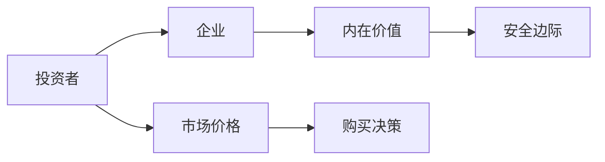
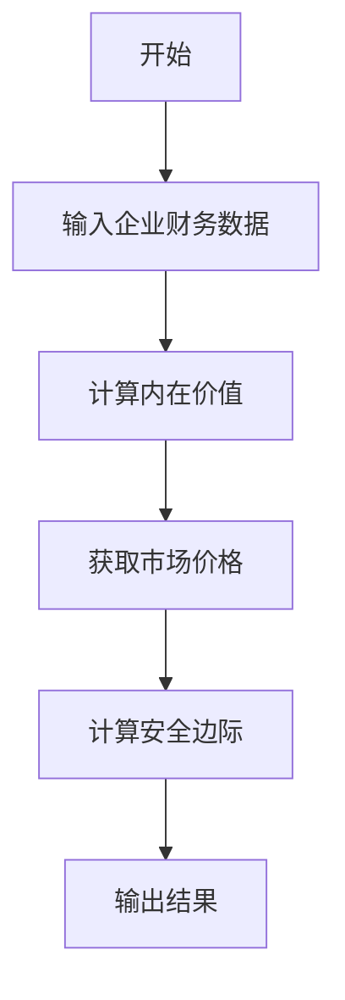
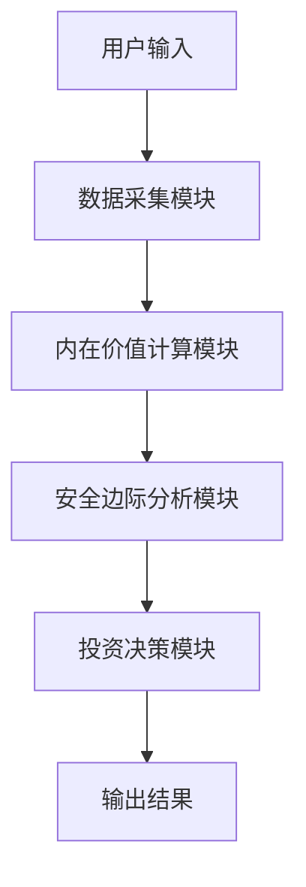
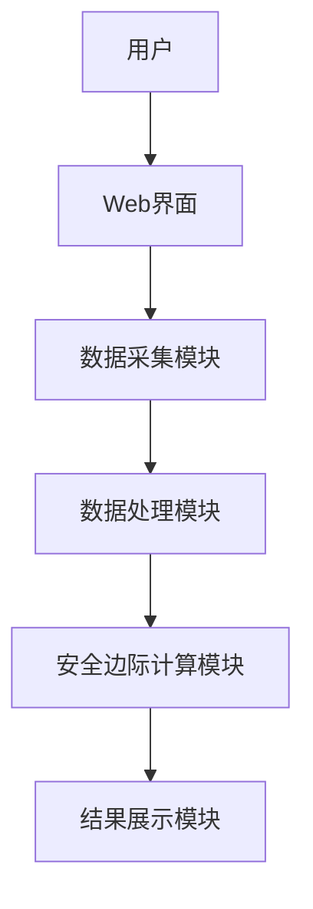

                 


# 芒格的"安全边际"理念：降低投资风险的关键

## 关键词：芒格, 安全边际, 投资风险, 价值评估, 风险管理, 投资策略

## 摘要：  
芒格的“安全边际”理念是投资领域中降低风险的重要策略，通过深入分析安全边际的定义、核心要素及其在投资决策中的应用，本文详细阐述了如何通过安全边际理念来评估企业内在价值，制定投资策略，并通过实际案例分析和系统架构设计，展示了如何在实际投资中应用这一理念，帮助投资者在复杂多变的市场环境中做出更明智的投资决策。

---

## 第1章：芒格"安全边际"理念的背景与起源

### 1.1 芒格及其投资理念概述

#### 1.1.1 芒格的生平简介
查理·芒格（Charlie Munger）是美国著名投资者和伯克希尔哈撒韦公司副董事长，以严谨的投资理念和独特的人生智慧闻名。他主张通过深入分析企业的基本面和市场趋势，寻找具有长期竞争优势的企业进行投资。

#### 1.1.2 芒格的投资哲学核心
芒格的投资哲学强调“逆向思考”和“安全边际”。他认为，市场往往充满非理性，投资者应避免跟随市场情绪，而是寻找那些具有安全边际、低估的股票进行投资。

#### 1.1.3 安全边际理念的起源与发展
安全边际理念起源于格雷厄姆的价值投资理论，芒格进一步发展了这一理念，强调在投资决策中考虑企业的长期价值和市场波动性，以降低投资风险。

### 1.2 投资风险与安全边际的关系

#### 1.2.1 投资风险的定义与分类
投资风险指在投资过程中可能遭受本金损失或收益低于预期的风险，通常分为系统性风险和非系统性风险。

#### 1.2.2 安全边际在投资中的作用
安全边际通过低估企业的内在价值，为投资决策提供缓冲空间，降低市场波动对投资组合的影响。

#### 1.2.3 安全边际与投资收益的平衡
在追求高收益的同时，安全边际确保了投资的稳健性，避免了过度冒险带来的损失。

---

## 第2章：安全边际的核心概念与特征

### 2.1 安全边际的定义与内涵

#### 2.1.1 安全边际的定义
安全边际是投资标的价格与内在价值之间的差距，即市场价格低于内在价值的部分。

#### 2.1.2 安全边际的核心要素
包括内在价值、市场价格、行业地位、财务状况和管理团队等。

#### 2.1.3 安全边际与投资决策的关系
安全边际为投资者提供了风险控制的工具，帮助在不确定的市场中做出更明智的投资决策。

### 2.2 安全边际的属性特征对比

#### 2.2.1 表格对比：安全边际与其它投资理念的差异
| 投资理念    | 安全边际              | 基本面分析          | 技术分析          |
|------------|-----------------------|--------------------|-------------------|
| 定义        | 价格低于内在价值      | 分析财务数据        | 分析价格走势      |
| 适用场景    | 价值投资              | 确定企业价值        | 短期价格预测      |
| 风险控制    | 降低投资风险          | 较高风险            | 较高波动性         |

#### 2.2.2 图表分析：安全边际在投资组合中的占比


### 2.3 安全边际的实体关系图



---

## 第3章：安全边际的算法原理

### 3.1 安全边际的计算方法

#### 3.1.1 安全边际的计算公式
$$ 安全边际 = 内在价值 - 市场价格 $$

#### 3.1.2 安全边际的算法步骤


#### 3.1.3 安全边际的实现代码
```python
def calculate_margin_of_safety(intrinsic_value, market_price):
    return intrinsic_value - market_price

# 示例
intrinsic_value = 100
market_price = 80
margin = calculate_margin_of_safety(intrinsic_value, market_price)
print(f"安全边际为: {margin}")
```

---

## 第4章：安全边际的案例分析

### 4.1 案例背景介绍

#### 4.1.1 案例来源与背景
以某科技公司为例，该公司具有稳定的盈利能力和良好的行业前景，但当前市场价格低于其内在价值。

#### 4.1.2 案例目标与意义
通过分析该公司，验证安全边际理念在实际投资中的应用效果。

### 4.2 案例分析与结果解读

#### 4.2.1 数据收集与处理
收集该公司的财务报表数据，计算其内在价值和市场价格。

#### 4.2.2 模型构建与验证
使用内在价值公式计算该公司的内在价值，与市场价格进行比较。

#### 4.2.3 结果分析与总结
如果计算得出的安全边际为正值，说明该股票具有投资价值，反之则应谨慎考虑。

---

## 第5章：安全边际的系统架构设计

### 5.1 系统功能设计

#### 5.1.1 系统目标
构建一个基于安全边际理念的投资决策支持系统。

#### 5.1.2 系统功能模块
- 数据采集模块
- 内在价值计算模块
- 安全边际分析模块
- 投资决策模块

#### 5.1.3 系统功能流程图


### 5.2 系统架构设计

#### 5.2.1 系统架构图


---

## 第6章：安全边际的项目实战

### 6.1 项目介绍

#### 6.1.1 项目目标
开发一个基于安全边际理念的投资决策支持系统。

#### 6.1.2 项目环境
- 操作系统：Windows 10
- 开发工具：Python、Jupyter Notebook
- 数据库：SQLite

### 6.2 核心实现

#### 6.2.1 数据采集模块
编写代码从数据库中读取企业的财务数据。

#### 6.2.2 内在价值计算模块
使用内在价值公式计算企业的内在价值。

#### 6.2.3 安全边际分析模块
计算安全边际，并生成分析报告。

#### 6.2.4 投资决策模块
根据安全边际结果，生成投资建议。

### 6.3 案例分析

#### 6.3.1 数据收集与处理
收集并整理某科技公司的财务数据。

#### 6.3.2 模型构建与验证
使用Python代码计算该公司的内在价值和安全边际。

#### 6.3.3 结果分析与总结
根据分析结果，得出该公司的投资价值。

---

## 第7章：芒格"安全边际"理念的总结与展望

### 7.1 总结
芒格的安全边际理念为投资者提供了降低风险的有效工具，帮助他们在复杂的市场环境中做出更明智的投资决策。

### 7.2 展望
未来，随着人工智能和大数据技术的发展，安全边际理念将在投资决策中发挥更大的作用，为投资者提供更精准的投资策略。

### 7.3 最佳实践 Tips

#### 7.3.1 投资者注意事项
- 定期评估投资组合的安全边际
- 避免过度依赖市场情绪
- 确保投资决策的稳健性

#### 7.3.2 拓展阅读
推荐阅读查理·芒格的著作《Poor Charlie's Almanack》和《The Intelligent Investor》。

---

通过本文的详细阐述，读者可以全面了解芒格的安全边际理念，并将其应用于实际投资决策中，从而有效降低投资风险，实现稳健的投资回报。

