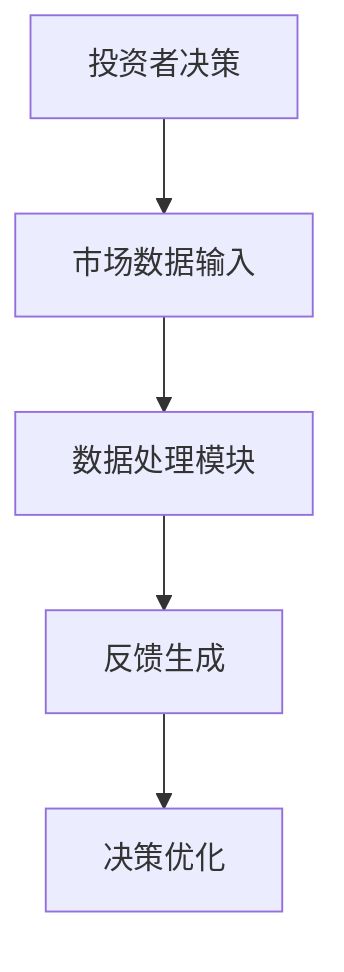

                 


# 芒格的"延迟反馈"理论：长期投资的心理挑战

## 关键词：芒格，延迟反馈，投资心理学，长期投资，决策制定，心理挑战

## 摘要：  
芒格的“延迟反馈”理论强调了在长期投资中，结果往往不会立即显现，这种延迟性对投资者的心理和决策能力提出了严峻挑战。本文从心理学角度剖析了延迟反馈对投资者的影响，探讨了如何应对这些挑战，结合实际案例和系统设计，提供了应对策略和实践方法。

---

# 第一部分：芒格的“延迟反馈”理论概述

## 第1章：延迟反馈的定义与核心观点

### 1.1 延迟反馈的定义与特征  
延迟反馈是指在行为或决策之后，结果并不立即显现，而是经过一段时间后才得到反馈。这种特性在长期投资中尤为明显，因为市场波动、经济周期等因素会延缓结果的显现。  

**延迟反馈的核心特征**：  
- 时间跨度长：结果可能需要数年甚至更长时间才能显现。  
- 不确定性高：中间变量和外部因素会影响最终结果。  
- 信息不对称：投资者在等待反馈的过程中，可能掌握的信息有限。  

### 1.2 芒格理论的核心观点  
芒格认为，延迟反馈是长期投资的“试金石”，因为它考验投资者的耐心和纪律性。他强调，成功的投资需要在延迟反馈中保持理性，避免因短期波动而做出错误决策。  

---

# 第二部分：延迟反馈的特征与心理挑战

## 第2章：延迟反馈的特征分析

### 2.1 延迟反馈的时间跨度与不确定性  
延迟反馈的时间跨度可能跨越多个经济周期，不确定性来源于市场波动、政策变化等不可控因素。  

### 2.2 延迟反馈与即时反馈的对比  
| 特性          | 延迟反馈       | 即时反馈       |
|---------------|----------------|----------------|
| 时间跨度      | 长             | 短             |
| 反馈频率      | 低             | 高             |
| 信息量        | 有限           | 充足           |
| 对决策的影响  | 高             | 低             |

---

# 第三部分：延迟反馈对投资者心理的影响

## 第3章：心理挑战的分析

### 3.1 决策疲劳与耐心问题  
延迟反馈会导致投资者在等待结果的过程中产生决策疲劳，进而影响判断力。  

### 3.2 情绪管理的重要性  
投资者在面对延迟反馈时，容易因市场的短期波动而产生焦虑或贪婪情绪，这会干扰理性的决策。  

### 3.3 马斯克的延迟满足理论  
埃隆·马斯克提出的“延迟满足”理论为芒格的延迟反馈提供了心理层面的支持，强调长期目标的重要性。  

---

# 第四部分：投资心理学中的延迟反馈

## 第4章：延迟反馈与投资决策

### 4.1 行为偏差的影响  
延迟反馈容易引发确认偏差、损失厌恶等行为偏差，影响投资者的决策质量。  

### 4.2 认知偏差的克服  
投资者需要克服对短期结果的关注，回归长期价值判断。  

### 4.3 案例分析：价值投资中的延迟反馈  
以巴菲特的投资为例，分析延迟反馈在价值投资中的实际应用。  

---

# 第五部分：系统分析与架构设计

## 第5章：长期投资的系统架构

### 5.1 系统目标与功能模块  
- **系统目标**：构建长期投资策略框架。  
- **功能模块**：数据采集、分析模块、反馈机制、决策模块。  

### 5.2 系统架构设计  


---

# 第六部分：项目实战与应用

## 第6章：延迟反馈的实践应用

### 6.1 项目环境与工具安装  
- **工具**：Python编程语言、数据分析库（Pandas、Matplotlib）。  

### 6.2 核心代码实现  
```python
def delayed_feedback_investment(portfolio, period=5):
    for _ in range(period):
        portfolio.update_value()
        if portfolio.performance < target:
            portfolio.rebalance()
    return portfolio.value
```

### 6.3 案例分析与结果解读  
通过模拟投资组合，展示延迟反馈机制在长期投资中的效果。  

---

# 第七部分：结论与建议

## 第7章：总结与最佳实践

### 7.1 核心观点回顾  
延迟反馈是长期投资的核心挑战，需要投资者具备耐心和纪律性。  

### 7.2 心理调整与风险管理  
- 建立长期目标，避免短期波动干扰。  
- 定期复盘，优化投资策略。  

### 7.3 拓展阅读与实践  
建议读者阅读芒格的著作，并结合实际投资经验，深入理解延迟反馈的应用。  

---

# 结语  
芒格的延迟反馈理论不仅是投资策略的核心，更是对投资者心理的深刻洞察。通过系统的分析和实践，投资者可以在长期投资中克服心理挑战，实现可持续的收益。

