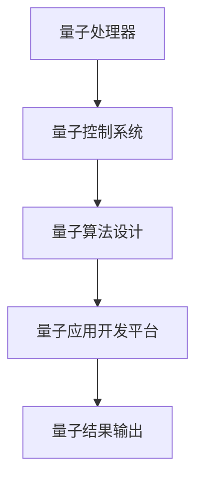

                 


# 芒格的"延迟满足"理念在量子计算长期投资中的应用

## 关键词：芒格，延迟满足，量子计算，长期投资，投资策略，量子算法，投资回报，风险评估，技术发展

## 摘要：芒格的“延迟满足”理念强调长期投资和耐心，这与量子计算这一需要长期投入和耐心等待回报的技术领域高度契合。本文从理论基础、实际应用、系统架构等多个角度，深入分析了“延迟满足”理念在量子计算投资中的应用，探讨了如何通过长期投资策略来最大化量子计算的潜在回报，并通过实际案例和系统设计，为投资者提供了实用的指导和建议。

---

## 第二部分: 芒格的“延迟满足”理念

### 2.1 芒格投资理念的核心要素

#### 2.1.1 延迟满足的定义与内涵

**延迟满足**是指个体在面对诱惑时，能够克制即时满足，选择延迟获得更大的满足。这一理念在投资领域中表现为：投资者不追求短期收益，而是愿意等待更长时间，以获得更高的长期回报。芒格认为，成功的投资需要耐心和纪律，避免被市场的短期波动所干扰。

#### 2.1.2 芒格投资理念的形成背景

芒格的投资理念深受心理学、经济学和管理学的影响。他提出的“延迟满足”理念结合了行为心理学中的自我控制理论和经济学中的长期投资理论，强调投资者需要具备长期视角，才能在复杂的市场环境中做出明智的决策。

#### 2.1.3 延迟满足与长期投资的关系

延迟满足与长期投资是相辅相成的。长期投资要求投资者具备耐心，能够承受短期市场的波动，而延迟满足则帮助投资者在面对短期诱惑时保持理性。两者结合，能够有效避免短期行为带来的风险，实现长期稳定的收益。

### 2.2 延迟满足理念的理论基础

#### 2.2.1 心理学视角：延迟满足的动机机制

心理学研究表明，延迟满足与个体的自我控制能力密切相关。自我控制能力强的投资者能够更好地抵制短期诱惑，做出更理性的投资决策。这在量子计算投资中尤为重要，因为量子计算技术的成熟和商业化可能需要较长时间。

#### 2.2.2 经济学视角：长期投资的收益与风险

经济学理论指出，长期投资通常伴随着更高的潜在回报，但也伴随着更大的风险。芒格认为，投资者需要在风险与回报之间找到平衡点，通过长期持有优质资产，逐步积累财富。

#### 2.2.3 管理学视角：延迟满足与组织决策

在组织管理中，延迟满足理念同样适用。企业需要在追求短期利润和长期发展之间做出选择。对于量子计算这样的前沿技术，企业需要投入大量资源和时间，但长期来看，这将带来更大的竞争优势。

---

## 第三部分: 量子计算的基本原理与投资价值

### 3.1 量子计算的基本概念

#### 3.1.1 量子计算的定义与特点

量子计算是一种基于量子力学原理的计算方式，与经典计算相比，具有并行计算能力和指数级的计算速度。量子计算机利用量子叠加和量子纠缠等特性，能够在某些特定问题上远超经典计算机。

#### 3.1.2 量子计算的核心技术原理

量子计算的核心技术包括量子比特（qubit）的制备、量子门操作和量子算法设计。量子比特是量子计算的基本单位，通过叠加和纠缠，能够实现并行计算。量子门操作是量子计算的基本操作，而量子算法则是量子计算的核心，如Shor算法用于大数分解，Grover算法用于无序搜索。

#### 3.1.3 量子计算与经典计算的主要区别

经典计算基于二进制逻辑，而量子计算基于量子叠加和纠缠，具有并行性和高效性。经典计算机处理问题时是串行的，而量子计算机可以同时处理多个问题，从而在某些领域表现出巨大的优势。

### 3.2 量子计算的潜在应用领域

#### 3.2.1 量子计算在密码学中的应用

量子计算能够高效分解大数，从而破解当前的RSA加密算法，这将对密码学和网络安全带来重大影响。同时，量子计算也将推动新的加密算法的发展，如基于椭圆曲线的加密方法。

#### 3.2.2 量子计算在优化问题中的应用

量子计算在优化问题，如旅行商问题（TSP）、物流优化和金融投资组合优化等领域表现出巨大潜力。通过量子计算，可以更高效地找到最优解，提高资源利用效率。

#### 3.2.3 量子计算在药物研发中的应用

量子计算可以模拟分子结构，加速新药的研发过程。通过量子模拟，科学家可以更快速地发现潜在药物，缩短研发周期，降低研发成本。

### 3.3 量子计算的投资价值分析

#### 3.3.1 量子计算行业的市场现状

当前，量子计算仍处于发展初期，主要集中在学术研究和少数高科技企业的研发阶段。尽管市场尚未成熟，但量子计算的潜力巨大，吸引了大量投资。

#### 3.3.2 量子计算技术的未来发展趋势

未来，量子计算将朝着提高量子比特的稳定性和计算精度，扩展量子计算机的规模，以及开发更高效的量子算法方向发展。同时，量子计算的应用领域也将逐步扩大，从加密到材料科学，再到金融等领域。

#### 3.3.3 量子计算投资的潜在风险与回报

量子计算投资的潜在回报巨大，但风险也较高。技术的不确定性和市场的波动性都可能影响投资回报。然而，通过长期投资和耐心等待，投资者可以在技术成熟后获得丰厚的回报。

---

## 第四部分: 延迟满足理念与量子计算投资的结合

### 4.1 延迟满足理念在量子计算投资中的应用

#### 4.1.1 长期投资视角下的量子计算发展

量子计算技术的发展需要时间和持续的研发投入。投资者需要具备长期视角，耐心等待技术的成熟和市场的认可。这正是延迟满足理念的核心。

#### 4.1.2 延迟满足与量子计算投资的逻辑契合

延迟满足理念强调的长期性和耐心，与量子计算投资的特性高度契合。量子计算需要长期的研发投入，而延迟满足理念帮助投资者在面对短期波动时保持耐心，避免做出错误的决策。

#### 4.1.3 量子计算投资的策略与风险管理

投资者在进行量子计算投资时，需要制定长期投资策略，合理分配资金，分散风险。同时，需要密切关注技术发展和市场动态，及时调整投资组合，以应对潜在的风险。

---

## 第五部分: 量子计算投资的系统架构设计

### 5.1 量子计算项目的系统架构

#### 5.1.1 量子计算系统的组成

量子计算系统主要包括量子处理器、量子控制系统、量子算法设计和量子应用开发平台。每个部分都需要高度协调，才能实现高效的量子计算。

#### 5.1.2 量子计算系统的功能设计

量子计算系统需要具备量子比特的制备、量子门操作、量子算法设计和量子结果的输出等功能。这些功能需要通过系统架构设计实现高效协同。

#### 5.1.3 量子计算系统的架构图



---

## 第六部分: 量子计算投资的项目实战

### 6.1 环境安装

#### 6.1.1 操作系统选择

建议选择Linux系统，因为其稳定性适合量子计算环境。安装Ubuntu或其他发行版。

#### 6.1.2 量子计算开发工具安装

安装Qiskit库，这是IBM提供的量子计算开发工具包。通过pip安装：

```bash
pip install qiskit
```

---

## 第七部分: 总结

芒格的“延迟满足”理念为量子计算投资提供了重要的指导。通过长期投资和耐心等待，投资者可以在量子计算技术成熟后获得丰厚的回报。然而，投资过程中需要关注技术风险和市场波动，制定合理的投资策略，分散风险。

---

## 附录

### 附录A: 进一步阅读资料

- 《The Psychology ofSaving》
- 《Quantum Computing for Dummies》
- 《The Long-Term Investment in Emerging Technologies》

### 附录B: 工具与资源

- Qiskit官方文档：[https://qiskit.org](https://qiskit.org)
- IBM Quantum Experience平台：[https://quantumexperience.ng.bluemix.net](https://quantumexperience.ng.bluemix.net)

---

通过以上结构和内容安排，我们详细探讨了芒格的“延迟满足”理念在量子计算长期投资中的应用，为投资者提供了理论支持和实践指导。

