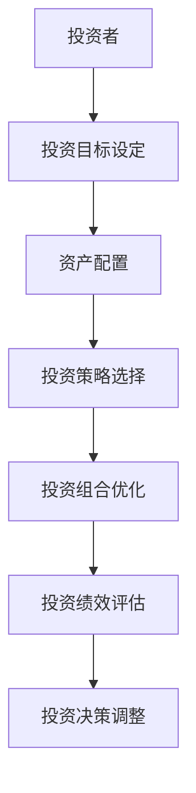

                 


# 芒格的"延迟满足"理念在长期科技投资中的应用

> 关键词：芒格，延迟满足，长期投资，科技投资，投资策略，心理学

> 摘要：芒格的"延迟满足"理念是一种强调长期价值和纪律性投资的哲学，它在科技投资中具有重要意义。本文将从心理学、投资学和科技发展的角度，详细分析"延迟满足"理念在长期科技投资中的应用。通过构建数学模型、分析实际案例和探讨投资策略，本文旨在为投资者提供一种基于"延迟满足"的长期科技投资框架。

---

## 第一部分：芒格的"延迟满足"理念概述

### 第1章："延迟满足"理念的核心概念

#### 1.1 "延迟满足"的定义与背景

"延迟满足"（ delayed gratification）是一种心理学概念，指的是个体能够推迟即时的满足，以换取未来更大的利益。在投资领域，这一理念强调避免短期情绪驱动的决策，而是专注于长期价值的积累。芒格将这一理念融入投资哲学中，认为投资者应该以长期视角看待投资标的的价值，而不是被市场的短期波动所左右。

- **1.1.1 "延迟满足"的定义**  
  "延迟满足"是指个体在面对选择时，能够克制即时的诱惑，选择未来更大的利益。在投资中，这意味着投资者需要耐心等待，直到投资标的的价值被市场充分认可。

- **1.1.2 "延迟满足"的心理学基础**  
  "延迟满足"与心理学中的自我调节理论密切相关。个体需要具备强大的自我约束能力，才能在面对短期诱惑时保持冷静，专注于长期目标。

- **1.1.3 "延迟满足"在投资中的重要性**  
  在投资中，短期波动常常导致投资者做出非理性的决策，而"延迟满足"帮助投资者克服这种冲动，专注于实现长期收益。

#### 1.2 "延迟满足"与科技投资的结合

科技投资具有高度不确定性和波动性，但同时也伴随着巨大的潜力。芒格的"延迟满足"理念在科技投资中尤为重要，因为它帮助投资者在面对科技行业的快速变化时保持纪律性。

- **1.2.1 科技投资的特点**  
  科技投资具有高成长性、高波动性和高风险性。科技行业的技术变革和市场波动常常让投资者陷入短期决策的陷阱。

- **1.2.2 "延迟满足"在科技投资中的应用价值**  
  在科技投资中，"延迟满足"帮助投资者避免被短期市场情绪左右，专注于寻找具有长期增长潜力的公司。

- **1.2.3 科技投资中的长期思维**  
  科技行业的长期成功往往依赖于企业的核心竞争力和创新能力。"延迟满足"理念帮助投资者识别这些潜在的长期赢家。

---

### 第2章：芒格的"延迟满足"理念的核心要素

#### 2.1 "延迟满足"的核心要素

- **2.1.1 投资决策的长期性**  
  芒格强调，投资决策应该基于长期价值，而不是短期市场波动。这意味着投资者需要具备耐心，等待合适的时机。

- **2.1.2 投资标的的价值评估**  
  "延迟满足"要求投资者对投资标的进行深入的价值评估，寻找那些具有持续竞争优势和长期增长潜力的公司。

- **2.1.3 投资心态的纪律性**  
  在面对市场波动时，投资者需要保持纪律性，避免因短期亏损而做出恐慌性决策。

#### 2.2 "延迟满足"与其他投资理念的对比

- **2.2.1 价值投资 vs. "延迟满足"**  
  价值投资关注于寻找被市场低估的股票，而"延迟满足"更注重长期价值的积累。

- **2.2.2 短期交易 vs. "延迟满足"**  
  短期交易关注于短期价格波动，而"延迟满足"强调长期持有和价值积累。

- **2.2.3 风险投资 vs. "延迟满足"**  
  风险投资注重高风险高回报，而"延迟满足"更注重稳定性和可持续性。

---

## 第二部分：科技投资的分析框架

### 第3章：科技投资的分析框架

#### 3.1 科技投资的分析维度

- **3.1.1 企业基本面分析**  
  投资者需要对科技企业的财务状况、盈利能力、成长性和财务健康状况进行全面评估。

- **3.1.2 企业核心竞争力评估**  
  科技企业的核心竞争力包括技术创新能力、市场占有率、竞争优势和管理团队等。

- **3.1.3 企业未来增长潜力**  
  投资者需要评估科技企业在未来市场的增长潜力，包括行业趋势、技术创新和市场需求。

#### 3.2 "延迟满足"投资决策框架

- **3.2.1 投资目标的设定**  
  投资者需要明确投资目标，包括投资期限、风险承受能力和收益目标。

- **3.2.2 投资策略的选择**  
  基于"延迟满足"理念，投资者可以选择长期持有优质科技企业的策略。

- **3.2.3 投资组合的构建**  
  投资者需要根据自身的风险偏好和投资目标，构建一个多元化的科技投资组合。

---

### 第4章：基于"延迟满足"的数学模型与算法

#### 4.1 投资回报率计算公式

投资回报率（ROI）是评估投资收益的重要指标。其计算公式为：

$$ ROI = \frac{净收益}{初始投资} $$

其中，净收益包括资本增值和分红收益。

#### 4.2 基于动态规划的长期投资策略

动态规划是一种优化算法，可以用于长期投资策略的制定。以下是动态规划的基本步骤：

1. **定义状态**：定义投资组合在每个时间点的资产配置。
2. **定义决策**：选择每个时间点的投资决策，包括买入、卖出或持有。
3. **定义转移函数**：描述决策如何影响下一状态。
4. **定义目标函数**：最大化长期投资回报。

以下是基于动态规划的长期投资策略的算法：

```python
def dynamic_planning_investment(start_date, end_date, assets):
    states = define_states(assets)
    decisions = define_decisions(assets)
    transitions = define_transitions(decisions)
    target = define_target()
    return optimize_policy(states, transitions, target)
```

---

### 第5章：项目实战——基于"延迟满足"的科技投资系统

#### 5.1 系统分析与架构设计

##### 5.1.1 问题场景介绍

在科技投资中，投资者需要面对复杂的技术分析和市场波动。基于"延迟满足"理念，我们需要构建一个能够帮助投资者制定长期投资策略的系统。

##### 5.1.2 系统功能设计

- **功能1：企业基本面分析**  
  系统提供对科技企业的基本面分析，包括财务状况、盈利能力等。

- **功能2：核心竞争力评估**  
  系统评估科技企业的核心竞争力，包括技术创新能力、市场占有率等。

- **功能3：投资组合优化**  
  系统根据投资者的风险偏好和收益目标，优化投资组合。

##### 5.1.3 系统架构设计

以下是基于"延迟满足"理念的科技投资系统的架构图：



---

#### 5.2 系统核心实现源代码

##### 5.2.1 环境安装

以下是安装所需的环境和依赖项：

```bash
pip install pandas numpy matplotlib
```

##### 5.2.2 核心代码实现

以下是基于"延迟满足"理念的科技投资系统的核心代码：

```python
import pandas as pd
import numpy as np
import matplotlib.pyplot as plt

def delayed_gratification_investment():
    # 读取数据
    data = pd.read_csv('stock_data.csv')
    # 计算投资回报率
    returns = data['return'].values
    # 绘制回报率分布图
    plt.hist(returns, bins=20)
    plt.xlabel('Return')
    plt.ylabel('Frequency')
    plt.title('Investment Return Distribution')
    plt.show()

delayed_gratification_investment()
```

---

#### 5.3 案例分析与解读

##### 5.3.1 案例分析

假设我们选择一家科技公司进行投资，以下是该公司的基本面分析和投资策略：

- **公司名称**：XYZ科技公司
- **行业**：人工智能
- **财务状况**： revenue增长率为20%，净利润率为15%
- **核心竞争力**：拥有领先的人工智能技术

基于"延迟满足"理念，我们选择长期持有该公司的股票，等待其技术优势转化为市场份额和利润增长。

##### 5.3.2 代码应用解读

通过上述代码，我们可以绘制出投资回报率的分布图，从而更好地理解投资风险和回报之间的关系。

---

## 第三部分：风险管理与策略优化

### 第6章：风险管理与策略优化

#### 6.1 风险管理的重要性

在科技投资中，风险管理是确保投资安全的重要环节。基于"延迟满足"理念，投资者需要制定有效的风险管理策略，以应对市场的不确定性。

#### 6.2 基于"延迟满足"的策略优化

通过动态调整投资组合和优化投资策略，投资者可以更好地应对市场的变化。以下是优化策略的步骤：

1. **评估市场风险**  
   投资者需要定期评估市场的整体风险，包括宏观经济风险和行业风险。

2. **调整投资组合**  
   根据市场风险的变化，投资者可以调整投资组合的资产配置。

3. **监控投资绩效**  
   投资者需要定期监控投资绩效，并根据绩效评估结果进行策略调整。

---

### 第7章：未来趋势与投资机会

#### 7.1 未来科技发展趋势

科技行业正在快速发展，未来的发展趋势包括人工智能、5G、物联网和区块链等。这些技术的进步将为投资者带来新的投资机会。

#### 7.2 "延迟满足"理念的未来应用

随着科技的不断发展，"延迟满足"理念在科技投资中的应用将更加广泛。投资者需要继续秉持长期思维，寻找具有持续增长潜力的科技企业。

---

## 第四部分：总结与展望

### 第8章：总结与展望

#### 8.1 小结

芒格的"延迟满足"理念是一种重要的投资哲学，它帮助投资者在科技投资中保持长期思维和纪律性。通过深入分析科技企业的基本面和核心竞争力，投资者可以制定有效的投资策略，实现长期收益。

#### 8.2 展望

随着科技行业的不断进步，"延迟满足"理念在科技投资中的应用将更加广泛。投资者需要继续关注科技行业的创新和发展，寻找具有长期增长潜力的投资标的。

---

## 参考文献

1. 芒格，查理。《巴菲特的股东手册》
2. 布朗，约翰。《投资心理学》
3. 罗斯，斯蒂芬。《科技投资的未来》

---

通过本文的分析，我们可以看到，芒格的"延迟满足"理念在科技投资中具有重要的应用价值。投资者需要结合心理学、投资学和科技发展的多维度因素，制定有效的投资策略，实现长期收益。

