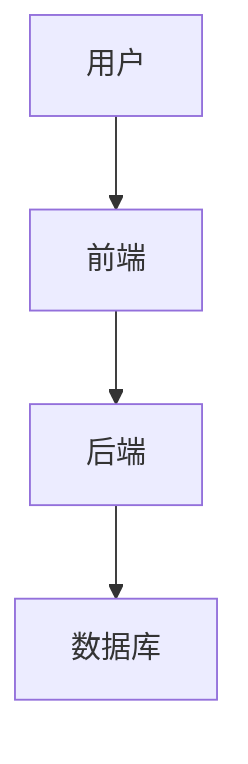

                 

# 芒格的"延迟满足"理念在风险投资中的应用

## 关键词：芒格，延迟满足，风险投资，投资决策，行为经济学

## 摘要：  
芒格的"延迟满足"理念是一种强调长期价值、理性决策和耐心等待的投资哲学，它不仅适用于个人生活决策，也对风险投资领域具有深远的影响。本文从理论基础、数学模型、系统设计和项目实战等多维度，详细阐述了芒格"延迟满足"理念在风险投资中的应用。通过分析投资决策的不确定性、概率论的应用、决策树模型的构建以及系统架构设计，本文为风险投资者提供了一套基于"延迟满足"理念的投资策略和方法论。

---

# 第1章: 芒格"延迟满足"理念的背景与核心概念

## 1.1 "延迟满足"的定义与内涵

### 1.1.1 "延迟满足"的定义  
"延迟满足"是指在面对选择时，能够克制即时满足的欲望，选择在未来获得更大的利益。这种决策模式强调长期价值，而非短期收益。

### 1.1.2 "延迟满足"的核心内涵  
- 强调时间的价值：通过延迟满足，投资者可以更好地评估项目的长期潜力，避免短期波动带来的损失。  
- 理性决策：基于逻辑和数据分析，而非情感驱动的决策。  
- 耐心等待：在不确定的市场中，等待最佳时机以实现更高的回报。

### 1.1.3 "延迟满足"与投资的关系  
在投资领域，"延迟满足"意味着投资者需要耐心等待优质投资机会的出现，而不是盲目追求数目增长。这种理念帮助投资者避免短期市场的诱惑，专注于长期的价值积累。

## 1.2 芒格"延迟满足"理念的背景

### 1.2.1 芒格的投资哲学概述  
芒格是一位著名的企业家和投资者，他的投资哲学强调理性、逻辑和长期价值。他认为，成功的投资需要对人性、概率和时间有深刻的理解。

### 1.2.2 "延迟满足"理念的提出背景  
在现代投资市场中，许多投资者被短期收益的诱惑所驱动，忽视了长期价值的积累。芒格提出的"延迟满足"理念，旨在帮助投资者克服短期诱惑，专注于长期收益。

### 1.2.3 "延迟满足"在风险投资中的应用价值  
- 提高决策质量：通过延迟满足，投资者能够更好地分析项目的长期潜力，避免短期决策失误。  
- 增强风险控制：在不确定的市场环境中，延迟满足可以帮助投资者规避风险，降低损失。  
- 提升投资回报：长期耐心的投资策略，往往能够带来更高的回报。

## 1.3 风险投资的基本概念与特点

### 1.3.1 风险投资的定义与特点  
风险投资是指将资金投入到具有高成长潜力的企业中，通过企业的增值实现投资收益。其特点是高风险、高回报，投资周期较长。

### 1.3.2 风险投资的主要模式  
- 创业投资：直接投资于初创企业。  
- 并购投资：通过收购现有企业实现投资目标。  
- 项目投资：针对特定项目进行投资。

### 1.3.3 风险投资与传统投资的区别  
- 投资对象：风险投资主要面向初创企业和高成长企业，传统投资则涵盖更广泛的资产类型。  
- 投资周期：风险投资通常需要更长的时间周期，传统投资则更注重短期回报。  
- 风险程度：风险投资具有更高的风险和不确定性。

## 1.4 本章小结  
本章主要介绍了芒格"延迟满足"理念的背景、核心概念以及风险投资的基本特点。通过理解"延迟满足"的理念，投资者可以在风险投资中做出更理性和耐心的决策，从而实现长期的财富增长。

---

# 第2章: "延迟满足"理念的核心原理与数学模型

## 2.1 心理学基础

### 2.1.1 理性决策与非理性决策  
理性决策基于逻辑和数据分析，而非理性决策则受情感和本能驱动。"延迟满足"理念强调理性决策的重要性。

### 2.1.2 时间偏好与投资决策  
人们通常更倾向于即时满足，这与投资中的短期决策密切相关。"延迟满足"通过改变时间偏好，帮助投资者做出更理性的决策。

### 2.1.3 延迟满足的动机与心理机制  
- 动机：追求长期利益和最大化回报。  
- 心理机制：通过自我约束和理性分析，克服短期诱惑。

## 2.2 行为经济学视角

### 2.2.1 行为经济学的基本概念  
行为经济学研究人类在决策过程中的行为偏差和非理性行为。

### 2.2.2 延迟满足与行为偏见  
- 偏见：人们倾向于高估短期收益，低估长期价值。  
- 校正：通过理性分析和延迟满足，克服行为偏见。

### 2.2.3 行为经济学对投资决策的启示  
- 了解自身偏见：识别和克服非理性决策。  
- 建立决策框架：通过系统化的方法，提高决策质量。

## 2.3 投资决策中的概率论应用

### 2.3.1 投资决策的不确定性  
市场波动、经济环境和企业经营状况都可能导致投资结果的不确定性。

### 2.3.2 概率论在投资决策中的应用  
- 通过概率分析，评估不同投资方案的潜在回报和风险。  
- 使用期望值公式，计算投资的长期回报。

### 2.3.3 延迟满足与概率论的结合  
通过概率分析，投资者可以更好地理解延迟满足的长期收益，从而做出更理性的决策。

## 2.4 本章小结  
本章从心理学和行为经济学的角度，分析了"延迟满足"理念的核心原理。通过概率论的应用，投资者可以更好地理解延迟满足的长期价值，并在实际投资中加以应用。

---

# 第3章: "延迟满足"理念的数学模型与算法

## 3.1 投资决策的数学模型

### 3.1.1 投资回报的数学表达  
投资回报可以表示为：  
$$ R = \frac{V_f - V_i}{V_i} \times 100\% $$  
其中，$V_f$ 是最终价值，$V_i$ 是初始投资。

### 3.1.2 时间价值的数学模型  
通过复利公式计算时间价值：  
$$ V_f = V_i \times (1 + r)^n $$  
其中，$r$ 是年化收益率，$n$ 是投资年数。

### 3.1.3 延迟满足的数学公式  
通过延迟满足，投资者可以最大化长期回报：  
$$ \text{长期回报} = \sum_{t=1}^{n} R_t \times (1 + r)^{n-t} $$

## 3.2 延迟满足的决策树模型

### 3.2.1 决策树的基本概念  
决策树是一种用于分析决策问题的树状图，包括决策节点、结果节点和概率边。

### 3.2.2 延迟满足的决策树构建  
1. 确定初始决策：是否进行投资。  
2. 分析可能结果：成功或失败。  
3. 评估概率和回报：计算每种结果的期望值。

### 3.2.3 决策树在投资决策中的应用  
通过决策树分析，投资者可以更好地理解延迟满足的长期回报。

## 3.3 基于概率论的算法实现

### 3.3.1 概率分布的计算  
假设某投资项目的成功概率为$p$，失败概率为$1-p$。

### 3.3.2 投资回报的期望值计算  
$$ E[R] = p \times R_{\text{成功}} + (1-p) \times R_{\text{失败}} $$

### 3.3.3 延迟满足的算法实现  
通过计算期望值，投资者可以选择回报最大的方案。

## 3.4 本章小结  
本章通过数学模型和算法，详细阐述了"延迟满足"理念的应用。通过概率论和决策树模型，投资者可以更好地理解延迟满足的长期价值。

---

# 第4章: 投资决策系统的系统分析与架构设计

## 4.1 系统需求分析

### 4.1.1 系统目标  
构建一个基于"延迟满足"理念的投资决策支持系统。

### 4.1.2 系统功能需求  
- 数据采集：收集市场数据和项目信息。  
- 模型计算：应用数学模型进行分析。  
- 决策支持：提供投资建议和决策支持。

### 4.1.3 系统性能需求  
- 处理速度：快速响应用户请求。  
- 数据准确性：确保分析结果的准确性。

## 4.2 系统架构设计

### 4.2.1 系统架构图  

### 4.2.2 模块划分与功能分配  
- 前端：用户界面和数据输入。  
- 后端：模型计算和数据分析。  
- 数据库：存储市场数据和项目信息。

### 4.2.3 系统接口设计  
- 用户与前端的交互接口。  
- 前端与后端的数据接口。  
- 后端与数据库的数据接口。

## 4.3 系统实现与测试

### 4.3.1 系统实现  
使用Python和Django框架开发系统。

### 4.3.2 系统测试  
- 单元测试：测试各个模块的功能。  
- 集成测试：测试系统整体功能。

### 4.3.3 测试结果分析  
确保系统功能正常，数据分析准确。

## 4.4 本章小结  
本章通过系统分析和架构设计，构建了一个基于"延迟满足"理念的投资决策支持系统。该系统可以帮助投资者更好地理解和应用这一理念。

---

# 第5章: 项目实战与案例分析

## 5.1 项目背景与目标

### 5.1.1 项目背景  
某初创科技公司，寻求风险投资。

### 5.1.2 项目目标  
评估公司价值，制定投资决策。

## 5.2 项目实施过程

### 5.2.1 数据采集  
收集公司财务数据、市场信息和竞争分析。

### 5.2.2 模型计算  
应用数学模型评估公司价值。

### 5.2.3 决策支持  
基于模型分析结果，制定投资策略。

## 5.3 案例分析

### 5.3.1 投资决策分析  
通过模型计算，评估公司的长期价值。

### 5.3.2 投资回报预测  
预测投资的长期回报和风险。

## 5.4 本章小结  
本章通过项目实战，展示了"延迟满足"理念在实际投资中的应用。通过系统化的分析和决策支持，投资者可以更好地实现长期价值。

---

# 第6章: 总结与展望

## 6.1 本章总结  
芒格的"延迟满足"理念在风险投资中具有重要的应用价值。通过理性分析和长期等待，投资者可以实现更高的回报。

## 6.2 未来展望  
随着科技的发展，"延迟满足"理念将在更多领域得到应用。投资者需要不断学习和适应，以应对市场的变化。

---

## 参考文献  
（此处列出相关书籍和文献）

---

## 附录  
（此处列出代码和数据表格）

---

以上是基于芒格"延迟满足"理念在风险投资中的应用的完整文章大纲和内容框架。通过系统化的分析和详细的案例说明，本文为读者提供了一套基于"延迟满足"理念的投资策略和方法论。

