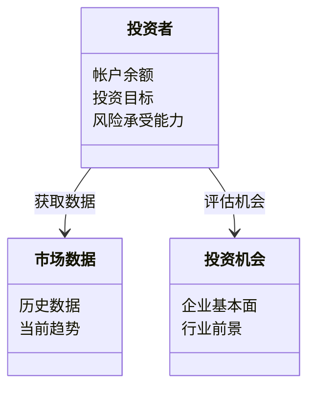

                 


# 芒格的延迟满足理念：长期投资的心理基础

## 关键词：
- 延迟满足
- 投资心理
- 长期投资
- 芒格投资理念
- 价值投资

## 摘要：
芒格的延迟满足理念强调在投资中保持耐心，不急于求成，而是等待最佳时机。本文从心理学、数学模型、系统架构等多个角度深入分析延迟满足理念的核心思想，并结合实际案例，探讨其在投资决策中的应用。

---

# 引言

## 1. 背景介绍

### 1.1 核心概念术语说明
- **延迟满足**：指在面对诱惑时，选择推迟即时满足以追求更长远利益的心理过程。
- **长期投资**：以价值为导向，关注企业的长期增长潜力，而非短期价格波动。

### 1.2 问题背景
现代投资者往往被短期市场波动所困扰，追求快速收益，忽视长期价值。这种急功近利的心态导致许多投资者错失长期增长的机会。

### 1.3 问题描述
当前市场环境中，投资者面临信息过载和情绪波动的双重影响，容易做出非理性的投资决策。许多投资者缺乏耐心，急于求成，导致投资回报不佳。

### 1.4 解决方案
芒格的延迟满足理念为投资者提供了一种心理框架，帮助他们在面对短期诱惑时保持冷静，专注于长期价值。

### 1.5 边界与外延
- **边界**：适用于长期价值投资，不适用于短期套利或投机行为。
- **外延**：涵盖投资决策中的耐心、理性分析和风险管理。

### 1.6 概念结构与核心要素
- **耐心**：等待最佳投资时机。
- **理性**：基于基本面分析做出决策。
- **长期视角**：关注企业的持续增长。

---

## 2. 核心概念与联系

### 2.1 心理学基础

#### 2.1.1 心理账户理论
- **心理账户**：投资者将资金分配到不同的心理账户中，每个账户对应不同的投资目标。
- **应用**：通过心理账户管理，投资者可以更好地控制短期冲动，专注于长期目标。

#### 2.1.2 自我控制理论
- **自我控制**：延迟满足需要强大的自我控制能力，抵制短期诱惑。
- **应用**：通过心理训练和纪律约束，投资者可以克服短期冲动，坚持长期投资策略。

#### 2.1.3 行为经济学理论
- **前景理论**：投资者对损失的敏感性高于收益，影响决策。
- **应用**：通过理解前景理论，投资者可以更好地管理情绪，避免非理性决策。

#### 2.1.4 对比分析

| 理论 | 心理账户 | 自我控制 | 前景理论 |
|------|----------|----------|----------|
| 描述 | 管理资金分配的心理账户 | 抵制短期诱惑的能力 | 对损失的敏感性影响决策 |
| 应用 | 分散投资目标 | 坚持长期策略 | 管理情绪波动 |

---

### 2.2 延迟满足与投资心理

#### 2.2.1 投资者的心理偏差
- **过度自信**：认为自己能够准确预测市场。
- **从众心理**：跟随市场潮流，忽视独立判断。
- **损失厌恶**：害怕亏损，导致错失投资机会。

#### 2.2.2 延迟满足对心理偏差的调节作用
- **调节过度自信**：通过长期视角减少对短期预测的依赖。
- **避免从众心理**：坚持独立分析，不随波逐流。
- **缓解损失厌恶**：通过分散投资降低对单一投资的焦虑。

---

## 3. 延迟满足的数学模型与算法

### 3.1 延迟满足的数学模型

#### 3.1.1 期望值模型
- **公式**：$$ E = \sum_{i=1}^{n} p_i x_i $$
  - $E$：期望值
  - $p_i$：事件i的概率
  - $x_i$：事件i的收益

- **应用**：通过计算长期投资的期望值，评估其合理性。

#### 3.1.2 现值模型
- **公式**：$$ PV = \sum_{i=1}^{n} \frac{CF_i}{(1 + r)^i} $$
  - $PV$：现值
  - $CF_i$：第i期的现金流
  - $r$：折现率

- **应用**：评估长期投资的现值，判断其是否值得投资。

---

## 4. 延迟满足的系统分析与架构设计

### 4.1 问题场景介绍

#### 4.1.1 投资者决策问题
- **问题**：投资者面临短期收益与长期价值的权衡。
- **目标**：构建一个辅助投资者做出长期决策的系统。

### 4.2 项目介绍

#### 4.2.1 项目目标
- 辅助投资者制定和执行长期投资策略。

#### 4.2.2 系统功能设计
- **功能1**：分析市场趋势。
- **功能2**：评估投资机会。
- **功能3**：制定投资计划。

#### 4.2.3 领域模型设计



#### 4.2.4 系统架构设计


---

## 5. 项目实战

### 5.1 环境配置

#### 5.1.1 安装Python
- 使用Anaconda或Miniconda安装Python 3.8+。

#### 5.1.2 安装依赖
```bash
pip install numpy pandas matplotlib
```

### 5.2 核心代码实现

#### 5.2.1 数据获取
```python
import pandas as pd
import numpy as np

def get_market_data():
    # 示例数据获取
    return pd.DataFrame({'Price': np.random.randn(100).cumsum()})
```

#### 5.2.2 投资机会评估
```python
def assess_investment_opportunity(portfolio, market_data):
    # 示例评估函数
    return portfolio.dot(market_data.mean())
```

### 5.3 案例分析

#### 5.3.1 投资组合模拟
- 使用历史数据模拟投资组合，验证长期投资策略的有效性。

---

## 6. 最佳实践与小结

### 6.1 心理调节技巧

#### 6.1.1 理解延迟满足的本质
- 坚持长期价值，忽略短期波动。

#### 6.1.2 建立投资纪律
- 遵循既定的投资策略，避免情绪化决策。

#### 6.1.3 定期复盘
- 检查投资组合，评估策略的有效性。

### 6.2 投资策略调整

#### 6.2.1 分散投资
- 通过多样化减少风险。

#### 6.2.2 定期再平衡
- 根据市场变化调整投资组合。

### 6.3 风险管理

#### 6.3.1 设置止损点
- 限制潜在损失。

#### 6.3.2 保持充足流动性
- 应对紧急资金需求。

### 6.4 小结

延迟满足理念不仅是心理学上的概念，更是投资成功的关键。通过心理调节、系统架构和最佳实践，投资者可以在复杂多变的市场中保持冷静，实现长期收益。

---

## 7. 拓展阅读

- 《投资最重要的事情》——本杰明·格雷厄姆
- 《穷查理宝典》——查理·芒格

---

通过本文的分析，读者可以深入理解芒格的延迟满足理念，并将其应用于实际投资中，从而实现长期稳健的投资回报。

