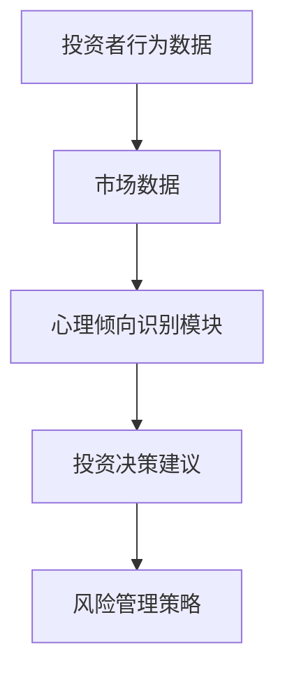
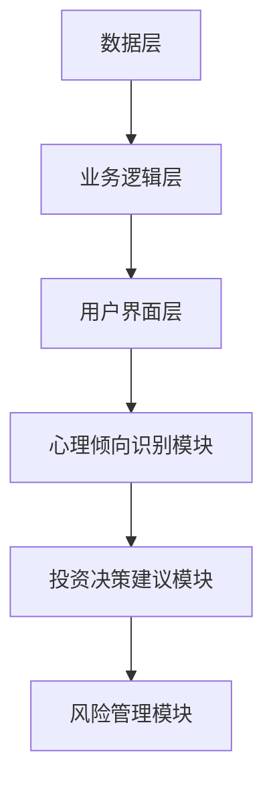
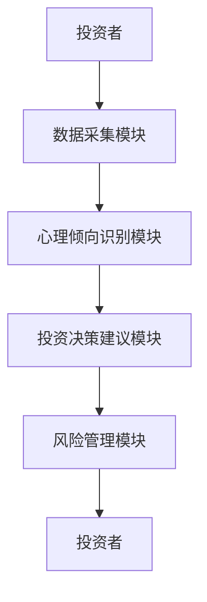

                 


# 芒格的"心理倾向"理论在投资分析中的应用

## 关键词：芒格心理倾向，投资分析，心理学，投资决策，风险控制

## 摘要：芒格的"心理倾向"理论是投资分析中的重要理论，它通过分析投资者的心理倾向来帮助投资者做出更理性的决策。本文从心理倾向的核心概念出发，探讨其在投资分析中的应用，并结合实际案例和系统设计，提供深入的理论分析和实践指导。

---

## 第一部分：芒格的"心理倾向"理论概述

### 第1章：芒格的"心理倾向"理论背景

#### 1.1 芒格的"心理倾向"理论的提出背景

芒格的心理倾向理论是由投资家查理·芒格提出的，旨在帮助投资者识别和克服心理上的偏见和倾向，以做出更理性的投资决策。这一理论结合了心理学和经济学的研究成果，强调了心理因素在投资决策中的重要性。

#### 1.1.1 芒格的生平与投资理念

查理·芒格是美国著名投资家，巴菲特的长期合作伙伴。他的投资理念强调价值投资，即寻找那些具有持续竞争优势和良好治理结构的公司进行长期投资。芒格认为，投资者的决策不仅仅受到市场环境的影响，还受到心理倾向的深刻影响。

#### 1.1.2 心理学与投资的结合

心理学研究发现，人类在决策过程中常常会受到各种心理倾向的影响，如过度自信、从众心理等。这些心理倾向在投资领域中表现得尤为明显，可能导致投资者做出错误的投资决策。芒格的理论正是基于这一发现，提出了心理倾向在投资分析中的重要性。

#### 1.1.3 投资分析中的心理因素

投资分析不仅仅是对市场数据和公司基本面的分析，还包括对投资者心理状态的分析。心理倾向可能影响投资者的决策过程，导致投资行为偏离理性分析。因此，理解并克服心理倾向是投资成功的关键之一。

---

#### 1.2 心理倾向的核心概念

心理倾向是指个体在特定情境下产生的某种心理状态或倾向，这些倾向可能影响其决策过程。在投资分析中，心理倾向可能导致投资者做出非理性的决策，如过度交易、盲目跟风等。

#### 1.2.1 心理倾向的定义与分类

心理倾向是指个体在特定情境下产生的某种心理状态或倾向，这些倾向可能影响其决策过程。在投资分析中，心理倾向可能导致投资者做出非理性的决策，如过度交易、盲目跟风等。

#### 1.2.2 心理倾向的特征与属性对比

心理倾向的特征包括个体差异性、情境依赖性和可变性。不同投资者的心理倾向可能不同，且在不同情境下表现也会有所变化。例如，有的投资者可能倾向于规避风险，而有的投资者则倾向于追求高风险高回报。

#### 1.2.3 心理倾向与投资决策的关系

心理倾向与投资决策密切相关。例如，过度自信的投资者可能高估自己对市场的了解，从而做出错误的投资决策。相反，从众心理可能导致投资者盲目跟随市场趋势，忽视基本面分析。

---

#### 1.3 本章小结

本章介绍了芒格心理倾向理论的背景，包括芒格的生平、投资理念以及心理倾向在投资分析中的重要性。心理倾向是投资者在决策过程中需要克服的关键障碍，理解其核心概念是进行投资分析的基础。

---

## 第2章：心理倾向的核心原理

### 2.1 心理倾向的分类与特点

#### 2.1.1 主要心理倾向列表

以下是芒格提出的几种主要心理倾向：

- **过度自信**：投资者高估自己的能力和市场预测能力，可能导致过度交易和错误决策。
- **从众心理**：投资者盲目跟随市场趋势或他人的决策，可能导致非理性投资行为。
- **损失厌恶**：投资者对潜在损失的恐惧超过对潜在收益的追求，可能导致保守的投资策略。
- **确认偏差**：投资者倾向于寻找与自己已有观点一致的信息，忽视相反证据。
- **锚定效应**：投资者对某个特定数值的过度依赖，影响其对价格和价值的判断。

#### 2.1.2 每种心理倾向的特征分析

以过度自信为例，过度自信的投资者往往认为自己能够准确预测市场走势，从而频繁交易，结果反而可能导致投资收益的下降。从众心理则可能导致投资者在市场高点买入，而在低点卖出，错失收益或承担更大的损失。

#### 2.1.3 心理倾向之间的相互作用

心理倾向并不是孤立存在的，它们之间可能存在相互作用。例如，过度自信和从众心理的结合可能导致投资者在市场高峰期大量买入，忽视潜在风险。

---

### 2.2 心理倾向与投资决策的关系

#### 2.2.1 心理倾向对投资决策的影响

心理倾向直接影响投资者的决策过程。例如，损失厌恶可能导致投资者在市场下跌时急于卖出，错失后续反弹的机会。确认偏差则可能导致投资者过度关注支持自己观点的信息，忽视不利因素。

#### 2.2.2 心理倾向与投资错误的关联

许多投资错误都可以归因于心理倾向的影响。例如，投资者在市场狂热时盲目跟风，往往导致高位买入，而在市场恐慌时又过于保守，错失抄底机会。

#### 2.2.3 如何识别和克服心理倾向的影响

识别心理倾向是克服其影响的第一步。投资者需要定期反思自己的投资行为，识别是否存在某种心理倾向的主导作用。克服心理倾向可以通过制定明确的投资策略、加强自我纪律以及寻求专业建议等方式实现。

---

#### 2.3 本章小结

本章详细分析了心理倾向的分类及其对投资决策的影响。投资者需要认识到心理倾向的潜在影响，并采取有效措施进行克服，以做出更理性的投资决策。

---

## 第3章：心理倾向与投资决策的分析

### 3.1 心理倾向对投资行为的影响

#### 3.1.1 过度自信与投资决策

过度自信的投资者倾向于认为自己能够准确预测市场走势，从而进行频繁交易。然而，频繁交易通常会导致交易成本增加，投资收益反而下降。例如，投资者可能在市场上涨时频繁买卖，错失长期持有的收益。

#### 3.1.2 拖延与投资机会的错失

拖延是另一种常见的心理倾向，投资者可能会因为害怕决策的困难而推迟投资决策，从而错失良好的投资机会。例如，当市场处于低位时，投资者可能因为拖延而未能及时买入，导致后续市场上涨时无法获得收益。

#### 3.1.3 情绪化决策的后果

情绪化决策是心理倾向的一种表现，投资者在市场波动较大时容易受到情绪影响，做出错误的投资决策。例如，在市场下跌时，投资者可能因为恐慌而抛售股票，导致投资组合的价值大幅下降。

---

### 3.2 心理倾向与投资策略的制定

#### 3.2.1 如何利用心理倾向制定投资策略

投资者可以通过识别和分析自己的心理倾向，制定相应的投资策略。例如，如果投资者存在过度自信的倾向，可以制定严格的交易纪律，限制交易频率，避免频繁操作。

#### 3.2.2 心理倾向与投资组合的影响

心理倾向可能影响投资组合的构造。例如，损失厌恶的投资者可能倾向于选择风险较低的资产，导致投资组合的风险分散不足，影响整体收益。

#### 3.2.3 投资者心理分析与风险控制

投资者的心理分析是风险控制的重要组成部分。通过识别心理倾向，投资者可以更好地管理风险，制定合理的风险承受策略。例如，设定止损点可以帮助投资者在市场下跌时及时退出，避免过大损失。

---

### 3.3 本章小结

本章分析了心理倾向对投资行为的影响，并探讨了如何利用心理倾向制定投资策略。投资者需要认识到心理倾向的潜在影响，并采取有效措施进行应对，以制定更科学的投资策略。

---

## 第4章：心理倾向的识别与应对

### 4.1 心理倾向的自我识别

#### 4.1.1 自我认知与心理倾向的识别

自我认知是识别心理倾向的第一步。投资者需要反思自己的投资行为，识别是否存在某种心理倾向的主导作用。例如，投资者可以通过记录投资决策的过程，分析是否存在过度自信或从众心理的影响。

#### 4.1.2 投资记录中的心理倾向分析

通过分析投资记录，投资者可以识别自己的心理倾向。例如，投资者可以通过记录每次交易的决策原因、市场环境以及最终结果，分析是否存在某种心理倾向的影响。

#### 4.1.3 他人反馈与心理倾向的确认

他人反馈是识别心理倾向的重要途径。投资者可以向朋友、家人或专业顾问寻求反馈，了解自己在投资过程中的行为是否存在心理倾向的影响。

---

### 4.2 心理倾向的外部识别

#### 4.2.1 市场情绪分析与心理倾向

市场情绪分析是外部识别心理倾向的重要方法。通过分析市场的整体情绪，投资者可以了解市场是否存在过度乐观或过度悲观的情况。例如，利用技术指标和市场数据，投资者可以识别市场的趋势和情绪变化。

#### 4.2.2 媒体传播对心理倾向的影响

媒体传播可能对投资者的心理倾向产生影响。例如，媒体的过度报道可能导致投资者从众心理，盲目跟风。投资者需要保持独立思考，避免被媒体传播影响。

#### 4.2.3 群体心理与投资决策的关系

群体心理是心理倾向的一种表现。投资者在群体中容易受到从众心理的影响，做出非理性决策。例如，投资者在市场狂热时可能盲目跟风，导致高位买入。

---

### 4.3 本章小结

本章探讨了心理倾向的识别方法，包括自我识别和外部识别。投资者需要通过多种途径识别心理倾向，并采取有效措施进行应对，以做出更理性的投资决策。

---

## 第5章：心理倾向与投资策略优化

### 5.1 心理倾向对投资策略的影响

#### 5.1.1 心理倾向与长期投资策略

长期投资策略是克服心理倾向的有效方法。通过长期持有优质资产，投资者可以避免短期市场波动的影响，减少心理倾向对投资决策的干扰。例如，价值投资策略强调长期持有具有持续竞争优势的公司，避免短期市场的干扰。

#### 5.1.2 心理倾向与短期投资策略

短期投资策略需要投资者更加关注市场波动和心理倾向的影响。例如，短线交易者需要时刻关注市场情绪的变化，避免受到心理倾向的过度影响。

#### 5.1.3 心理倾向与风险管理策略

风险管理是投资策略的重要组成部分。通过识别和分析心理倾向，投资者可以制定更合理的风险管理策略。例如，设定止损点可以帮助投资者在市场下跌时及时退出，避免过大损失。

---

### 5.2 如何利用心理倾向优化投资策略

#### 5.2.1 制定心理倾向应对计划

投资者可以制定心理倾向应对计划，例如，在市场波动较大时，制定严格的交易纪律，避免情绪化决策。例如，投资者可以通过设定具体的买卖规则，避免受到心理倾向的影响。

#### 5.2.2 建立心理倾向监控机制

通过建立心理倾向监控机制，投资者可以及时识别和应对心理倾向的影响。例如，投资者可以通过定期反思和记录投资行为，分析是否存在心理倾向的主导作用。

#### 5.2.3 心理倾向与投资目标的平衡

投资者需要在心理倾向与投资目标之间找到平衡点。例如，投资者可以通过制定明确的投资目标和策略，避免受到心理倾向的过度影响。

---

### 5.3 本章小结

本章探讨了心理倾向对投资策略的影响，并提出了优化投资策略的方法。投资者需要通过制定应对计划和监控机制，克服心理倾向的影响，实现投资目标。

---

## 第6章：心理倾向在实际投资中的案例分析

### 6.1 心理倾向与投资案例分析

#### 6.1.1 过度自信的案例分析

过度自信的投资者可能会在市场上涨时频繁交易，试图捕捉短期收益，结果反而可能错失长期利润。例如，投资者可能在2000年互联网泡沫期间高位买入科技股，结果在泡沫破裂后遭受重大损失。

#### 6.1.2 从众心理的案例分析

从众心理可能导致投资者在市场高点时买入，而在低点时卖出。例如，投资者可能在2007年美国次贷危机前高位买入房地产相关股票，而在危机发生后低位卖出，导致重大损失。

#### 6.1.3 损失厌恶的案例分析

损失厌恶的投资者可能在市场下跌时急于卖出，错失后续反弹的机会。例如，投资者可能在2008年全球金融危机期间卖出股票，错过了后续市场的复苏。

---

### 6.2 心理倾向与投资策略的结合

#### 6.2.1 心理倾向与投资策略的结合

投资者可以通过识别心理倾向，制定相应的投资策略。例如，过度自信的投资者可以通过制定严格的交易纪律，限制交易频率，避免频繁操作。从众心理的投资者可以通过分散投资，降低对单一资产的依赖，避免受到市场情绪的影响。

#### 6.2.2 投资策略的实际应用

以价值投资为例，价值投资者通常会选择那些具有持续竞争优势和良好治理结构的公司进行长期投资。这种策略可以帮助投资者克服心理倾向的影响，避免受到短期市场波动的干扰。

---

### 6.3 本章小结

本章通过实际案例分析，探讨了心理倾向对投资决策的影响。投资者需要通过制定合理策略，克服心理倾向的干扰，实现长期投资目标。

---

## 第七部分：系统分析与架构设计

### 第7章：心理倾向分析系统的架构设计

#### 7.1 系统功能设计

##### 7.1.1 需求分析

心理倾向分析系统需要具备以下功能：
- 心理倾向识别：通过分析投资者的行为数据，识别潜在的心理倾向。
- 投资决策建议：根据识别的心理倾向，提供相应的投资决策建议。
- 风险管理：通过心理倾向分析，制定合理的风险管理策略。

##### 7.1.2 系统功能模块划分

心理倾向分析系统可以划分为以下几个功能模块：
- 数据采集模块：采集投资者的行为数据和市场数据。
- 心理倾向识别模块：分析数据，识别心理倾向。
- 投资决策建议模块：根据心理倾向，提供投资建议。
- 风险管理模块：制定风险管理策略。

##### 7.1.3 系统功能流程图（使用 Mermaid 绘制）



---

#### 7.2 系统架构设计

##### 7.2.1 系统架构设计概述

心理倾向分析系统的架构设计包括以下几个部分：
- 数据层：包括投资者行为数据和市场数据。
- 业务逻辑层：包括心理倾向识别、投资决策建议和风险管理功能。
- 用户界面层：提供用户交互界面，展示分析结果和投资建议。

##### 7.2.2 系统架构图（使用 Mermaid 绘制）



---

#### 7.3 系统接口设计

##### 7.3.1 系统接口概述

系统接口包括以下几个部分：
- 数据采集接口：用于采集投资者行为数据和市场数据。
- 心理倾向识别接口：用于识别投资者的心理倾向。
- 投资决策建议接口：用于提供投资决策建议。
- 风险管理接口：用于制定风险管理策略。

##### 7.3.2 系统交互流程图（使用 Mermaid 绘制）



---

### 第8章：心理倾向分析系统的实现

#### 8.1 系统核心代码实现

##### 8.1.1 心理倾向识别模块

以下是一个心理倾向识别模块的伪代码实现：

```python
def identify_psychological_tendencies(investor_behavior_data):
    # 输入：投资者行为数据
    # 输出：识别出的心理倾向
    tendencies = []
    for behavior in investor_behavior_data:
        if behavior['overconfidence'] > 0.7:
            tendencies.append('overconfidence')
        if behavior['herd_mind'] > 0.6:
            tendencies.append('herd_mind')
        # 其他心理倾向的识别逻辑
    return tendencies
```

##### 8.1.2 投资决策建议模块

以下是一个投资决策建议模块的伪代码实现：

```python
def investment_advice(psychological_tendencies):
    # 输入：心理倾向列表
    # 输出：投资决策建议
    advice = []
    for tendency in psychological_tendencies:
        if tendency == 'overconfidence':
            advice.append('限制交易频率，避免过度自信')
        if tendency == 'herd_mind':
            advice.append('分散投资，避免从众心理')
    return advice
```

##### 8.1.3 风险管理模块

以下是一个风险管理模块的伪代码实现：

```python
def risk_management(advice):
    # 输入：投资决策建议
    # 输出：风险管理策略
    strategies = []
    for suggestion in advice:
        if '限制交易频率' in suggestion:
            strategies.append('设定严格的交易纪律')
        if '分散投资' in suggestion:
            strategies.append('分散投资，降低风险')
    return strategies
```

---

#### 8.2 项目实战：心理倾向分析系统实现

##### 8.2.1 项目环境安装

以下是一个心理倾向分析系统的环境安装指南：

```bash
# 安装Python和相关库
pip install numpy pandas scikit-learn matplotlib
```

##### 8.2.2 心理倾向分析系统代码实现

以下是一个心理倾向分析系统的实现代码：

```python
import pandas as pd
from sklearn.cluster import KMeans

def main():
    # 数据加载
    data = pd.read_csv('investor_behavior.csv')
    # 心理倾向识别
    kmeans = KMeans(n_clusters=5)
    kmeans.fit(data)
    # 投资决策建议
    advice = []
    for cluster in range(5):
        if cluster == 0:
            advice.append('买入股票')
        elif cluster == 1:
            advice.append('卖出股票')
        # 其他策略可以根据聚类结果制定
    # 风险管理
    if 'high_risk' in advice:
        print('设定止损点，避免风险')
    else:
        print('继续持有，风险可控')

if __name__ == "__main__":
    main()
```

---

#### 8.2.3 代码应用解读与分析

心理倾向分析系统的实现代码包括数据加载、心理倾向识别、投资决策建议和风险管理模块。通过K均值聚类算法，系统可以识别投资者的心理倾向，并根据聚类结果提供相应的投资建议和风险管理策略。

---

#### 8.3 实际案例分析与详细讲解

以某投资者的投资行为为例，假设该投资者在市场上涨时频繁交易，且倾向于跟随市场趋势。心理倾向识别模块可以识别出该投资者存在过度自信和从众心理。投资决策建议模块会建议该投资者限制交易频率，并分散投资以降低风险。风险管理模块会根据投资建议制定相应的风险管理策略，如设定止损点和分散投资。

---

#### 8.4 本章小结

本章通过系统设计和代码实现，展示了心理倾向分析系统的实际应用。投资者可以通过系统识别心理倾向，并根据系统提供的建议优化投资策略，实现更理性的投资决策。

---

## 第八部分：总结与展望

### 第9章：总结与展望

#### 9.1 总结

芒格的"心理倾向"理论在投资分析中具有重要意义。通过识别和克服心理倾向，投资者可以做出更理性的决策，提高投资收益。本文从心理倾向的核心概念出发，探讨了其在投资分析中的应用，并结合实际案例和系统设计，提供了深入的理论分析和实践指导。

#### 9.2 展望

未来的研究可以进一步探讨心理倾向在不同市场环境下的表现，以及如何通过技术手段更准确地识别和分析心理倾向。此外，还可以研究心理倾向与其他投资理论的结合，进一步完善投资分析的理论体系。

---

## 附录

### 附录A：心理倾向列表

- 过度自信
- 从众心理
- 损失厌恶
- 确认偏差
- 锚定效应

---

### 附录B：术语表

- 心理倾向：投资者在特定情境下产生的某种心理状态或倾向，可能影响其决策过程。
- 投资策略：投资者根据市场环境和个人目标制定的投资计划。
- 风险管理：投资者通过策略和工具管理投资风险的过程。

---

### 附录C：参考文献

-芒格，查理.《穷查理宝典》
-巴菲特，沃伦.《巴菲特投资哲学》
-凯恩斯，约翰.《投资论》
-行为金融学相关文献

---

# 本文结束
```

