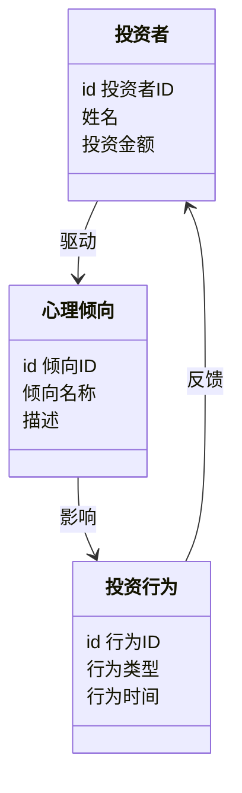

                 


# 芒格的"心理倾向"理论在社交媒体投资中的应用

> 关键词：芒格心理倾向，社交媒体投资，投资决策，心理偏差，风险管理

> 摘要：本文深入探讨了芒格的"心理倾向"理论在社交媒体投资中的应用，通过分析心理倾向对投资决策的影响，结合社交媒体的特性，提出了如何利用心理倾向理论优化投资策略的系统方法。

---

## 第一部分：引言

### 第1章：社交媒体投资的现状与问题

#### 1.1 社交媒体在投资中的角色
- 社交媒体的兴起为投资者提供了实时信息和社交互动的平台，但也带来了信息过载和情绪影响的问题。
- 投资者通过社交媒体获取信息、分享观点，但这种互动也容易受到心理倾向的干扰。

#### 1.2 芒格心理倾向理论的背景
- 芒格的心理倾向理论涵盖了25种心理倾向，如贪婪、恐惧、从众等，这些倾向在社交媒体环境中表现得尤为明显。
- 本文将分析这些心理倾向如何影响投资者的决策，并探讨如何利用这些理论优化投资策略。

#### 1.3 本书的研究目标与意义
- 本文旨在通过分析心理倾向在社交媒体中的应用，为投资者提供科学的投资决策支持。
- 研究意义在于结合心理学与技术分析，为社交媒体投资提供理论与实践的双重指导。

---

## 第二部分：芒格心理倾向理论的核心概念

### 第2章：芒格心理倾向理论的定义与特点

#### 2.1 心理倾向的定义与分类
- 心理倾向是指个体在特定情境下的心理状态和行为模式，包括贪婪、恐惧、从众等。
- 芒格将心理倾向分为25种类型，每种类型都有其独特的表现形式和影响。

#### 2.2 心理倾向与投资决策的关系
- 投资者在社交媒体上的行为往往受到心理倾向的驱动，例如贪婪导致过度投资，恐惧导致错失良机。
- 本文通过案例分析，展示心理倾向如何影响投资决策。

#### 2.3 心理倾向的实体关系图（ER图）
```mermaid
erDiagram
    投资者 {
        id 投资者ID
        姓名
        投资金额
    }
    心理倾向 {
        id 倾向ID
        倾向名称
        描述
    }
    投资行为 {
        id 行为ID
        行为类型
        行为时间
    }
    投资者 --> 心理倾向 : 驱动
    心理倾向 --> 投资行为 : 影响
    投资行为 --> 投资者 : 反馈
```

---

## 第三部分：社交媒体环境下的心理倾向分析

### 第3章：社交媒体对心理倾向的影响

#### 3.1 社交媒体的特性与心理倾向的关系
- 社交媒体的信息传播速度快，容易引发从众心理。
- 情感化的信息更容易引发投资者的心理偏差。

#### 3.2 社交媒体中的信息偏差与心理倾向
- 信息偏差是指社交媒体上的信息不完全或误导性，容易引发投资者的贪婪或恐惧。
- 本文通过实例分析，展示信息偏差如何影响投资决策。

#### 3.3 社交媒体中的从众心理与羊群效应
- 从众心理在社交媒体中表现得尤为明显，投资者容易跟随大众意见，忽视独立思考。
- 羊群效应会导致市场波动加剧，投资者需要警惕这种心理倾向。

---

## 第四部分：心理倾向在社交媒体投资中的应用

### 第4章：心理倾向分析在投资决策中的应用

#### 4.1 心理倾向分析的步骤与方法
- 数据收集：通过社交媒体平台获取投资者行为数据。
- 数据分析：利用自然语言处理（NLP）技术分析文本情感。
- 模型构建：建立心理倾向分析模型，预测投资者行为。

#### 4.2 心理倾向分析在投资决策中的具体应用
- 风险评估：通过分析投资者的心理倾向，预测市场的波动。
- 投资策略制定：根据心理倾向调整投资组合，规避风险。

#### 4.3 心理倾向分析的系统架构设计


---

## 第五部分：项目实战与总结

### 第5章：项目实战

#### 5.1 环境安装与数据收集
- 使用Python的社交媒体API获取数据。
- 数据清洗与预处理。

#### 5.2 系统核心实现源代码
```python
import pandas as pd
from textblob import TextBlob

def analyze_sentiment(text):
    blob = TextBlob(text)
    return blob.sentiment.polarity

data = pd.DataFrame({'文本': ['Positive', 'Negative', 'Neutral']})
data['情感极性'] = data['文本'].apply(analyze_sentiment)
print(data)
```

#### 5.3 项目小结
- 通过项目实战，验证了心理倾向分析在社交媒体投资中的有效性。
- 投资者应结合心理倾向理论，制定科学的投资策略。

---

## 第六部分：总结与展望

### 第6章：总结与展望

#### 6.1 总结
- 芒格的心理倾向理论为社交媒体投资提供了重要的理论支持。
- 本文通过系统分析和项目实战，展示了如何利用心理倾向优化投资决策。

#### 6.2 展望
- 未来研究可以结合更多心理学理论，优化投资决策模型。
- 提高投资者的心理素质，减少心理倾向的负面影响。

---

## 结语

芒格的心理倾向理论在社交媒体投资中的应用，不仅为投资者提供了科学的决策支持，也为技术分析提供了新的视角。通过本文的分析，投资者可以更好地理解自身行为，避免因心理倾向导致的投资失误。

---

## 参考文献
- 芒格的心理倾向理论相关文献
- 社交媒体与投资行为相关研究
- 相关技术文档与代码库

