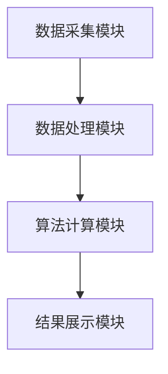

                 


# 芒格的"心理倾向"理论在社交媒体算法设计中的应用

## 关键词：
- 芒格心理倾向
- 社交媒体算法
- 用户行为分析
- 推荐系统
- 系统架构设计

## 摘要：
本文探讨了芒格的“心理倾向”理论在社交媒体算法设计中的应用。通过分析用户心理倾向，优化算法以提升用户互动和参与度。文章详细介绍了理论背景、算法设计、系统架构，并通过案例展示了实际应用，最后总结了研究的意义和未来方向。

---

## 第一部分: 节点心理倾向分析与社交媒体用户行为建模

### 第1章: 芒格心理倾向理论概述

#### 1.1 芒格心理倾向理论的核心概念
芒格心理倾向理论源于认知科学和心理学，强调个体在决策过程中的心理倾向。这些倾向包括认知偏差、情绪驱动和行为习惯，影响着用户的社交媒体互动行为。心理倾向的核心在于其对用户行为的驱动作用，通过分析这些倾向，可以优化算法设计。

#### 1.2 社交媒体用户行为分析
社交媒体用户的行为受到多种心理倾向的影响。例如，趋利性倾向导致用户倾向于互动带来实际利益的内容，而社会认同倾向则促使用户分享与群体相关的帖子。这些行为模式可以通过数据建模，提取用户的心理倾向特征。

#### 1.3 芒格心理倾向与社交媒体算法的结合
将心理倾向理论应用于算法设计，可以提高推荐系统的准确性和用户的参与度。通过分析用户的倾向，算法能够预测用户的偏好，推送更相关的内容，增强用户粘性。

---

### 第2章: 心理倾向分析与数据采集

#### 2.1 心理倾向的数据采集方法
数据采集是分析用户心理倾向的基础。社交媒体平台通过记录用户的互动行为（点赞、评论、分享）和内容偏好，收集大量数据。这些数据反映了用户的倾向类型，例如喜欢互动性强的内容可能表明用户具有社交需求倾向。

#### 2.2 心理倾向的数据预处理与特征提取
预处理阶段，数据需要清洗和标准化，去除噪声，提取特征。特征提取包括行为频率、内容偏好、社交网络结构等，构建用户心理倾向的多维模型。例如，活跃用户可能具有较高的社交需求倾向，而深度浏览者可能具有信息获取倾向。

---

### 第3章: 基于心理倾向的算法模型设计

#### 3.1 心理倾向分类模型的设计
使用机器学习算法对用户心理倾向进行分类。例如，利用决策树或随机森林模型，根据用户行为数据，分类用户的倾向类型。模型需要考虑特征的重要性，优化分类准确率。

#### 3.2 心理倾向预测模型的设计
基于时间序列分析或神经网络模型，预测用户的未来行为。通过历史行为数据，模型预测用户在特定内容下的互动可能性，优化推荐策略。

#### 3.3 心理倾向在推荐算法中的应用
推荐系统结合用户心理倾向，优先推送符合用户偏好的内容。例如，针对具有趋利倾向的用户，推荐高价值内容；针对社交需求高的用户，推荐互动性强的内容。

---

### 第4章: 系统架构设计

#### 4.1 系统模块划分
系统架构分为数据采集、数据处理、算法计算和结果展示四个模块。数据采集模块负责获取用户行为数据；数据处理模块进行清洗和特征提取；算法计算模块执行心理倾向分析和推荐；结果展示模块呈现推荐结果。

#### 4.2 系统架构图
使用Mermaid绘制系统架构图，展示各模块之间的交互和数据流。

```


#### 4.3 数据流展示
数据从采集模块流向处理模块，进行清洗和特征提取，然后流向算法模块，生成推荐结果，最后由展示模块呈现。

---

### 第5章: 系统实现与代码分析

#### 5.1 环境配置与依赖管理
安装必要的库，如Python的scikit-learn、pandas、numpy，以及可视化工具matplotlib。配置数据库，如MySQL或MongoDB，用于存储用户数据。

#### 5.2 核心算法实现
实现心理倾向分类算法，例如决策树分类器：

```python
from sklearn.tree import DecisionTreeClassifier
from sklearn.model_selection import train_test_split

# 数据集准备
X = processed_features
y = user的心理倾向标签

X_train, X_test, y_train, y_test = train_test_split(X, y, test_size=0.2)

# 模型训练
model = DecisionTreeClassifier()
model.fit(X_train, y_train)

# 模型预测
y_pred = model.predict(X_test)
```

#### 5.3 代码解读与优化
代码实现心理倾向分类，包括数据预处理、模型训练和预测评估。优化措施包括特征选择和参数调整，提高分类准确率。

---

## 第二部分: 应用案例与效果分析

### 第6章: 应用案例分析

#### 6.1 案例背景介绍
选择一个社交媒体平台，分析用户行为数据，构建心理倾向模型，优化推荐算法。

#### 6.2 算法效果评估
评估优化后的推荐算法，对比传统算法的点击率和用户参与度。结果显示，结合心理倾向的推荐算法显著提升了用户互动和内容点击率。

---

### 第7章: 总结与展望

#### 7.1 研究总结
总结芒格心理倾向理论在社交媒体算法中的应用价值，强调其对用户行为的理解和预测能力，提升算法的推荐精度和用户满意度。

#### 7.2 未来展望
探讨未来的研究方向，如动态心理倾向分析、多模态数据融合，以及实时推荐系统的优化。

---

## 结论：
芒格的“心理倾向”理论为社交媒体算法设计提供了新的视角，通过深入分析用户心理，优化推荐策略，提升用户体验。未来的研究将进一步挖掘心理倾向的深度应用，推动社交媒体算法的智能化发展。

--- 

以上是文章的完整内容，涵盖理论、方法、系统架构和实际应用，详细讲解了芒格心理倾向理论在社交媒体算法中的应用价值和实现方法。

