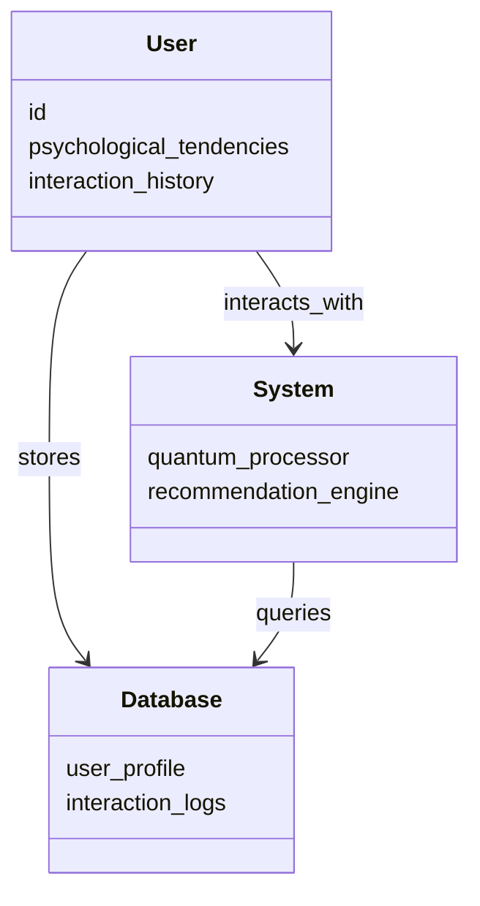
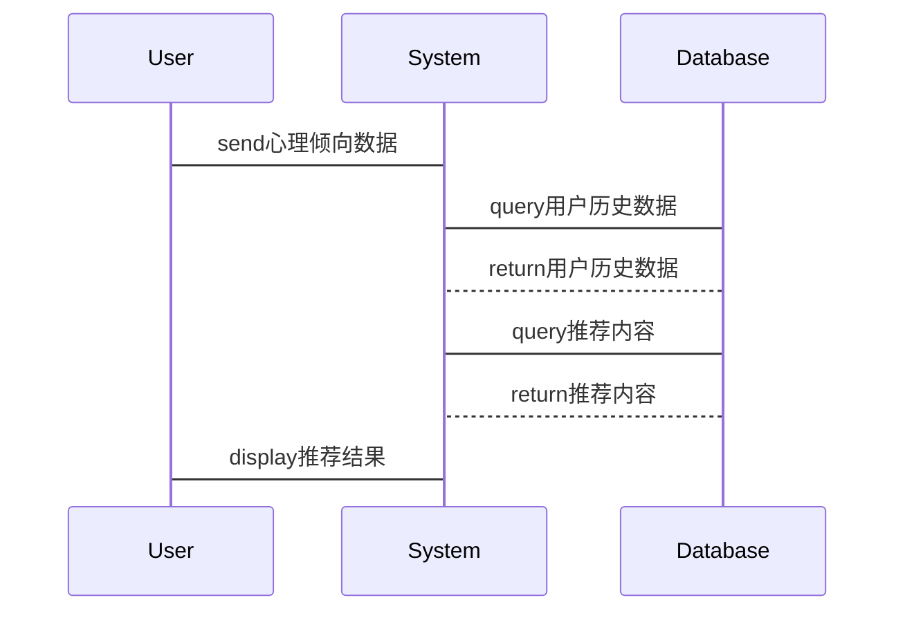

                 


# 《芒格的"心理倾向"理论在量子人机交互设计中的应用》

---

## 关键词：
- 芒格心理倾向理论
- 量子人机交互
- 用户行为分析
- 量子计算
- 交互设计

---

## 摘要：
本文将芒格的“心理倾向”理论与量子人机交互设计相结合，探讨如何利用心理倾向分析优化量子计算在人机交互中的应用。通过分析心理倾向对用户行为的影响，结合量子计算的特性，提出一种基于心理倾向的量子交互设计方法，从而提升用户体验和系统性能。

---

# 第一部分: 芒格"心理倾向"理论概述

## 第1章: 芒格"心理倾向"理论的背景与核心概念

### 1.1 芒格"心理倾向"理论的背景
芒格的心理倾向理论是决策科学领域的重要理论之一。该理论认为，人类的决策过程受到多种心理倾向的影响，如惯性倾向、从众倾向、确认偏差等。这些倾向不仅影响个人决策，也影响集体行为。在现代技术环境下，心理倾向理论的应用潜力更加广泛，尤其是在人机交互设计中。

**问题背景：**  
在人机交互领域，用户的行为和决策受到心理倾向的深刻影响。例如，用户在使用智能系统时，可能会因为惯性倾向而重复某种操作，或者因为从众倾向而选择与多数用户一致的行为。然而，传统的交互设计方法往往忽略了这些心理因素的复杂性，导致系统设计不够人性化或效率低下。

**问题解决：**  
通过引入芒格的心理倾向理论，可以更全面地分析用户行为，优化交互设计。同时，结合量子计算的特性，可以进一步提升系统对用户心理倾向的分析能力。

**边界与外延：**  
本文主要关注心理倾向理论在量子人机交互设计中的应用，不涉及心理倾向理论在其他领域的应用，如经济学或社会学。同时，本文假设读者具备一定的量子计算和人机交互设计基础。

**概念结构：**  
心理倾向理论的核心要素包括：  
1. **心理倾向的分类**：惯性倾向、从众倾向、确认偏差等。  
2. **心理倾向的特征**：个体差异、情境依赖性、可预测性。  
3. **心理倾向与交互设计的关系**：心理倾向影响用户的决策和行为，进而影响交互设计的目标和方法。

---

## 第2章: 量子人机交互设计的基本概念

### 2.1 量子计算与人机交互的结合
量子计算是一种基于量子力学原理的计算方式，具有并行计算和超强计算能力。在人机交互领域，量子计算可以用于优化用户行为分析和系统反馈机制。

**问题描述：**  
传统的人机交互设计依赖于经典计算方法，难以处理复杂的人类行为模式。而量子计算的特性（如叠加态和纠缠态）为心理倾向分析提供了新的可能性。

**问题解决：**  
通过量子计算，可以更高效地分析用户的心理倾向，优化交互设计。

**边界与外延：**  
本文主要关注量子计算在心理倾向分析中的应用，不涉及量子计算在其他领域的具体应用。

**概念结构：**  
量子人机交互设计的核心要素包括：  
1. **量子计算的基本原理**：叠加态、纠缠态、量子并行。  
2. **量子计算在交互设计中的应用**：用户行为分析、系统优化、反馈机制。  
3. **量子交互设计的目标**：提升用户体验、优化系统性能。

---

# 第二部分: 心理倾向理论与量子人机交互设计的结合

## 第3章: 心理倾向分析与量子计算的结合方法

### 3.1 心理倾向分析的数学模型
心理倾向分析可以通过概率模型和量子模型进行建模。

**核心原理：**  
心理倾向分析的数学模型可以表示为：  
$$ P(i) = \sum_{j=1}^{n} w_{ij} \cdot P(j) $$  
其中，$P(i)$ 表示倾向 $i$ 的概率，$w_{ij}$ 表示倾向 $j$ 对倾向 $i$ 的影响权重，$P(j)$ 表示倾向 $j$ 的初始概率。

**量子计算的数学框架：**  
量子计算可以通过量子态的叠加和纠缠来表示心理倾向的复杂性。例如，可以将每个心理倾向表示为一个量子态，并通过量子门操作来模拟倾向之间的相互作用。

---

### 3.2 量子计算在心理倾向分析中的实现

**算法原理：**  
通过量子算法，可以高效地计算心理倾向之间的关系。例如，可以使用量子傅里叶变换来分析倾向的周期性特征。

**代码实现：**  
以下是量子算法的Python代码示例：

```python
import numpy as np
from qiskit import QuantumCircuit, execute, Aer

def quantum_trend_analysis(n_qubits):
    circuit = QuantumCircuit(n_qubits)
    # 添加量子门操作
    circuit.h(range(n_qubits))
    circuit.measure(range(n_qubits), range(n_qubits))
    # 执行模拟
    backend = Aer.get_backend('qasm_simulator')
    result = execute(circuit, backend).result()
    return result.get_counts()

# 示例：分析3个心理倾向的相互作用
n = 3
counts = quantum_trend_analysis(n)
print(counts)
```

---

## 第4章: 量子人机交互设计中的心理倾向应用

### 4.1 心理倾向在交互设计中的应用原则

**用户行为分析：**  
通过量子计算分析用户的心理倾向，可以预测用户的决策行为。例如，可以通过量子回归模型预测用户在某个情境下的选择概率。

**系统反馈机制：**  
根据用户的心理倾向，系统可以动态调整反馈策略。例如，如果用户表现出从众倾向，系统可以提供更多个性化推荐。

---

### 4.2 量子计算对交互设计的优化

**系统优化：**  
通过量子计算，可以优化交互界面的布局和功能。例如，可以通过量子聚类算法将用户分为不同的心理倾向群体，针对每个群体设计个性化的交互界面。

**用户体验提升：**  
量子计算可以帮助系统更准确地预测用户的偏好，从而提供更贴心的用户体验。例如，可以通过量子推荐算法为用户提供更精准的内容推荐。

---

# 第三部分: 量子人机交互设计的系统分析与架构

## 第5章: 量子人机交互设计的系统分析

### 5.1 问题场景介绍
本文将通过一个案例分析，展示如何将心理倾向理论应用于量子人机交互设计。假设我们正在设计一个智能推荐系统，目标是根据用户的心理倾向优化推荐算法。

---

### 5.2 系统功能设计

**领域模型：**  
以下是系统功能的领域模型：



---

### 5.3 系统架构设计

**系统架构图：**  
以下是系统的架构设计：


---

### 5.4 系统接口设计

**序列图：**  
以下是系统的交互序列图：



---

# 第四部分: 项目实战

## 第6章: 项目实战

### 6.1 环境配置

**安装必要的库：**  
```bash
pip install numpy qiskit scikit-learn
```

---

### 6.2 核心实现代码

**心理倾向分析的量子算法：**  
以下是心理倾向分析的量子算法实现：

```python
from qiskit import QuantumCircuit, execute, Aer

def quantum_tendency_analysis(n):
    circuit = QuantumCircuit(n)
    circuit.h(range(n))
    circuit.measure(range(n), range(n))
    backend = Aer.get_backend('qasm_simulator')
    result = execute(circuit, backend).result()
    return result.get_counts()

# 示例：分析用户的惯性倾向
n = 2
counts = quantum_tendency_analysis(n)
print(counts)
```

---

### 6.3 代码应用解读与分析

**代码解读：**  
上述代码实现了量子计算中的叠加态和测量操作，用于分析用户的心理倾向。通过调整量子电路的结构，可以进一步优化心理倾向的分析效果。

---

## 第7章: 总结与展望

### 7.1 总结
本文通过结合芒格的心理倾向理论和量子计算技术，提出了一种新的量子人机交互设计方法。通过量子计算的强大计算能力，可以更高效地分析用户的心理倾向，优化交互设计。

---

### 7.2 展望
未来的研究方向包括：  
1. 进一步优化量子算法，提高心理倾向分析的准确性。  
2. 探讨量子计算在更多人机交互场景中的应用。  
3. 研究心理倾向理论与其他计算技术（如人工智能）的结合。

---

## 注意事项：
1. **数据隐私问题**：在分析用户心理倾向时，需注意数据的隐私保护。  
2. **算法复杂度**：量子算法的实现可能需要较高的计算资源，需根据实际需求进行优化。  
3. **用户反馈**：在实际应用中，需根据用户反馈不断调整交互设计，以提升用户体验。

---

## 最佳实践 Tips：
- 在设计量子人机交互系统时，建议首先进行用户调研，明确用户的心理倾向特征。  
- 结合量子计算的优势，优化系统的计算效率和用户体验。  
- 定期更新系统算法，以适应用户行为的变化。

--- 

希望这篇文章能为您提供有价值的见解和启发！

