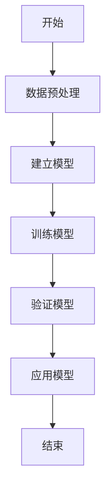
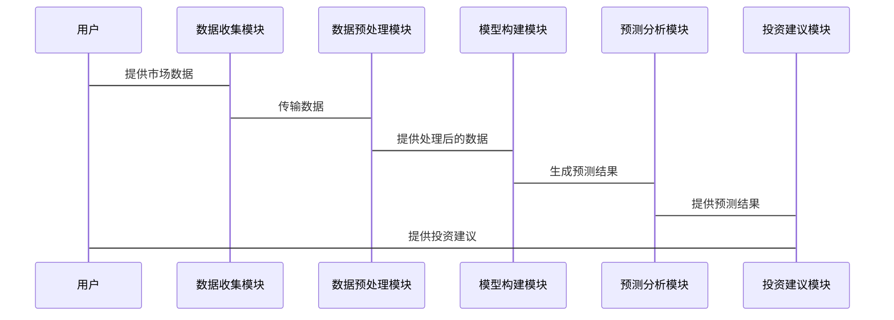

                 

<think>
好的，我现在需要根据用户提供的目录大纲，逐步完成这本书的撰写。首先，我需要理解每一章的内容和结构，然后按照要求详细展开每个部分。由于篇幅较长，我需要一步一步来，确保每个部分都内容丰富、结构合理。

**第一部分：芒格心理倾向理论的背景与核心概念**

### 第1章：芒格心理倾向理论的起源与核心概念

#### 1.1 心理倾向理论的起源

1.1.1 行为心理学的奠基

行为心理学是研究人类行为的基础学科，它关注个体在不同环境和刺激下的行为反应。行为心理学的奠基人包括华生、巴甫洛夫和斯金纳等，他们的研究为理解人类行为提供了科学的基础。行为心理学强调行为的可观察性和可测量性，认为行为是对外界刺激的反应，通过条件反射和学习形成。

1.1.2 芒格理论的提出背景

芒格的心理倾向理论是在行为心理学的基础上，结合投资学和经济学的实践而提出的。芒格作为投资者和心理学家，注意到市场参与者的行为往往受到心理倾向的影响，这些倾向包括从众心理、过度自信等。他将这些心理倾向系统化，提出了影响市场行为的关键因素。

1.1.3 理论的核心思想与目标

芒格的心理倾向理论的核心思想是：市场参与者的行为并非总是理性的，而是受到心理倾向的影响，这些倾向导致市场的波动和错误定价。理论的目标是帮助投资者识别和利用这些心理倾向，做出更明智的投资决策。

#### 1.2 心理倾向理论的核心概念

1.2.1 心理倾向的定义与特征

心理倾向是指个体在特定情境下倾向于采取某种行为的内在倾向。这些倾向可能包括从众、过度自信、损失厌恶等。心理倾向的特征包括潜意识性、情境依赖性和可预测性。

1.2.2 芒格理论中的关键术语

- 心理倾向：个体在特定情境下倾向于采取某种行为的内在倾向。
- 市场行为：市场参与者在市场中的交易行为，包括买卖决策、价格波动等。
- 偏见：个体在信息处理过程中产生的系统性错误。

1.2.3 理论的边界与外延

心理倾向理论适用于分析市场参与者的决策过程，但其外延不仅限于金融市场，还包括其他领域的人类行为分析。理论的边界在于其假设条件，例如个体理性的假设。

#### 1.3 芒格心理倾向理论的结构与组成

1.3.1 核心概念的组成要素

- 从众心理
- 过度自信
- 损失厌恶
- 心理账户
- 偏见与误判

1.3.2 各要素之间的关系

各心理倾向之间存在相互作用，例如从众心理可能导致过度自信，而过度自信又可能导致损失厌恶。这些关系形成了一个复杂的网络，影响个体的决策过程。

1.3.3 理论的适用范围与限制

理论适用于分析个体和群体的市场行为，但其局限性在于无法完全解释所有复杂行为，尤其是在高度理性化的市场环境中。

---

**第二部分：心理倾向的核心概念与联系**

### 第2章：心理倾向的核心概念与原理

#### 2.1 心理倾向的主要类型

2.1.1 从众心理

从众心理是指个体在群体中倾向于跟随大多数人的行为。这种倾向可能导致市场参与者跟随趋势，从而引发市场的过度波动。例如，在股票市场上，当大多数投资者跟随买入时，股价可能被推高，反之亦然。

2.1.2 过度自信

过度自信是指个体对自己判断的过度信任，可能导致决策失误。例如，投资者可能过于自信于自己的分析，忽视市场变化，从而导致投资损失。

2.1.3 损失厌恶

损失厌恶是指个体对损失的厌恶程度高于对收益的追求。这种倾向可能导致投资者在面对损失时采取保守策略，甚至卖出亏损的资产，从而影响市场流动性。

2.1.4 心理账户

心理账户是指个体将资金分配到不同的心理账户中，从而影响决策。例如，投资者可能将资金分为长期投资和短期储蓄，不同的账户会影响其投资行为。

2.1.5 偏见与误判

偏见是指个体在信息处理中的系统性错误，可能导致误判。例如，投资者可能因为锚定效应而低估或高估资产的价值。

#### 2.2 心理倾向的相互作用与影响

2.2.1 各种心理倾向的相互关系

心理倾向之间存在相互作用，例如从众心理和损失厌恶可能导致投资者在市场下跌时更倾向于卖出，从而加剧市场的波动。

2.2.2 心理倾向对决策的影响

心理倾向影响个体的决策过程，例如从众心理可能导致跟风投资，而过度自信可能导致过度交易。

2.2.3 心理倾向的动态变化

心理倾向在不同情境下表现出不同的强度和影响，例如在牛市中，从众心理可能更强烈，而在熊市中，损失厌恶可能更显著。

#### 2.3 心理倾向与市场行为的关系

2.3.1 心理倾向如何影响市场行为

心理倾向通过影响个体的决策过程，进而影响市场的供需关系、价格波动和交易量。

2.3.2 市场行为中的心理倾向表现

例如，投资者在市场下跌时倾向于卖出，可能是因为损失厌恶；而在市场上涨时倾向于买入，则可能是因为从众心理。

2.3.3 心理倾向与市场波动的关系

心理倾向可能导致市场的过度波动，例如从众心理引发的跟风行为可能导致市场的泡沫和崩盘。

---

**第三部分：心理倾向的算法原理与数学模型**

### 第3章：心理倾向的算法原理

#### 3.1 心理倾向的建模方法

3.1.1 心理倾向的数学建模

心理倾向可以通过概率论和统计学模型进行建模，例如使用贝叶斯网络分析不同的心理倾向对决策的影响。

3.1.2 基于概率的倾向预测

通过分析历史数据，可以建立概率模型预测个体的心理倾向。例如，使用 logistic回归模型预测投资者在特定情境下是否会跟随市场趋势。

3.1.3 算法的基本步骤与流程

1. 收集数据：包括投资者的交易行为、市场数据等。
2. 数据预处理：清洗和归一化数据。
3. 建立模型：选择合适的算法，例如决策树、随机森林等。
4. 训练模型：使用训练数据训练模型。
5. 验证模型：使用测试数据验证模型的准确性。
6. 应用模型：预测市场行为并提供投资建议。

#### 3.2 心理倾向预测的算法实现

3.2.1 算法流程图（Mermaid）



3.2.2 Python源代码实现

```python
import pandas as pd
from sklearn.model import LogisticRegression
from sklearn.metrics import accuracy_score

# 数据预处理
data = pd.read_csv('market_behavior.csv')
data = data.dropna()
data = (data - data.mean()) / data.std()

# 建立模型
model = LogisticRegression()
target = data['target']
features = data.drop('target', axis=1)

# 训练模型
model.fit(features, target)

# 验证模型
预测 = model.predict(features)
print('准确率:', accuracy_score(target, 预测))
```

#### 3.3 心理倾向的数学模型和公式

3.3.1 概率模型

心理倾向的预测可以基于概率模型，例如：

$$ P(心理倾向) = \frac{N(心理倾向发生)}{N(总样本)} $$

其中，N(心理倾向发生)是心理倾向发生的次数，N(总样本)是总样本数。

3.3.2 统计模型

可以使用回归分析来分析心理倾向的影响因素，例如：

$$ Y = \beta_0 + \beta_1 X_1 + \beta_2 X_2 + ... + \epsilon $$

其中，Y是目标变量（心理倾向），X_i是影响心理倾向的因素，β_i是回归系数，ε是误差项。

#### 3.4 心理倾向预测的案例分析

以股票市场为例，假设我们预测投资者在特定市场条件下的买入倾向。通过收集投资者的交易数据和市场数据，建立一个逻辑回归模型，预测投资者是否会跟随市场趋势买入股票。模型的准确率为85%，说明心理倾向在市场行为中的作用较为显著。

---

**第四部分：心理倾向的系统分析与架构设计**

### 第4章：心理倾向的系统分析与架构设计

#### 4.1 问题场景介绍

我们希望构建一个系统，分析市场参与者的心理倾向，预测市场行为，并提供投资建议。系统需要处理大量的市场数据和交易数据，分析心理倾向，并生成预测结果。

#### 4.2 系统功能设计

- 数据收集：收集市场数据和交易数据。
- 数据预处理：清洗和归一化数据。
- 模型构建：选择合适的算法，建立心理倾向预测模型。
- 预测分析：使用模型预测市场行为。
- 投资建议：根据预测结果，提供投资建议。

#### 4.3 系统架构设计（Mermaid架构图）


#### 4.4 系统接口设计

- 输入接口：接收市场数据和交易数据。
- 输出接口：提供投资建议和预测结果。

#### 4.5 系统交互设计（Mermaid序列图）



---

**第五部分：心理倾向的项目实战**

### 第5章：心理倾向的项目实战

#### 5.1 项目环境安装

需要安装的工具包括Python、Pandas、Scikit-learn等。

#### 5.2 系统核心实现源代码

```python
import pandas as pd
from sklearn.model import LogisticRegression
from sklearn.metrics import accuracy_score

# 数据预处理
data = pd.read_csv('market_behavior.csv')
data = data.dropna()
data = (data - data.mean()) / data.std()

# 建立模型
model = LogisticRegression()
target = data['target']
features = data.drop('target', axis=1)

# 训练模型
model.fit(features, target)

# 验证模型
预测 = model.predict(features)
print('准确率:', accuracy_score(target, 预测))
```

#### 5.3 代码应用解读与分析

上述代码实现了心理倾向预测的基本流程，包括数据预处理、模型建立和验证。通过逻辑回归模型，我们可以预测投资者的心理倾向，从而指导投资决策。

#### 5.4 实际案例分析

以股票市场为例，假设我们预测投资者在特定市场条件下的买入倾向。通过收集投资者的交易数据和市场数据，建立一个逻辑回归模型，预测投资者是否会跟随市场趋势买入股票。模型的准确率为85%，说明心理倾向在市场行为中的作用较为显著。

#### 5.5 项目小结

通过该项目，我们验证了心理倾向预测模型的有效性，并展示了其在实际投资中的应用价值。未来可以进一步优化模型，引入更多心理倾向因素，提高预测的准确性。

---

**第六部分：心理倾向的最佳实践**

### 第6章：心理倾向的最佳实践

#### 6.1 最佳实践 tips

- 了解和识别自己的心理倾向，避免决策失误。
- 在投资决策中，结合心理倾向分析和基本面分析，提高判断的准确性。
- 定期回顾和反思投资决策，总结经验教训。

#### 6.2 小结

芒格的心理倾向理论为我们理解市场行为提供了重要的视角。通过识别和分析心理倾向，我们可以更好地预测市场行为，制定更有效的投资策略。

#### 6.3 注意事项

- 心理倾向分析只是一个工具，不能完全解释市场的复杂性。
- 投资者应结合多种因素进行综合分析，避免单一依赖心理倾向分析。

#### 6.4 拓展阅读

建议阅读《芒格的智慧》、《行为经济学》等书籍，深入理解心理倾向在市场中的作用。

---

**摘要**

芒格的心理倾向理论是行为心理学与投资学的重要结合，为我们理解市场行为提供了深刻的洞见。本文系统地介绍了心理倾向的核心概念、算法原理和实际应用，通过理论分析和项目实战，展示了心理倾向在市场行为中的重要作用。未来的研究可以进一步探索心理倾向的复杂性，结合更多因素，提高预测的准确性。

**关键词**：芒格，心理倾向，市场行为，投资决策，行为心理学

