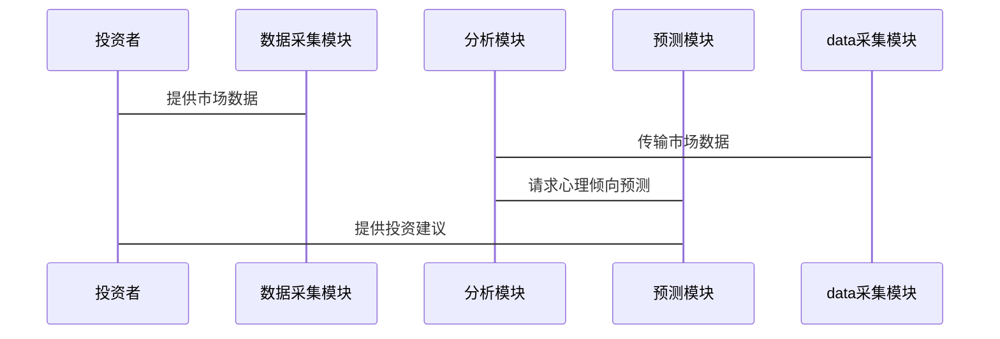

                 


# 芒格的"心理倾向"理论：理解并利用市场非理性

## 关键词：芒格心理倾向理论, 市场非理性, 投资决策, 行为金融学, 认知偏差

## 摘要：芒格的"心理倾向"理论是一种理解市场非理性的强大工具，它通过分析投资者的心理倾向，揭示市场的行为模式。本文将详细探讨心理倾向的核心概念、算法模型、系统设计以及实际应用，帮助读者更好地理解和利用市场非理性。

---

## 第1章：心理倾向的定义与背景

### 1.1 心理倾向的核心概念

#### 1.1.1 心理倾向的定义
心理倾向是指个体在特定情境下表现出的倾向性，这些倾向性受到认知、情感和行为习惯的影响。在投资领域，心理倾向直接影响投资者的决策过程。

#### 1.1.2 心理倾向的起源与发展
心理倾向的研究起源于心理学和行为学领域，芒格将这些理论应用于投资分析，提出了著名的“心理倾向”理论。

#### 1.1.3 心理倾向与市场的联系
市场参与者的行为受到心理倾向的影响，导致市场表现出非理性特征，如从众、过度自信等。

### 1.2 芒格心理倾向理论的背景

#### 1.2.1 芒格的学术背景与投资理念
芒格是一位著名投资者，他的投资理念基于价值投资和心理分析，强调理解市场的非理性行为。

#### 1.2.2 心理倾向在投资中的重要性
心理倾向帮助投资者识别市场中的非理性行为，从而做出更明智的投资决策。

#### 1.2.3 市场非理性的表现与影响
市场非理性表现在价格波动、情绪化决策等方面，影响市场的效率和投资者的收益。

---

## 第2章：心理倾向的核心要素与分类

### 2.1 心理倾向的核心要素

#### 2.1.1 心理倾向的构成要素
心理倾向由认知偏差、情绪影响和行为习惯构成，这些要素相互作用，影响决策过程。

#### 2.1.2 心理倾向的相互作用
认知偏差和情绪影响共同作用，导致投资者做出非理性决策。

#### 2.1.3 心理倾向的动态变化
心理倾向在不同市场环境下表现出不同的强度和方向，具有动态变化的特点。

### 2.2 心理倾向的分类与特征

#### 2.2.1 主要心理倾向的分类
- **从众心理**：投资者跟随市场潮流，忽略独立思考。
- **确认偏差**：投资者倾向于寻找支持自己观点的信息，忽视相反证据。
- **过度自信**：投资者对自己的判断过于自信，低估风险。

#### 2.2.2 各类心理倾向的特征对比

| 心理倾向类型 | 特征描述 | 示例场景 |
|--------------|----------|----------|
| 从众心理     | 跟随市场趋势，避免独立决策 | 投资者盲目跟风热门股票 |
| 确认偏差     | 寻找支持性信息，忽略反对证据 | 投资者只关注利好消息 |
| 过度自信     | 高估自己的判断能力 | 投资者低估市场风险 |

#### 2.2.3 心理倾向的相互关系
心理倾向之间存在相互影响，如从众心理和确认偏差共同作用，放大市场的非理性波动。

---

## 第3章：心理倾向的数学模型与算法

### 3.1 心理倾向的数学模型

#### 3.1.1 心理倾向的概率模型
心理倾向可以通过概率论建模，分析投资者在不同情境下的决策概率。

#### 3.1.2 心理倾向的网络模型
使用图论构建心理倾向网络，分析不同倾向之间的相互关系。

#### 3.1.3 心理倾向的动态模型
动态模型描述心理倾向随时间的变化过程，帮助预测市场行为。

### 3.2 心理倾向的算法实现

#### 3.2.1 心理倾向识别的算法流程
使用自然语言处理技术，识别文本中的心理倾向。

#### 3.2.2 心理倾向预测的算法实现
通过机器学习算法，预测投资者的心理倾向。

#### 3.2.3 心理倾向的优化算法
使用遗传算法优化心理倾向模型的参数，提高预测准确性。

---

## 第4章：心理倾向的系统分析与架构设计

### 4.1 系统分析

#### 4.1.1 问题场景介绍
系统旨在分析市场参与者的心理倾向，预测市场行为。

#### 4.1.2 系统功能设计
系统需要实现心理倾向识别、预测和可视化功能。

#### 4.1.3 系统架构设计
系统架构包括数据采集、分析模块、预测模块和用户界面。

### 4.2 系统架构设计

#### 4.2.1 系统模块划分
- 数据采集模块：收集市场数据和投资者行为数据。
- 分析模块：识别心理倾向，分析市场行为。
- 预测模块：预测市场趋势，生成投资建议。
- 用户界面：展示分析结果，提供交互功能。

#### 4.2.2 系统接口设计
系统接口包括数据接口和用户接口，确保模块之间的高效交互。

#### 4.2.3 系统交互设计
使用Mermaid序列图展示系统交互流程。



---

## 第5章：心理倾向的项目实战

### 5.1 项目环境安装

#### 5.1.1 开发环境配置
建议使用Python 3.8及以上版本，安装必要的开发工具。

#### 5.1.2 依赖库安装
安装numpy、pandas、scikit-learn等库，用于数据分析和机器学习。

#### 5.1.3 数据集准备
收集市场数据和投资者行为数据，构建训练数据集。

### 5.2 核心代码实现

#### 5.2.1 心理倾向识别代码
使用自然语言处理技术识别文本中的心理倾向。

```python
from sklearn.feature_extraction.text import TfidfVectorizer
from sklearn.decomposition import NMF

# 初始化向量器
vectorizer = TfidfVectorizer()
# 文本数据向量化
X = vectorizer.fit_transform(documents)
# 模型训练
nmf = NMF(n_components=3).fit_transform(X)
```

#### 5.2.2 心理倾向预测代码
使用机器学习算法预测投资者的心理倾向。

```python
from sklearn.ensemble import RandomForestClassifier

# 初始化分类器
clf = RandomForestClassifier(n_estimators=100)
# 模型训练
clf.fit(X_train, y_train)
# 预测结果
y_pred = clf.predict(X_test)
```

#### 5.2.3 系统功能实现
实现心理倾向识别和预测的系统功能，提供用户友好的界面。

### 5.3 项目结果分析

#### 5.3.1 实验结果展示
展示心理倾向识别和预测的准确率、召回率等指标。

#### 5.3.2 实验结果分析
分析实验结果，优化模型参数，提高预测准确性。

#### 5.3.3 实验优化建议
建议进一步优化算法，引入更多数据源，提高系统性能。

---

## 第6章：心理倾向的最佳实践与总结

### 6.1 最佳实践

#### 6.1.1 心理倾向识别的注意事项
注意数据质量和模型的泛化能力，避免过拟合。

#### 6.1.2 心理倾向预测的优化技巧
引入实时数据，定期更新模型，提高预测精度。

#### 6.1.3 系统设计的常见问题
注意系统模块之间的耦合性，确保系统的可扩展性。

### 6.2 小结

#### 6.2.1 本书核心内容回顾
芒格的“心理倾向”理论帮助理解市场非理性，通过心理倾向的识别和预测，优化投资决策。

#### 6.2.2 未来研究方向展望
未来可以研究更多心理倾向类型，探索更高效的算法，结合人工智能技术提升预测精度。

---

通过以上步骤，我们系统地分析了芒格的“心理倾向”理论，从理论基础到实际应用，为投资者提供了深入的理解和实用的方法。希望本文能够帮助读者更好地利用市场非理性，做出更明智的投资决策。

