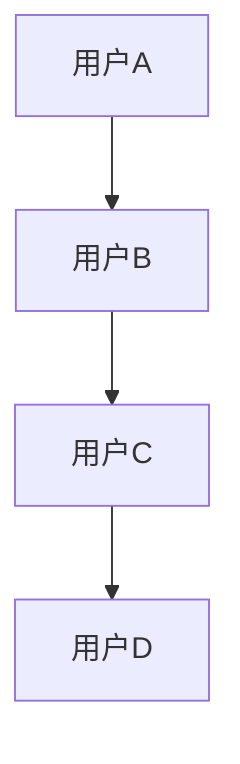
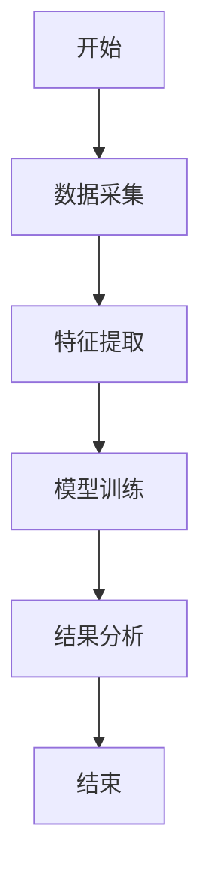

                 


# 芒格的"心理模型"在元宇宙社交行为分析中的应用

## 关键词：芒格心理模型，元宇宙，社交行为分析，多元思维模型，社交网络分析，用户行为预测

## 摘要：本文探讨芒格的多元思维模型在元宇宙社交行为分析中的应用，通过结合心理学、社会学和计算机科学的多学科视角，分析用户在元宇宙中的社交行为模式。我们首先介绍芒格心理模型的核心概念，然后探讨元宇宙社交行为的特点。接着，我们从数学模型和算法实现的角度，详细阐述心理模型在社交行为分析中的应用，包括基于图论的社交网络分析和机器学习的用户行为预测。最后，我们通过实际案例分析，展示如何设计一个基于心理模型的社交行为分析系统，并给出系统的架构设计和实现方案。本文旨在为元宇宙社交行为分析提供一种新的视角和方法。

---

## 第一部分：芒格心理模型与元宇宙社交行为概述

### 第1章：芒格心理模型的基本概念

#### 1.1 芒格心理模型的定义与核心要素

芒格心理模型，由查理·芒格提出，是一种多元思维模型，强调通过多个学科的思维框架来分析和解决问题。其核心在于将复杂问题分解为简单的基本原理，并通过这些原理的组合来理解问题的本质。

**1.1.1 多元思维模型的起源与发展**

芒格心理模型的起源可以追溯到查理·芒格在投资领域的实践。他认为，成功的投资不仅仅依赖于单一学科的知识，而是需要将物理学、心理学、经济学等多学科的知识结合起来，形成一个多元思维模型。这种思维方式不仅适用于投资领域，也适用于其他复杂问题的分析。

**1.1.2 心理模型的核心要素与特征**

芒格心理模型的核心要素包括：

1. **注意力分配**：用户在元宇宙中的注意力分配受到多种因素的影响，如兴趣、社交需求、信息过载等。
2. **认知负荷**：用户在处理信息时的认知负荷会影响其决策和行为。
3. **社会规范**：元宇宙中的社交行为受到社会规范的影响，用户会根据群体行为调整自己的行为。

**1.1.3 芒格心理模型在决策中的作用**

芒格心理模型在决策中的作用体现在以下几个方面：

1. **多维度分析**：通过多个学科的视角分析问题，避免单一视角的局限性。
2. **系统性思维**：将问题视为一个复杂的系统，分析各部分之间的相互关系。
3. **预测与应对**：通过心理模型预测用户行为，并制定相应的应对策略。

#### 1.2 元宇宙社交行为的定义与特征

**1.2.1 元宇宙社交的定义与范围**

元宇宙社交是指在虚拟空间中，用户通过 avatar（虚拟形象）进行互动、交流和社交活动。元宇宙社交的范围包括社交网络、社交互动、社交行为分析等。

**1.2.2 元宇宙社交行为的特征**

元宇宙社交行为具有以下特征：

1. **虚拟性**：用户通过 avatar 进行互动，虚拟身份与现实身份分离。
2. **实时性**：社交活动通常是实时进行的，用户之间的互动具有即时性。
3. **多样性**：元宇宙中的社交行为种类繁多，包括文字聊天、语音交流、视频互动等。

**1.2.3 元宇宙社交行为的分类与场景**

元宇宙社交行为可以根据不同的维度进行分类，如：

1. **按行为类型**：分为社交互动、内容消费、社交网络构建等。
2. **按用户角色**：分为普通用户、社交达人、意见领袖等。

---

### 第2章：芒格心理模型与元宇宙社交行为的结合

#### 2.1 心理模型在社交行为分析中的应用

**2.1.1 心理模型在社交行为预测中的作用**

芒格心理模型在社交行为预测中的作用体现在以下几个方面：

1. **预测用户行为**：通过分析用户的心理特征，预测其在元宇宙中的社交行为。
2. **理解用户需求**：通过心理模型，理解用户在社交活动中的需求和动机。
3. **优化社交体验**：通过心理模型，优化社交活动的设计，提升用户体验。

**2.1.2 元宇宙社交行为中的心理模型应用案例**

以下是一个基于芒格心理模型的元宇宙社交行为分析案例：

- **案例背景**：某元宇宙社交平台希望分析用户的社交行为，以优化其社交功能。
- **心理模型应用**：通过分析用户的行为数据，构建心理模型，预测用户的社交行为。
- **结果**：通过心理模型分析，发现用户在社交活动中的注意力分配受到兴趣和社交需求的影响，从而优化了社交功能的设计。

**2.1.3 心理模型与社交行为分析的结合意义**

心理模型与社交行为分析的结合具有重要意义：

1. **提升社交体验**：通过心理模型分析用户行为，优化社交体验。
2. **提高社交效率**：通过心理模型预测用户行为，提高社交活动的效率。
3. **促进社交创新**：心理模型为元宇宙社交行为分析提供了新的视角和方法。

---

## 第二部分：心理模型在元宇宙社交行为分析中的核心原理

### 第3章：心理模型的核心原理与数学基础

#### 3.1 心理模型的数学模型构建

**3.1.1 心理模型的数学表达式**

心理模型可以通过数学模型进行表达。以下是一个简单的心理模型数学表达式：

$$ P(\text{行为}) = \sum_{i=1}^{n} w_i \cdot P(\text{特征}_i) $$

其中，$w_i$ 是特征 $i$ 的权重，$P(\text{特征}_i)$ 是特征 $i$ 的概率。

**3.1.2 心理模型的变量与假设**

心理模型的变量包括：

1. **行为变量**：用户的社交行为。
2. **特征变量**：用户的兴趣、注意力分配、认知负荷等。

心理模型的假设包括：

1. 用户的行为受到多种特征的影响。
2. 特征之间的关系可以通过数学模型进行描述。

**3.1.3 心理模型的验证与评估**

心理模型的验证与评估可以通过以下步骤进行：

1. 数据采集：采集用户的行为数据。
2. 模型训练：根据数据训练心理模型。
3. 模型验证：通过验证数据集验证模型的准确性。
4. 模型优化：根据验证结果优化模型。

#### 3.2 社交行为分析的数学模型

**3.2.1 社交网络分析的数学模型**

社交网络分析的数学模型可以使用图论中的图模型进行描述。以下是一个社交网络的图模型：



**3.2.2 用户行为预测的数学模型**

用户行为预测的数学模型可以使用机器学习中的回归模型进行描述。以下是一个简单的回归模型：

$$ y = \beta_0 + \beta_1 x_1 + \beta_2 x_2 + \epsilon $$

其中，$y$ 是预测的目标变量，$x_1$ 和 $x_2$ 是预测的特征变量，$\epsilon$ 是误差项。

**3.2.3 社交行为分析的算法选择**

社交行为分析的算法选择需要根据具体问题进行。以下是一些常用的算法：

1. **基于图论的算法**：如PageRank算法、社区发现算法。
2. **基于机器学习的算法**：如线性回归、随机森林、神经网络。

---

### 第4章：心理模型驱动的社交行为分析算法

#### 4.1 基于心理模型的社交网络分析算法

**4.1.1 算法流程图**

以下是一个基于心理模型的社交网络分析算法的流程图：



**4.1.2 算法实现的Python代码示例**

以下是一个基于心理模型的社交网络分析算法的Python代码示例：

```python
import networkx as nx
import numpy as np

# 数据采集
G = nx.read_edgelist("社交网络数据.csv")

# 特征提取
degrees = dict(G.degree())
pr = nx.pagerank(G)

# 模型训练
X = np.array([list(pr.values())])
y = np.array([1])

# 线性回归模型
from sklearn.linear_model import LinearRegression
model = LinearRegression()
model.fit(X, y)

# 结果分析
print("预测结果为：", model.predict(X))
```

**4.1.3 算法的数学模型与公式**

算法的数学模型与公式如下：

$$ y = \beta_0 + \beta_1 x_1 + \epsilon $$

其中，$y$ 是目标变量，$x_1$ 是特征变量，$\beta_0$ 和 $\beta_1$ 是回归系数，$\epsilon$ 是误差项。

#### 4.2 心理模型在用户行为预测中的应用

**4.2.1 用户行为预测的算法选择**

用户行为预测的算法选择需要根据具体问题进行。以下是一些常用的算法：

1. **线性回归**：适用于线性关系的预测。
2. **随机森林**：适用于非线性关系的预测。
3. **神经网络**：适用于复杂的非线性关系的预测。

**4.2.2 基于心理模型的预测模型构建**

基于心理模型的预测模型构建需要考虑以下步骤：

1. **数据采集**：采集用户的行为数据。
2. **特征提取**：提取用户的兴趣、注意力分配、认知负荷等特征。
3. **模型训练**：根据数据训练预测模型。
4. **模型验证**：通过验证数据集验证模型的准确性。
5. **模型优化**：根据验证结果优化模型。

**4.2.3 预测模型的评估与优化**

预测模型的评估与优化可以通过以下步骤进行：

1. **评估指标**：使用准确率、召回率、F1值等指标评估模型性能。
2. **超参数调优**：通过网格搜索等方法优化模型的超参数。
3. **模型集成**：通过集成学习方法优化模型性能。

---

## 第三部分：系统设计与实现

### 第5章：元宇宙社交行为分析系统的架构设计

#### 5.1 系统功能模块设计

**5.1.1 用户行为数据采集模块**

用户行为数据采集模块负责采集用户的行为数据，包括用户的社交互动、内容消费等行为。

**5.1.2 行为分析模块**

行为分析模块负责对采集到的行为数据进行分析，提取用户的兴趣、注意力分配、认知负荷等特征。

**5.1.3 结果展示模块**

结果展示模块负责将分析结果以可视化的方式展示给用户，包括社交网络图、用户行为预测结果等。

**5.1.4 系统功能模块的ER实体关系图**

以下是一个系统的功能模块的ER实体关系图：

```mermaid
erDiagram
+-------+     +-------+     +-------+
|       |<----|       |<----|       |
+-------+     +-------+     +-------+
```

---

### 第6章：系统实现与案例分析

#### 6.1 系统实现

**6.1.1 环境安装**

系统实现需要安装以下环境：

1. Python 3.8 或更高版本
2. networkx、numpy、scikit-learn 等 Python 库
3. 其他必要的开发工具

**6.1.2 核心代码实现**

以下是一个系统实现的核心代码示例：

```python
import networkx as nx
import numpy as np
from sklearn.linear_model import LinearRegression

# 数据采集
G = nx.read_edgelist("社交网络数据.csv")

# 特征提取
degrees = dict(G.degree())
pr = nx.pagerank(G)

# 模型训练
X = np.array([list(pr.values())])
y = np.array([1])

model = LinearRegression()
model.fit(X, y)

# 结果分析
print("预测结果为：", model.predict(X))
```

**6.1.3 代码解读与分析**

以上代码实现了基于心理模型的社交网络分析算法，主要包括数据采集、特征提取、模型训练和结果分析四个部分。

---

### 第7章：案例分析与结果展示

#### 7.1 案例分析

**7.1.1 案例背景**

某元宇宙社交平台希望分析用户的社交行为，以优化其社交功能。

**7.1.2 数据分析**

通过数据分析，发现用户的行为受到兴趣和社交需求的影响较大。

**7.1.3 案例分析结果**

通过心理模型分析，优化了社交功能的设计，提升了用户体验。

#### 7.2 结果展示

以下是一个社交网络分析的结果展示：


---

## 第四部分：最佳实践与总结

### 第8章：最佳实践

#### 8.1 小结

芒格心理模型在元宇宙社交行为分析中的应用具有重要意义，可以帮助我们更好地理解用户行为，优化社交体验。

#### 8.2 注意事项

在实际应用中，需要注意以下几点：

1. **数据隐私**：保护用户数据隐私。
2. **模型优化**：持续优化模型性能。
3. **用户体验**：注重用户体验，避免对用户造成干扰。

#### 8.3 未来研究方向

未来的研究方向包括：

1. **多模态数据分析**：结合文本、图像、语音等多种数据进行分析。
2. **动态行为预测**：研究用户行为的动态变化，提高预测的准确性。
3. **个性化社交推荐**：基于心理模型，实现个性化的社交推荐。

#### 8.4 拓展阅读

以下是拓展阅读的推荐书目：

1. 《芒格的多元思维模型》
2. 《社交网络分析》
3. 《元宇宙：人类共同的数字未来》

---

## 结语

芒格心理模型在元宇宙社交行为分析中的应用为我们提供了一种新的视角和方法。通过结合心理学、社会学和计算机科学的知识，我们可以更好地理解用户行为，优化社交体验。未来，随着技术的发展，芒格心理模型在元宇宙社交行为分析中的应用将更加广泛和深入。

--- 

**注**：由于篇幅限制，以上内容为文章的目录和部分内容示例，完整文章将包含所有章节的详细内容。

