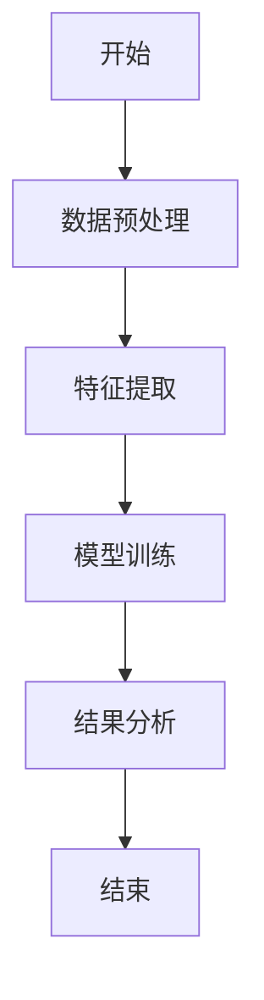
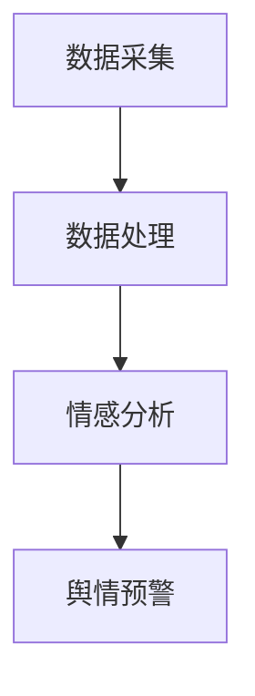
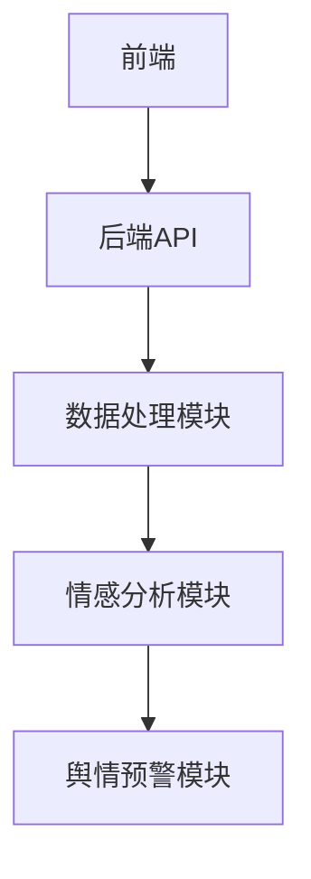

                 


# 《芒格的"心理模型"在社交媒体舆情分析中的应用》

> 关键词：芒格心理模型，社交媒体舆情分析，情感分析，用户行为预测，舆情预警，数据分析

> 摘要：芒格的“心理模型”作为一种强大的决策思维工具，在社交媒体舆情分析中具有重要的应用价值。本文从芒格心理模型的起源、核心概念出发，结合社交媒体舆情分析的背景与现状，深入探讨芒格心理模型在情感分析、用户行为预测、舆情预警等领域的具体应用。通过详细讲解算法原理、系统架构设计以及项目实战，本文为读者提供了一套完整的芒格心理模型在社交媒体舆情分析中的落地方案。

---

# 第一部分：芒格心理模型与社交媒体舆情分析的背景

## 第1章：芒格心理模型的起源与核心理念

### 1.1 芒格心理模型的定义与特点
#### 1.1.1 芒格心理模型的起源
芒格心理模型由查理·芒格提出，是一种基于心理学、经济学和决策科学的思维方式。它强调通过理解人类思维的内在规律，帮助人们做出更明智的决策。

#### 1.1.2 芒格心理模型的核心理念
- **逆向思维**：从反方向思考问题，避免陷入常规思维的陷阱。
- **第一性原理**：从最基本的原理出发，逐步构建解决方案。
- **决策树分析**：通过树状结构分析决策的可能结果和概率。

#### 1.1.3 芒格心理模型在决策中的应用
芒格心理模型广泛应用于投资、管理等领域，其核心在于通过心理模型的构建，帮助人们更好地理解和预测人类行为。

---

### 1.2 社会媒体舆情分析的背景与现状

#### 1.2.1 社会媒体舆情分析的定义
社交媒体舆情分析是指通过对社交媒体上的海量数据进行收集、处理和分析，了解公众对特定事件、品牌或产品的看法和情绪。

#### 1.2.2 当前社交媒体舆情分析的主要方法
- **情感分析**：通过自然语言处理技术判断文本的情感倾向。
- **主题建模**：识别文本中的主题和关键词。
- **用户行为分析**：通过用户互动数据预测用户的潜在行为。

#### 1.2.3 芒格心理模型在社交媒体舆情分析中的价值
芒格心理模型可以帮助我们更好地理解社交媒体数据背后的人类行为和情绪，从而提高舆情分析的准确性和深度。

---

## 第2章：芒格心理模型与社交媒体舆情分析的结合

### 2.1 芒格心理模型在社交媒体舆情分析中的应用背景

#### 2.1.1 社会媒体数据的特点
- **非结构化**：社交媒体数据包括文本、图片、视频等多种形式。
- **实时性**：社交媒体数据生成速度快，需要实时处理。
- **多样性**：数据来源广泛，包括用户、评论、点赞等。

#### 2.1.2 芒格心理模型在社交媒体数据中的适用性
- 芒格心理模型可以帮助我们理解用户在社交媒体上的行为动机。
- 通过心理模型分析，可以预测用户的情感倾向和行为趋势。

#### 2.1.3 芒格心理模型与社交媒体舆情分析的结合意义
将芒格心理模型应用于社交媒体舆情分析，可以提高舆情分析的深度和预测的准确性。

---

### 2.2 芒格心理模型在社交媒体舆情分析中的具体应用

#### 2.2.1 芒格心理模型在情感分析中的应用
- **情感分类**：通过心理模型分析用户评论的情感倾向。
- **情感强度分析**：量化用户情感的强度。

#### 2.2.2 芒格心理模型在用户行为预测中的应用
- **用户行为建模**：通过心理模型预测用户的后续行为。
- **用户分群**：根据心理模型将用户分为不同的群体。

#### 2.2.3 芒格心理模型在舆情预警中的应用
- **舆情监测**：实时监测社交媒体上的负面情绪。
- **舆情预测**：通过心理模型预测舆情的发展趋势。

---

# 第二部分：芒格心理模型与社交媒体舆情分析的核心概念

## 第3章：芒格心理模型的核心概念与原理

### 3.1 芒格心理模型的核心概念

#### 3.1.1 心理模型的构成要素
- **认知偏差**：人类在决策过程中常见的认知错误。
- **决策框架**：构建决策的逻辑框架。
- **行为动机**：驱动人类行为的根本原因。

#### 3.1.2 心理模型的分类与特征
- **认知型心理模型**：基于认知偏差的分析。
- **行为型心理模型**：基于行为动机的分析。
- **混合型心理模型**：结合认知和行为的综合分析。

#### 3.1.3 心理模型的动态演化
- 心理模型的动态变化与社交媒体环境的互动。

---

### 3.2 芒格心理模型与社交媒体数据的关系

#### 3.2.1 社会媒体数据的结构化与非结构化特点
- 结构化数据：如用户ID、时间戳。
- 非结构化数据：如文本评论、图片。

#### 3.2.2 芒格心理模型在社交媒体数据中的映射
- 通过心理模型分析用户评论的情感和意图。

#### 3.2.3 芒格心理模型与社交媒体数据的交互作用
- 数据驱动心理模型的构建与优化。

---

## 第4章：芒格心理模型在社交媒体舆情分析中的算法实现

### 4.1 芒格心理模型的算法原理

#### 4.1.1 算法流程图


#### 4.1.2 算法步骤
1. 数据预处理：清洗和标注数据。
2. 特征提取：提取文本特征，如关键词、情感倾向。
3. 模型训练：基于心理模型构建分类器。
4. 结果分析：解读模型输出，优化算法。

---

### 4.2 算法实现的Python代码示例

#### 4.2.1 数据预处理
```python
import pandas as pd
import numpy as np

# 加载数据
data = pd.read_csv('social_media_data.csv')

# 数据清洗
data.dropna(inplace=True)
```

#### 4.2.2 特征提取
```python
from sklearn.feature_extraction.text import TfidfVectorizer

vectorizer = TfidfVectorizer()
X = vectorizer.fit_transform(data['text'])
```

#### 4.2.3 模型训练
```python
from sklearn.svm import SVC

model = SVC()
model.fit(X, data['label'])
```

#### 4.2.4 模型评估
```python
from sklearn.metrics import accuracy_score

y_pred = model.predict(X)
print(accuracy_score(data['label'], y_pred))
```

---

## 第5章：基于芒格心理模型的社交媒体舆情分析系统架构设计

### 5.1 系统功能设计

#### 5.1.1 功能模块
- 数据采集模块：爬取社交媒体数据。
- 数据处理模块：清洗和标注数据。
- 情感分析模块：基于心理模型分析情感倾向。
- 舆情预警模块：实时监测负面情绪。

#### 5.1.2 功能流程图


---

### 5.2 系统架构设计

#### 5.2.1 系统架构图


---

## 第6章：项目实战与优化

### 6.1 项目实战

#### 6.1.1 环境安装
```bash
pip install numpy pandas scikit-learn
```

#### 6.1.2 核心代码实现
```python
import pandas as pd
from sklearn.svm import SVC
from sklearn.feature_extraction.text import TfidfVectorizer

# 加载数据
data = pd.read_csv('social_media_data.csv')

# 特征提取
vectorizer = TfidfVectorizer()
X = vectorizer.fit_transform(data['text'])

# 模型训练
model = SVC()
model.fit(X, data['label'])

# 模型预测
y_pred = model.predict(X)
print(accuracy_score(data['label'], y_pred))
```

---

### 6.2 项目优化与总结

#### 6.2.1 优化建议
- 数据预处理阶段可以引入更多特征。
- 模型训练阶段可以尝试不同的算法优化效果。

#### 6.2.2 项目总结
通过芒格心理模型结合社交媒体舆情分析，可以有效提升情感分析和舆情预警的准确性，为实际应用提供有力支持。

---

## 第7章：注意事项与未来展望

### 7.1 注意事项

#### 7.1.1 数据隐私问题
在处理社交媒体数据时，需要注意用户隐私保护。

#### 7.1.2 算法优化方向
未来可以尝试引入深度学习模型提高分析精度。

#### 7.1.3 系统扩展性
系统设计时需要考虑数据量的扩展性和算法的可扩展性。

---

### 7.2 未来展望

#### 7.2.1 心理模型的进一步研究
深入研究心理模型在复杂场景中的应用。

#### 7.2.2 技术的融合与创新
探索心理模型与其他数据分析技术的结合，如图神经网络。

#### 7.2.3 应用场景的扩展
将心理模型应用于更多领域，如社交媒体营销、用户画像构建等。

---

## 第8章：最佳实践与小结

### 8.1 最佳实践

#### 8.1.1 数据处理
确保数据的高质量，避免噪声干扰。

#### 8.1.2 模型选择
根据具体场景选择合适的算法，避免盲目使用复杂模型。

#### 8.1.3 结果解读
注重结果的可解释性，避免片面追求模型准确率。

---

### 8.2 小结

通过本文的探讨，我们可以看到芒格心理模型在社交媒体舆情分析中的巨大潜力。结合心理模型的思维方式和现代数据分析技术，我们可以更深入地理解社交媒体数据背后的规律，为实际应用提供更有力的支持。

---

## 第9章：拓展阅读与参考资料

### 9.1 拓展阅读

#### 9.1.1 心理学相关书籍
- 《Thinking, Fast and Slow》
- 《The Art of Cognitive Behavioral Therapy》

#### 9.1.2 数据分析相关书籍
- 《Python机器学习实战》
- 《数据挖掘导论》

### 9.2 参考资料
- 查理·芒格的演讲和著作
- 社会媒体分析相关论文
- 机器学习与自然语言处理技术资料

