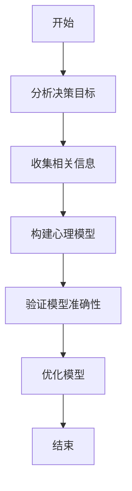
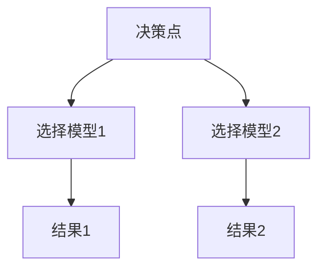
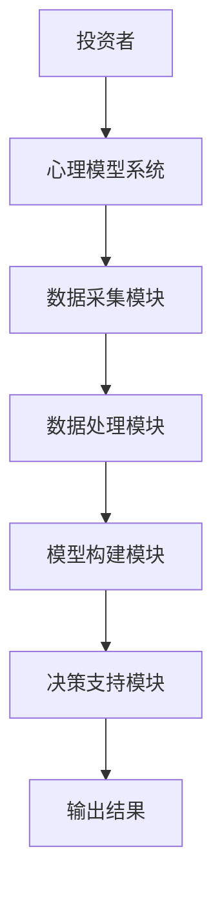

                 


# 芮格的"心理模型"：提高投资决策的质量和效率

> 关键词：芒格，心理模型，投资决策，决策质量，决策效率

> 摘要：芒格的"心理模型"是一种通过构建多学科知识框架来优化投资决策的方法。本文从心理模型的核心概念、算法原理、数学模型、系统架构设计、项目实战等多个维度进行详细阐述，帮助读者全面理解和应用这一方法，从而提高投资决策的质量和效率。

---

## 第一部分: 芮格的"心理模型"概述

### 第1章: 心理模型的核心概念与背景

#### 1.1 心理模型的定义与背景
- **1.1.1 什么是心理模型**
心理模型是指个体对某一事物或系统的内在认知和理解，是人们在大脑中构建的“知识框架”。芒格认为，心理模型是理解世界的基础，通过不断积累和优化这些模型，可以做出更明智的决策。

- **1.1.2 芮格与心理模型的关联**
芒格是“心理模型”的倡导者，他强调通过学习多学科的基本原理，构建一个强大的心理模型框架，从而在投资决策中避免常见错误。

- **1.1.3 心理模型在投资中的应用价值**
心理模型帮助投资者更好地理解市场、企业和经济的运作规律，从而做出更准确的投资决策。

#### 1.2 芮格的"心理模型"体系
- **1.2.1 芮格的"心理模型"框架**
芒格的“心理模型”框架强调跨学科知识的重要性，包括经济学、心理学、数学等领域的基本原理。

- **1.2.2 心理模型的核心要素**
- 知识框架：多学科的基本原理
- 决策规则：基于模型的判断和选择
- 认知偏差：识别和避免认知陷阱

- **1.2.3 心理模型的分类与特点**
- 分类：
  - 确定性模型：基于事实和数据的模型
  - 概率模型：基于概率和可能性的模型
  - 行为模型：基于人类行为的模型
- 特点：
  - 简洁性：模型应简洁明了
  - 可解释性：模型应易于理解和解释
  - 实用性：模型应能实际应用于投资决策

---

### 第2章: 心理模型的核心概念与联系

#### 2.1 心理模型的原理与机制
- **2.1.1 心理模型的形成过程**
- 数据收集：通过观察和学习积累知识
- 模型构建：将知识转化为基本的心理模型
- 模型优化：通过实践和反馈不断优化模型

- **2.1.2 心理模型的特征分析**
- 表格对比：
| 特征 | 确定性模型 | 概率模型 | 行为模型 |
|------|------------|----------|----------|
| 适用场景 | 确定性问题 | 不确定性问题 | 人类行为相关问题 |
| 输出结果 | 确定的结论 | 概率分布 | 行为预测 |
| 优点 | 结果明确 | 考虑多种可能性 | 解释人类行为 |
| 缺点 | 忽略不确定性 | 计算复杂 | 难以量化 |

- **2.1.3 心理模型的优缺点对比**
- 优点：
  - 提高决策效率
  - 减少认知偏差
  - 增强决策的准确性
- 缺点：
  - 过度依赖模型可能导致僵化
  - 模型的复杂性可能增加决策难度

#### 2.2 心理模型的ER实体关系图
```mermaid
er
    entity 心理模型 {
        id
        名称
        核心要素
        应用场景
    }
    entity 投资决策 {
        id
        决策目标
        决策依据
        决策结果
    }
    entity 核心要素 {
        id
        名称
        属性
        关系
    }
```

---

### 第3章: 心理模型的算法原理讲解

#### 3.1 心理模型的算法流程


#### 3.2 心理模型的数学模型
- **3.2.1 概率论在心理模型中的应用**
$$P(A|B) = \frac{P(B|A)P(A)}{P(B)}$$

- **3.2.2 心理模型的决策树分析**


---

### 第4章: 心理模型的系统分析与架构设计

#### 4.1 系统分析
- **4.1.1 投资决策场景分析**
- 投资者需要在不确定的市场环境中做出决策
- 需要考虑多种因素，如市场趋势、企业基本面等

- **4.1.2 系统功能需求**
- 数据采集：收集市场数据、企业信息等
- 模型构建：构建心理模型框架
- 决策支持：提供基于模型的决策建议

- **4.1.3 系统非功能需求**
- 可扩展性：支持多种模型的构建和优化
- 高可用性：确保系统在高负载下的稳定性

#### 4.2 系统架构设计


---

### 第5章: 心理模型的项目实战

#### 5.1 环境安装与配置
```bash
pip install mermaid
npm install mermaid
```

#### 5.2 核心代码实现
```python
def build心理模型(data):
    # 数据预处理
    processed_data = preprocess(data)
    # 模型构建
    model = construct_model(processed_data)
    # 模型验证
    validated_model = validate_model(model, processed_data)
    return validated_model
```

#### 5.3 案例分析与解读
- 案例：某公司投资决策
- 分析：通过心理模型分析公司的财务状况、市场地位等
- 结论：基于模型做出投资决策

---

## 第六部分: 总结与展望

### 6.1 最佳实践 tips
- 定期优化心理模型
- 多学科知识的学习与应用
- 理解并避免认知偏差

### 6.2 小结
芒格的“心理模型”是一种强大的工具，通过构建多学科的知识框架，投资者可以做出更明智的投资决策。

### 6.3 注意事项
- 模型的复杂性可能会影响决策效率
- 需要不断学习和优化模型

### 6.4 拓展阅读
- 《芒格的“心理模型”：投资决策的科学与艺术》
- 《概率论与投资决策》

---

通过以上内容，读者可以全面理解芒格的“心理模型”及其在投资决策中的应用，从而提高决策的质量和效率。

