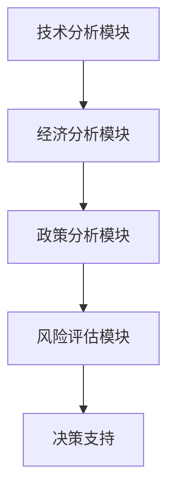
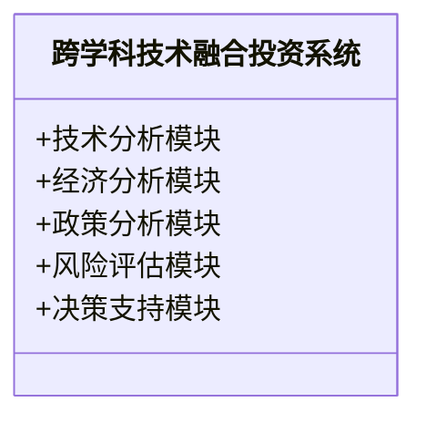
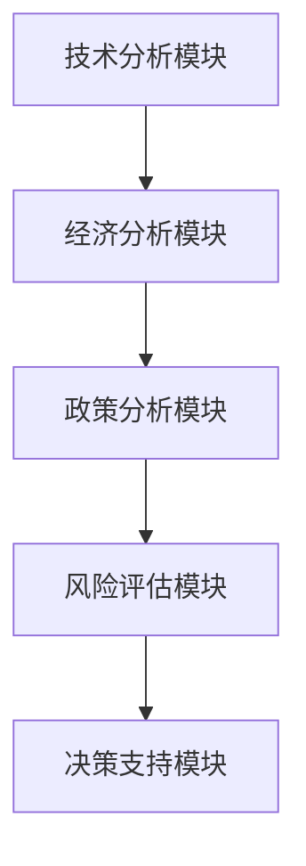
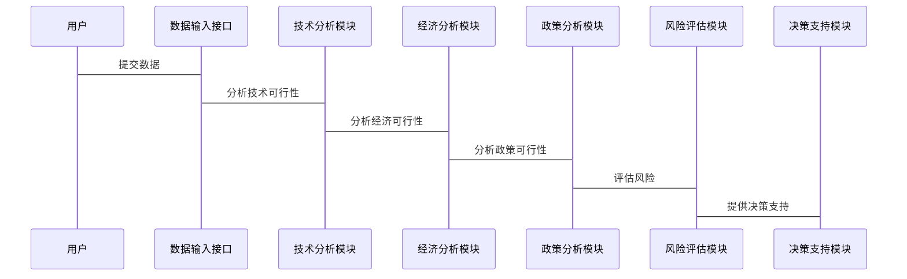

                 


# 芒格的"思维复杂性"在跨学科技术融合投资中的重要性

## 关键词：芒格思维复杂性，跨学科技术融合，投资，系统架构，算法

## 摘要：  
芒格的"思维复杂性"是指在多个学科领域之间建立联系并进行综合分析的能力，这种能力在跨学科技术融合投资中具有重要意义。本文从芒格思维复杂性的核心概念出发，结合跨学科技术融合投资的背景与现状，详细分析了其在投资决策中的应用。通过构建数学模型和算法实现，展示了如何利用芒格的思维复杂性来优化投资组合和降低风险。文章还结合实际案例，探讨了系统架构设计和项目实现的具体步骤，为读者提供了一种全新的投资思路。

---

# 第一部分: 芒格的"思维复杂性"与跨学科技术融合投资概述

## 第1章: 芒格思维复杂性与跨学科技术融合投资的背景

### 1.1 芒格思维复杂性的定义与核心要素

#### 1.1.1 芒格思维复杂性的定义  
芒格的思维复杂性是指在多个学科领域之间建立联系并进行综合分析的能力，它强调从多个维度（如心理学、经济学、物理学等）出发，理解问题的本质。这种思维方式的核心在于“多元思维模型”，即通过多个学科的视角来分析问题，从而避免单一视角的局限性。

#### 1.1.2 芒格思维复杂性的核心要素  
1. **多维度分析**：从多个学科角度（如经济学、心理学、物理学等）分析问题。
2. **动态适应性**：能够根据环境变化调整思维方式。
3. **系统性思考**：将问题视为一个整体系统，分析各部分之间的关系。

#### 1.1.3 芒格思维复杂性与跨学科技术融合投资的关系  
跨学科技术融合投资需要综合考虑多个领域的知识，而芒格的思维复杂性正是这种能力的体现。它能够帮助投资者在技术融合的过程中，更好地识别机会和风险。

### 1.2 跨学科技术融合投资的背景与现状

#### 1.2.1 跨学科技术融合的定义  
跨学科技术融合是指将不同学科的技术和方法结合起来，形成新的技术和应用。例如，人工智能与生物学的结合催生了生物医学工程。

#### 1.2.2 跨学科技术融合投资的现状  
随着技术的快速发展，跨学科技术融合在投资领域变得越来越重要。投资者需要能够从多个角度分析技术融合的潜力和风险，而芒格的思维复杂性为此提供了理论基础。

#### 1.2.3 芒格思维复杂性在其中的作用  
芒格的思维复杂性能够帮助投资者在跨学科技术融合中，更好地识别潜在的机会和风险。例如，在人工智能与医疗技术的结合中，芒格的思维复杂性可以帮助投资者从经济学、生物学和计算机科学等多个角度进行分析。

---

## 第2章: 芒格思维复杂性与跨学科技术融合投资的核心概念

### 2.1 芒格思维复杂性的核心模型

#### 2.1.1 芒格思维模型的层次结构  
芒格的思维模型可以分为三个层次：  
1. **基础层**：基本的逻辑和数学原理。  
2. **中间层**：经济学、心理学等学科的基本理论。  
3. **顶层**：综合多个学科的思维方式。

#### 2.1.2 芒格思维模型的动态性与适应性  
芒格的思维模型具有动态性，能够根据环境的变化进行调整。例如，在投资决策中，可以根据市场变化调整思维方式。

#### 2.1.3 芒格思维模型的多维度分析  
芒格的思维模型强调从多个维度分析问题，例如在投资决策中，可以从技术、经济、政策等多个角度进行分析。

### 2.2 跨学科技术融合投资的系统架构

#### 2.2.1 跨学科技术融合投资的系统组成  
1. **技术分析模块**：分析技术的可行性。  
2. **经济分析模块**：分析经济的可行性。  
3. **政策分析模块**：分析政策的可行性。  
4. **风险评估模块**：评估投资的风险。

#### 2.2.2 跨学科技术融合投资的系统功能  
1. **数据采集**：采集跨学科技术融合的相关数据。  
2. **数据分析**：对数据进行分析，评估技术融合的潜力。  
3. **决策支持**：基于分析结果，提供投资决策支持。

#### 2.2.3 跨学科技术融合投资的系统架构图  


---

## 第3章: 芒格思维复杂性与跨学科技术融合投资的数学模型

### 3.1 芒格思维复杂性的数学建模

#### 3.1.1 芒格思维复杂性的层次分析法（AHP）

层次分析法是一种常用的决策分析方法，可以用于评估芒格思维复杂性。其步骤如下：

1. **构建层次结构**：将问题分解为多个层次，例如目标层、准则层和方案层。  
2. **构造判断矩阵**：根据专家意见，构造判断矩阵。  
3. **计算权重**：计算各层次的权重，确定各因素的重要性。

#### 3.1.2 芒格思维复杂性的动态系统模型  
动态系统模型可以用于描述芒格思维复杂性的动态性。其数学表达式如下：

$$
x_{t+1} = f(x_t, u_t)
$$

其中，\(x_t\) 表示当前状态，\(u_t\) 表示控制输入，\(f\) 是系统模型。

#### 3.1.3 芒格思维复杂性的网络图模型  
网络图模型可以用于描述芒格思维模型的结构。例如，可以将不同学科的知识点作为节点，连接起来形成网络。

### 3.2 跨学科技术融合投资的数学模型

#### 3.2.1 跨学科技术融合投资的数学框架  
跨学科技术融合投资的数学框架可以表示为：

$$
\text{收益} = \sum_{i=1}^{n} w_i \cdot x_i
$$

其中，\(w_i\) 是第 \(i\) 个因素的权重，\(x_i\) 是第 \(i\) 个因素的值。

#### 3.2.2 跨学科技术融合投资的优化模型  
优化模型可以用于选择最优的投资组合。其目标函数为：

$$
\max \sum_{i=1}^{n} r_i \cdot x_i
$$

约束条件为：

$$
\sum_{i=1}^{n} x_i = 1
$$

其中，\(r_i\) 是第 \(i\) 个投资的预期收益，\(x_i\) 是第 \(i\) 个投资的权重。

#### 3.2.3 跨学科技术融合投资的网络流模型  
网络流模型可以用于描述投资的资金流动。例如，可以将不同的投资项目作为节点，资金流动作为边。

---

## 第4章: 芒格思维复杂性与跨学科技术融合投资的算法实现

### 4.1 芒格思维复杂性评估算法

#### 4.1.1 算法原理  
层次分析法（AHP）可以用于评估芒格思维复杂性。其步骤如下：

1. **构建层次结构**：将问题分解为多个层次。  
2. **构造判断矩阵**：根据专家意见，构造判断矩阵。  
3. **计算权重**：计算各层次的权重，确定各因素的重要性。

#### 4.1.2 算法步骤  
1. **数据预处理**：收集相关数据。  
2. **构建判断矩阵**：根据专家意见，构造判断矩阵。  
3. **计算权重**：计算各层次的权重，确定各因素的重要性。

#### 4.1.3 算法实现（Python代码示例）

```python
import numpy as np

def calculate_weights(matrix):
    # 计算特征向量
    eigenvectors = np.linalg.eig(matrix)
    # 计算特征值
    eigenvalues = eigenvectors[0]
    # 计算权重
    weights = eigenvalues / np.sum(eigenvalues)
    return weights

# 示例矩阵
matrix = np.array([[1, 2, 3],
                   [1/2, 1, 2],
                   [1/3, 1/2, 1]])

weights = calculate_weights(matrix)
print("权重为：", weights)
```

### 4.2 跨学科技术融合投资的算法实现

#### 4.2.1 投资组合优化算法  
投资组合优化算法可以用于选择最优的投资组合。其目标函数为：

$$
\max \sum_{i=1}^{n} r_i \cdot x_i
$$

约束条件为：

$$
\sum_{i=1}^{n} x_i = 1
$$

其中，\(r_i\) 是第 \(i\) 个投资的预期收益，\(x_i\) 是第 \(i\) 个投资的权重。

#### 4.2.2 风险评估算法  
风险评估算法可以用于评估投资的风险。其步骤如下：

1. **数据预处理**：收集相关数据。  
2. **构建风险模型**：基于数据，构建风险模型。  
3. **评估风险**：根据模型，评估投资的风险。

#### 4.2.3 投资决策树算法  
投资决策树算法可以用于制定投资决策。其步骤如下：

1. **数据预处理**：收集相关数据。  
2. **构建决策树**：基于数据，构建决策树。  
3. **决策支持**：根据决策树，制定投资决策。

---

## 第5章: 芒格思维复杂性与跨学科技术融合投资的系统分析与架构设计

### 5.1 系统分析

#### 5.1.1 问题场景介绍  
跨学科技术融合投资需要综合考虑多个因素，例如技术可行性、经济可行性、政策可行性等。

#### 5.1.2 系统功能设计  
系统功能设计包括技术分析、经济分析、政策分析和风险评估。

#### 5.1.3 领域模型（Mermaid类图）  


### 5.2 系统架构设计

#### 5.2.1 系统架构图（Mermaid架构图）  


#### 5.2.2 系统接口设计  
系统接口设计包括数据输入接口、数据输出接口和用户界面接口。

#### 5.2.3 系统交互设计（Mermaid序列图）  


---

## 第6章: 芒格思维复杂性与跨学科技术融合投资的项目实战

### 6.1 环境安装

#### 6.1.1 安装Python环境  
需要安装Python 3.8及以上版本。

#### 6.1.2 安装相关库  
需要安装NumPy、Pandas、Matplotlib等库。

### 6.2 核心代码实现

#### 6.2.1 技术分析模块的实现  
```python
import numpy as np
import pandas as pd

def analyze_technology(data):
    # 技术分析逻辑
    return data
```

#### 6.2.2 经济分析模块的实现  
```python
import numpy as np
import pandas as pd

def analyze_economy(data):
    # 经济分析逻辑
    return data
```

#### 6.2.3 政策分析模块的实现  
```python
import numpy as np
import pandas as pd

def analyze_policy(data):
    # 政策分析逻辑
    return data
```

#### 6.2.4 风险评估模块的实现  
```python
import numpy as np
import pandas as pd

def assess_risk(data):
    # 风险评估逻辑
    return data
```

#### 6.2.5 决策支持模块的实现  
```python
import numpy as np
import pandas as pd

def make_decision(data):
    # 决策支持逻辑
    return data
```

### 6.3 案例分析与结果解读

#### 6.3.1 案例分析  
以人工智能与医疗技术的结合为例，分析其在投资中的应用。

#### 6.3.2 结果解读  
根据分析结果，提供投资决策支持。

### 6.4 项目小结

---

## 第7章: 总结与展望

### 7.1 总结  
芒格的思维复杂性在跨学科技术融合投资中具有重要意义。通过构建数学模型和算法实现，可以帮助投资者更好地识别机会和风险。

### 7.2 展望  
未来的研究可以进一步探索芒格思维复杂性在其他领域的应用，例如企业管理和政策制定。

---

## 第8章: 最佳实践与注意事项

### 8.1 最佳实践

#### 8.1.1 知识储备  
投资者需要具备多学科的知识储备。

#### 8.1.2 数据分析能力  
投资者需要具备较强的数据分析能力。

#### 8.1.3 实践经验  
投资者需要积累丰富的实践经验。

### 8.2 小结  
芒格的思维复杂性是一种重要的思维方式，能够帮助投资者在跨学科技术融合中取得成功。

### 8.3 注意事项  
1. **风险评估**：投资有风险，需谨慎评估。  
2. **数据质量**：数据质量直接影响分析结果。  
3. **模型选择**：选择合适的模型是关键。

### 8.4 拓展阅读  
推荐阅读芒格的《穷查理宝典》和相关跨学科技术融合的书籍。

---

# 结语  
芒格的思维复杂性在跨学科技术融合投资中的应用，不仅是一种思维方式，更是一种成功的投资策略。通过本文的分析，读者可以更好地理解其重要性，并将其应用于实际投资中。

