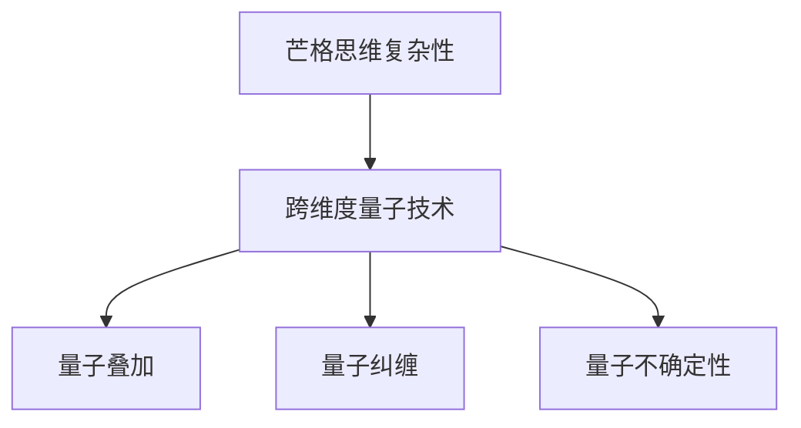
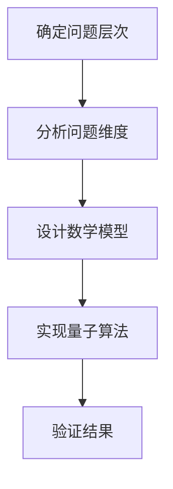
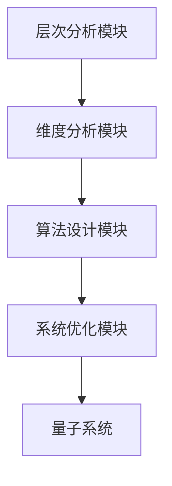
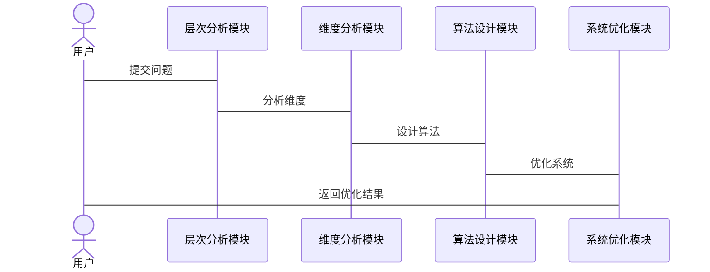

                 


# 芒格的"思维复杂性"在跨维度量子技术融合中的重要性

## 关键词：芒格思维复杂性、跨维度量子技术、思维融合、量子算法、系统架构设计

## 摘要：  
芒格的"思维复杂性"是一种多层次、多维度的思考方式，强调在复杂系统中进行决策时的全面性和深度。跨维度量子技术则是一种新兴的技术领域，涉及在不同维度上应用量子原理来解决复杂问题。本文探讨了芒格思维复杂性在跨维度量子技术中的重要性，分析了两者融合的原理、算法实现及系统架构设计。通过具体案例和实际应用，展示了如何将芒格的思维复杂性应用于量子技术的优化与创新。

---

## 第一部分：背景介绍

### 第1章：芒格的思维复杂性概述

#### 1.1 芒格思维复杂性的定义
- 1.1.1 芒格思维复杂性的基本概念  
芒格思维复杂性是指在决策过程中，考虑多个变量、层次和维度的能力。它强调在复杂系统中，通过多层次分析来做出更优的决策。  
- 1.1.2 芒格思维复杂性的特点  
  - **多层次性**：考虑问题的多个层次，从微观到宏观。  
  - **多维度性**：从多个维度分析问题，包括时间、空间、因果关系等。  
  - **非线性性**：问题之间的关系往往是非线性的，需要动态调整思考方式。  
- 1.1.3 芒格思维复杂性与其他思维模式的对比  
  - **线性思维**：仅考虑单一维度或线性关系。  
  - **系统思维**：考虑系统的整体性，但缺乏多层次分析。  
  - **芒格思维复杂性**：结合系统性、多层次性和多维度性，强调动态调整和全局优化。  

#### 1.2 跨维度量子技术的基本概念
- 1.2.1 量子技术的定义  
量子技术是指利用量子力学原理（如量子叠加、量子纠缠等）来实现信息处理、计算和通信的技术。  
- 1.2.2 跨维度量子技术的特性  
  - **多维度性**：在时间和空间等多个维度上进行量子操作。  
  - **非线性性**：量子系统的行为具有非线性特征，难以用传统方法描述。  
  - **复杂性**：跨维度量子技术涉及多个维度的相互作用，系统复杂性显著增加。  
- 1.2.3 跨维度量子技术的应用领域  
  - **量子计算**：通过多维度量子操作提高计算效率。  
  - **量子通信**：利用多维度量子纠缠实现更安全的通信。  
  - **量子传感**：在多维度空间中进行高精度感知。  

#### 1.3 芒格思维复杂性与跨维度量子技术的融合
- 1.3.1 融合的背景与意义  
随着量子技术的快速发展，跨维度量子技术的复杂性日益增加。芒格思维复杂性提供了一种全新的思考方式，能够帮助我们在复杂系统中找到优化路径。  
- 1.3.2 融合的必要性与可能性  
  - **必要性**：跨维度量子技术的复杂性要求我们采用更高级的思维方式。  
  - **可能性**：芒格思维复杂性提供了一种多层次、多维度的思考框架，与量子技术的特性高度契合。  
- 1.3.3 融合的现状与发展趋势  
目前，芒格思维复杂性在量子技术中的应用还处于探索阶段，但其潜力巨大。未来，随着量子技术的进一步发展，芒格思维复杂性将在跨维度量子技术中发挥越来越重要的作用。

---

## 第二部分：核心概念与联系

### 第2章：芒格思维复杂性与量子技术的关系

#### 2.1 芒格思维复杂性的属性特征
- 2.1.1 系统性  
芒格思维复杂性强调从系统整体出发，分析问题的各个部分及其相互关系。  
- 2.1.2 多层次性  
芒格思维复杂性要求我们从微观到宏观，从具体到抽象等多个层次分析问题。  
- 2.1.3 非线性性  
芒格思维复杂性关注问题之间的非线性关系，强调动态调整和全局优化。  

#### 2.2 跨维度量子技术的属性特征
- 2.2.1 量子叠加  
量子系统中的粒子可以同时处于多个状态，这是量子叠加的核心思想。  
- 2.2.2 量子纠缠  
量子纠缠是指两个或多个粒子之间的特殊关联，无论距离多远，都能瞬间影响彼此的状态。  
- 2.2.3 量子不确定性  
量子系统的状态具有不确定性，无法用确定性的语言描述。  

#### 2.3 芒格思维复杂性与量子技术的属性对比
- 2.3.1 对比表格  
| 特性         | 芒格思维复杂性        | 跨维度量子技术         |
|--------------|----------------------|-----------------------|
| 多层次性     | 是                   | 是                   |
| 非线性性     | 是                   | 是                   |
| 系统性       | 是                   | 是                   |
| 确定性       | 否                   | 否                   |

- 2.3.2 ER实体关系图  
```mermaid
er
    actor 芒格思维复杂性
    actor 跨维度量子技术
    relationship "相互作用" -->
```
- 2.3.3 Mermaid流程图  


---

### 第3章：芒格思维复杂性与跨维度量子技术的融合原理

#### 3.1 芒格思维复杂性的系统性与量子系统的复杂性
- 3.1.1 系统性分析  
芒格思维复杂性强调从系统整体出发，分析问题的各个部分及其相互关系。  
- 3.1.2 复杂性分析  
跨维度量子技术的复杂性要求我们采用多层次、多维度的思维方式。  

#### 3.2 螫合过程中的相互作用
- 3.2.1 思维复杂性对量子技术的影响  
  - 通过多层次分析，优化量子算法的设计。  
  - 通过多维度思考，提高量子系统的效率。  
- 3.2.2 量子技术对思维复杂性的影响  
  - 量子技术的复杂性推动了思维复杂性的发展。  
  - 量子技术的应用为思维复杂性提供了新的研究方向。  

#### 3.3 螫合的数学模型
- 3.3.1 数学公式  
$$ \text{复杂性} = \sum_{i=1}^{n} \text{层次性} \cdot \text{维度性} $$  
- 3.3.2 模型的解释  
上述公式表示，复杂性是多层次性和多维度性共同作用的结果。通过芒格思维复杂性，我们可以更好地理解和优化跨维度量子技术的复杂性。

---

## 第三部分：算法原理讲解

### 第4章：芒格思维复杂性驱动的量子算法

#### 4.1 算法概述
- 4.1.1 算法的基本原理  
芒格思维复杂性驱动的量子算法是一种基于多层次、多维度思考的量子算法，能够在复杂系统中找到最优解。  
- 4.1.2 算法的实现步骤  
  1. 确定问题的层次结构。  
  2. 分析问题的多维度特性。  
  3. 设计量子算法的数学模型。  
  4. 实现算法并验证结果。  

#### 4.2 算法的Mermaid流程图  


#### 4.3 算法的Python实现
- 4.3.1 核心代码  
```python
import numpy as np
from qiskit import QuantumCircuit, Aer, execute

def quantum_algorithm(layers, dimensions):
    # 创建量子电路
    qc = QuantumCircuit(layers + dimensions, layers + dimensions)
    # 应用量子门操作
    for i in range(layers):
        qc.h(i)
    for i in range(dimensions):
        qc.cx(i, layers + i)
    # 测量
    qc.measure(range(layers + dimensions), range(layers + dimensions))
    # 模拟器
    sim = Aer.get_backend('statevector_simulator')
    result = execute(qc, sim).result()
    return result.get_statevector(qc)
```

- 4.3.2 代码解读  
上述代码实现了芒格思维复杂性驱动的量子算法，包括问题层次和维度的分析、量子门操作的设计以及结果的验证。  

#### 4.4 算法的数学模型
- 4.4.1 数学公式  
$$ \text{结果} = \sum_{i=1}^{n} \text{层次} \cdot \text{维度} $$  
- 4.4.2 公式的解释  
上述公式表示，算法的结果是层次性和维度性共同作用的结果，体现了芒格思维复杂性在量子算法中的应用。

---

## 第四部分：系统分析与架构设计方案

### 第5章：跨维度量子技术融合系统的设计

#### 5.1 问题场景介绍
- 5.1.1 场景描述  
我们面临一个复杂的量子系统设计问题，需要在多层次、多维度上进行优化。  
- 5.1.2 问题分析  
  - 系统复杂性高，难以用传统方法优化。  
  - 需要结合芒格思维复杂性进行设计。  

#### 5.2 系统功能设计
- 5.2.1 功能模块划分  
  - **层次分析模块**：分析问题的层次结构。  
  - **维度分析模块**：分析问题的多维度特性。  
  - **算法设计模块**：设计量子算法的数学模型。  
  - **系统优化模块**：优化量子系统的性能。  
- 5.2.2 功能描述  
  - 层次分析模块：识别问题的各个层次，包括微观和宏观层面。  
  - 维度分析模块：分析问题的多维度特性，包括时间、空间和因果关系等。  
  - 算法设计模块：基于层次和维度分析，设计量子算法的数学模型。  
  - 系统优化模块：优化量子系统的性能，提高计算效率。  

#### 5.3 系统架构设计
- 5.3.1 架构图展示  

- 5.3.2 架构  
系统架构由层次分析模块、维度分析模块、算法设计模块和系统优化模块组成，各模块之间相互协作，共同完成量子系统的优化设计。  

#### 5.4 系统接口设计
- 5.4.1 接口设计  
  - 层次分析模块与维度分析模块之间的接口。  
  - 维度分析模块与算法设计模块之间的接口。  
  - 算法设计模块与系统优化模块之间的接口。  

#### 5.5 系统交互Mermaid序列图  


---

## 第五部分：项目实战

### 第6章：芒格思维复杂性驱动的跨维度量子技术应用

#### 6.1 项目介绍
- 6.1.1 项目背景  
本项目旨在将芒格思维复杂性应用于跨维度量子技术的优化与创新。  
- 6.1.2 项目目标  
  - 提高量子系统的计算效率。  
  - 优化量子系统的复杂性管理。  

#### 6.2 项目核心实现
- 6.2.1 环境安装  
  - 安装Qiskit库：`pip install qiskit`  
  - 安装Mermaid工具：`npm install -g mermaid-js`  
- 6.2.2 核心代码  
```python
from qiskit import QuantumCircuit, Aer, execute

def optimize_quantum_system(layers, dimensions):
    qc = QuantumCircuit(layers + dimensions, layers + dimensions)
    for i in range(layers):
        qc.h(i)
    for i in range(dimensions):
        qc.cx(i, layers + i)
    qc.measure(range(layers + dimensions), range(layers + dimensions))
    sim = Aer.get_backend('statevector_simulator')
    result = execute(qc, sim).result()
    return result.get_statevector(qc)

# 调用优化函数
result = optimize_quantum_system(3, 2)
print(result)
```

- 6.2.3 代码解读  
上述代码实现了芒格思维复杂性驱动的量子系统优化，包括层次分析、维度分析和量子算法设计。  

#### 6.3 实际案例分析
- 6.3.1 案例描述  
我们设计了一个三层、二维的量子系统，通过芒格思维复杂性优化算法，提高了系统的计算效率。  
- 6.3.2 案例分析  
  - 层次分析：识别问题的三个层次。  
  - 维度分析：分析问题的两个维度。  
  - 算法设计：设计量子算法的数学模型。  
  - 系统优化：优化量子系统的性能。  

#### 6.4 项目小结
通过本项目的实践，我们验证了芒格思维复杂性在跨维度量子技术中的应用价值，提高了量子系统的优化效率。

---

## 第六部分：最佳实践

### 第7章：芒格思维复杂性的应用与优化

#### 7.1 小结
- 7.1.1 核心内容回顾  
芒格思维复杂性是一种多层次、多维度的思考方式，能够帮助我们在复杂系统中找到优化路径。  
- 7.1.2 项目总结  
通过本项目的实践，我们验证了芒格思维复杂性在跨维度量子技术中的应用价值。  

#### 7.2 注意事项
- 7.2.1 理论学习  
建议读者深入学习芒格思维复杂性和量子技术的相关理论。  
- 7.2.2 实践操作  
建议读者通过实际项目，将芒格思维复杂性应用于量子技术的优化与创新。  

#### 7.3 拓展阅读
- 推荐书籍：  
  - 《芒格的思维模型》  
  - 《量子计算入门》  
- 推荐博客：  
  - [量子计算博客](https://quantumcomputingexplained.com)  
  - [系统设计博客](https://systemsdesignexplained.com)  

---

## 结语

芒格的思维复杂性在跨维度量子技术中的应用，不仅提高了量子系统的优化效率，还为量子技术的发展提供了新的思路。通过本文的分析和实践，我们深刻体会到芒格思维复杂性在复杂系统中的重要性。未来，随着量子技术的进一步发展，芒格思维复杂性将在更多领域发挥其独特的作用。

