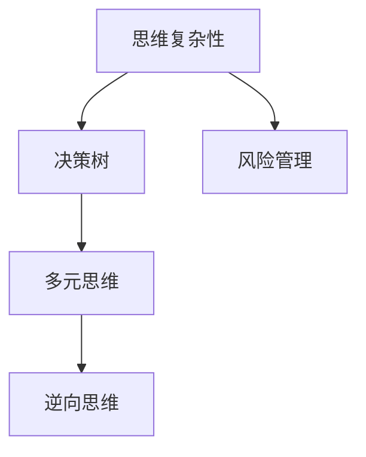
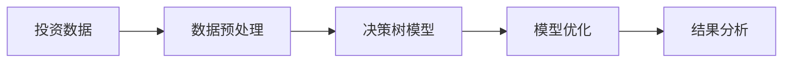
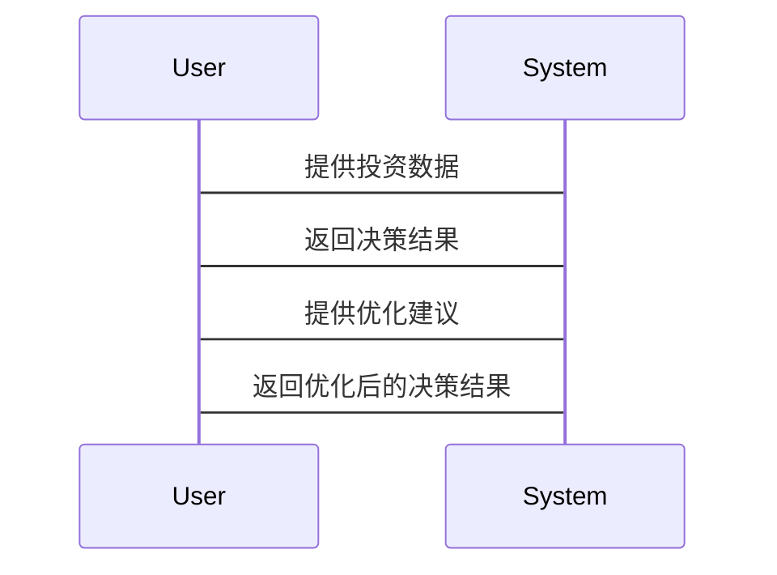

                 


# 芒格的"思维复杂性"：应对复杂投资环境的工具

> 关键词：芒格思维复杂性，投资决策，复杂系统，决策树模型，多元思维框架

> 摘要：本文深入探讨了芒格的“思维复杂性”这一概念，分析了其在应对复杂投资环境中的应用价值。通过结合芒格的多元思维框架和决策树模型，本文详细阐述了思维复杂性在投资决策中的重要性，并提供了具体的算法实现和系统设计思路，帮助读者更好地理解和应用这一工具。

---

## 第一部分: 引言

### 第1章: 芒格的思维复杂性概述

#### 1.1 什么是思维复杂性

- **思维复杂性的定义**：思维复杂性是指在面对复杂问题时，个体或系统需要综合考虑多个维度的信息、因素和可能性，从而做出更全面和精准的决策。
- **思维复杂性的特征**：
  - 多维度性：涉及多个变量和因素。
  - 非线性关系：变量之间的关系复杂且难以预测。
  - 不确定性：存在多种可能的结局和风险。
- **思维复杂性与简单决策的关系**：
  - 复杂性不是简单性的对立面，而是在更高层次上的一致性。
  - 简单决策适用于线性问题，而复杂性适用于非线性问题。

#### 1.2 芒格的思维模型

- **多元思维框架**：
  -芒格提倡通过多个学科的视角（如心理学、经济学、物理学等）来分析问题。
  -通过多元思维框架，投资者可以避免单一视角的局限性。
- **芒格决策树模型**：
  - 通过树状结构来分析决策的可能结果和概率。
  - 适用于复杂决策场景，帮助投资者识别关键决策点。
- **芒格的逆向思维**：
  - 从结果反推原因，帮助投资者识别潜在风险和机会。

#### 1.3 为什么思维复杂性重要

- **投资环境的复杂性**：
  - 金融市场中的变量（如价格波动、政策变化、经济周期等）相互交织。
  - 单一的分析方法难以捕捉所有关键因素。
- **复杂决策的挑战**：
  - 需要综合考虑多个变量和不确定性。
  - 需要平衡短期利益与长期目标。
- **复杂性与决策质量的关系**：
  - 适当的复杂性分析可以提高决策质量。
  - 过度简化可能导致决策失误。

---

## 第2章: 芒格思维复杂性的核心概念

### 2.1 思维复杂性的核心要素

- **多维度分析**：
  - 从多个维度（如财务指标、行业趋势、市场情绪等）分析问题。
  - 例如：分析一家公司的财务状况时，需要考虑收入、利润、负债等多个指标。
- **反向思考**：
  - 从结果反推原因，帮助识别潜在风险和机会。
  - 例如：分析一家公司可能的破产原因，从而避免投资风险。
- **风险管理**：
  - 将复杂性与风险管理结合，降低投资风险。

### 2.2 芒格思维模型的数学表达

- **复杂性度量公式**：
  $$ C = \sum_{i=1}^{n} \frac{1}{1 + e^{-x_i}} $$
  - 其中，\( x_i \) 表示第 \( i \) 个因素的权重。
  - 公式用于量化多个因素对决策的综合影响。
- **决策树的熵值计算**：
  $$ H = -\sum_{i=1}^{n} p_i \log_2 p_i $$
  - 用于衡量数据的混乱程度，帮助选择最优的决策分支。

### 2.3 芒格思维模型的ER实体关系图



---

## 第3章: 芒格思维复杂性的算法原理

### 3.1 芒格决策树算法

- **决策树的构建过程**：
  1. 选择根节点：根据熵值计算，选择信息增益最大的特征作为根节点。
  2. 划分数据集：根据根节点的特征值划分数据集。
  3. 递归构建子树：对每个子数据集重复上述步骤，直到叶子节点。
- **决策树的优化策略**：
  - 剪枝：防止过拟合，减少决策树的复杂性。
  - 例如：使用 CART 算法进行剪枝。
- **决策树的实现代码**：

```python
def calculate_entropy(data):
    labels = data['label'].value_counts().values
    entropy = 0
    for label in labels:
        entropy += - (label / sum(labels)) * np.log2(label / sum(labels))
    return entropy

def choose_best_feature(data):
    base_entropy = calculate_entropy(data)
    best_gain = -1
    best_feature = -1
    for feature in data.columns:
        if feature == 'label':
            continue
        values = data[feature].unique()
        entropy_after_split = 0
        for value in values:
            sub_data = data[data[feature] == value]
            sub_entropy = calculate_entropy(sub_data)
            entropy_after_split += (len(sub_data) / len(data)) * sub_entropy
        info_gain = base_entropy - entropy_after_split
        if info_gain > best_gain:
            best_gain = info_gain
            best_feature = feature
    return best_feature

def build_decision_tree(data):
    features = data.columns.drop('label')
    if len(features) == 0 or data['label'].nunique() == 1:
        return {'label': data['label'].values[0]}
    best_feature = choose_best_feature(data)
    tree = {best_feature: {}}
    features = [feature for feature in features if feature != best_feature]
    for value in data[best_feature].unique():
        sub_data = data[data[best_feature] == value]
        sub_tree = build_decision_tree(sub_data)
        tree[best_feature][value] = sub_tree
    return tree
```

---

## 第4章: 系统分析与架构设计

### 4.1 系统功能设计

- **功能模块**：
  - 数据采集与预处理：收集和清洗投资相关数据。
  - 模型构建：基于芒格思维复杂性构建决策树模型。
  - 模型优化：对决策树进行剪枝和调优。
  - 结果分析：输出决策结果和风险分析报告。

### 4.2 系统架构设计



### 4.3 系统接口设计

- **输入接口**：
  - 投资数据输入（如历史价格、财务数据等）。
- **输出接口**：
  - 决策结果输出（如投资建议）。
  - 风险分析报告。

### 4.4 系统交互设计



---

## 第5章: 项目实战

### 5.1 环境安装

- **工具与库**：
  - Python：用于数据分析和建模。
  - Pandas、Scikit-learn：用于数据处理和机器学习。
  - Mermaid：用于绘制图表。

### 5.2 核心实现代码

```python
import pandas as pd
from sklearn.tree import DecisionTreeClassifier
from sklearn.metrics import accuracy_score

# 数据加载与预处理
data = pd.read_csv('investment_data.csv')
X = data.drop('label', axis=1)
y = data['label']

# 决策树模型构建
model = DecisionTreeClassifier()
model.fit(X, y)

# 模型预测与评估
y_pred = model.predict(X)
print('准确率:', accuracy_score(y, y_pred))
```

### 5.3 案例分析

- **案例：分析苹果公司的投资机会**。
  - 数据输入：苹果公司的财务数据、市场趋势等。
  - 模型运行：基于芒格思维复杂性模型进行分析。
  - 结果解读：输出投资建议和风险分析。

---

## 第6章: 总结与展望

### 6.1 总结

- 本文深入探讨了芒格的思维复杂性及其在投资决策中的应用。
- 通过结合多元思维框架和决策树模型，本文提供了一种应对复杂投资环境的工具。

### 6.2 展望

- 未来的研究可以进一步优化芒格思维模型，结合更多因素进行分析。
- 探讨将芒格思维复杂性应用于其他领域（如企业战略、风险管理等）的潜力。

---

## 最佳实践 Tips

- **小结**：
  - 复杂性不是问题，而是需要正确对待的工具。
  - 芒格思维模型可以帮助投资者更好地应对复杂性。
- **注意事项**：
  - 避免过度简化问题，忽视关键因素。
  - 定期更新模型，适应市场变化。
- **拓展阅读**：
  - 《芒格投资哲学》。
  - 《复杂性理论与投资决策》。

---

通过以上内容，读者可以全面理解芒格的思维复杂性，并将其应用于实际投资决策中。

