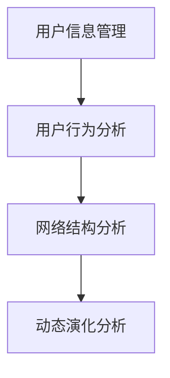

                 


# 芒格的"思维格栅"在复杂自适应系统分析中的运用

## 关键词：芒格思维格栅、复杂自适应系统、多元思维模型、系统分析、网络结构、动态演化、算法实现

## 摘要：芒格的思维格栅是一种多元化的思考框架，通过将多个学科的核心原则结合起来，帮助我们更好地理解和分析复杂问题。本文将探讨芒格思维格栅在复杂自适应系统（CAS）分析中的应用，从基本概念、核心原理到实际算法实现，全面解析其在系统分析中的优势和应用场景。

---

# 第1章: 芒格思维格栅的基本概念

## 1.1 芒格思维格栅的定义与特点

### 1.1.1 芒格思维格栅的定义
芒格思维格栅是由查理·芒格提出的“多元思维模型”，强调通过多个学科的核心原则来构建知识框架。其本质是一个将不同领域知识交叉整合的网络结构。

$$
\text{芒格思维格栅} = \bigcup_{i=1}^{n} \text{学科}_i
$$

### 1.1.2 芒格思维格栅的核心特点
- **跨学科性**：整合多个学科的核心思想。
- **网络结构**：节点代表知识点，边代表知识点之间的联系。
- **动态演化**：随着新知识的加入，网络不断扩展和优化。

### 1.1.3 芒格思维格栅与其他思维模型的对比
| 特性               | 芒格思维格栅                     | 单一学科模型         |
|--------------------|----------------------------------|----------------------|
| 知识覆盖范围       | 多学科交叉                     | 单一学科             |
| 网络结构           | 复杂的网络结构                 | 简单线性结构         |
| 动态性             | 高度动态                       | 较低动态             |

## 1.2 复杂自适应系统的基本概念

### 1.2.1 复杂自适应系统的定义
复杂自适应系统（CAS）是指由多个相互作用的个体（或组件）构成的动态系统，这些个体能够根据环境反馈调整自身行为。

$$
\text{CAS} = \{A_1, A_2, \ldots, A_n\}
$$

其中，$A_i$ 表示系统中的个体，每个个体都有自己的行为规则和适应机制。

### 1.2.2 复杂自适应系统的特征
- **非线性**：系统输出与输入不成简单的比例关系。
- **涌现性**：系统整体表现出个体不具备的特性。
- **自适应性**：系统能够根据环境变化调整自身行为。

### 1.2.3 复杂自适应系统与简单系统的区别
| 特性               | 复杂自适应系统                 | 简单系统             |
|--------------------|--------------------------------|----------------------|
| 结构                | 复杂且动态                    | 简单且静态            |
| 行为                | 涣性行为                      | 可预测行为            |
| 稳定性              | 高度依赖网络结构              | 稳定性较高            |

## 1.3 芒格思维格栅与复杂自适应系统的联系

### 1.3.1 芒格思维格栅在复杂系统分析中的作用
- 提供跨学科的视角，帮助发现系统中的潜在关联。
- 通过网络结构分析，揭示系统的动态演化规律。

### 1.3.2 芒格思维格栅与复杂自适应系统的关系
- 芒格思维格栅为复杂系统的分析提供了一个多维度的知识框架。
- 复杂系统的动态特性为芒格思维格栅的网络结构提供了丰富的应用场景。

## 1.4 本章小结
本章介绍了芒格思维格栅的基本概念和复杂自适应系统的特征，分析了两者之间的联系，为后续章节的深入分析奠定了基础。

---

# 第2章: 芒格思维格栅的核心原理

## 2.1 多元思维模型的构建

### 2.1.1 多元思维模型的定义
多元思维模型是芒格思维格栅的核心，指通过多个学科的核心原则来构建知识框架。

$$
\text{多元思维模型} = \bigcup_{i=1}^{m} \text{学科}_i
$$

### 2.1.2 多元思维模型的核心要素
- **学科选择**：选择具有广泛应用价值的学科。
- **原则提取**：从每个学科中提取核心原则。
- **网络构建**：将提取的原则连接成网络结构。

### 2.1.3 多元思维模型的构建方法
1. 确定目标问题领域。
2. 选择相关学科。
3. 提取每个学科的核心原则。
4. 构建知识点之间的关联网络。

## 2.2 芒格思维格栅的网络结构

### 2.2.1 芒格思维格栅的网络结构特点
- **节点代表知识点**：每个节点对应一个核心原则。
- **边代表关联关系**：边表示知识点之间的逻辑联系。

### 2.2.2 芒格思维格栅的节点与边的关系
- **节点**：知识点。
- **边**：知识点之间的关联关系。

### 2.2.3 芒格思维格栅的网络动态特性
- **节点动态增加**：随着新知识的加入，节点数量增加。
- **边动态变化**：节点之间的关联关系随知识的更新而变化。

## 2.3 芒格思维格栅的动态演化

### 2.3.1 芒格思维格栅的动态演化机制
- **自适应学习**：根据新的知识调整网络结构。
- **知识融合**：将新知识与现有知识网络融合。

### 2.3.2 芒格思维格栅的自适应性
- **环境适应**：能够根据环境变化调整知识网络。
- **自我优化**：通过反馈机制不断优化网络结构。

### 2.3.3 芒格思维格栅的可扩展性
- **模块化扩展**：可以通过添加新模块扩展网络。
- **可扩展性**：能够适应不同规模的系统分析。

## 2.4 本章小结
本章详细讲解了芒格思维格栅的核心原理，包括多元思维模型的构建方法、网络结构特点以及动态演化机制。

---

# 第3章: 芒格思维格栅在复杂系统分析中的应用

## 3.1 复杂系统的建模与分析

### 3.1.1 复杂系统的建模方法
- **网络流模型**：通过流网络分析系统中的信息流动。
- **元胞自动机模型**：通过局部规则模拟系统整体行为。

### 3.1.2 复杂系统的分析框架
1. 确定系统边界。
2. 选择适当的建模方法。
3. 分析系统动态特性。

## 3.2 芒格思维格栅在复杂系统分析中的具体应用

### 3.2.1 芒格思维格栅在复杂系统中的节点分析
- **节点分析**：分析系统中的关键知识点。
- **边分析**：分析知识点之间的关联关系。

### 3.2.2 芒格思维格栅在复杂系统中的网络分析
- **网络结构分析**：通过网络图分析系统的整体结构。
- **网络动态分析**：分析系统的动态演化过程。

### 3.2.3 芒格思维格栅在复杂系统中的动态分析
- **动态网络分析**：分析系统的动态变化过程。
- **反馈机制分析**：分析系统的自适应性。

## 3.3 芒格思维格栅在复杂系统中的优势

### 3.3.1 跨学科视角
芒格思维格栅提供了跨学科的视角，能够发现系统中的潜在关联。

### 3.3.2 网络结构分析
通过网络结构分析，能够揭示系统的动态演化规律。

### 3.3.3 自适应性分析
通过芒格思维格栅的动态演化机制，能够分析系统的自适应性。

## 3.4 本章小结
本章通过具体案例分析，展示了芒格思维格栅在复杂系统分析中的应用，强调了其在网络结构分析和动态演化分析中的优势。

---

# 第4章: 芒格思维格栅与复杂自适应系统的网络结构分析

## 4.1 复杂自适应系统的网络结构

### 4.1.1 网络结构的定义
- **节点**：系统中的个体或组件。
- **边**：个体之间的相互作用关系。

### 4.1.2 网络结构的特征
- **度分布**：节点的连接数量分布。
- **聚类系数**：节点之间连接的紧密程度。

### 4.1.3 网络结构的动态变化
- **节点动态增加**：系统中个体数量的变化。
- **边动态变化**：个体之间关系的变化。

## 4.2 芒格思维格栅在复杂系统网络结构中的应用

### 4.2.1 网络流模型
- **流网络分析**：通过流网络分析系统中的信息流动。
- **流量分配**：分析系统中资源的分配情况。

### 4.2.2 元胞自动机模型
- **局部规则**：通过局部规则模拟系统整体行为。
- **空间结构**：通过空间结构分析系统的动态演化。

## 4.3 本章小结
本章通过网络结构分析，展示了芒格思维格栅在复杂自适应系统中的应用，强调了其在网络结构分析中的优势。

---

# 第5章: 芒格思维格栅在复杂自适应系统中的算法实现

## 5.1 算法原理

### 5.1.1 算法的核心思想
- **多元思维模型**：通过多个学科的核心原则构建知识框架。
- **网络结构分析**：通过网络结构分析系统中的动态演化。

### 5.1.2 算法的数学模型
$$
\text{网络结构} = \{(\text{节点}, \text{边})\}
$$

其中，节点代表知识点，边代表知识点之间的关联关系。

## 5.2 算法实现

### 5.2.1 环境配置
- **编程语言**：Python
- **库依赖**：networkx、matplotlib

### 5.2.2 核心代码实现
```python
import networkx as nx
import matplotlib.pyplot as plt

# 创建网络结构
G = nx.Graph()

# 添加节点
G.add_nodes_from(['A', 'B', 'C', 'D'])

# 添加边
G.add_edges_from([('A', 'B'), ('B', 'C'), ('C', 'D'), ('D', 'A')])

# 绘制网络图
nx.draw(G, with_labels=True, node_color='red', edge_color='blue')
plt.show()
```

### 5.2.3 算法实现的步骤
1. 确定目标问题领域。
2. 选择相关学科。
3. 提取每个学科的核心原则。
4. 构建知识点之间的关联网络。
5. 分析系统的动态演化过程。

## 5.3 算法实现的案例分析

### 5.3.1 案例背景
以社交网络为例，分析用户之间的关系网络。

### 5.3.2 数据收集
- **用户信息**：用户的基本信息。
- **用户行为**：用户的互动行为。

### 5.3.3 数据分析
- **网络结构分析**：分析用户之间的关系网络。
- **动态演化分析**：分析用户关系的动态变化过程。

## 5.4 本章小结
本章通过算法实现，展示了芒格思维格栅在复杂自适应系统中的应用，强调了其在网络结构分析中的优势。

---

# 第6章: 芒格思维格栅在复杂自适应系统中的项目实战

## 6.1 项目背景

### 6.1.1 项目目标
通过芒格思维格栅分析社交网络中的用户关系。

### 6.1.2 项目需求
- 分析用户之间的关系网络。
- 分析用户关系的动态变化过程。

## 6.2 项目实施

### 6.2.1 环境配置
- **编程语言**：Python
- **库依赖**：networkx、matplotlib

### 6.2.2 系统功能设计
- **用户信息管理**：管理用户的基本信息。
- **用户行为分析**：分析用户的互动行为。
- **网络结构分析**：分析用户之间的关系网络。

### 6.2.3 系统架构设计


### 6.2.4 系统实现
```python
import networkx as nx
import matplotlib.pyplot as plt

# 创建网络结构
G = nx.Graph()

# 添加节点
G.add_nodes_from(['A', 'B', 'C', 'D'])

# 添加边
G.add_edges_from([('A', 'B'), ('B', 'C'), ('C', 'D'), ('D', 'A')])

# 绘制网络图
nx.draw(G, with_labels=True, node_color='red', edge_color='blue')
plt.show()
```

## 6.3 项目小结
本章通过项目实战，展示了芒格思维格栅在复杂自适应系统中的应用，强调了其在网络结构分析中的优势。

---

# 第7章: 总结与展望

## 7.1 总结
芒格思维格栅是一种强大的工具，能够帮助我们更好地理解和分析复杂自适应系统。通过芒格思维格栅，我们可以从多个学科的角度分析系统，揭示系统的动态演化规律。

## 7.2 展望
未来的研究可以进一步探索芒格思维格栅在其他复杂系统中的应用，例如经济系统、生态系统等。同时，也可以结合更多的数学工具和算法，进一步优化芒格思维格栅的网络结构分析能力。

## 7.3 最佳实践 tips
- 在实际应用中，结合具体问题选择合适的学科和模型。
- 定期更新知识网络，保持芒格思维格栅的动态性。

## 7.4 小结
本章总结了全文的主要内容，并对未来的研究方向提出了展望。

---

# 附录

## 附录A: 参考文献
1. 芒格，查理. 《芒格的思维格栅》.
2. 系统科学相关文献.

## 附录B: 工具推荐
- **Python**：用于网络结构分析。
- **Networkx**：用于构建和分析网络结构。
- **Matplotlib**：用于绘制网络图。

---

以上是《芒格的"思维格栅"在复杂自适应系统分析中的运用》的技术博客文章目录大纲和部分详细内容。

