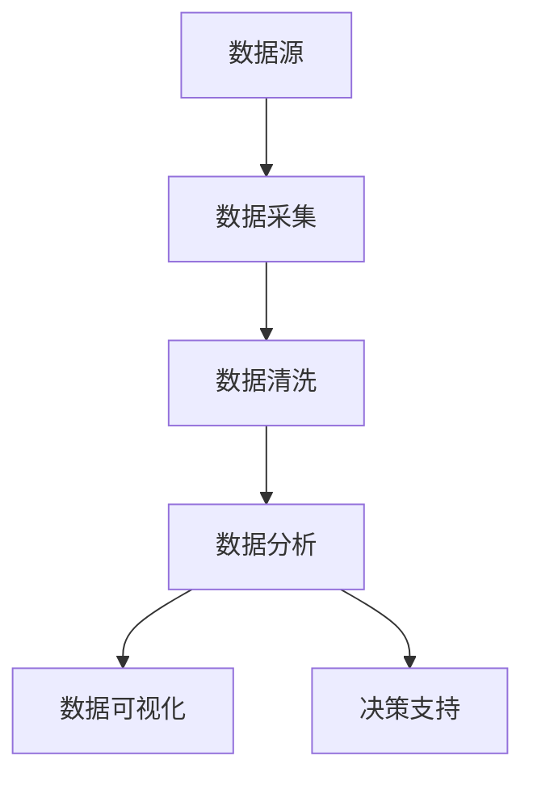

                 


# 芒格的"思维格栅"在大数据分析中的运用

## 关键词：芒格思维格栅、大数据分析、数据分析、多维度视角、系统性思维

## 摘要：  
本文探讨了芒格的"思维格栅"这一多学科、系统性思维框架在大数据分析中的应用。通过分析芒格思维格栅的核心概念及其在数据分析中的具体应用，结合实际案例，展示了如何利用芒格思维格栅提升数据分析的深度与广度。文章内容包括大数据分析的核心概念、芒格思维格栅的理论基础、芒格思维格栅在大数据分析中的具体应用、芒格思维格栅在大数据分析中的算法实现、芒格思维格栅在大数据分析中的系统架构、芒格思维格栅在大数据分析中的项目实战等部分，全面解析了芒格思维格栅在大数据分析中的运用。

---

## 第1章：芒格思维格栅的核心概念

### 1.1 芒格思维格栅的定义与特点

#### 1.1.1 芒格思维格栅的定义  
芒格思维格栅是由查理·芒格提出的一种多学科、系统性思维框架。它将各个学科的核心原理和思维方式整合在一起，形成一个立体的知识网络，帮助分析者从多个维度理解问题并做出决策。

#### 1.1.2 芒格思维格栅的核心特点  
- **多学科视角**：芒格思维格栅强调从多个学科（如心理学、经济学、数学等）的角度去分析问题。
- **系统性思维**：它注重整体性思考，而非单一维度的分析。
- **可扩展性**：芒格思维格栅可以根据具体问题进行灵活扩展，适用于不同场景。

#### 1.1.3 芒格思维格栅与传统思维框架的区别  
传统的数据分析往往依赖单一的分析方法或工具，而芒格思维格栅强调从多个维度出发，结合不同学科的原理进行分析，从而避免单一视角的局限性。

---

### 1.2 芒格思维格栅的构成要素

#### 1.2.1 格栅的多学科视角  
芒格思维格栅的核心在于其多学科视角。例如，在数据分析中，可以从统计学、概率论、心理学等多个角度去理解数据背后的意义。

#### 1.2.2 格栅的逻辑结构  
芒格思维格栅的逻辑结构强调从上至下的系统性思考。例如，首先从整体出发，分析问题的各个维度，再逐步深入到具体细节。

#### 1.2.3 格栅的可扩展性  
芒格思维格栅可以根据具体问题进行扩展。例如，在数据分析中，可以根据数据的特性添加新的分析维度。

---

## 第2章：芒格思维格栅在数据分析中的应用背景

### 2.1 数据分析的现状与挑战

#### 2.1.1 数据分析的定义与范围  
数据分析是指对数据进行采集、处理、分析和可视化的过程，旨在从数据中提取有价值的信息。

#### 2.1.2 数据分析中的常见问题  
- 数据量大，难以处理。
- 数据复杂性高，难以找到规律。
- 数据分析工具的选择困难。

#### 2.1.3 芒格思维格栅如何解决这些问题  
芒格思维格栅提供了一种多维度、系统性的分析方法，可以帮助分析者更全面地理解数据，避免单一视角的局限性。

---

### 2.2 芒格思维格栅与大数据分析的契合点

#### 2.2.1 数据分析的多维度视角  
大数据分析需要从多个维度去理解数据，而芒格思维格栅提供了这种多维度视角的支持。

#### 2.2.2 芒格思维格栅的系统性思维  
芒格思维格栅强调系统性思维，这与大数据分析中对整体数据的理解不谋而合。

#### 2.2.3 芒格思维格栅在数据分析中的优势  
- 提高数据分析的深度和广度。
- 帮助分析者发现数据背后隐藏的规律。
- 提供一种灵活的分析框架，适用于不同场景。

---

## 第3章：大数据分析的核心概念

### 3.1 数据的定义与分类

#### 3.1.1 数据的定义  
数据是指对客观事物的描述，可以是数值、文字、图像等形式。

#### 3.1.2 数据的分类  
- 结构化数据：可以组织成表格形式的数据，例如数据库中的数据。
- 非结构化数据：无法组织成表格形式的数据，例如文本、图像等。

#### 3.1.3 数据的生命周期  
数据的生命周期包括数据采集、存储、处理、分析、可视化和决策支持等阶段。

---

### 3.2 数据分析的方法与工具

#### 3.2.1 数据分析的方法  
- 描述性分析：对数据的基本特征进行描述。
- 预测性分析：利用历史数据预测未来趋势。
- 规范性分析：通过数据分析提出优化建议。

#### 3.2.2 常用数据分析工具  
- Excel：适用于简单的数据分析。
- Python：适用于复杂的数据分析，常用库包括Pandas、NumPy等。
- R：适用于统计分析。
- Tableau：适用于数据可视化。

#### 3.2.3 数据分析的流程  
1. 数据采集：从各种来源获取数据。
2. 数据清洗：对数据进行预处理，去除噪声。
3. 数据分析：利用各种方法对数据进行分析。
4. 数据可视化：将分析结果以图表形式展示。

---

## 第4章：芒格思维格栅在大数据分析中的应用

### 4.1 芒格思维格栅的多维度视角在数据分析中的体现

#### 4.1.1 数据分析中的多维度视角  
在数据分析中，可以从统计学、概率论、心理学等多个角度去理解数据。

#### 4.1.2 芒格思维格栅的系统性思维  
芒格思维格栅强调系统性思维，可以帮助分析者从整体角度理解数据。

#### 4.1.3 芒格思维格栅在数据分析中的应用案例  
例如，在分析用户行为数据时，可以从心理学、经济学等多个角度去理解用户的行为模式。

---

### 4.2 芒格思维格栅在数据分析中的具体方法

#### 4.2.1 数据分析的多维度视角  
在数据分析中，可以结合统计学、概率论等学科的原理进行分析。

#### 4.2.2 芒格思维格栅的系统性思维  
芒格思维格栅可以帮助分析者从整体角度理解数据，避免单一视角的局限性。

#### 4.2.3 芒格思维格栅在数据分析中的应用技巧  
例如，在分析销售数据时，可以从市场趋势、消费者心理等多个维度进行分析。

---

## 第5章：芒格思维格栅在大数据分析中的算法实现

### 5.1 芒格思维格栅的算法原理

#### 5.1.1 算法原理  
芒格思维格栅的算法原理强调从多个维度出发，结合不同学科的原理进行数据分析。

#### 5.1.2 算法流程  
1. 确定分析目标。
2. 从多个维度获取数据。
3. 对数据进行清洗和预处理。
4. 结合芒格思维格栅的多学科视角进行分析。
5. 输出分析结果。

#### 5.1.3 算法实现  
以下是使用Python实现芒格思维格栅算法的示例代码：

```python
import pandas as pd
import numpy as np

# 数据采集
data = pd.read_csv('data.csv')

# 数据清洗
data.dropna(inplace=True)

# 数据分析
# 假设我们从统计学角度进行分析
mean = data['销售额'].mean()
print(f'平均销售额为：{mean}')

# 假设我们从概率论角度进行分析
import numpy as np
from scipy import stats

# 计算销售额的标准差
std_dev = np.std(data['销售额'])
print(f'销售额的标准差为：{std_dev}')

# 假设我们从心理学角度进行分析
# 分析用户行为特征
user_behavior = data['用户行为'].value_counts()
print(f'用户行为分布：{user_behavior}')
```

---

### 5.2 芒格思维格栅在数据分析中的系统架构

#### 5.2.1 系统架构设计  
以下是芒格思维格栅在数据分析中的系统架构设计：



#### 5.2.2 系统功能设计  
- 数据采集：从各种数据源获取数据。
- 数据清洗：对数据进行预处理。
- 数据分析：结合芒格思维格栅的多学科视角进行分析。
- 数据可视化：将分析结果以图表形式展示。

---

## 第6章：芒格思维格栅在大数据分析中的项目实战

### 6.1 项目背景

#### 6.1.1 项目介绍  
假设我们正在分析一个电商网站的用户行为数据，目标是通过数据分析优化用户体验。

#### 6.1.2 项目目标  
通过数据分析，找出影响用户购买行为的关键因素。

---

### 6.2 项目实施

#### 6.2.1 数据采集  
从电商网站的日志中采集用户行为数据。

#### 6.2.2 数据清洗  
对数据进行预处理，去除噪声数据。

#### 6.2.3 数据分析  
结合芒格思维格栅的多学科视角进行分析：
- 从统计学角度分析用户的购买频率。
- 从概率论角度分析用户的购买概率。
- 从心理学角度分析用户的行为特征。

#### 6.2.4 数据可视化  
将分析结果以图表形式展示，例如用户购买频率分布图。

---

### 6.3 项目结果

#### 6.3.1 分析结果  
通过分析发现，用户购买行为主要受价格、促销活动和用户体验的影响。

#### 6.3.2 结论  
优化价格策略和提升用户体验可以有效提高销售额。

---

## 第7章：总结与展望

### 7.1 总结  
芒格思维格栅提供了一种多维度、系统性的分析方法，可以帮助分析者更全面地理解数据，避免单一视角的局限性。

### 7.2 展望  
未来，随着大数据技术的不断发展，芒格思维格栅在数据分析中的应用将更加广泛，帮助分析者做出更明智的决策。

---

## 附录

### 附录1：常用数据分析工具  
- Python：Pandas、NumPy等。
- R：统计分析。
- Tableau：数据可视化。

### 附录2：数学公式汇总  
$$\text{平均值} = \frac{\sum x_i}{n}$$  
$$\text{标准差} = \sqrt{\frac{\sum (x_i - \bar{x})^2}{n}}$$

---

## 索引  
（根据文章内容生成索引）

---

通过以上结构和内容，我们可以看到芒格思维格栅在大数据分析中的应用是多维度且系统的。它不仅帮助分析者从多个视角理解数据，还能通过结合不同学科的原理，提高数据分析的深度和广度。希望本文能为大数据分析领域提供新的思路和方法。

