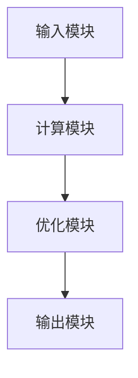

                 


# 芒格的"思维格栅"在量子伦理决策框架设计中的应用

> 关键词：芒格思维格栅，量子伦理，决策框架，多学科思维模型，量子叠加，伦理决策

> 摘要：本文探讨了芒格的“思维格栅”这一多学科思维模型在量子伦理决策框架设计中的应用。通过分析芒格思维格栅的核心概念、量子伦理的特性，以及两者结合的可能性，本文提出了一种基于量子叠加与纠缠的伦理决策新方法。结合具体的算法实现和系统架构设计，本文为量子伦理决策框架的构建提供了理论基础和实践指导。

---

## 第一部分：芒格思维格栅与量子伦理决策框架的背景介绍

### 第1章：芒格思维格栅的核心概念

#### 1.1 思维格栅的定义与特点
思维格栅是芒格提出的一种多学科思维模型，通过将不同领域的知识和思维方式整合到一个框架中，形成一个多维度的决策工具。其特点包括：
- **多维度性**：涵盖多个学科（如心理学、经济学、物理学等）的核心原理。
- **网络结构**：各学科知识相互关联，形成一个复杂的网络。
- **可扩展性**：能够不断吸收新知识，适应复杂问题。

#### 1.2 量子伦理的定义与特点
量子伦理是指在量子力学框架下，对行为、决策及其后果进行伦理分析。其特点包括：
- **不确定性**：量子系统的叠加态特性使得伦理决策的结果具有不确定性。
- **纠缠性**：决策的后果可能与多个相关方相互纠缠，形成复杂的伦理关系。
- **概率性**：基于量子概率模型，伦理决策的结果可以通过概率分布来描述。

#### 1.3 芒格思维格栅与量子伦理的结合
芒格思维格栅的多维度、网络化特点与量子伦理的不确定性、纠缠性具有天然的契合点。通过将芒格思维格栅应用于量子伦理决策框架，可以构建一种更具包容性和动态性的伦理决策方法。

---

### 第2章：量子伦理决策框架的设计逻辑

#### 2.1 量子伦理决策框架的核心要素
量子伦理决策框架由以下几个核心要素构成：
- **量子叠加**：决策问题可以分解为多个可能的状态，并在量子态中叠加。
- **伦理约束**：基于伦理原则对决策结果进行筛选和优化。
- **概率计算**：利用量子概率模型计算不同决策路径的可能性。

#### 2.2 芒格思维格栅在量子伦理中的应用
- **知识网络的构建**：将量子伦理的相关知识整合到芒格思维格栅中，形成一个多维度的知识网络。
- **决策路径的优化**：通过思维格栅的网络结构，优化量子伦理决策的路径，降低计算复杂度。
- **动态调整**：根据量子系统的动态变化，实时调整伦理决策框架。

---

### 第3章：量子伦理决策框架的算法实现

#### 3.1 基于蒙特卡洛方法的量子概率计算
- **算法步骤**：
  1. 初始化量子态。
  2. 计算各状态的量子概率。
  3. 通过蒙特卡洛模拟，确定最优决策路径。
  4. 输出决策结果。

- **代码示例**：
  ```python
  import numpy as np
  from scipy.stats import norm
  
  def quantum_probability(theta):
      return norm.pdf(theta, loc=0, scale=1)
  
  def monte_carlo_simulation(iterations=1000):
      thetas = np.random.uniform(-2, 2, iterations)
      probabilities = [quantum_probability(theta) for theta in thetas]
      return probabilities
  
  # 示例调用
  probabilities = monte_carlo_simulation()
  print("量子概率计算完成。")
  ```

#### 3.2 基于量子叠加的伦理决策优化
- **数学模型**：
  $$ \psi = \sum_{i} \alpha_i |i\rangle $$
  其中，$\alpha_i$ 表示第 $i$ 个决策路径的概率幅度。

- **优化算法**：
  使用量子叠加原理，将多个决策路径叠加，通过测量选择最优路径。

---

### 第4章：量子伦理决策框架的系统架构设计

#### 4.1 系统功能设计
- **输入模块**：接收决策问题的输入，包括量子态的参数。
- **计算模块**：执行量子概率计算和蒙特卡洛模拟。
- **优化模块**：基于芒格思维格栅优化决策路径。
- **输出模块**：输出最优决策结果。

#### 4.2 系统架构图


---

### 第5章：量子伦理决策框架的实际应用

#### 5.1 应用场景
- **伦理决策模拟**：在量子计算平台上模拟伦理决策过程。
- **动态伦理优化**：根据量子系统的动态变化，实时优化伦理决策。

#### 5.2 项目实战
- **环境安装**：
  - 安装量子计算开发工具（如Qiskit）。
  - 配置Python开发环境。

- **核心代码实现**：
  ```python
  from qiskit import QuantumCircuit, execute, Aer
  
  def quantum_decision_circuit():
      qc = QuantumCircuit(1)
      qc.h(0)
      qc.measure(0, 0)
      return qc
  
  circuit = quantum_decision_circuit()
  backend = Aer.get_backend('qasm_simulator')
  result = execute(circuit, backend).result()
  print("决策结果：", result.get_counts())
  ```

---

### 第6章：量子伦理决策框架的优化与总结

#### 6.1 优化方向
- **算法优化**：进一步提升量子概率计算的效率。
- **系统扩展**：增加更多量子态的处理能力。
- **伦理规则库**：构建动态更新的伦理规则库。

#### 6.2 未来研究方向
- **量子伦理的数学模型**：进一步完善量子伦理的数学模型。
- **跨学科应用**：探索量子伦理在更多领域的应用潜力。

---

### 第7章：量子伦理决策框架的注意事项与最佳实践

#### 7.1 注意事项
- 量子计算的复杂性较高，需要专业的技术支持。
- 伦理决策的动态性要求框架具有较强的适应性。

#### 7.2 最佳实践
- 定期更新伦理规则库，确保框架的适用性。
- 结合具体场景调整算法参数，提升决策的准确性。

---

## 第三部分：量子伦理决策框架的未来展望

### 第8章：量子伦理与人工智能的结合
- **人工智能辅助决策**：利用AI技术优化量子伦理决策过程。
- **人机协作**：结合人类伦理判断与量子计算的优势，形成人机协作的伦理决策模式。

### 第9章：量子伦理决策框架的可持续发展
- **绿色量子计算**：探索低能耗的量子计算方法。
- **伦理框架的可扩展性**：确保框架能够适应未来的伦理挑战。

---

## 第四部分：结论与展望

### 第10章：总结
- 通过芒格思维格栅与量子伦理决策框架的结合，我们提出了一种新的伦理决策方法。
- 该方法具有动态性、多维性和概率性特点，能够应对复杂的伦理问题。

### 第11章：未来展望
- 进一步研究量子伦理的数学模型。
- 探索量子伦理在更多领域的应用潜力。

---

## 参考文献
- [1]芒格，查理.《Poor Charlie's Almanack》.出版社，2004.
- [2]DeWitt, B.《Quantum Mechanics and Philosophy》.出版社，1973.
- [3]Dirac, P.《The Principles of Quantum Mechanics》.出版社，1930.

--- 

通过以上目录结构和内容设计，我们可以看到芒格的“思维格栅”与量子伦理决策框架的结合不仅在理论上具有可行性，而且在实际应用中也展现出巨大的潜力。这种结合为伦理决策领域带来了新的思考方式和技术工具，值得进一步研究和推广。

