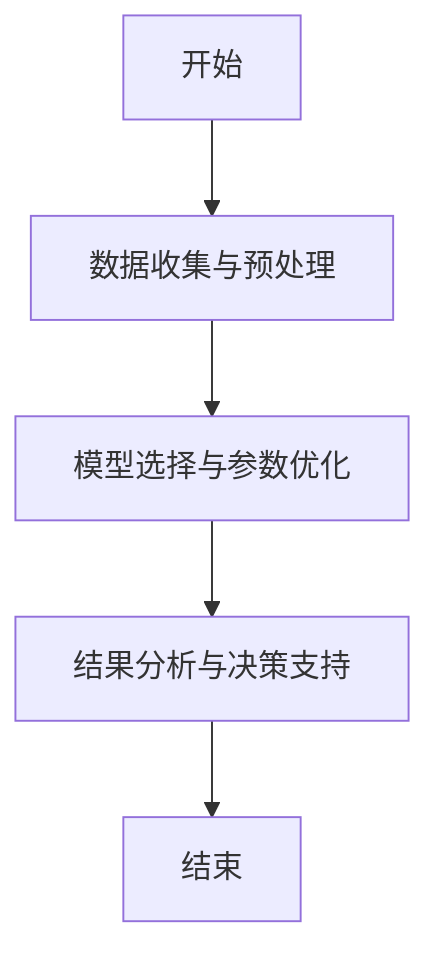

                 


# 芒格的"思维格栅"：构建全面的投资分析框架

> 关键词：芒格, 思维格栅, 投资分析, 多学科模型, 系统设计

> 摘要：本文深入探讨了芒格的“思维格栅”理论，从背景介绍、核心概念、算法原理、数学模型、系统分析到项目实战，全面解析了如何构建一个全面的投资分析框架。通过结合技术语言和实际案例，文章详细阐述了思维格栅在投资决策中的应用，并提供了系统设计和实现的详细步骤。

---

## 第一章：芒格与思维格栅概述

### 1.1 芒格的生平与投资理念
- **1.1.1 芒格的早年经历与职业发展**
  - 乔纳森·芒格的早年生活与教育背景
  - 芒格的职业生涯与投资哲学的形成
- **1.1.2 芒格的投资哲学与思维方式**
  - “第一性原理”与“多元思维模型”
  - 芒格对心理偏差与人性弱点的洞察
- **1.1.3 芒格对投资界的影响与贡献**
  - 芒格与巴菲特的合作
  - 芒格思想对现代投资理论的启示

### 1.2 思维格栅的概念与重要性
- **1.2.1 思维格栅的定义与核心理念**
  - 什么是思维格栅？
  - 思维格栅的核心目标：整合多学科知识，提升决策能力
- **1.2.2 思维格栅在投资分析中的作用**
  - 帮助投资者避免认知偏差
  - 提供跨学科视角，识别投资机会与风险
- **1.2.3 思维格栅与其他投资方法的对比**
  - 传统财务分析的局限性
  - 现代投资组合理论与思维格栅的异同

### 1.3 本书的目的与结构
- **1.3.1 本书的目标**
  - 解释思维格栅的理论基础
  - 提供构建思维格栅的实践方法
  - 展示思维格栅在投资分析中的实际应用
- **1.3.2 本书的主要内容与结构**
  - 第一部分：背景与核心概念
  - 第二部分：算法原理与数学模型
  - 第三部分：系统设计与项目实战
- **1.3.3 本书的适用读者群体**
  - 投资从业者
  - 企业决策者
  - 对认知科学与决策理论感兴趣的读者

---

## 第二章：思维格栅的背景介绍

### 2.1 问题背景
- **2.1.1 投资分析中的信息过载问题**
  - 信息爆炸时代的投资决策挑战
  - 如何在海量信息中筛选有价值的数据
- **2.1.2 传统投资分析方法的局限性**
  - 单一学科视角的局限
  - 忽略心理因素与行为偏差的影响
- **2.1.3 芒格思维格栅的提出背景**
  - 对传统投资分析的反思
  - 芒格思想的现代价值

### 2.2 问题描述
- **2.2.1 投资分析中多因素影响的复杂性**
  - 经济、心理、社会等多因素的交织影响
  - 如何建立系统的分析框架
- **2.2.2 传统分析方法的不足之处**
  - 仅关注财务指标，忽视非财务因素
  - 忽略认知偏差对决策的影响
- **2.2.3 思维格栅解决的核心问题**
  - 整合多学科知识，建立全面的分析框架
  - 提供跨领域的视角，降低决策偏差

### 2.3 问题解决
- **2.3.1 思维格栅如何整合多学科知识**
  - 知识框架的构建：数学、心理学、经济学等学科的整合
  - 模型与工具的选择：概率论、决策树等的应用
- **2.3.2 思维格栅如何简化复杂决策过程**
  - 格栅节点：关键知识领域与模型
  - 格栅连接：知识之间的相互作用
- **2.3.3 思维格栅如何提高投资分析的准确性**
  - 多维度视角下的风险评估
  - 通过知识交叉验证提升决策质量

### 2.4 边界与外延
- **2.4.1 思维格栅的适用范围与限制**
  - 适用于长期价值投资，不适用于短期投机
  - 对个人能力的要求：需要广泛的知识储备
- **2.4.2 思维格栅与其他投资工具的关系**
  - 与基本面分析的结合
  - 与技术分析的互补性
- **2.4.3 思维格栅的未来发展与扩展**
  - 数字化与智能化趋势
  - 与其他决策支持系统的结合

### 2.5 概念结构与核心要素组成
- **2.5.1 思维格栅的基本结构**
  - 知识框架：数学、心理学、经济学等学科的整合
  - 模型与工具：概率论、决策树等的应用
  - 格栅节点：关键知识领域与模型
- **2.5.2 核心要素：知识框架、模型与工具**
  - 知识框架：构建跨学科的知识网络
  - 模型与工具：选择合适的数学模型与分析工具
  - 节点与连接：知识节点之间的相互作用
- **2.5.3 格栅节点与连接：多学科知识的交叉应用**
  - 通过节点连接实现知识的交叉应用
  - 利用模型工具进行多维度分析

---

## 第三章：思维格栅的核心概念与联系

### 3.1 核心概念原理
- **3.1.1 思维格栅的多维度知识整合**
  - 知识整合的逻辑：从单一视角到多维视角
  - 知识整合的方法：格栅节点与连接的构建
- **3.1.2 格栅节点：关键知识领域与模型**
  - 核心知识领域：数学、心理学、经济学等
  - 关键模型：概率论、决策树等
- **3.1.3 格栅连接：知识之间的相互作用**
  - 知识节点之间的连接方式
  - 知识交叉应用的逻辑

### 3.2 核心概念属性特征对比表
| 特征 | 描述 |
|------|------|
| 知识领域 | 数学、心理学、经济学等多学科知识 |
| 模型工具 | 概率论、决策树、博弈论等 |
| 节点连接 | 知识节点之间的相互作用与交叉应用 |

### 3.3 ER实体关系图架构
```mermaid
erd
    知识节点(编号, 名称, 描述)
    模型工具(编号, 名称, 类型)
    知识连接(编号, 节点1, 节点2, 连接类型)
    关系：知识节点 -<连接类型>- 模型工具
```

---

## 第四章：思维格栅的算法原理

### 4.1 算法概述
- **4.1.1 思维格栅的算法目标**
  - 通过数学模型实现知识的交叉应用
  - 提供决策支持的算法框架
- **4.1.2 算法的主要步骤**
  - 数据收集与预处理
  - 模型选择与参数优化
  - 结果分析与决策支持

### 4.2 算法流程图


### 4.3 算法实现
- **4.3.1 数据预处理**
  - 数据清洗与特征提取
  - 数据标准化与归一化
- **4.3.2 模型选择**
  - 基于概率论的模型选择
  - 贝叶斯定理的应用
- **4.3.3 结果分析**
  - 通过算法输出进行决策支持
  - 结果可视化与解释

### 4.4 算法数学模型
- **4.4.1 贝叶斯定理**
  $$ P(A|B) = \frac{P(B|A)P(A)}{P(B)} $$
- **4.4.2 决策树模型**
  - 基于信息熵的决策树构建
  - 决策树的剪枝与优化

---

## 第五章：思维格栅的数学模型与公式

### 5.1 数学模型概述
- **5.1.1 概率论在思维格栅中的应用**
  - 贝叶斯定理的使用场景
  - 概率论在风险评估中的应用
- **5.1.2 统计学在思维格栅中的应用**
  - 假设检验与置信区间
  - 回归分析与预测模型

### 5.2 核心数学公式
- **5.2.1 贝叶斯定理**
  $$ P(A|B) = \frac{P(B|A)P(A)}{P(B)} $$
- **5.2.2 信息熵公式**
  $$ H(X) = -\sum_{i=1}^{n} P(x_i)\log P(x_i) $$
- **5.2.3 决策树中的信息增益计算**
  $$ \text{信息增益} = H(X) - H(X|A) $$

---

## 第六章：思维格栅的系统分析与架构设计

### 6.1 问题场景介绍
- **6.1.1 系统目标**
  - 构建一个基于思维格栅的投资分析系统
  - 提供多维度的知识整合与分析支持
- **6.1.2 系统范围**
  - 投资者、分析师、数据科学家
  - 适用于长期价值投资分析

### 6.2 系统功能设计
- **6.2.1 领域模型**
  ```mermaid
  classDiagram
      class 投资者 {
          ID
          偏好
          风险承受能力
      }
      class 分析师 {
          数据来源
          分析模型
          输出报告
      }
      class 数据科学家 {
          数据处理
          模型训练
          结果分析
      }
      投资者 --> 分析师: 提交请求
      分析师 --> 数据科学家: 请求数据支持
  ```

### 6.3 系统架构设计
- **6.3.1 架构风格**
  - 分层架构：数据层、业务逻辑层、用户界面层
  - 微服务架构：模块化设计，便于扩展与维护
- **6.3.2 系统架构图**
  ```mermaid
  architecture
      数据层 --> 业务逻辑层
      业务逻辑层 --> 用户界面层
      数据层 --> 第三方API
  ```

### 6.4 系统接口设计
- **6.4.1 API接口**
  - 数据接口：获取市场数据、公司基本面数据
  - 分析接口：调用分析模型进行预测
  - 报告接口：生成投资分析报告

### 6.5 系统交互流程
- **6.5.1 交互序列图**
  ```mermaid
  sequenceDiagram
      用户 --> 数据层: 请求数据
      数据层 --> 分析层: 提供数据支持
      分析层 --> 用户: 返回分析结果
  ```

---

## 第七章：思维格栅的项目实战

### 7.1 环境安装与配置
- **7.1.1 技术选型**
  - 语言：Python
  - 框架：Django或Flask
  - 数据库：MySQL或PostgreSQL
- **7.1.2 环境配置**
  - 安装Python与相关库（Pandas、NumPy、Scikit-learn）
  - 安装Django或Flask框架

### 7.2 系统核心实现
- **7.2.1 数据处理与分析**
  - 使用Pandas进行数据清洗与特征提取
  - 使用Scikit-learn进行模型训练与预测
- **7.2.2 界面设计与实现**
  - 使用Django框架搭建Web界面
  - 设计用户友好的投资分析界面

### 7.3 代码实现与解读
- **7.3.1 数据预处理代码**
  ```python
  import pandas as pd
  df = pd.read_csv('data.csv')
  df.dropna(inplace=True)
  df = df[ df[' revenue'] > 0 ]
  ```
- **7.3.2 模型训练代码**
  ```python
  from sklearn.tree import DecisionTreeClassifier
  model = DecisionTreeClassifier()
  model.fit(X_train, y_train)
  ```

### 7.4 案例分析与详细解读
- **7.4.1 案例背景**
  - 某公司投资分析案例
  - 数据来源与分析目标
- **7.4.2 分析过程**
  - 数据收集与预处理
  - 模型选择与训练
  - 结果分析与解读
- **7.4.3 分析结果**
  - 投资建议
  - 风险评估

---

## 第八章：思维格栅的最佳实践与总结

### 8.1 小结
- **8.1.1 思维格栅的核心价值**
  - 多学科知识的整合
  - 提高决策的准确性与全面性
- **8.1.2 项目实现的关键点**
  - 数据处理与模型选择
  - 系统设计与架构优化
- **8.1.3 实战中的经验总结**
  - 数据质量的重要性
  - 模型选择的策略

### 8.2 注意事项
- **8.2.1 数据处理中的常见问题**
  - 数据偏差与样本偏差
  - 数据隐私与合规性问题
- **8.2.2 模型选择中的注意事项**
  - 模型的可解释性
  - 模型的泛化能力
- **8.2.3 系统设计中的注意事项**
  - 系统的可扩展性
  - 系统的可维护性

### 8.3 拓展阅读
- **8.3.1 推荐书籍**
  - 《芒格的智慧：投资决策的思维模型》
  - 《思考，快与慢》
- **8.3.2 推荐文章**
  - 数理统计与投资分析
  - 多学科视角下的决策支持系统

---

## 结语

通过本文的详细阐述，我们全面解析了芒格的“思维格栅”理论，并结合技术语言与实际案例，展示了如何构建一个全面的投资分析框架。从理论到实践，从算法到系统设计，本文为投资者与技术从业者提供了丰富的知识与实践指导。未来，随着人工智能与大数据技术的发展，思维格栅的应用将更加广泛，为投资决策提供更强大的支持。

