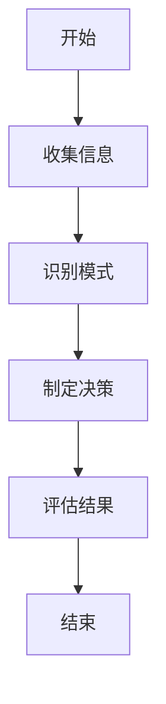
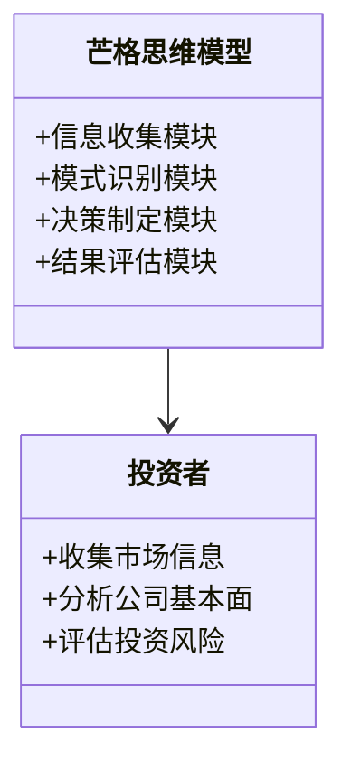

                 

# 芒格的思维模型：在投资中的应用

## 关键词：芒格思维模型、投资决策、多元思维模型、概率论、机会成本、系统性思维、风险管理

## 摘要：芒格的思维模型是一种基于多元思维和系统性分析的投资方法，通过结合数学期望、概率论、机会成本等核心概念，帮助投资者做出更理性、更科学的投资决策。本文将从芒格思维模型的背景与核心概念出发，深入分析其数学基础、算法设计、系统架构，并结合实际投资案例，展示其在行业分析、公司估值、风险管理等领域的广泛应用。最后，我们将总结芒格思维模型的投资决策框架，并提出最佳实践建议，帮助投资者更好地理解和应用这一方法。

---

## 第1章：芒格思维模型的背景与核心概念

### 1.1 芒格思维模型的起源

芒格思维模型由投资者查理·芒格提出，其核心思想是通过建立多元思维模型来理解和分析问题。这种方法结合了传统投资分析和现代系统性思维，旨在帮助投资者避免认知偏差，做出更理性的决策。

#### 1.1.1 芝加哥学派与价值投资的碰撞

芒格的投资理念深受芝加哥学派的影响，尤其是其对概率论和理性决策的重视。然而，他发现传统投资方法往往忽视了市场的复杂性和不确定性，因此提出了多元思维模型。

#### 1.1.2 芒格的多元思维模型的提出

芒格认为，投资者应该通过多个学科的视角来分析问题，包括心理学、经济学、数学等。多元思维模型的核心在于将各个学科的原理整合起来，形成一个完整的分析框架。

#### 1.1.3 芒格思维模型的核心要素

芒格思维模型的核心要素包括：

- **数学期望**：通过概率分布计算投资的期望收益。
- **机会成本**：评估投资的隐含成本。
- **非对称信息**：分析市场中的信息不对称对投资决策的影响。
- **系统性思维**：将投资视为一个复杂的系统，分析其各个组成部分的相互作用。

### 1.2 芒格思维模型的核心概念

#### 1.2.1 多元思维模型的定义

多元思维模型是一种通过多个学科的视角来分析问题的方法。它强调跨学科的整合，以帮助投资者更好地理解市场的复杂性。

#### 1.2.2 芒格思维模型的结构与特点

芒格思维模型的结构包括以下几个部分：

1. **信息收集**：通过多种渠道收集市场数据。
2. **模式识别**：识别市场中的规律和模式。
3. **决策制定**：基于模式识别做出投资决策。
4. **结果评估**：评估决策的结果并优化模型。

#### 1.2.3 芒格思维模型与传统投资方法的区别

与传统投资方法相比，芒格思维模型更注重系统性分析和跨学科整合。传统方法往往依赖单一的分析框架，而芒格思维模型则强调多个视角的结合。

---

## 第2章：芒格思维模型的数学基础

### 2.1 概率论与期望值

#### 2.1.1 概率论的基本概念

概率论是芒格思维模型的重要组成部分。它帮助投资者计算投资的期望收益和风险。

#### 2.1.2 期望值的计算公式

期望值的计算公式为：
$$E[X] = \sum_{i=1}^{n} x_i p_i$$
其中，$x_i$ 是第 $i$ 种情况下的收益，$p_i$ 是该情况发生的概率。

#### 2.1.3 期望值在投资决策中的应用

通过计算期望值，投资者可以评估不同投资方案的收益和风险，从而做出更理性的决策。

### 2.2 机会成本与沉没成本

#### 2.2.1 机会成本的定义与计算

机会成本是指投资者选择一个方案时，放弃其他方案所付出的代价。计算公式为：
$$\text{机会成本} = \text{最佳替代方案的价值} - \text{实际选择的价值}$$

#### 2.2.2 沉没成本的概念与处理方法

沉没成本是指已经发生的、无法收回的成本。在投资决策中，投资者应避免过度关注沉没成本，而应专注于未来的收益和风险。

### 2.3 非对称信息与逆向思维

#### 2.3.1 非对称信息的定义与影响

非对称信息是指市场参与者之间信息的不对称。这可能导致市场的扭曲和投资机会的错失。

#### 2.3.2 逆向思维的策略与应用

逆向思维是指从反方向思考问题。在投资中，逆向思维可以帮助投资者发现市场的低估机会。

---

## 第3章：芒格思维模型的核心算法与流程图

### 3.1 核心算法概述

芒格思维模型的核心算法包括以下几个步骤：

1. **信息收集**：收集市场的相关信息。
2. **模式识别**：识别市场中的规律和模式。
3. **决策制定**：基于模式识别做出投资决策。
4. **结果评估**：评估决策的结果并优化模型。

### 3.2 算法流程图

以下是芒格思维模型的流程图：

---

## 第4章：芒格思维模型的系统架构设计

### 4.1 系统架构概述

芒格思维模型的系统架构包括以下几个部分：

1. **信息收集模块**：负责收集市场的相关信息。
2. **模式识别模块**：负责识别市场中的规律和模式。
3. **决策制定模块**：负责基于模式识别做出投资决策。
4. **结果评估模块**：负责评估决策的结果并优化模型。

### 4.2 系统架构图

以下是芒格思维模型的系统架构图：

---

## 第5章：芒格思维模型在投资中的实际应用

### 5.1 行业分析与公司估值

#### 5.1.1 行业分析的步骤与方法

行业分析的步骤包括：

1. **行业背景分析**：分析行业的历史发展和未来趋势。
2. **行业竞争分析**：分析行业的竞争格局和主要参与者。
3. **行业财务分析**：分析行业的财务状况和盈利能力。

#### 5.1.2 公司估值的关键指标与模型

公司估值的关键指标包括：

- **市盈率（P/E）**：市价与每股收益的比率。
- **市净率（P/B）**：市价与每股净资产的比率。
- **股息率**：股息与股价的比率。

#### 5.1.3 案例分析：如何使用芒格思维模型评估一家公司

假设我们要评估一家公司，首先需要收集公司的财务数据和行业信息。然后，通过模式识别和数据分析，识别公司的竞争优势和潜在风险。最后，基于这些分析结果，制定投资决策。

### 5.2 投资决策框架

#### 5.2.1 构建投资决策框架的步骤

构建投资决策框架的步骤包括：

1. **明确投资目标**：确定投资的目的和预期收益。
2. **分析市场环境**：分析市场的宏观经济和行业趋势。
3. **评估公司基本面**：分析公司的财务状况和竞争优势。
4. **制定投资策略**：基于分析结果制定投资策略。

#### 5.2.2 框架的组成部分与功能

投资决策框架的组成部分包括：

1. **市场分析**：分析市场的宏观经济和行业趋势。
2. **公司分析**：分析公司的财务状况和竞争优势。
3. **风险评估**：评估投资的风险和潜在收益。

---

## 第6章：芒格思维模型的投资心态与风险管理

### 6.1 投资心态的培养

#### 6.1.1 理性与耐心

芒格强调投资者需要保持理性和耐心。理性是指基于事实和数据做出决策，耐心是指等待合适的投资机会。

#### 6.1.2 避免情绪化决策

情绪化决策是投资中的常见问题。芒格认为，投资者应避免被情绪左右，而应基于理性和数据做出决策。

### 6.2 风险管理策略

#### 6.2.1 风险的分类与识别

风险的分类包括市场风险、流动性风险、信用风险等。识别风险是风险管理的第一步。

#### 6.2.2 风险控制的措施

风险控制的措施包括：

- **分散投资**：通过投资多个资产降低风险。
- **设定止损**：在投资出现亏损时及时止损。

---

## 第7章：芒格思维模型的最佳实践与小结

### 7.1 最佳实践 tips

- **持续学习**：投资者需要不断学习新的知识和技能，以适应市场的变化。
- **注重实践**：将理论与实践相结合，通过实际操作提升投资能力。
- **保持耐心**：投资需要时间和耐心，不应急于求成。

### 7.2 小结

芒格思维模型是一种系统性分析和跨学科整合的投资方法。它通过结合数学期望、概率论、机会成本等核心概念，帮助投资者做出更理性和科学的决策。投资者应将芒格思维模型与实际投资相结合，不断优化自己的投资策略。

### 7.3 注意事项

- **避免过度复杂化**：芒格思维模型虽然复杂，但投资者应避免过度复杂化，而应注重其实用性。
- **注重实际效果**：投资者应关注模型的实际效果，而不是仅仅依赖模型本身。

### 7.4 拓展阅读

- **《芒格的多元思维模型》**：详细介绍了芒格思维模型的核心思想和实际应用。
- **《投资学基础》**：提供了投资学的基本理论和方法。

---

通过本文的详细讲解，我们希望读者能够更好地理解和应用芒格思维模型，从而在投资中做出更理性和科学的决策。

