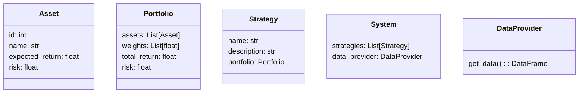
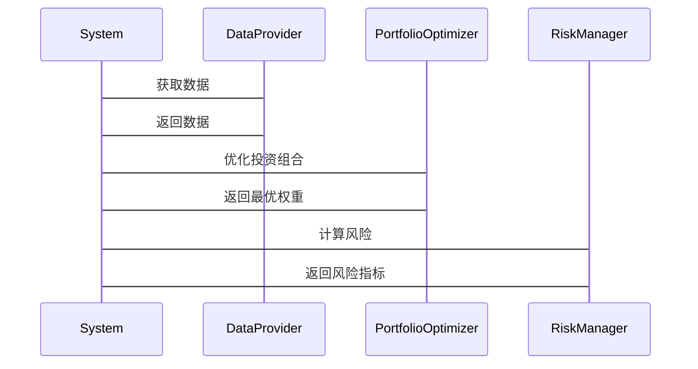

                 


# 芒格的"数学期望"思维在量化投资策略优化中的应用

---

## 关键词：
- 量化投资
- 数学期望
- 期望值
- 投资策略
- 蒙特卡洛模拟
- 马科维茨投资组合理论

---

## 摘要：
本文探讨了芒格的数学期望思维在量化投资中的应用，分析了数学期望在投资决策中的核心作用，结合具体算法和数学模型，详细讲解了如何利用数学期望优化投资策略。通过实际案例分析，展示了数学期望在量化投资中的实践价值。

---

## 第一部分：芒格的数学期望思维概述

### 1.1 芒格的数学期望思维简介

#### 1.1.1 芒格的数学期望思维的起源
数学期望是概率论中的核心概念，用于衡量随机变量的平均值。芒格在投资中强调长期的、理性思维，而数学期望为其提供了量化工具。

#### 1.1.2 数学期望在投资中的核心作用
通过数学期望，投资者可以量化资产的预期收益，评估投资策略的可行性。

#### 1.1.3 芒格思维与投资决策的关系
芒格的思维强调长期和理性，而数学期望帮助量化这些决策，确保投资决策的科学性和可持续性。

---

## 第二部分：数学期望的基本概念与应用

### 2.1 数学期望的定义与性质

#### 2.1.1 期望值的定义
数学期望是随机变量可能取值的加权平均，权重为相应的概率。例如，掷骰子的期望值为3.5。

#### 2.1.2 期望值的性质与特点
- 线性性质：期望值是线性的，不受变量之间依赖关系的影响。
- 非负性：若所有可能的取值非负，则期望值也非负。

#### 2.1.3 期望值在概率论中的地位
期望值是概率论的核心工具，用于评估随机变量的长期平均表现。

### 2.2 数学期望在投资决策中的作用

#### 2.2.1 投资决策中的期望收益
通过计算资产的期望收益，投资者可以评估其风险调整后的收益。

#### 2.2.2 期望值与风险评估的关系
风险越高，资产的期望收益可能越高，但实际结果可能偏离期望值。

#### 2.2.3 期望值在资产配置中的应用
通过优化资产配置，投资者可以最大化期望收益，同时最小化风险。

---

## 第三部分：量化投资策略优化中的数学期望应用

### 3.1 数学期望在投资组合优化中的应用

#### 3.1.1 投资组合优化的基本概念
投资组合优化旨在通过调整资产权重，最大化期望收益，同时最小化风险。

#### 3.1.2 数学期望在组合优化中的作用
通过计算各资产的期望收益和方差，构建优化模型，确定最优组合。

#### 3.1.3 优化过程中的数学模型
$$ \text{目标函数：} \quad E(R_p) = \sum_{i=1}^n w_i E(R_i) $$
$$ \text{约束条件：} \quad \sum_{i=1}^n w_i = 1, \quad w_i \geq 0 $$

### 3.2 数学期望在风险控制中的应用

#### 3.2.1 风险评估的基本方法
通过计算资产的方差或标准差，评估其风险水平。

#### 3.2.2 数学期望在风险控制中的策略
通过调整资产配置，优化风险与收益的平衡。

#### 3.2.3 风险与收益的平衡点
在优化过程中，找到期望收益与风险的最优平衡点，确定最佳投资组合。

---

## 第四部分：基于数学期望的量化投资策略构建

### 4.1 策略构建

#### 4.1.1 策略构想
根据历史数据和市场分析，构建基于数学期望的量化投资策略。

#### 4.1.2 数据收集与处理
收集历史价格数据，计算各资产的期望收益和风险指标。

#### 4.1.3 策略回测
通过回测验证策略的有效性，评估其在不同市场条件下的表现。

---

## 第五部分：算法原理与数学模型

### 5.1 蒙特卡洛模拟

#### 5.1.1 算法原理
通过模拟大量随机场景，计算资产的期望收益和风险，评估投资策略的可行性。

#### 5.1.2 实现步骤
1. 确定变量分布
2. 生成随机数
3. 计算期望值
4. 分析结果

#### 5.1.3 代码实现
```python
import numpy as np

# 定义随机变量
np.random.seed(42)
n_samples = 1000
returns = np.random.normal(0.05, 0.15, n_samples)

# 计算期望值
expected_return = np.mean(returns)
print(f"期望收益率：{expected_return:.2%}")
```

### 5.2 马科维茨投资组合理论

#### 5.2.1 理论基础
通过优化投资组合，最大化期望收益，最小化风险。

#### 5.2.2 数学模型
$$ \text{目标函数：} \quad \min_w \frac{1}{2} w^T \Sigma w $$
$$ \text{约束条件：} \quad w^T \mu = \text{目标收益}, \quad \sum_{i=1}^n w_i = 1, \quad w_i \geq 0 $$

#### 5.2.3 实现步骤
1. 计算资产收益和协方差矩阵
2. 构建优化问题
3. 解决优化问题
4. 确定最优权重

#### 5.2.4 代码实现
```python
import numpy as np
from scipy.optimize import minimize

# 定义优化函数
def optimize_portfolio(weights, returns, covariance_matrix, target_return):
    # 目标函数：最小化方差
    def objective(weights):
        return np.dot(weights, np.dot(covariance_matrix, weights))
    
    # 约束条件
    constraints = [{'type': 'eq', 'fun': lambda w: np.sum(w) - 1},
                   {'type': 'eq', 'fun': lambda w: np.dot(weights, returns) - target_return}]
    
    # 解决优化问题
    result = minimize(objective, np.ones(len(weights)), method='SLSQP', constraints=constraints)
    return result.x

# 示例数据
n_assets = 3
returns = np.array([0.05, 0.10, 0.08])
covariance_matrix = np.array([
    [0.02, 0.01, 0.01],
    [0.01, 0.03, 0.02],
    [0.01, 0.02, 0.03]
])
weights = np.ones(n_assets) / n_assets

target_return = 0.08
optimal_weights = optimize_portfolio(weights, returns, covariance_matrix, target_return)
print(f"最优权重：{optimal_weights}")
```

---

## 第六部分：系统分析与架构设计

### 6.1 系统功能设计

#### 6.1.1 领域模型（mermaid 类图）


### 6.2 系统架构设计（mermaid 架构图）


### 6.3 系统交互（mermaid 序列图）


---

## 第七部分：项目实战与案例分析

### 7.1 项目实战

#### 7.1.1 环境安装
安装必要的库，如numpy、pandas、scipy等。

#### 7.1.2 核心实现
编写代码实现投资组合优化，使用蒙特卡洛模拟进行风险评估。

#### 7.1.3 代码解读
解释代码功能，展示优化结果和风险评估。

### 7.2 案例分析

#### 7.2.1 案例介绍
假设三个资产，目标收益8%，优化投资组合。

#### 7.2.2 优化结果
展示最优权重和投资组合的风险。

#### 7.2.3 结果分析
解释结果的意义，说明如何在实际中应用。

---

## 第八部分：总结与最佳实践

### 8.1 小结
芒格的数学期望思维为量化投资提供了科学的决策工具，通过优化投资组合，投资者可以实现风险可控下的最大收益。

### 8.2 注意事项
- 确保数据质量
- 合理设置目标收益
- 定期评估和调整策略

### 8.3 拓展阅读
建议阅读《投资学》、《Python金融计算》等书籍，深入理解量化投资的数学模型和算法。

---

## 结语：
通过本文的分析，读者可以理解芒格的数学期望思维在量化投资中的应用，掌握相关的算法和数学模型，并能够将其应用到实际投资策略的优化中。

