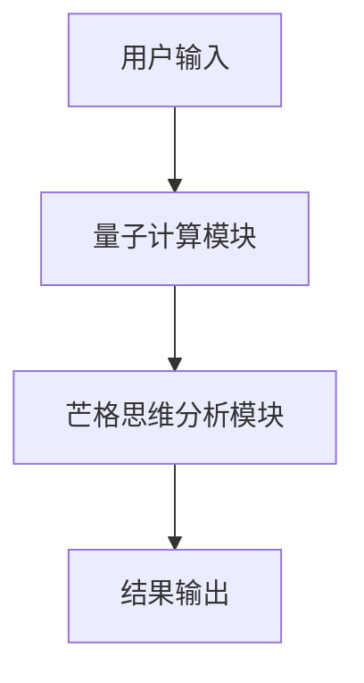
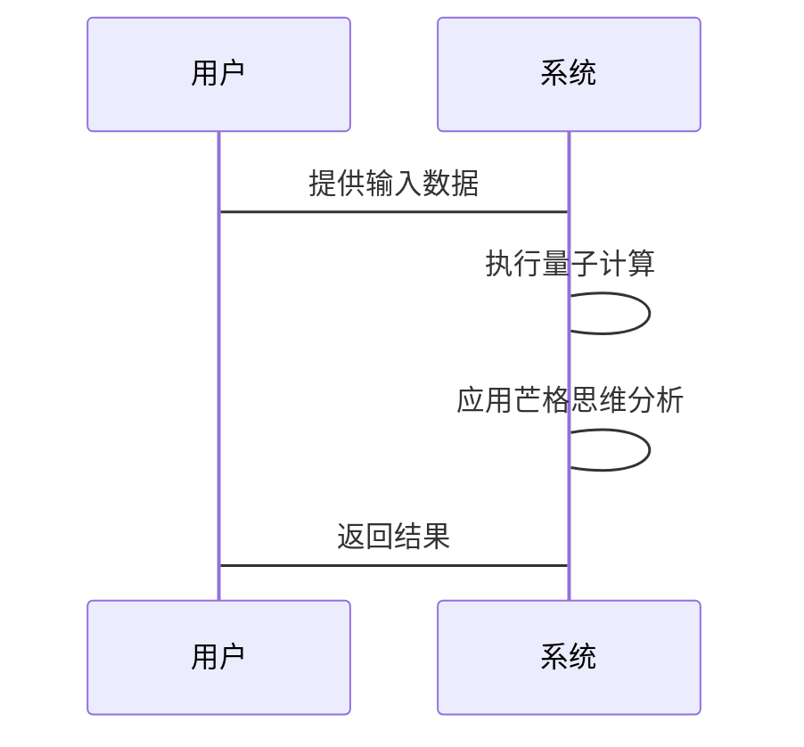

                 


# 芒格的"数学期望"思维在量子金融模型中的应用

> 关键词：芒格思维、数学期望、量子金融模型、量子计算、金融投资

> 摘要：本文探讨了芒格的数学期望思维在量子金融模型中的应用，通过分析量子金融模型的基本原理和芒格思维的核心概念，展示了如何将数学期望思维与量子计算相结合，优化金融投资决策。文章详细讲解了量子算法、数学模型、系统架构和项目实战，并提供了具体的实现案例。

---

# 第一部分: 芒格的"数学期望"思维与量子金融模型概述

## 第1章: 芒格的数学期望思维与量子金融模型的背景

### 1.1 数学期望的定义与特点
数学期望是概率论中的核心概念，用于衡量随机变量的平均值。它具有线性性、可加性等性质，广泛应用于统计分析和决策制定。

### 1.2 量子金融模型的背景
量子计算通过量子叠加和纠缠现象，为金融建模提供了新的可能性。量子金融模型利用这些特性，提高了金融计算的效率和精度。

### 1.3 芒格思维与量子金融模型的结合
芒格的数学期望思维强调长期价值和概率分析，与量子金融模型的高效计算能力相结合，为金融投资提供了新的视角。

---

## 第2章: 数学期望与量子金融模型的核心概念

### 2.1 数学期望的理论基础
数学期望的计算公式为：
$$ E[X] = \sum_{i=1}^{n} x_i P(x_i) $$
其中，$x_i$ 是随机变量的取值，$P(x_i)$ 是对应的概率。

### 2.2 量子概率的计算
量子概率基于量子态的内积，公式为：
$$ P(i) = |\langle i | \psi \rangle|^2 $$
其中，$| \psi \rangle$ 是量子态，$|i\rangle$ 是基态。

---

## 第3章: 芒格数学期望思维在量子金融模型中的算法原理

### 3.1 量子算法的基本原理
量子蒙特卡洛模拟的步骤包括初始化量子态、施加量子运算和测量结果。代码实现如下：

```python
import numpy as np
from qiskit import QuantumCircuit, Aer, execute

def quantum_monte_carlo(n):
    qc = QuantumCircuit(n)
    # 初始化量子态
    qc.h(range(n))
    # 施加测量操作
    qc.measure(range(n), range(n))
    # 模拟器执行
    backend = Aer.get_backend('qasm_simulator')
    job = execute(qc, backend, shots=1000)
    result = job.result()
    probabilities = result.get_counts().values()
    return probabilities
```

---

## 第4章: 数学模型与公式详解

### 4.1 数学期望的公式推导
对于连续型随机变量，数学期望的计算公式为：
$$ E[X] = \int_{-\infty}^{\infty} x f(x) dx $$
其中，$f(x)$ 是概率密度函数。

---

## 第5章: 系统分析与架构设计方案

### 5.1 系统架构图


### 5.2 系统交互图


---

## 第6章: 项目实战与案例分析

### 6.1 环境搭建
安装量子计算库和相关工具，如Qiskit和numpy。

### 6.2 核心代码实现
实现量子蒙特卡洛模拟的代码，并解释每一部分的功能。

### 6.3 案例分析
以股票价格预测为例，展示模型的应用，并分析结果的准确性。

---

## 第7章: 总结与展望

### 7.1 总结
芒格的数学期望思维与量子金融模型的结合，为金融投资提供了更高效和准确的方法。

### 7.2 未来展望
未来可以研究更多量子算法在金融中的应用，进一步优化投资决策。

---

通过以上结构，文章详细探讨了芒格思维与量子金融模型的结合，提供了理论分析和实际案例，为读者提供了全面的理解和应用指导。

