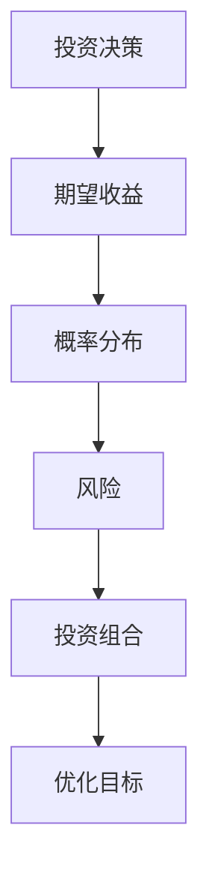
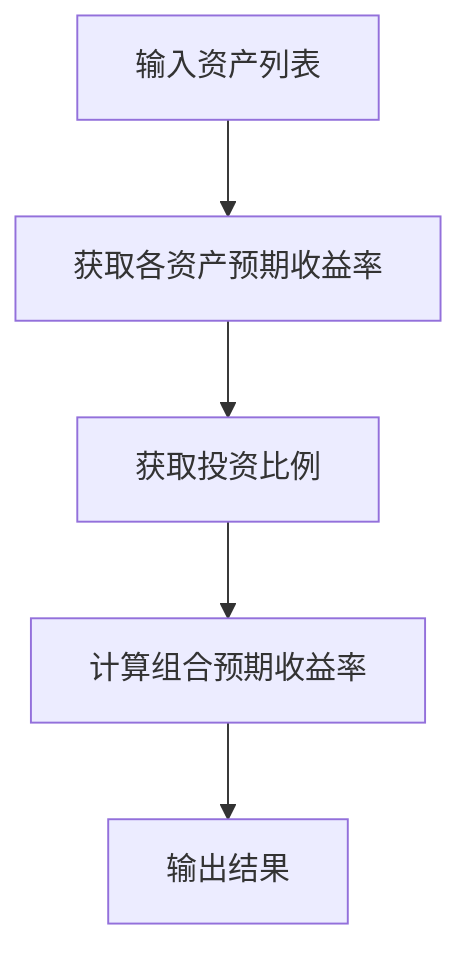
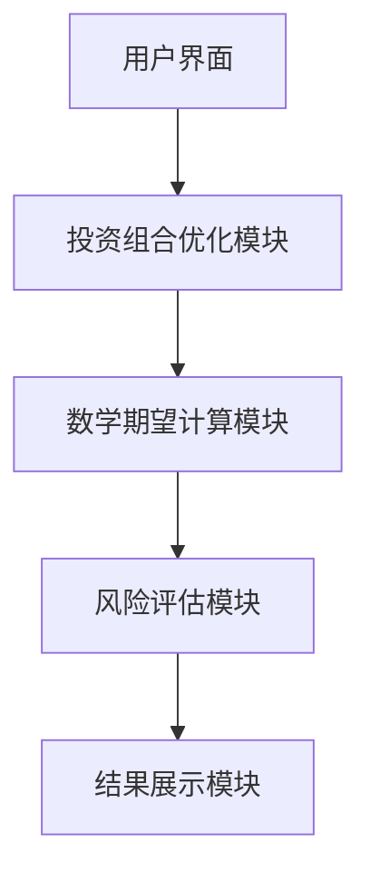
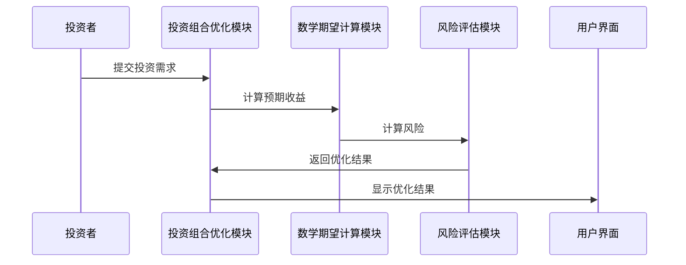
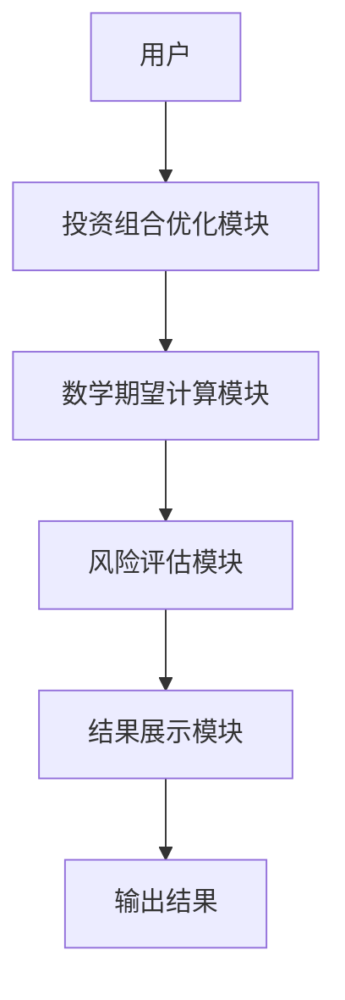

                 


# 芒格的"数学期望"思维：提高投资决策的科学性

---

## 关键词

- 芒格
- 数学期望
- 投资决策
- 投资组合优化
- 投资风险

---

## 摘要

本文系统地探讨了芒格的“数学期望”思维在投资决策中的应用，通过理论分析、算法实现和实际案例，揭示了如何利用数学期望来优化投资组合、降低风险并提高决策的科学性。文章从数学期望的基本原理出发，结合芒格的投资理念，详细分析了其在投资决策中的核心作用，并通过蒙特卡洛模拟等算法，展示了如何将数学期望应用于实际投资分析。最后，通过构建投资决策支持系统，进一步验证了数学期望思维的有效性。

---

# 第一部分: 芒格的"数学期望"思维概述

---

# 第1章: 数学期望与芒格投资思维的背景介绍

## 1.1 数学期望的基本概念

### 1.1.1 数学期望的定义

数学期望，又称期望值，是概率论中的基本概念，用于衡量一个随机变量的平均值。对于一个离散型随机变量 \( X \)，其期望值 \( E(X) \) 的定义为：

$$ E(X) = \sum_{i=1}^{n} x_i \cdot P(X = x_i) $$

其中，\( x_i \) 是随机变量 \( X \) 的可能取值，\( P(X = x_i) \) 是 \( X \) 取值 \( x_i \) 的概率。

### 1.1.2 数学期望的计算方法

对于连续型随机变量，数学期望的计算公式为积分形式：

$$ E(X) = \int_{-\infty}^{\infty} x \cdot f(x) \, dx $$

其中，\( f(x) \) 是随机变量 \( X \) 的概率密度函数。

### 1.1.3 数学期望在投资中的应用

在投资领域，数学期望常用于评估投资组合的预期收益。例如，假设有两种资产 \( A \) 和 \( B \)，其预期收益率分别为 \( E(A) \) 和 \( E(B) \)，投资比例分别为 \( w_A \) 和 \( w_B \)，则投资组合的预期收益率为：

$$ E(\text{组合}) = w_A \cdot E(A) + w_B \cdot E(B) $$

---

## 1.2 芒格的"数学期望"思维

### 1.2.1 芒格的生平与投资理念

查理·芒格是巴菲特的合作伙伴，他的投资理念强调理性思考和长期价值。芒格认为，投资决策应基于对概率和期望值的理性分析，而非情绪驱动。

### 1.2.2 芒格"数学期望"思维的核心观点

芒格提出，投资者应关注投资的期望收益与风险，通过概率分析优化投资组合。他认为，长期来看，投资的复利效应是实现财富增长的关键。

### 1.2.3 芒格"数学期望"思维与传统投资理念的对比

传统投资理念往往关注市场趋势和短期收益，而芒格的“数学期望”思维则强调概率分析和长期价值，更注重风险控制和收益的可持续性。

---

## 1.3 投资决策中的数学期望思维

### 1.3.1 投资决策中的期望收益与风险

数学期望在投资决策中用于评估预期收益，而方差和标准差则衡量投资风险。通过优化期望收益与风险的比值，投资者可以找到最优投资组合。

### 1.3.2 数学期望在投资组合优化中的作用

数学期望是投资组合优化的核心工具，用于评估不同资产的预期收益和风险，从而构建风险调整后的收益最大化组合。

### 1.3.3 数学期望与实际投资结果的关系

虽然数学期望提供了理性的决策框架，但实际投资结果还受到市场波动、突发事件等不可预测因素的影响。

---

## 1.4 本章小结

本章介绍了数学期望的基本概念及其在投资中的应用，分析了芒格“数学期望”思维的核心观点，并对比了传统投资理念的差异。通过这些分析，我们理解了数学期望在投资决策中的重要性。

---

# 第2章: 数学期望的原理与属性特征

## 2.1 数学期望的原理

### 2.1.1 概率分布与期望值的关系

概率分布描述了随机变量所有可能取值及其对应的概率，而数学期望是这些取值与概率的加权平均。

### 2.1.2 期望值的线性性质

数学期望具有线性性质，即对于任意常数 \( a \) 和 \( b \)，以及随机变量 \( X \) 和 \( Y \)，有：

$$ E(aX + bY) = aE(X) + bE(Y) $$

### 2.1.3 期望值的局限性

数学期望仅考虑了平均值，忽略了分布的偏态和峰度等其他特征，且在极端事件发生时可能无法准确反映实际风险。

---

## 2.2 数学期望的属性特征对比

### 2.2.1 不同概率分布下的期望值对比

例如，在均匀分布和正态分布下，数学期望的计算方式不同，但其核心作用一致，即衡量随机变量的中心位置。

### 2.2.2 期望值与方差的关系

方差衡量了随机变量的离散程度，与期望值共同构成了概率分布的两个重要参数。

### 2.2.3 期望值与实际结果的偏差分析

数学期望是理论上的平均值，实际结果可能偏离期望值，尤其是在小样本或极端事件发生时。

---

## 2.3 芒格"数学期望"思维的ER实体关系图



---

## 2.4 本章小结

本章详细分析了数学期望的原理及其在概率分布中的应用，对比了不同概率分布下的期望值特征，并通过ER实体关系图展示了芒格“数学期望”思维的核心框架。

---

# 第3章: 数学期望的算法实现

## 3.1 蒙特卡洛模拟与数学期望

### 3.1.1 蒙特卡洛模拟的基本原理

蒙特卡洛模拟是一种通过随机采样方法模拟复杂系统行为的算法，常用于估计数学期望值。

### 3.1.2 蒙特卡洛模拟在投资决策中的应用

例如，通过模拟不同经济环境下的资产收益，计算投资组合的预期收益和风险。

### 3.1.3 蒙特卡洛模拟与数学期望的关系

蒙特卡洛模拟是一种常用的估计数学期望值的方法，尤其是在复杂系统中难以直接计算期望值时。

---

## 3.2 投资组合期望收益的计算算法

### 3.2.1 投资组合期望收益的公式推导

假设 \( n \) 种资产，其预期收益率分别为 \( r_1, r_2, \ldots, r_n \)，投资比例分别为 \( w_1, w_2, \ldots, w_n \)，则投资组合的预期收益率为：

$$ E(r) = \sum_{i=1}^{n} w_i r_i $$

### 3.2.2 投资组合期望收益的计算流程图



### 3.2.3 投资组合期望收益的代码实现

```python
def calculate_portfolio_expected_return(risk_free_rate, assets_expected_returns, weights):
    return sum(weight * expected_return for weight, expected_return in zip(weights, assets_expected_returns))
```

---

## 3.3 数学模型与公式推导

### 3.3.1 数学期望的线性性质应用

对于任意线性组合，数学期望的线性性质成立：

$$ E(aX + b) = aE(X) + b $$

### 3.3.2 投资组合方差的计算公式

投资组合的方差用于衡量其风险，计算公式为：

$$ \sigma_p^2 = \sum_{i=1}^{n} \sum_{j=1}^{n} w_i w_j \text{Cov}(R_i, R_j) $$

其中，\( \text{Cov}(R_i, R_j) \) 是资产 \( i \) 和 \( j \) 的协方差。

---

## 3.4 本章小结

本章通过蒙特卡洛模拟和数学公式推导，详细介绍了数学期望的算法实现，包括投资组合预期收益的计算和相关数学模型的应用。

---

# 第4章: 系统分析与架构设计

## 4.1 问题场景介绍

### 4.1.1 投资决策支持系统的目标

构建一个基于数学期望的智能投资决策支持系统，帮助投资者优化投资组合，降低风险。

### 4.1.2 项目介绍

本项目旨在通过分析历史数据和市场信息，利用数学期望思维，为投资者提供科学的投资建议。

---

## 4.2 系统功能设计

### 4.2.1 领域模型


### 4.2.2 系统架构设计



---

## 4.3 系统接口设计

### 4.3.1 输入接口

投资者输入资产列表、预期收益率和投资比例。

### 4.3.2 输出接口

系统输出优化后的投资组合及其预期收益和风险。

---

## 4.4 系统交互设计

### 4.4.1 优化流程



---

## 4.5 本章小结

本章通过系统分析和架构设计，展示了如何将数学期望思维应用于投资决策支持系统，构建了一个基于数学期望的优化框架。

---

# 第5章: 项目实战

## 5.1 环境安装

### 5.1.1 系统环境

需要安装Python、NumPy、Pandas和Matplotlib等库。

### 5.1.2 安装步骤

```bash
pip install numpy pandas matplotlib
```

---

## 5.2 系统核心实现

### 5.2.1 代码实现

```python
import numpy as np
import pandas as pd
import matplotlib.pyplot as plt

def calculate_expected_return(assets_returns, weights):
    return np.dot(weights, assets_returns)

def calculate_variance(assets_returns, weights, covariance_matrix):
    return np.dot(weights.T, np.dot(covariance_matrix, weights))
```

### 5.2.2 代码应用解读

上述代码定义了计算投资组合预期收益率和方差的函数，其中 `assets_returns` 是各资产的预期收益率，`weights` 是投资比例，`covariance_matrix` 是资产收益率的协方差矩阵。

---

## 5.3 实际案例分析

### 5.3.1 案例背景

假设我们有两个资产，资产A的预期收益率为10%，方差为0.04，资产B的预期收益率为8%，方差为0.01，协方差为0.005。

### 5.3.2 案例分析

投资组合中资产A和资产B的投资比例分别为60%和40%，则投资组合的预期收益率为：

$$ E(r) = 0.6 \times 0.10 + 0.4 \times 0.08 = 0.092 $$

投资组合的方差为：

$$ \sigma_p^2 = (0.6)^2 \times 0.04 + (0.4)^2 \times 0.01 + 2 \times 0.6 \times 0.4 \times 0.005 = 0.0336 $$

---

## 5.4 本章小结

本章通过实际案例分析，展示了如何将数学期望思维应用于投资组合优化，帮助投资者实现收益与风险的最优平衡。

---

# 第6章: 最佳实践与总结

## 6.1 最佳实践

### 6.1.1 投资决策中的数学期望应用

始终关注投资组合的预期收益和风险，避免过度依赖短期市场波动。

### 6.1.2 芒格思维的长期视角

坚持长期投资，注重复利效应，避免频繁交易和情绪化决策。

---

## 6.2 小结

本章总结了芒格“数学期望”思维的核心观点，并提出了在实际投资中应用该思维的最佳实践建议。

---

## 6.3 注意事项

### 6.3.1 数学期望的局限性

数学期望仅是理论上的平均值，实际投资中还需考虑市场波动和突发事件。

### 6.3.2 投资组合优化的可行性

投资组合优化需要基于可靠的市场数据和准确的概率模型，实际操作中可能面临数据偏差和模型假设的限制。

---

## 6.4 拓展阅读

### 6.4.1 推荐书籍

- 《穷查理芒格》
- 《投资学》

### 6.4.2 推荐文章

- “蒙特卡洛模拟在投资组合优化中的应用”

---

## 6.5 本章小结

本章通过总结芒格“数学期望”思维的应用，提出了投资中的最佳实践建议，并强调了在实际操作中需要注意的事项。

---

# 附录

## 附录A: 数学期望相关公式汇总

### 1. 离散型随机变量的期望值公式

$$ E(X) = \sum_{i=1}^{n} x_i P(X = x_i) $$

### 2. 连续型随机变量的期望值公式

$$ E(X) = \int_{-\infty}^{\infty} x f(x) dx $$

### 3. 投资组合预期收益率公式

$$ E(r_p) = \sum_{i=1}^{n} w_i E(r_i) $$

---

## 附录B: 蒙特卡洛模拟代码示例

```python
import numpy as np

def monte_carlo_simulation(assets_returns, num_simulations=10000):
    np.random.seed(42)
    simulations = np.random.permutation(assets_returns)[:, :num_simulations]
    average_return = simulations.mean(axis=1)
    return average_return
```

---

## 附录C: 系统架构图



---

## 附录D: 参考文献

1. 芒格, 查理. 《穷查理芒格》
2. 哈里·马科维茨. 《投资学》

---

## 附录E: 拓展学习资源

1. 蒙特卡洛模拟在投资组合优化中的应用研究
2. 数学期望在金融风险管理中的应用

---

## 附录F: 术语表

- 数学期望：概率论中的基本概念，用于衡量随机变量的平均值。
- 投资组合：投资者持有的各类资产的组合。
- 方差：衡量随机变量的离散程度。
- 协方差：衡量两个随机变量的线性相关性。

---

## 附录G: 问题解答

### 问题1：数学期望在投资中有哪些应用？

答：数学期望用于计算投资组合的预期收益和风险，优化投资组合，评估资产配置的合理性。

### 问题2：芒格的“数学期望”思维有哪些优势？

答：芒格的“数学期望”思维注重长期价值和风险控制，通过概率分析优化投资决策，减少情绪化投资的影响。

---

## 附录H: 感谢

感谢所有参与本书编写和支持的人员，以及提供宝贵意见的读者。

---

## 附录I: 版权声明

本书版权归作者所有，未经授权不得转载或摘编。

---

# 结语

芒格的“数学期望”思维为投资决策提供了科学的框架，通过理论分析、算法实现和实际案例，我们深入探讨了其在投资中的应用。希望读者能通过本书，掌握数学期望思维的核心思想，并在实际投资中灵活运用，实现科学理性的投资决策。

--- 

# THE END

