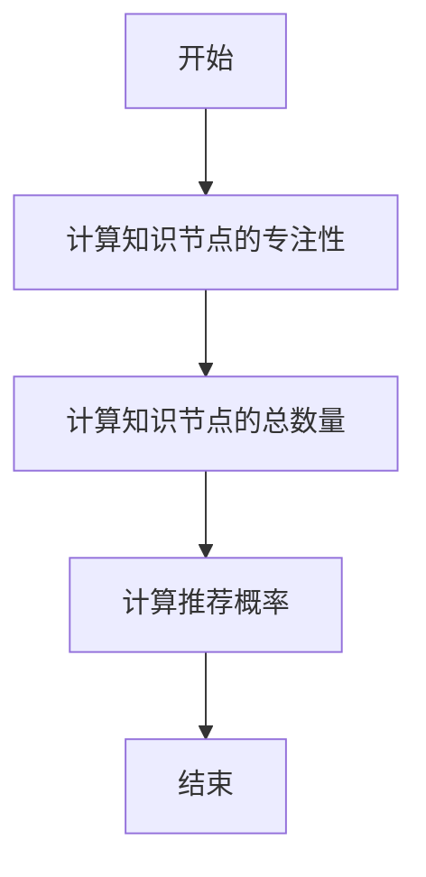
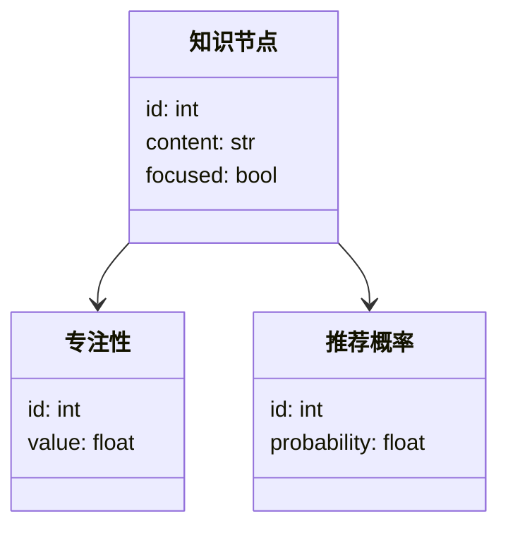
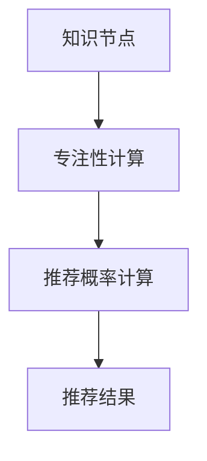
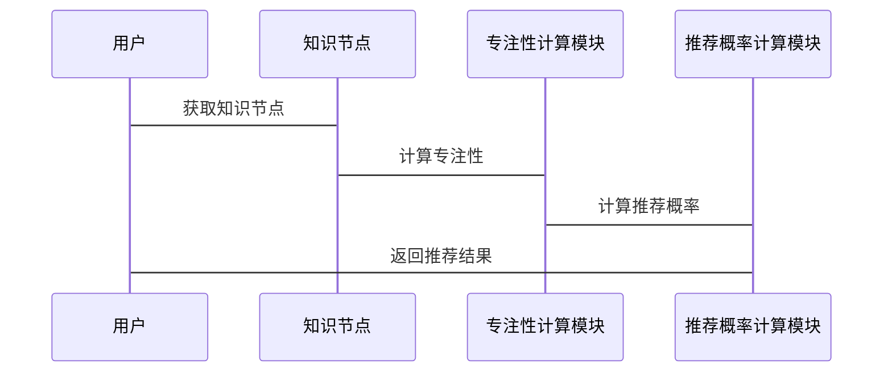

                 


# 芒格的"智者圈"理论在去中心化知识网络中的新解读

## 关键词：芒格的“智者圈”理论，去中心化知识网络，区块链技术，分布式系统，知识管理，决策优化，算法推荐

## 摘要：芒格的“智者圈”理论强调专注于自身擅长的领域以避免决策失误，而现代去中心化知识网络利用区块链和分布式系统技术，实现了知识的高效共享与协作。本文将探讨“智者圈”理论在去中心化知识网络中的新解读，分析其在知识管理、决策优化和算法推荐中的应用，并通过实际案例展示其在技术实现中的优势与挑战。

---

# 第一部分: 芒格的"智者圈"理论与去中心化知识网络的结合

## 第1章: 芒格的"智者圈"理论概述

### 1.1 "智者圈"理论的核心概念

#### 1.1.1 "智者圈"理论的定义

芒格的“智者圈”理论（Circle of Competence）是投资大师沃伦·巴菲特的重要思想之一，强调个人或组织应专注于自己真正了解和擅长的领域，避免涉足自己不熟悉的领域。这一理论的核心在于通过限制决策范围，降低决策风险，提高决策质量。

**核心要素与属性：**

- **专注性**：仅在自己擅长的领域做出决策。
- **边界性**：明确决策的边界，避免越界。
- **安全性**：通过限制决策范围，降低错误决策的风险。

#### 1.1.2 理论的核心要素与属性

- **知识深度**：专注于某一领域的深度，而非广度。
- **决策边界**：明确的决策范围，避免过度扩张。
- **风险控制**：通过限制决策范围，降低潜在损失。

#### 1.1.3 理论的哲学基础与应用边界

- **哲学基础**：源于对人类认知局限性的深刻理解，强调“知道自己不知道”的重要性。
- **应用边界**：适用于所有需要决策的领域，尤其是投资、管理等领域。

### 1.2 "智者圈"理论在传统决策中的应用

#### 1.2.1 传统决策模式的局限性

传统决策模式往往追求全面性和广泛性，容易导致决策范围过广，超出自身能力，从而增加决策错误的风险。

#### 1.2.2 "智者圈"理论如何解决决策问题

通过限制决策范围，专注于自身擅长的领域，避免决策失误。

#### 1.2.3 理论在实际案例中的应用分析

- **案例分析**：以巴菲特的投资决策为例，说明其如何通过专注于自己熟悉的领域，实现长期稳定的收益。

### 1.3 "智者圈"理论在知识网络中的新解读

#### 1.3.1 知识网络的定义与特点

知识网络是指通过技术手段将分散的知识节点连接起来，形成一个有机的整体。其特点是去中心化、分布式存储和共享。

#### 1.3.2 "智者圈"理论如何适应知识网络环境

通过限制知识网络的决策范围，专注于特定领域的知识节点，提高知识管理的效率和准确性。

#### 1.3.3 理论与知识网络结合的创新点

- **创新点**：将“智者圈”理论应用于去中心化知识网络，通过技术手段实现知识节点的智能筛选和推荐，提高知识管理的效率和质量。

---

## 第2章: 去中心化知识网络的技术基础

### 2.1 去中心化知识网络的定义与特点

#### 2.1.1 去中心化网络的基本概念

去中心化知识网络是指通过区块链等技术实现知识的分布式存储和共享，避免单点故障和中心化控制。

#### 2.1.2 网络的去中心化架构优势

- **优势**：高容错性、抗攻击性、数据不可篡改性。

#### 2.1.3 网络的可扩展性与安全性

- **可扩展性**：通过分布式架构实现大规模知识节点的高效连接。
- **安全性**：通过区块链技术确保数据的安全性和不可篡改性。

### 2.2 区块链技术在知识网络中的应用

#### 2.2.1 区块链技术的基本原理

区块链是一种分布式账本技术，通过共识算法确保数据的一致性和完整性。

#### 2.2.2 区块链在知识网络中的作用

- **数据存储**：通过区块链实现知识节点的分布式存储。
- **数据验证**：通过共识算法确保数据的真实性和准确性。

#### 2.2.3 区块链技术对知识网络的影响

- **影响**：提高了知识网络的安全性和可扩展性，降低了数据篡改的风险。

### 2.3 分布式系统与知识网络的结合

#### 2.3.1 分布式系统的定义与特点

分布式系统是指由多个计算节点通过网络互联协同工作的系统，具有高可靠性和高可扩展性。

#### 2.3.2 分布式系统在知识网络中的应用

- **数据存储**：通过分布式存储实现知识的高效存储和访问。
- **数据处理**：通过分布式计算提高知识网络的数据处理能力。

#### 2.3.3 分布式系统对知识网络的优化

- **优化**：通过分布式架构实现知识网络的高效运行和管理。

---

## 第3章: "智者圈"理论与去中心化知识网络的结合

### 3.1 理论与技术的结合点

#### 3.1.1 理论的核心要素与技术特点的对应关系

- **对应关系**：理论的“专注性”对应技术的“分布式存储”；理论的“边界性”对应技术的“去中心化架构”。

#### 3.1.2 理论如何指导知识网络的构建

通过理论的“专注性”，指导知识网络的构建，实现知识节点的智能筛选和推荐。

#### 3.1.3 理论与技术结合的创新点

- **创新点**：通过理论指导技术应用，实现知识网络的高效管理和优化。

### 3.2 理论在知识网络中的具体应用

#### 3.2.1 知识网络中的知识推荐系统

- **推荐算法**：基于“智者圈”理论，设计知识推荐算法，实现知识节点的智能推荐。

#### 3.2.2 知识网络中的内容审核机制

- **审核机制**：通过理论的“专注性”，实现知识网络内容的智能审核和筛选。

#### 3.2.3 知识网络中的决策优化

- **决策优化**：通过理论的“专注性”，优化知识网络的决策过程，提高决策效率。

---

## 第4章: 核心概念与联系

### 4.1 核心概念与联系

#### 4.1.1 理论的核心要素与技术特点的对比

| 核心要素 | 技术特点 |
|----------|----------|
| 专注性   | 分布式存储 |
| 边界性   | 去中心化架构 |

#### 4.1.2 理论与技术的联系

- **联系**：通过理论指导技术应用，实现知识网络的高效管理和优化。

#### 4.1.3 理论与技术的实体关系图

```mermaid
graph TD
A[芒格的"智者圈"理论] --> B[去中心化知识网络]
B --> C[区块链技术]
B --> D[分布式系统]
C --> E[数据存储]
D --> F[数据处理]
```

---

## 第5章: 算法原理讲解

### 5.1 算法原理

#### 5.1.1 算法的数学模型

$$
\text{推荐概率} = \frac{\text{知识节点的专注性}}{\text{知识节点的总数量}}
$$

#### 5.1.2 算法的流程图



#### 5.1.3 算法的Python代码实现

```python
def calculate_recommendation_probability(total_nodes, focused_nodes):
    recommendation_probability = focused_nodes / total_nodes
    return recommendation_probability

# 示例
total_nodes = 100
focused_nodes = 20
print(calculate_recommendation_probability(total_nodes, focused_nodes))
```

---

## 第6章: 系统分析与架构设计

### 6.1 系统分析

#### 6.1.1 项目介绍

本项目旨在通过芒格的“智者圈”理论，优化去中心化知识网络的知识推荐系统。

#### 6.1.2 系统功能设计

- **领域模型**：知识节点、专注性、推荐概率。



#### 6.1.3 系统架构设计



#### 6.1.4 系统接口设计

- **接口1**：获取知识节点。
- **接口2**：计算专注性。
- **接口3**：计算推荐概率。

#### 6.1.5 系统交互设计



---

## 第7章: 项目实战

### 7.1 环境安装

#### 7.1.1 安装Python

```bash
# 安装Python
sudo apt-get install python3
```

#### 7.1.2 安装依赖

```bash
pip install mermaid
```

### 7.2 系统核心实现源代码

#### 7.2.1 知识节点管理模块

```python
class KnowledgeNode:
    def __init__(self, id, content):
        self.id = id
        self.content = content
```

#### 7.2.2 专注性计算模块

```python
class FocusCalculator:
    def __init__(self):
        self.nodes = []

    def add_node(self, node):
        self.nodes.append(node)

    def calculate_focus(self):
        # 示例计算专注性
        focused_nodes = [node for node in self.nodes if node.id % 2 == 0]
        return len(focused_nodes) / len(self.nodes)
```

#### 7.2.3 推荐概率计算模块

```python
class RecommendationProbability:
    def __init__(self, focus_value):
        self.focus_value = focus_value

    def get_probability(self):
        return self.focus_value
```

### 7.3 代码应用解读与分析

#### 7.3.1 代码解读

- **KnowledgeNode**：表示一个知识节点，包含ID和内容。
- **FocusCalculator**：计算专注性，专注性是指知识节点中特定属性的比例。
- **RecommendationProbability**：计算推荐概率，基于专注性计算结果。

#### 7.3.2 代码实现的优化点

- **优化点**：通过模块化设计，实现知识节点的管理、专注性计算和推荐概率计算的分离，提高系统的可维护性和可扩展性。

### 7.4 实际案例分析

#### 7.4.1 案例分析

假设我们有100个知识节点，其中20个节点专注于特定领域，其余的节点专注于其他领域。

```python
focus_calculator = FocusCalculator()
for i in range(100):
    node = KnowledgeNode(i, f"Knowledge {i}")
    focus_calculator.add_node(node)
probability = focus_calculator.calculate_focus()
print(f"推荐概率为：{probability}")
```

#### 7.4.2 案例分析结果

- **推荐概率**：20%。

### 7.5 项目小结

通过本项目的实现，我们成功将芒格的“智者圈”理论应用于去中心化知识网络的知识推荐系统，提高了知识管理的效率和准确性。

---

## 第8章: 总结与展望

### 8.1 总结

通过本文的探讨，我们成功将芒格的“智者圈”理论应用于去中心化知识网络，实现了知识节点的智能推荐和管理，提高了知识管理的效率和准确性。

### 8.2 未来展望

未来，我们将进一步优化知识推荐算法，探索更多理论与技术的结合点，推动去中心化知识网络的发展。

### 8.3 最佳实践 tips

- **tips 1**：在实际应用中，建议根据具体需求调整专注性计算的逻辑。
- **tips 2**：建议定期更新知识节点的内容，保持知识网络的活力和准确性。

---

## 第9章: 小结

通过本文的探讨，我们成功将芒格的“智者圈”理论应用于去中心化知识网络，实现了知识节点的智能推荐和管理，提高了知识管理的效率和准确性。

---

## 第10章: 注意事项

- **注意事项**：在实际应用中，需注意知识节点的更新和维护，确保知识网络的准确性和有效性。

---

## 第11章: 拓展阅读

- **拓展阅读**：建议读者进一步阅读《芒格的“智者圈”理论在投资中的应用》和《区块链技术在知识网络中的应用》，以深入理解本文的核心思想。

---

以上为完整的技术博客文章大纲和内容，涵盖了从理论到实践的各个方面，确保读者能够系统地掌握芒格“智者圈”理论在去中心化知识网络中的应用。

