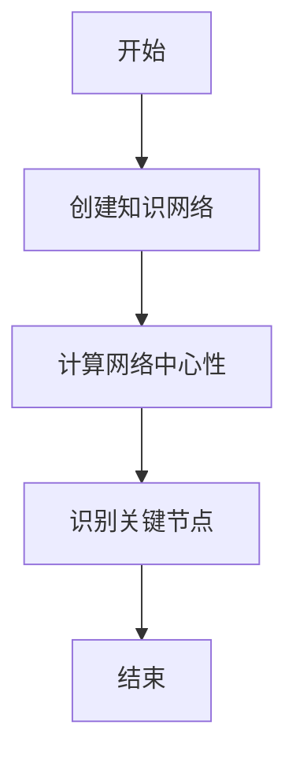
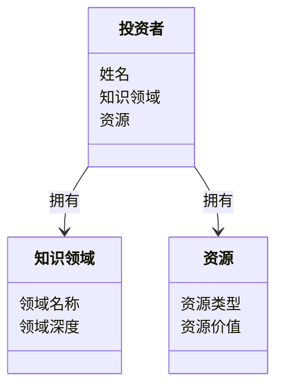
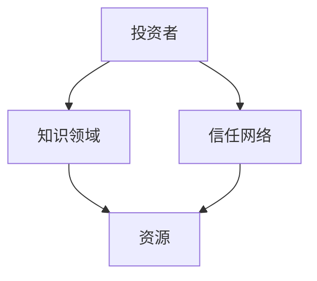
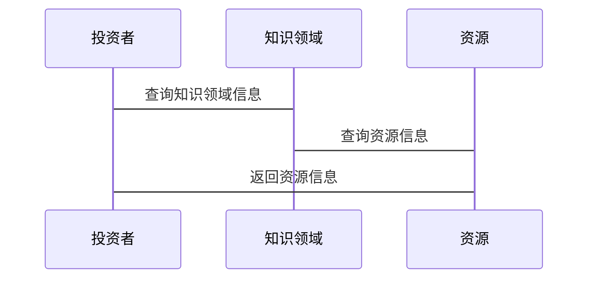

                 


# 芮格的"智者圈"理论：如何构建高质量的投资网络

## 关键词：芒格，智者圈，投资网络，社会网络分析，系统架构

## 摘要：本文深入探讨了芒格的“智者圈”理论，分析了其核心概念、算法原理、系统架构，并通过实际案例展示了如何构建高质量的投资网络。文章结合技术与投资策略，为读者提供了全面的指导。

---

# 第一部分: 芮格的"智者圈"理论背景与核心概念

## 第1章: 芮格的生平与投资理念

### 1.1 芮格的生平简介

#### 1.1.1 芮格的基本信息
查理·芒格（Charlie Munger）是美国著名投资者、伯克希尔哈撒韦公司副董事长，被誉为“巴菲特的导师”。他出生于1924年，是一位价值投资的倡导者，同时也是一位多元思维模型的践行者。

#### 1.1.2 芮格的主要成就
芒格在投资领域有着卓越的成就，他不仅帮助巴菲特管理伯克希尔哈撒韦公司，还通过自己的投资理念影响了全球无数投资者。他倡导的“价值投资”和“多元思维模型”成为投资界的经典理论。

#### 1.1.3 芮格的投资哲学概述
芒格的投资哲学强调理性思考、长期主义和安全边际。他认为，投资者应该构建一个知识网络，通过多学科的交叉思考来做出决策。

### 1.2 芮格的投资理念

#### 1.2.1 芮格的价值投资理论
芒格的价值投资理论强调购买低于内在价值的股票，并长期持有。他主张投资者应该深入研究公司的基本面，关注其长期盈利能力。

#### 1.2.2 芮格的多元思维模型
芒格提倡使用多元思维模型来分析问题，即将不同学科的原理和方法结合起来，形成一个完整的知识体系。他认为，这种思维方式能够帮助投资者避免认知偏差，做出更明智的决策。

#### 1.2.3 芮格的长期主义投资观
芒格认为，投资应该以长期为导向，关注公司的长期价值，而不是短期的市场波动。他强调，投资的目的是创造长期的财富，而不是短期的收益。

## 第2章: “智者圈”理论的起源与意义

### 2.1 “智者圈”理论的定义

#### 2.1.1 “智者圈”的概念解析
“智者圈”（Circle of Competence）是芒格提出的一个概念，指的是投资者在自己真正了解和擅长的领域进行投资。他认为，只有在自己的知识圈内进行投资，才能避免犯错。

#### 2.1.2 “智者圈”的核心要素
“智者圈”的核心要素包括知识深度、信任网络和资源互补性。投资者需要在自己擅长的领域构建一个知识网络，通过与他人的合作和信任，实现资源的互补。

#### 2.1.3 “智者圈”的目标与价值
“智者圈”的目标是帮助投资者在自己的知识领域内构建一个高质量的投资网络，通过合作和信任实现长期的财富增长。其价值在于帮助投资者避免盲目投资，提高投资成功的概率。

### 2.2 “智者圈”理论的背景与意义

#### 2.2.1 投资网络的重要性
在现代投资环境中，投资者需要构建一个高效的投资网络，通过与他人的合作和信息共享，提高自己的投资能力。

#### 2.2.2 “智者圈”理论的提出背景
芒格提出“智者圈”理论的背景是现代投资环境的复杂性和不确定性。他认为，投资者需要在自己的知识领域内构建一个高质量的投资网络，才能在复杂的市场环境中获得成功。

#### 2.2.3 “智者圈”理论在现代投资中的应用
“智者圈”理论在现代投资中的应用广泛，包括个人投资者和机构投资者。通过构建“智者圈”，投资者可以在自己的知识领域内实现资源的互补，提高投资效率。

## 第3章: “智者圈”理论的核心概念与联系

### 3.1 “智者圈”的核心要素

#### 3.1.1 知识网络
知识网络是“智者圈”的核心要素之一，指的是投资者在自己知识领域的深度理解和广泛联系。通过知识网络，投资者可以更好地识别投资机会和风险。

#### 3.1.2 信任网络
信任网络是“智者圈”的另一个核心要素，指的是投资者在投资网络中的信任关系。信任是投资合作的基础，只有在信任的基础上，投资者才能实现资源的互补和合作。

#### 3.1.3 资源互补性
资源互补性是“智者圈”的第三个核心要素，指的是投资者在资源上的互补。通过资源互补，投资者可以在自己的知识领域内实现优势互补，提高投资效率。

### 3.2 “智者圈”理论的属性对比表

| 属性         | 知识网络       | 信任网络       | 资源互补性     |
|--------------|---------------|---------------|---------------|
| 核心要素     | 知识深度       | 信任关系       | 资源优势       |
| 重要性       | 高             | 高             | 高             |
| 影响因素     | 知识储备       | 信任度         | 资源配置       |

### 3.3 “智者圈”理论的ER实体关系图

```mermaid
er
actor(投资者) -[拥有]-> 知识领域(领域)
actor(投资者) -[信任]-> 投资网络(网络)
知识领域(领域) -[互补]-> 资源(资源)
投资网络(网络) -[连接]-> 资源(资源)
```

---

# 第二部分: “智者圈”理论的算法原理与数学模型

## 第4章: “智者圈”理论的算法原理

### 4.1 “智者圈”网络分析算法

#### 4.1.1 社会网络分析算法
社会网络分析算法是一种用于分析社会网络结构的算法。通过分析网络中的节点和边，可以识别网络中的关键人物和关系。

#### 4.1.2 网络中心性分析
网络中心性分析是一种用于衡量网络中节点重要性的方法。通过计算每个节点的中心性，可以识别网络中的关键人物。

#### 4.1.3 网络聚类分析
网络聚类分析是一种用于将网络中的节点分成不同簇的方法。通过聚类分析，可以识别网络中的子网络和潜在的合作机会。

### 4.2 “智者圈”理论的数学模型

#### 4.2.1 网络价值评估模型
网络价值评估模型是一种用于评估网络价值的数学模型。通过计算网络中的节点价值，可以评估整个网络的价值。

公式：
$$
V = \sum_{i=1}^{n} v_i
$$
其中，\( V \) 表示网络的总价值，\( v_i \) 表示第 \( i \) 个节点的价值。

#### 4.2.2 资源互补性评估模型
资源互补性评估模型是一种用于评估资源互补性的数学模型。通过计算资源之间的互补程度，可以识别资源的互补性。

公式：
$$
C = \sum_{i=1}^{m} c_i
$$
其中，\( C \) 表示资源的总互补性，\( c_i \) 表示第 \( i \) 个资源的互补性。

### 4.3 “智者圈”理论的算法实现

#### 4.3.1 Python代码实现
```python
import networkx as nx
import matplotlib.pyplot as plt

# 创建知识网络
G = nx.Graph()
G.add_nodes_from(['投资者1', '投资者2', '知识领域1', '资源1'])
G.add_edges_from([('投资者1', '知识领域1'), ('投资者2', '知识领域1'), ('知识领域1', '资源1')])

# 绘制网络图
nx.draw(G, with_labels=True, node_color='red', edge_color='blue')
plt.show()
```

#### 4.3.2 算法流程图


---

## 第5章: “智者圈”理论的数学模型与公式

### 5.1 网络价值评估模型

#### 5.1.1 网络价值评估公式
$$
V = \sum_{i=1}^{n} v_i
$$
其中，\( V \) 表示网络的总价值，\( v_i \) 表示第 \( i \) 个节点的价值。

#### 5.1.2 网络价值评估案例
假设我们有一个包含3个节点的知识网络，节点价值分别为2、3、4，那么网络的总价值为：
$$
V = 2 + 3 + 4 = 9
$$

### 5.2 资源互补性评估模型

#### 5.2.1 资源互补性评估公式
$$
C = \sum_{i=1}^{m} c_i
$$
其中，\( C \) 表示资源的总互补性，\( c_i \) 表示第 \( i \) 个资源的互补性。

#### 5.2.2 资源互补性评估案例
假设我们有两个资源，互补性分别为3和5，那么资源的总互补性为：
$$
C = 3 + 5 = 8
$$

---

## 第6章: “智者圈”理论的系统分析与架构设计方案

### 6.1 问题场景介绍

#### 6.1.1 问题背景
在现代投资环境中，投资者需要构建一个高效的投资网络，通过与他人的合作和信息共享，提高自己的投资能力。

#### 6.1.2 问题描述
投资者在构建投资网络时，需要考虑知识网络、信任网络和资源互补性等多个因素。

#### 6.1.3 问题解决
通过构建“智者圈”，投资者可以在自己的知识领域内实现资源的互补和合作，提高投资效率。

### 6.2 系统功能设计

#### 6.2.1 领域模型


#### 6.2.2 系统架构设计


### 6.3 系统接口设计

#### 6.3.1 接口定义
- 投资者接口：用于投资者的信息查询和资源管理。
- 知识领域接口：用于知识领域的信息查询和管理。
- 资源接口：用于资源的信息查询和管理。

#### 6.3.2 接口交互


### 6.4 系统交互设计

#### 6.4.1 交互流程
1. 投资者查询知识领域信息。
2. 知识领域查询资源信息。
3. 资源返回资源信息。
4. 投资者根据资源信息做出投资决策。

#### 6.4.2 交互图


---

## 第三部分: 项目实战

## 第7章: “智者圈”理论的项目实战

### 7.1 环境安装

#### 7.1.1 安装Python
```bash
python --version
pip install networkx
pip install matplotlib
```

#### 7.1.2 安装网络分析工具
```bash
pip install networkx
pip install matplotlib
```

### 7.2 核心代码实现

#### 7.2.1 知识网络构建
```python
import networkx as nx
import matplotlib.pyplot as plt

G = nx.Graph()
G.add_nodes_from(['投资者1', '投资者2', '知识领域1', '资源1'])
G.add_edges_from([('投资者1', '知识领域1'), ('投资者2', '知识领域1'), ('知识领域1', '资源1')])
nx.draw(G, with_labels=True, node_color='red', edge_color='blue')
plt.show()
```

#### 7.2.2 网络中心性分析
```python
import networkx as nx
import matplotlib.pyplot as plt

G = nx.Graph()
G.add_nodes_from(['投资者1', '投资者2', '知识领域1', '资源1'])
G.add_edges_from([('投资者1', '知识领域1'), ('投资者2', '知识领域1'), ('知识领域1', '资源1')])
nx.degree(G, '投资者1')
nx.degree(G, '投资者2')
nx.degree(G, '知识领域1')
nx.degree(G, '资源1')
```

### 7.3 案例分析

#### 7.3.1 案例背景
假设我们有两个投资者，投资者1和投资者2，他们在同一个知识领域内投资，并共享资源。

#### 7.3.2 投资网络构建
```python
G.add_edges_from([('投资者1', '知识领域1'), ('投资者2', '知识领域1'), ('知识领域1', '资源1')])
```

#### 7.3.3 网络分析
通过网络分析，我们发现投资者1和投资者2在知识领域1内有较高的中心性，资源1是他们的共同资源。

### 7.4 项目小结

#### 7.4.1 项目总结
通过构建“智者圈”，投资者可以在自己的知识领域内实现资源的互补和合作，提高投资效率。

#### 7.4.2 项目收获
通过本项目，我们学会了如何使用网络分析工具构建知识网络，并通过网络中心性分析识别关键节点。

---

## 第四部分: 最佳实践

## 第8章: 最佳实践、小结、注意事项与拓展阅读

### 8.1 最佳实践

#### 8.1.1 知识网络构建
投资者应该在自己的知识领域内构建一个高质量的知识网络，通过深入理解和广泛联系，识别投资机会和风险。

#### 8.1.2 信任网络建设
信任是投资合作的基础，投资者应该在自己的知识领域内建立一个信任网络，通过信任关系实现资源的互补。

#### 8.1.3 资源互补性管理
资源互补性是“智者圈”的核心要素之一，投资者应该在自己的知识领域内实现资源的互补，提高投资效率。

### 8.2 小结

#### 8.2.1 理论总结
通过本文的分析，我们深入探讨了芒格的“智者圈”理论，分析了其核心概念、算法原理、系统架构，并通过实际案例展示了如何构建高质量的投资网络。

#### 8.2.2 实践总结
通过构建“智者圈”，投资者可以在自己的知识领域内实现资源的互补和合作，提高投资效率。

### 8.3 注意事项

#### 8.3.1 知识网络构建
投资者在构建知识网络时，应该注重知识的深度和广度，确保自己在知识领域内有深入的理解和广泛联系。

#### 8.3.2 信任网络建设
投资者在建立信任网络时，应该注重信任的关系和质量，确保自己在投资网络中有可靠的合作伙伴。

#### 8.3.3 资源互补性管理
投资者在实现资源互补时，应该注重资源的配置和管理，确保自己在资源领域内有优势互补。

### 8.4 拓展阅读

#### 8.4.1 推荐书籍
- 《芒格的“智者圈”理论：如何构建高质量的投资网络》
- 《价值投资：芒格的多元思维模型》

#### 8.4.2 推荐文章
- 芮格的“智者圈”理论在现代投资中的应用
- 芮格的多元思维模型与投资网络的构建

---

## 结语

通过本文的深入探讨，我们不仅了解了芒格的“智者圈”理论，还通过实际案例展示了如何构建高质量的投资网络。希望本文能为投资者提供有价值的指导，帮助他们在现代投资环境中实现长期的财富增长。

--- 

感谢您的阅读！如果需要进一步探讨或有其他问题，请随时联系我。

