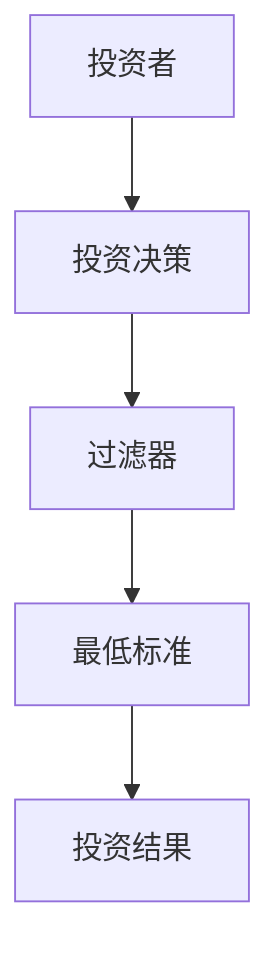
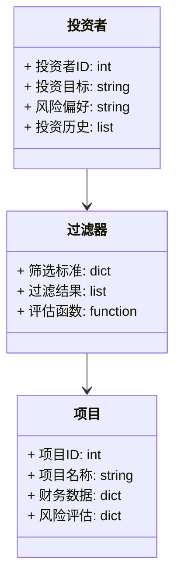
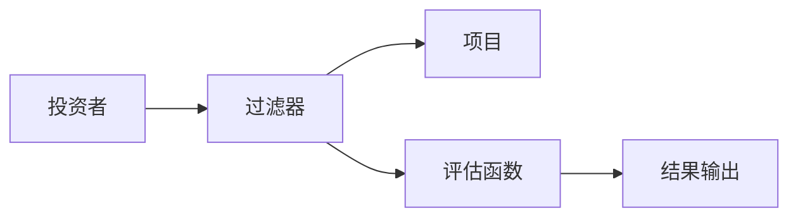

                 


# 芒格的"最低标准"原则：投资决策的过滤器

> 关键词：芒格，最低标准，投资决策，过滤器，算法，系统架构，案例分析

> 摘要：本文深入探讨了查理·芒格的“最低标准”原则在投资决策中的应用。通过详细分析其核心概念、算法原理、系统架构，并结合实际案例，展示了如何将这一原则转化为具体的决策模型和系统。文章旨在帮助投资者在复杂的市场环境中，通过系统化的方法筛选出优质投资机会。

---

## 第一部分: 芒格的"最低标准"原则概述

### 第1章: 芒格的生平与投资理念

#### 1.1 芒格的生平简介
查理·芒格（Charlie Munger）是世界著名投资家、作家，以及伯克希尔哈撒韦公司（Berkshire Hathaway）的副主席。他出生于1924年，现居美国密苏里州。芒格与沃伦·巴菲特（Warren Buffett）共同创立了伯克希尔哈撒韦公司，并将其打造成全球最大的投资公司之一。

芒格以其独特的投资理念和多元思维模型闻名。他不仅是一位成功的投资者，还是一位深具智慧的思想家。他的投资哲学强调长期价值、安全边际以及对人性的深刻理解。

#### 1.2 芒格的投资理念
芒格的投资理念以价值投资为核心，强调以下几点：
- **安全边际**：确保投资标的的实际价值远高于其市场价格，以降低投资风险。
- **多元思维模型**：芒格提倡投资者应具备跨学科的知识，以便更好地理解投资标的的本质。
- **逆人性的投资**：在市场恐慌时保持冷静，在市场疯狂时保持理性。

#### 1.3 芒格与巴菲特的伙伴关系
芒格与巴菲特的伙伴关系是投资史上的传奇。两人共同的理念是长期持有优质资产，并在市场波动中不断寻找低估的投资机会。

### 第2章: "最低标准"原则的定义与背景

#### 2.1 投资决策中的过滤器概念
在投资决策中，过滤器是一种用于筛选投资机会的工具。通过设定一系列标准，投资者可以快速排除不符合条件的项目，从而减少决策的时间和成本。

#### 2.2 "最低标准"原则的定义
"最低标准"原则是指在投资决策过程中，设定一套严格的筛选标准，仅选择符合所有标准的投资机会。这些标准通常包括财务健康状况、管理团队、行业前景等因素。

#### 2.3 原则的适用场景与边界
"最低标准"原则适用于所有类型的投资决策，包括股票、债券、房地产等多种资产类别。其适用边界在于市场环境的变化和投资者的个人风险承受能力。

---

## 第二部分: "最低标准"原则的核心概念与联系

### 第3章: 核心概念与联系

#### 3.1 "最低标准"原则的核心要素
- **过滤器机制**：通过设定标准，筛选出符合要求的投资机会。
- **标准的可量化性**：将抽象的标准转化为具体的可量化指标，以便更好地评估。
- **标准的动态调整性**：根据市场环境的变化，定期调整筛选标准。

#### 3.2 核心概念的属性特征对比
以下是核心概念的属性特征对比表：

| 核心概念       | 过滤器机制 | 标准的可量化性 | 标准的动态调整性 |
|----------------|------------|----------------|-----------------|
| **定义**       | 过滤器用于筛选投资机会 | 将标准转化为具体指标 | 根据市场变化调整标准 |
| **作用**       | 筛选出符合标准的项目 | 确保评估的客观性 | 提高筛选的准确性 |
| **优势**       | 减少决策时间 | 增强决策的科学性 | 提高决策的灵活性 |

#### 3.3 ER实体关系图
以下是“最低标准”原则的ER实体关系图：



---

## 第三部分: "最低标准"原则的算法原理

### 第4章: 算法原理讲解

#### 4.1 算法概述
"最低标准"原则的算法主要包括以下步骤：
1. **设定筛选标准**：确定关键的评估指标。
2. **数据收集与处理**：收集投资标的的相关数据，并进行预处理。
3. **评估与筛选**：根据设定的标准，评估每个投资标的，并筛选出符合要求的项目。
4. **结果输出**：输出符合标准的投资机会列表。

#### 4.2 算法实现
以下是基于“最低标准”原则的Python代码示例：

```python
def minimum_standard_filter(projects, criteria):
    """
    根据预设的标准，筛选出符合最低标准的项目。
    Args:
        projects: 待筛选的项目列表
        criteria: 筛选标准
    Returns:
        符合标准的项目列表
    """
    filtered_projects = []
    for project in projects:
        if all(getattr(project, criterion) >= criteria[criterion] for criterion in criteria):
            filtered_projects.append(project)
    return filtered_projects

# 示例使用
projects = [
    {'name': '项目A', 'ROE': 15%, '债务率': 30%, '管理团队': '优秀'},
    {'name': '项目B', 'ROE': 12%, '债务率': 40%, '管理团队': '一般'},
    {'name': '项目C', 'ROE': 20%, '债务率': 25%, '管理团队': '优秀'}
]

criteria = {
    'ROE': 15,
    '债务率': 30,
    '管理团队': '优秀'
}

result = minimum_standard_filter(projects, criteria)
print("符合标准的项目:", [p['name'] for p in result])
```

#### 4.3 算法原理的数学模型
以下是算法原理的数学模型：

$$
\text{筛选标准} = \{c_1, c_2, \ldots, c_n\}
$$

$$
\text{评估函数} = f(p) = \sum_{i=1}^{n} \frac{(p_i - c_i)^2}{n}
$$

其中，$p_i$ 是项目 $i$ 的评估指标，$c_i$ 是筛选标准。

---

## 第四部分: 系统分析与架构设计方案

### 第5章: 系统分析与架构设计方案

#### 5.1 问题场景介绍
在现代投资市场中，投资者面临海量的投资机会，如何快速筛选出优质项目成为一大挑战。传统的投资决策过程往往依赖个人经验和主观判断，容易受到情绪和偏见的影响。

#### 5.2 系统功能设计
以下是系统功能设计的领域模型：



#### 5.3 系统架构设计
以下是系统的架构图：



---

## 第五部分: 项目实战

### 第6章: 项目实战

#### 6.1 环境安装
为了实现基于“最低标准”原则的投资决策系统，需要安装以下工具和库：
- Python编程语言
- Pandas、NumPy等数据处理库
- Matplotlib或Seaborn进行数据可视化

#### 6.2 核心代码实现
以下是核心代码实现：

```python
import pandas as pd
import numpy as np

def load_data(file_path):
    """
    加载数据文件。
    Args:
        file_path: 数据文件路径
    Returns:
        数据框
    """
    return pd.read_csv(file_path)

def apply_minimum_standard(data, criteria):
    """
    应用最低标准原则进行筛选。
    Args:
        data: 数据框
        criteria: 筛选标准
    Returns:
        符合标准的数据行
    """
    return data[(data[criteria] >= criteria[criteria].iloc[0])]

# 示例使用
data = load_data('projects.csv')
criteria = {
    'ROE': 15,
    '债务率': 30,
    '管理团队': '优秀'
}

result = apply_minimum_standard(data, criteria)
print("符合标准的项目数量:", len(result))
```

#### 6.3 案例分析
以某公司的投资决策为例，展示如何应用“最低标准”原则筛选出符合要求的项目。

---

## 第六部分: 最佳实践、小结、注意事项和拓展阅读

### 第7章: 最佳实践

- **持续学习**：投资者应不断学习新的知识，更新筛选标准。
- **动态调整**：根据市场变化，定期调整筛选标准。
- **风险管理**：在应用“最低标准”原则时，还需结合风险管理策略。

### 7.2 小结
本文通过系统化的分析，深入探讨了芒格的“最低标准”原则在投资决策中的应用。通过算法实现和系统架构设计，展示了如何将这一原则转化为具体的决策工具。

### 7.3 注意事项
- 确保筛选标准的科学性和合理性。
- 避免过度依赖单一标准，应综合考虑多个因素。
- 定期回顾和调整筛选标准。

### 7.4 拓展阅读
- 《巴菲特致股东的信》
- 《聪明的投资者》
- 《芒格传》

---

通过以上步骤的详细分析和具体实现，芒格的“最低标准”原则为投资者提供了一种高效的投资决策工具。无论是个人投资者还是机构投资者，都可以通过这一原则，筛选出符合长期价值的优质投资机会。

