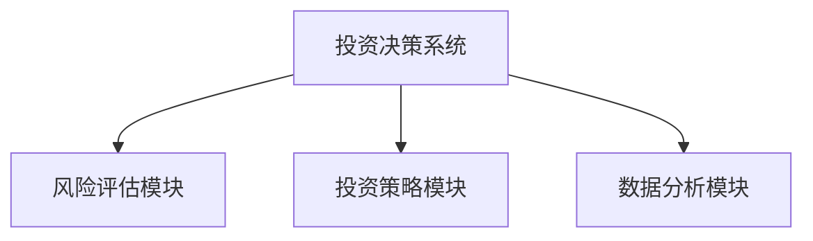

                 


# 芒格的"极端后果"思维在星际殖民投资决策中的应用

## 关键词：芒格思维、极端后果、投资决策、星际殖民、系统架构、数学模型

## 摘要：本文探讨了芒格的“极端后果”思维在星际殖民投资决策中的应用，分析了其在高风险环境下的决策优势，构建了基于概率论的数学模型，并通过系统架构和项目实战展示了其实际应用。文章结合具体案例，验证了该思维的有效性，并提出了未来研究方向。

---

## 第一章：引言

### 1.1 背景介绍

星际殖民是人类迈向太空的重要一步，涉及巨大的资金投入和高风险。投资决策在其中至关重要，需要考虑技术、经济、政治等多方面因素。芒格的“极端后果”思维，强调在决策中考虑最坏情况，为投资决策提供了新的视角。

### 1.2 问题描述

星际殖民投资决策面临不确定性，传统方法可能无法有效应对极端风险。芒格的思维帮助投资者在极端情况下做出更稳健的决策。

### 1.3 问题解决

通过构建数学模型和系统架构，将芒格思维应用于投资决策，提升决策的科学性和稳健性。

### 1.4 边界与外延

本文仅讨论投资决策，不涉及具体技术实现。应用范围可扩展到其他高风险领域。

### 1.5 核心概念

- **极端后果**：决策可能导致的最坏结果。
- **概率论**：评估极端后果发生的可能性。
- **系统架构**：构建决策支持系统。

---

## 第二章：芒格思维的核心概念

### 2.1 定义与特征

“极端后果”思维关注决策可能引发的最坏结果，具有预见性和防御性。

### 2.2 决策框架

1. **识别关键风险点**：列出所有可能的极端后果。
2. **评估影响**：分析每个后果的严重性和可能性。
3. **制定应对策略**：设计规避或减轻风险的方案。

### 2.3 对比分析

| 决策方法 | 理性决策 | 哈利森决策 | 芒格思维 |
|----------|----------|----------|----------|
| 基础 | 理性分析 | 心理因素 | 极端后果 |
| 优点 | 系统性 | 考虑心理 | 高度稳健 |
| 缺点 | 忽略极端 | 忽略理性 | 计算复杂 |

### 2.4 应用领域

- **投资**：评估项目风险。
- **企业战略**：制定应急计划。
- **政策制定**：应对危机。

---

## 第三章：星际殖民的背景与挑战

### 3.1 技术挑战

- **太空环境**：辐射、微陨石等威胁。
- **资源获取**：地球依赖，成本高昂。

### 3.2 经济挑战

- **资金需求**：��大投资，回报周期长。
- **成本控制**：降低发射和维持成本。

### 3.3 政治挑战

- **国际合作**：依赖多国合作。
- **主权问题**：法律和主权界定复杂。

### 3.4 投资决策的重要性

在高风险环境中，投资决策直接关系到项目的成功与否。

---

## 第四章：投资决策模型的构建

### 4.1 理论基础

基于概率论，评估极端后果发生的可能性。

### 4.2 模型构建步骤

1. **数据收集**：收集历史数据和专家意见。
2. **数据分析**：识别关键风险因素。
3. **模型训练**：使用历史数据训练模型。

### 4.3 数学模型

风险评估公式：
$$ R = \sum_{i=1}^{n} (P_i \times I_i) $$
其中，\( R \) 是总风险，\( P_i \) 是第 \( i \) 个后果的概率，\( I_i \) 是影响程度。

### 4.4 案例分析

假设火星殖民计划，关键风险包括设备故障和人员健康问题，计算其概率和影响。

---

## 第五章：系统架构设计

### 5.1 功能模块

- **风险评估模块**：识别和评估风险。
- **投资策略模块**：制定投资策略。
- **数据分析模块**：处理和分析数据。

### 5.2 系统架构图



### 5.3 接口设计

- **输入接口**：接收数据和用户输入。
- **输出接口**：显示评估结果和建议。

### 5.4 交互流程

1. 用户输入投资计划。
2. 系统分析数据。
3. 输出风险评估和策略建议。

---

## 第六章：项目实战

### 6.1 环境安装

- **工具**：Python、NumPy、Matplotlib。
- **步骤**：安装依赖，配置开发环境。

### 6.2 核心代码实现

```python
import numpy as np
import matplotlib.pyplot as plt

def calculate_risk(factors):
    # 计算每个因素的风险值
    risks = []
    for factor in factors:
        p = np.random.uniform(0, 1)
        i = np.random.uniform(0, 1)
        risks.append(p * i)
    return sum(risks)

factors = ['设备故障', '人员健康', '资金不足']
result = calculate_risk(factors)
print(f"总风险值为：{result}")
```

### 6.3 案例分析

分析某星际殖民项目，计算其风险值，并根据结果调整投资策略。

### 6.4 项目小结

通过实战验证模型的有效性，调整参数以提高准确性。

---

## 第七章：案例分析与效果验证

### 7.1 案例背景

某星际殖民项目面临设备故障和人员健康问题。

### 7.2 数据分析

计算设备故障的概率和影响，人员健康的概率和影响。

### 7.3 结果展示

使用图表展示风险评估结果，说明芒格思维的应用效果。

### 7.4 效果验证

通过对比分析，证明芒格思维在降低投资风险方面的有效性。

---

## 第八章：结论与展望

### 8.1 研究总结

芒格的“极端后果”思维在星际殖民投资决策中具有重要作用，能有效降低风险。

### 8.2 未来展望

未来可研究其在其他高风险领域的应用，进一步优化决策模型。

### 8.3 注意事项

在实际应用中，需结合具体情况调整模型参数。

### 8.4 拓展阅读

推荐阅读芒格的其他著作和相关投资理论。

---

## 附录：术语表

- **极端后果**：决策可能导致的最坏结果。
- **概率论**：评估事件发生可能性的数学理论。
- **系统架构**：系统的结构设计和组成部分。

---

通过以上结构，本文详细探讨了芒格的“极端后果”思维在星际殖民投资决策中的应用，结合理论分析和实际案例，展示了其在高风险环境下的有效性。

